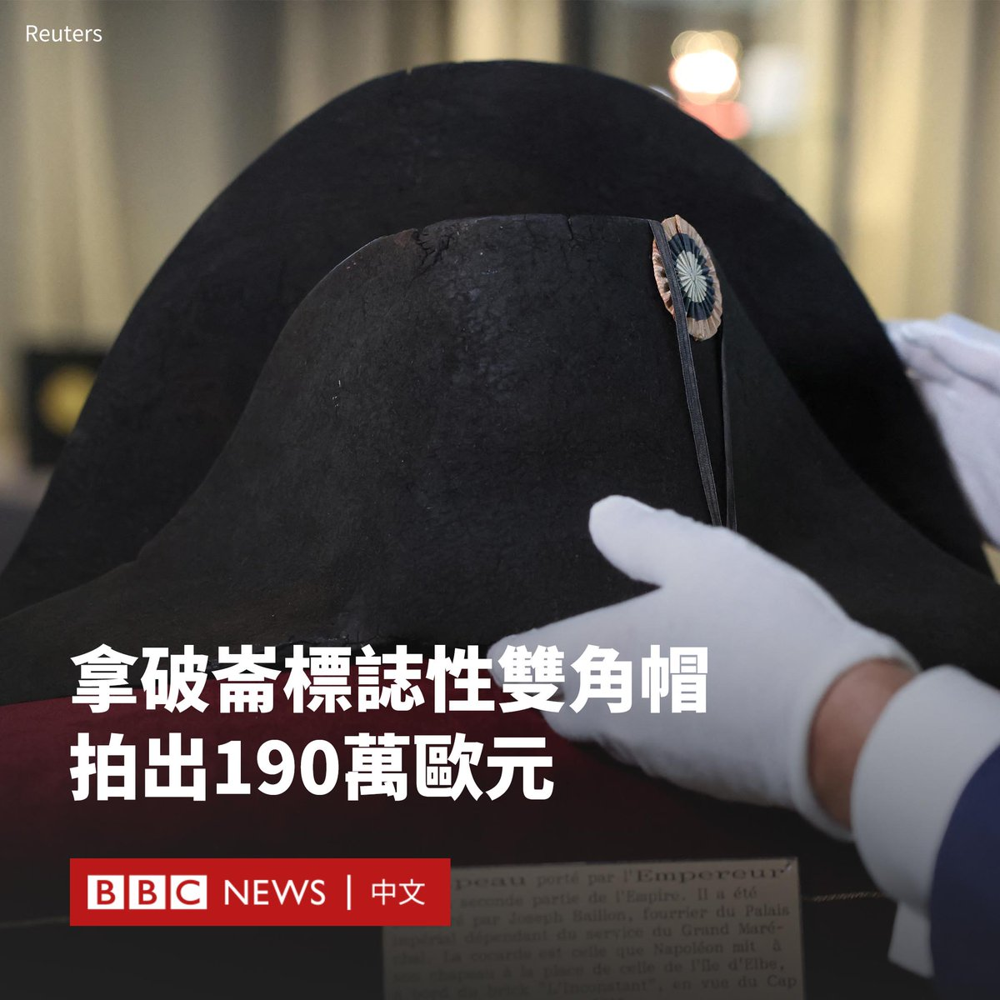

D英国广播公司BBC 北京时间 2023-11-21T09:45:58Z 1726778951471944127 在19世纪统治法国的皇帝拿破仑（Napoleon Bonaparte）的一顶帽子在巴黎拍卖会上以190万欧元（210万美元）落槌。

这顶黑色海狸双角毡帽曾被估价在60万至80万欧元之间。买家尚未公开自己的身份。

历史学家说，这顶帽子是拿破仑的标志之一。侧戴这顶帽子使他在战场上易于辨认，因为他麾下大多数军官都以帽檐与肩膀垂直的方式戴帽子。

拿破仑在多年里拥有大约120顶双角帽。不过，据说目前仅存20顶，其中许多被私人收藏。

这顶帽子被与去年去世的一位实业家收藏的其他拿破仑藏品一起出售。

拍卖商表示，这顶帽子的出处无可挑剔，在整个19世纪都一直由拿破仑的宫廷军需官所在家族保存。   