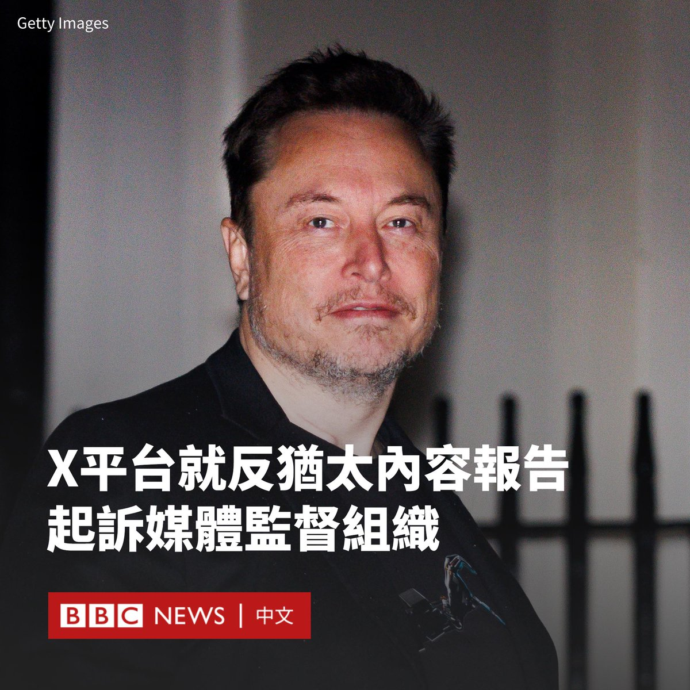

D英国广播公司BBC 北京时间 2023-11-21T12:20:46Z 1726817908654035166 马斯克的社交媒体平台X（旧称推特）起诉了立场偏左的媒体监督组织“Media Matters for America”，该组织此前指责X平台允许广告与反犹太帖文一起呈现。

X的诉状称，Media Matters“操纵”了数据，目的是“将广告商赶出该平台并摧毁X公司”。

自Media Matters上周发布分析以来，包括苹果（Apple）、迪士尼（Disney）、IBM和康卡斯特（Comcast）在内的企业已暂停在X上投放广告。

在马斯克威胁提起诉讼后，Media Matters指责他为“霸凌者”。

该组织上周表示，X上的广告与支持纳粹主义的帖子同时出现，如希特勒语录和否认针对犹太人的大屠杀的帖子。

X在得克萨斯州提起的诉讼称：“Media Matters在知情的情况下恶意制造并排图片，将广告商在X公司社交媒体平台上发布的帖子，与新纳粹和白人民族主义边缘内容放在一起。”

X首席执行官琳达·雅卡里诺（Linda Yaccarino）表示，X上“没有一个真实的用户”看到过IBM、康卡斯特或甲骨文的广告出现在Media Matters文章所述的内容旁边。

周六，马斯克发誓要对Media Matters以及任何“合谋对我们公司进行欺诈性攻击”的人提起“热核级”诉讼。

Media Matters成立于2004年，以批评保守派评论员和媒体机构而闻名。

上周三，马斯克本人也身陷争议漩涡。他赞同了X上的一个帖子，该帖子声称犹太人对白人怀有“辩证仇恨”。马斯克在回复该帖时写道：“你说出了真相”，这被指助长了反犹太主义言论。   D英国广播公司BBC 北京时间 2023-11-21T09:45:58Z 1726778951471944127 在19世纪统治法国的皇帝拿破仑（Napoleon Bonaparte）的一顶帽子在巴黎拍卖会上以190万欧元（210万美元）落槌。

这顶黑色海狸双角毡帽曾被估价在60万至80万欧元之间。买家尚未公开自己的身份。

历史学家说，这顶帽子是拿破仑的标志之一。侧戴这顶帽子使他在战场上易于辨认，因为他麾下大多数军官都以帽檐与肩膀垂直的方式戴帽子。

拿破仑在多年里拥有大约120顶双角帽。不过，据说目前仅存20顶，其中许多被私人收藏。

这顶帽子被与去年去世的一位实业家收藏的其他拿破仑藏品一起出售。

拍卖商表示，这顶帽子的出处无可挑剔，在整个19世纪都一直由拿破仑的宫廷军需官所在家族保存。   