自由亚洲电台 北京时间 2023-11-21T23:37:46Z 1726988280749781167 RT @RFA_Chinese: #亮亮和丽君 只是做了普通人要做的事，恋爱、结婚、买房、生娃，可是，就因为他们在中国，就变成了一个悲剧。
失业、降薪、烂尾楼...躲过初一躲不过十五？在中国谁又不是亮亮和丽君？
https://t.co/DTgQDUKJMR https://t…   自由亚洲电台 北京时间 2023-11-21T16:42:09Z 1726883685448954083 【浙江民众在院内装气象仪】
【被指威胁国家安全遭处罚】
浙江舟山一业主在自家院内安装了国产无线气象仪，并接入互联网查看气象资料，但被当地执法人员指其行为泄露气象数据，危害国家安全，罚款五千元。详细报道：https://t.co/qGy2JqSdC8 https://t.co/yHDsJeuTlW 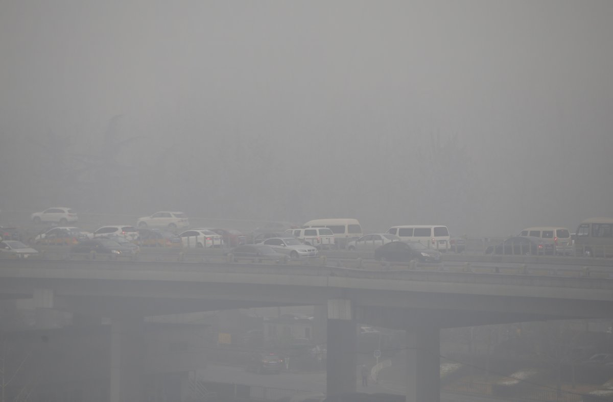  自由亚洲电台 北京时间 2023-11-21T17:17:19Z 1726892534612611556 【南京警方十天前跨省追缴孙林新书】
【多地民众追悼孙林被国保传唤】
中国异议人士 #孙林 上周疑似遭到警方暴力对待后身亡，当局切断孙林家属与外界联系。据孙林友人披露，十天前，南京国保曾到武汉追缴孙林寄给友人的一本新书。目前尚不知孙林遭到暴力是否与这本新书有关。详细报道：https://t.co/rMk17OQF3s   自由亚洲电台 北京时间 2023-11-21T16:10:49Z 1726875801105371184 【界立建当庭保释】
【张开宇带伤旁听当场晕倒】
在参加抗议习近平访问旧金山的活动时被警方带走的中国民主党青年部执行长界立建，11月20日下午出庭并被当场裁定保释，界立建20日晚上获得保释时，强调他在抗议冲突中被殴打，他出于“自卫”，盼法律还给公道。而带伤出席旁听界立建庭审的张开宇突然晕倒，被送上救护车。（孙诚拍摄）
#界立建 #张开宇   自由亚洲电台 北京时间 2023-11-21T11:45:55Z 1726809137445523884 RT @RFA_Chinese: 【界立建被当庭保释 张开宇带伤旁听当场晕倒】
中国民主党青年部执行长 #界立建 于11月16日下午参加了 #抗议习近平访美 的活动，并和欢迎者发生街头冲突，于当天下午被捕，并被关押在旧金山第一号监狱。… https://t.co/9aRcRLW…   自由亚洲电台 北京时间 2023-11-21T10:03:04Z 1726783256086102130 【赖清德萧美琴21日赴中选会登记】
【成为民进党总统与副总统候选人】
民进党的总统和副总统参选人赖清德和萧美琴，21日上午赴中选会登记，正式成为台湾的总统和副总统候选人，也是台湾第一组登记参选的正副总统候选人。
#赖清德 #萧美琴 #赖萧配 https://t.co/RwLCGp2kjU 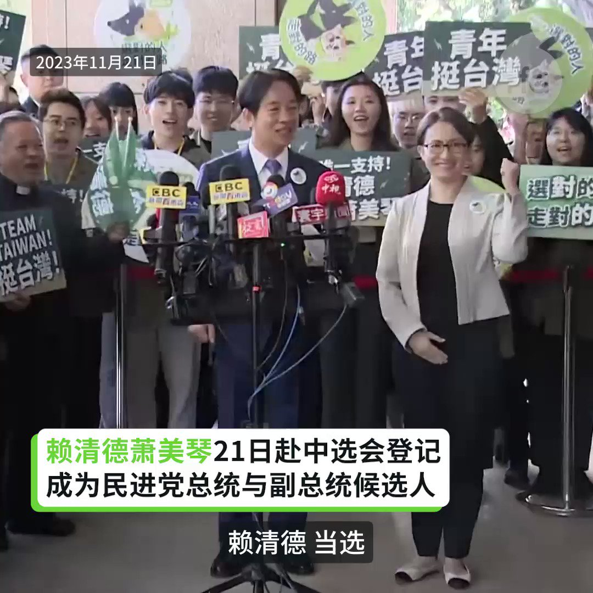  自由亚洲电台 北京时间 2023-11-21T08:33:50Z 1726760796598972887 欢迎收听和订阅播客【＃亚太报道】 https://t.co/MjLNSvVMqc
南京异议人士 #孙林 死因成疑; 舆论呼吁释放 #余文生 夫妇; #赖清德 与 #萧美琴 组成台湾竞选搭档；#王毅 总结 #习近平访美成果；习近平是不是 #独裁者？ https://t.co/8BerTTcrEI 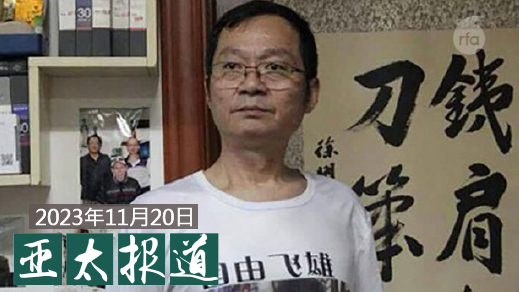  自由亚洲电台 北京时间 2023-11-21T09:03:38Z 1726768296895365369 11月20日下午，#界立建 在旧金山县高等法院出庭，被当场决定零元保释，他会在当天晚上9点获释。
带伤出席旁听的 #张开宇 当庭晕倒，被送上了救护车辆。（记者孙诚拍摄） https://t.co/Csw4ooJMLF   自由亚洲电台 北京时间 2023-11-21T04:56:18Z 1726706055181451748 专栏 | #夜话中南海：#三中全会 上如何处分已先后被撤消行政或军内职务的四名中央委员
#秦刚 #李尚福 #李玉超 #徐忠波
https://t.co/ZLtu73qe2I https://t.co/7CRMrW8TAR 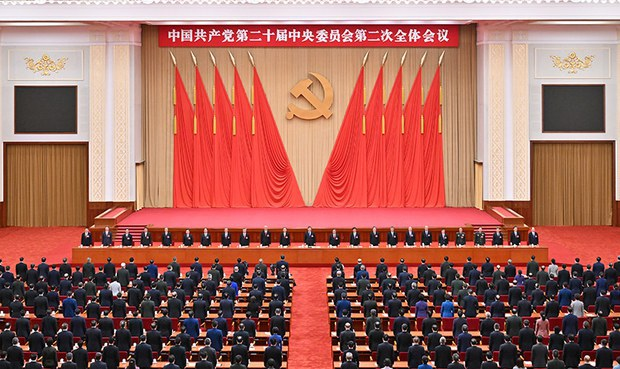  自由亚洲电台 北京时间 2023-11-21T05:30:01Z 1726714538597462506 据香港《南华早报》11月20日报道，在最近提交给第十一届中国指挥与控制大会的一篇论文中，中国国防科技大学透露，中国建立了一个配备专业 #高超声速武器 力量、直接向最高军事层级报告的 #近空间指挥系统，这被认为是世界首个。
https://t.co/Kllk51c9ql https://t.co/i6n7OLOXfI 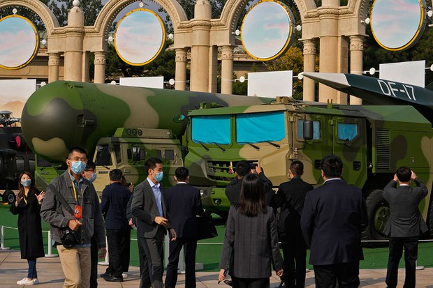  自由亚洲电台 北京时间 2023-11-21T05:45:19Z 1726718390650433887 #亮亮和丽君 只是做了普通人要做的事，恋爱、结婚、买房、生娃，可是，就因为他们在中国，就变成了一个悲剧。
失业、降薪、烂尾楼...躲过初一躲不过十五？在中国谁又不是亮亮和丽君？
https://t.co/DTgQDUKJMR https://t.co/5KiAj45kyP 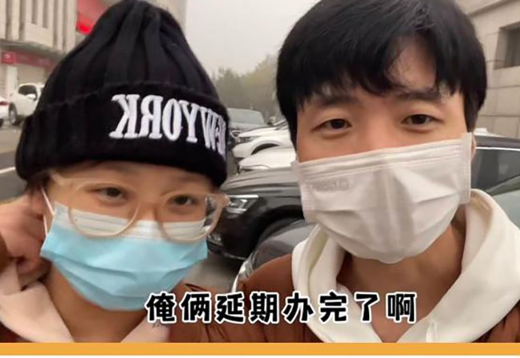  自由亚洲电台 北京时间 2023-11-21T05:54:06Z 1726720599509315765 极右翼选举联盟"自由前进党"候选人、国会众议员哈维尔·米莱（Javier Milei) 当选阿根廷新一任总统。
今年8月，米莱曾说，与中国政府发展关系就像和刺客交易："在中国，人们不自由，他们不能做自己想做的事，当他们这样做的时候，他们就会被杀。你愿意和刺客交换吗?"
https://t.co/vMQA3AJNnU https://t.co/OclJYdAu5V   自由亚洲电台 北京时间 2023-11-21T06:00:10Z 1726722126185656556 本周一，美国华盛顿智库战略与国际研究中心（CSIS）举办研讨会，重点分析两国领导人在 #拜习会 中所释放的政治信号。

https://t.co/tqK4xKwGuR https://t.co/bhTtLtOGY2 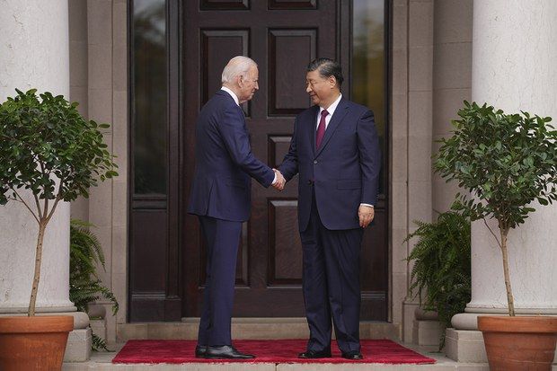  自由亚洲电台 北京时间 2023-11-21T02:56:54Z 1726676007267250278 近日，中国官方发布今年前十月 #实际使用外资金额（FDI）情况。相关数据显示，外资对华直接投资已连续同比第五个月下滑，降幅扩大至9.4%。
有分析认为，习近平的"#国家安全"政策造成外资大规模出逃，短期内的情况还难以改观。

https://t.co/GLze1B0dKI https://t.co/fcHsnzkGi1   自由亚洲电台 北京时间 2023-11-21T02:59:06Z 1726676560806347132 中国 #网信办 在国家主席 习近平访美 期间启动新一波的 #网络清朗行动，表明为期一个月的"#网络戾气整治"专项主要打击恶意诋毁和造谣攻击等，并加强对表情包、P图拼图等讽刺管理。
这波行动真的是如官方说，志在维护网络言论正义？还是另有用意？

https://t.co/oa9A2bezi0 https://t.co/2m38pkSSO4 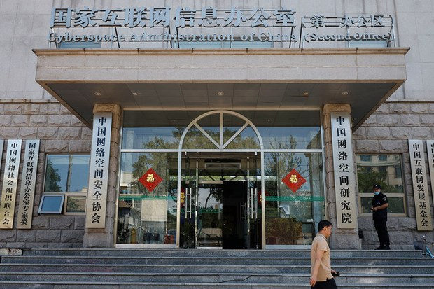  自由亚洲电台 北京时间 2023-11-21T03:39:26Z 1726686710787121533 美国总统拜登日前与中国主席习近平会面后，再次把习近平称为 #独裁者.
加拿大总理 #特鲁多 则虽未直言习近平独裁，但认为中国是威权专制国家，不民主。
有专家认为，#加拿大 已经很认清楚中国的真面目，对待中国的态度已经变得更理性了。
https://t.co/vXsxJkCaIV https://t.co/1NWG2zAfzX 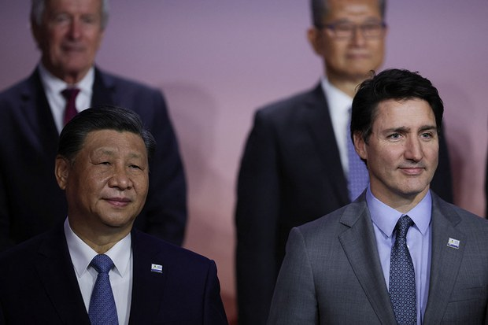  自由亚洲电台 北京时间 2023-11-21T03:47:31Z 1726688744382796081 中国国家主席 #习近平 结束美国行后返回北京。中国外长 #王毅 总结此访是习近平运筹大国关系的"大手笔"，也是习近平今年出席多边峰会的"收官作"。 #拜习会 后，美中关系是否会出现缓和呢？
https://t.co/F9Yb5XVnjP https://t.co/swxvkzf8pG 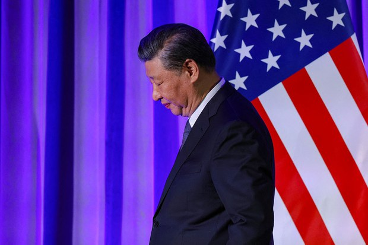  自由亚洲电台 北京时间 2023-11-21T00:45:24Z 1726642910924566810 #拜习会 成为国际舆论焦点;其中最为引起 #澳大利亚 战略专家关注的话题之一,是“拜习会”是否标志着印太地区将迈向隐定? 对此,专家们有不同看法。
https://t.co/bs9ecKOrDB https://t.co/vYQdDSP5Zc 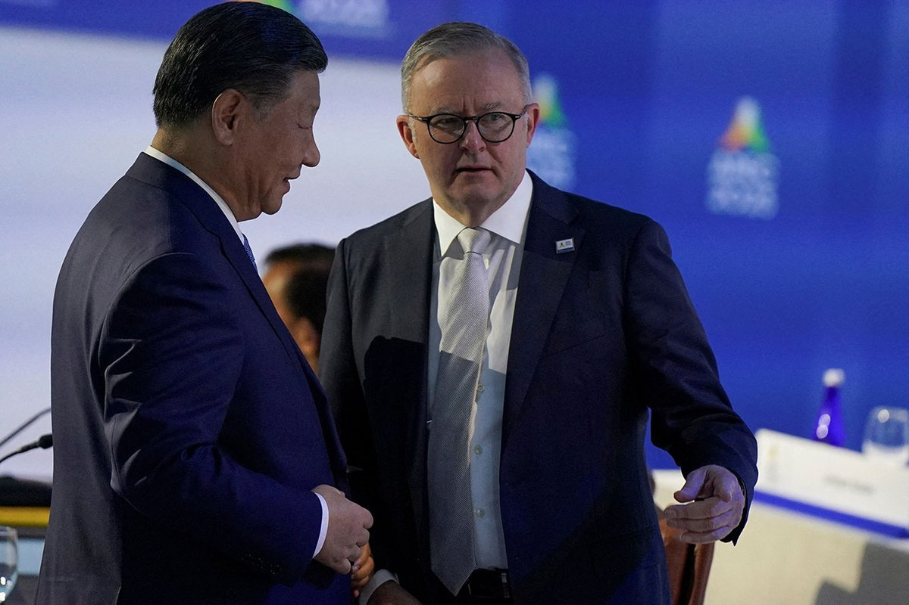  自由亚洲电台 北京时间 2023-11-21T02:12:38Z 1726664865404842190 台湾的驻美代表 #萧美琴 协助台积电创办人张忠谋代表总统蔡英文出席亚太经合会后，搭同班机返台。11月20日，萧美琴宣布辞去已任期长达3年零4个月的驻美代表一职，成为 #民进党副总统参选人。
https://t.co/GqYxU3WYYx https://t.co/qoE9qaC5x8 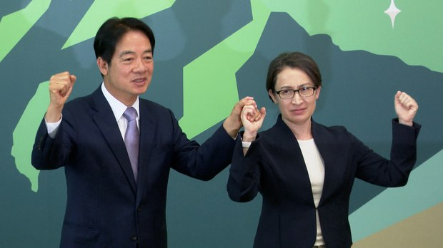  