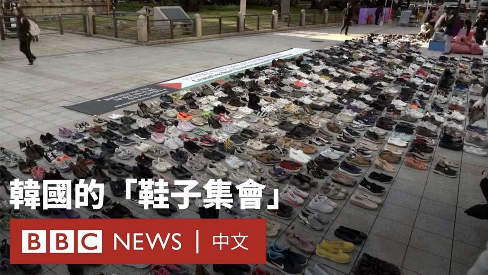
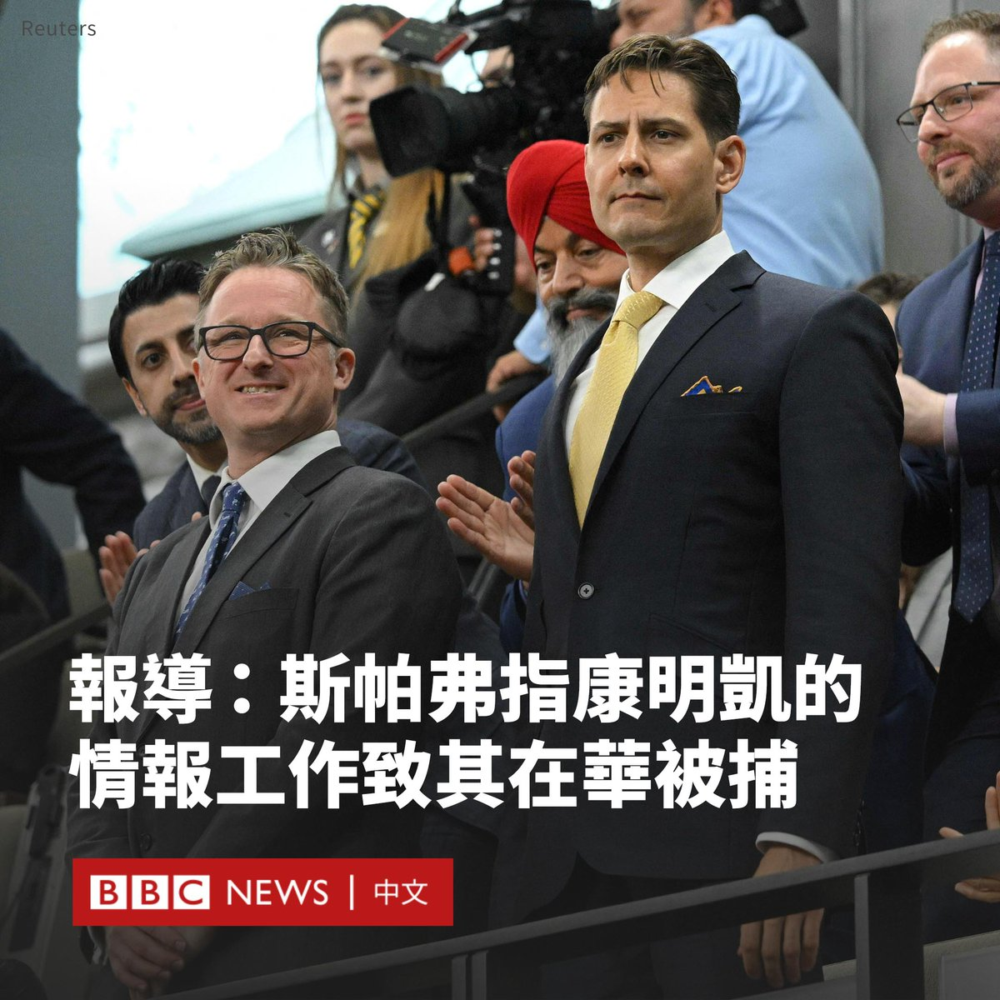
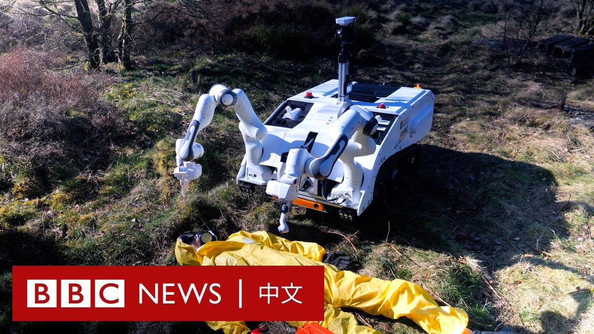

D英国广播公司BBC 北京时间 2023-11-20T18:51:21Z 1726553814797594937 在韩国首尔市中心，活动人士透过“鞋子集会”，展示数千双象征着巴勒斯坦遇害者的鞋子，呼吁加沙停火。 https://t.co/emJTup2687   D英国广播公司BBC 北京时间 2023-11-20T20:00:05Z 1726571109561115012 米莱常被外界比喻为“阿根廷的特朗普”。他的竞选提议包括“炸毁”中央银行、引入美元成为阿根廷官方货币等，这些表态在极度渴望改变的选民中间赢得了支持。https://t.co/7IDGMRMTgh   D英国广播公司BBC 北京时间 2023-11-20T16:29:45Z 1726518177117704205 加拿大人康明凯（Michael Kovrig）和迈克尔‧斯帕弗（Michael Spavor）曾因被控从事间谍活动而被中国羁押了1000多天，但在他们获释回加拿大后，这一牵动加中关系的事件似乎有了新的余波。

加拿大媒体《环球邮报》（The Globe and Mail）报道，在回到加拿大两年多后，斯帕弗正在向加拿大政府索赔数百万美元作为赔偿。

该报道援引未透露姓名人士的话称，斯帕弗指他“无意中”与康明凯分享了朝鲜相关信息，但不知道这些信息会被传递给加拿大政府及其“五眼联盟”的情报合作伙伴。

他声称，正是康明凯的行动导致两人都身陷囹圄。BBC无法独立证实该说法。

加拿大全球事务部发言人对此回应称，“中国任意拘留迈克尔‧斯帕弗和康明凯是不公正和不可接受的。”

“继续任何一位迈克尔参与间谍活动的说法，只是在延续他们在中国被拘留的错误理由。”

中国驻加拿大大使馆也在报道刊发后回应称，“中国是法治国家，康明凯、迈克尔涉嫌危害中国国家安全犯罪，中国司法机关严格依法办案。”

“近日相关报道再次说明上述事实不容抵赖。”中国大使馆发言人说。

康明凯是一名前加拿大外交官，被捕时在国际危机组织（International Crisis Grou）担任东北亚高级顾问。

斯帕弗是“长白山文化交流中心”（Paektu Cultural Exchange）主任，该组织致力于促进对朝鲜的投资和旅游，据报他是少数与朝鲜领导人金正恩建立关系的西方人之一。

斯帕弗和康明凯在2018年底被捕，在他们被拘捕不久前，加拿大应美国的要求拘留了中国电信巨头华为的高管孟晚舟，该事件导致中国和加拿大的关系迅速恶化。对他们的拘捕被广泛视为是中国的报复行动。

2021年9月，在孟晚舟获释离开加拿大后，康明凯与斯帕弗也获释离开中国。   D英国广播公司BBC 北京时间 2023-11-20T17:35:37Z 1726534755456294974 台湾民进党总统参选人赖清德在周一（11月20日）宣布其副手人选为现任台湾驻美代表萧美琴。赖清德在社交媒体发文说，这是他“最好的决定”，指相信萧美琴是“现今台湾外交工作中的佼佼者”。https://t.co/4cq3RpEHIa   D英国广播公司BBC 北京时间 2023-11-20T15:08:46Z 1726497796889440677 澳大利亚指控中国海军在一起国际水域相遇事件中使用声呐脉冲，导致澳方潜水员受伤。https://t.co/9KkVwsZT0i   D英国广播公司BBC 北京时间 2023-11-20T13:25:01Z 1726471690308530247 在许多难以到达的灾区，派医生去治疗伤员往往很难实现。科学家们发明了一种机器人，它可以让医生在安全距离之外就提供医疗援助。 https://t.co/1CfrDw1Sv2   D英国广播公司BBC 北京时间 2023-11-20T11:00:20Z 1726435276006793405 许多中国年轻人正在用古怪的插画来表达他们对职场环境的失望——被称为“职场人设”。在经济不景气和就业市场竞争激烈的情况下，这成为年轻人表达挫败感的一种方式。三位年轻人讲述了她们的故事。https://t.co/pxVgeLCWYF   D英国广播公司BBC 北京时间 2023-11-20T09:32:23Z 1726413146028691609 【最新消息】阿根廷大选决选结果出炉，反建制的右翼候选人哈维尔·米莱（Javier Milei）成为阿根廷下一任总统。

米莱承诺对国家进行大幅改革，以改善飙升的通货膨胀和陷入危机的经济。

官方结果显示，米莱的支持率接近56%，而他的竞争对手、庇隆主义经济部长塞尔吉奥·马萨（Sergio Massa）的支持率为44%，后者承认败选。   