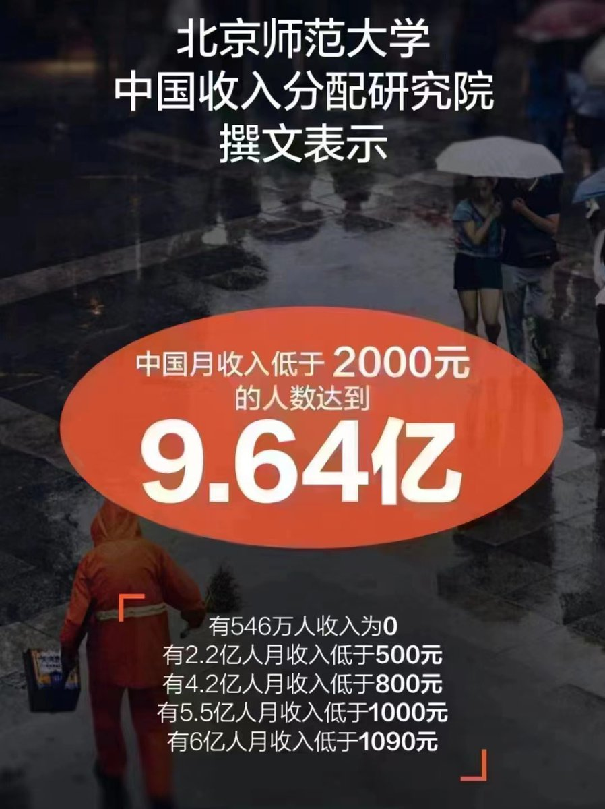

Ivy未央 北京时间 2023-11-20T13:14:25Z 1726469022378848414 它们设计了你的一生——就是让你在温饱线上挣扎。

自2012年上台以来，习近平反复公开宣扬他服膺毛泽东，要追随毛泽东的治国路线。习所采取的诸多经济政策和措施不是促进经济发展而是打击经济发展，不是让人民富裕而是让人民贫穷。通过使民弱、民穷来谋求国强——习的政权、政府才安全！ https://t.co/SXDT8Fnxhs   