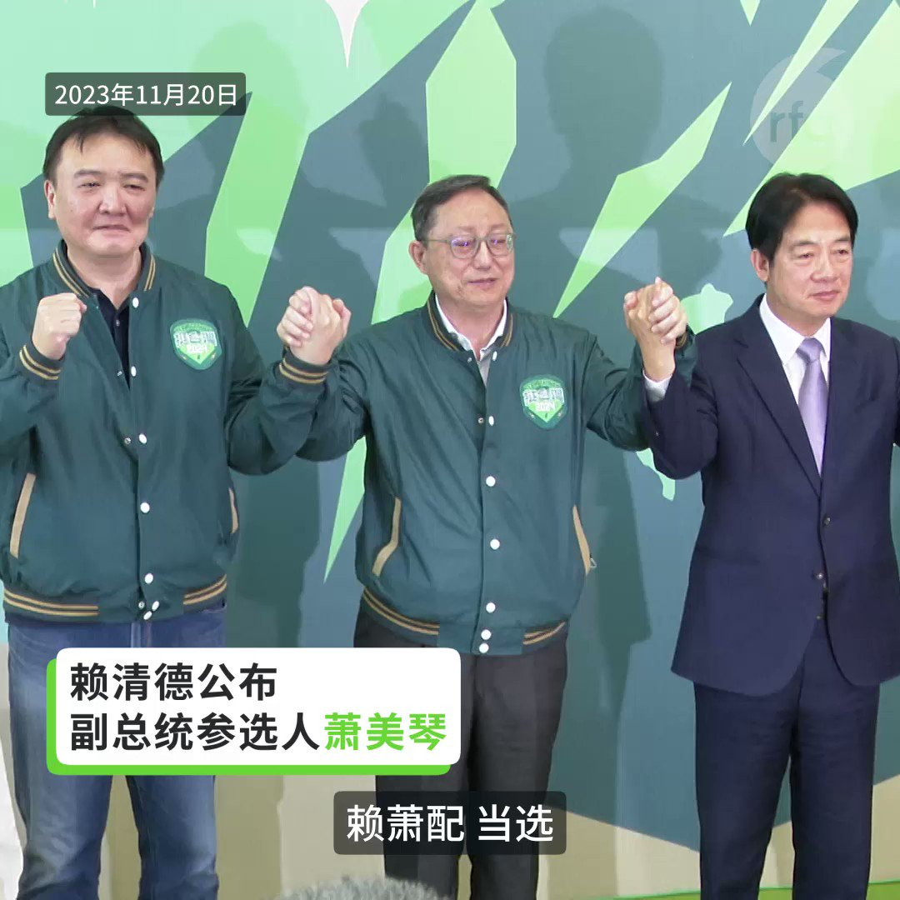
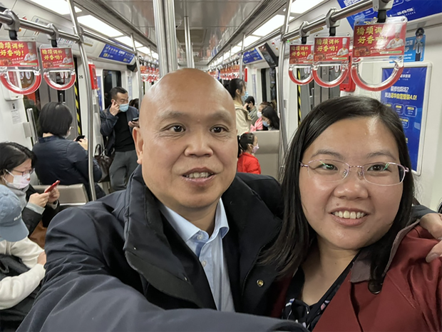

自由亚洲电台 北京时间 2023-11-20T21:51:48Z 1726599225390358590 【中美军事难协调 | 因双方认知不同】
始于1998年的中美 #军事安全 磋商机制成效有限：中方关注战略问题，要求美军不要靠近中国才最安全。美方则关心战术问题，认为在公海航行天经地义，只需要研究如何避免碰撞则可。双方讨论同一件事，却不在同一个层面，难有共识。
详阅：https://t.co/OIOFUhKfeJ   自由亚洲电台 北京时间 2023-11-20T17:19:16Z 1726530640018018622 【赖清德公布副总统参选人萧美琴】
【民进党“赖萧配”登场】
台湾民进党总统参选人赖清德20日公布副手为台湾驻美代表萧美琴。萧美琴说，台海现状正遭对岸片面改变，让她焦虑能否守住民主价值，这些情势更让她知道她没有回避空间，为了台湾 ，她会拚下去。
#赖萧配 #赖清德 #萧美琴 https://t.co/EpGemjiGBz   自由亚洲电台 北京时间 2023-11-20T14:49:15Z 1726492887070933371 【异议人士 #孙林 疑遭殴打致死】
【家属被控制 网民遭警告不得悼念】
中国异议人士孙林在南京家中遭遇多名警察上门，期间发生肢体冲突，孙林受伤后送医院，其后死亡。目前，警方已控制孙林的家属，并警告网民不得赴南京悼念孙林。海外人权组织及机构敦促当局调查及公布孙林的死因。详细报道：https://t.co/cjmUdv0sOY   自由亚洲电台 北京时间 2023-11-20T15:22:28Z 1726501246398509110 【律师余文生夫妇儿子服药过量送医抢救】
【才刚独自度过了19岁生日】
曾代理“709大抓捕”案的北京人权律师余文生和妻子许艳因涉嫌“寻衅滋事”被羁押超过半年。上周，两人的儿子在生日当天因服药过量送医抢救。有法律界人士促请当局让余文生夫妇取保候审。详细报道：https://t.co/0k2plpxw9n
#余文生 https://t.co/6XJcA7o7bx   自由亚洲电台 北京时间 2023-11-20T11:46:23Z 1726446868585238935 【赖清德在社交媒体公布萧美琴为副总统搭档人选】
民进党台湾总统大选参选人 #赖清德 20日上午在社交媒体脸书公布，将与原台湾驻美代表 #萧美琴 搭档参选。
​
赖清德预计在20号下午的记者会正式宣布邀请萧美琴成为参选 2024 总统大选的竞选搭档。他说，”这是众所期待的决定，也是最好的决定。”

（圖：赖清德脸书，摄于2020年2月美国华盛顿特区的林肯纪念堂）   自由亚洲电台 北京时间 2023-11-20T10:06:39Z 1726421765910368488 【习近平自我评价：“手小，抓篮球抓不住】
APEC期间与泰国总理 #赛塔 聊及国足以2比1战胜泰国，习近平表示：“侥幸成分大......我现在对我们国家的足球队，我不敢肯定他们的水平，有起伏。” 又称自己抓不住篮球，“踢足球还行”。
详阅：https://t.co/QT0eFKoKrh   自由亚洲电台 北京时间 2023-11-20T03:08:40Z 1726316579095240838 鉴于缅甸政府军在北部遭到多个武装组织的大规模联合进攻，被困当地的266多名泰国，菲律宾和新加坡公民正撤离 #缅甸，经由中国 #昆明，飞往泰国 #曼谷 。
详见：https://t.co/pII4nCSGkI   自由亚洲电台 北京时间 2023-11-20T00:59:23Z 1726284044781138074 人权律师 #余文生 和妻子 #许艳 子儿子日前因服药送医抢救，现已脱离危险。夫妇自今年春季遭当局羁押至今七个月。
详见：https://t.co/zteA5yx4ge   