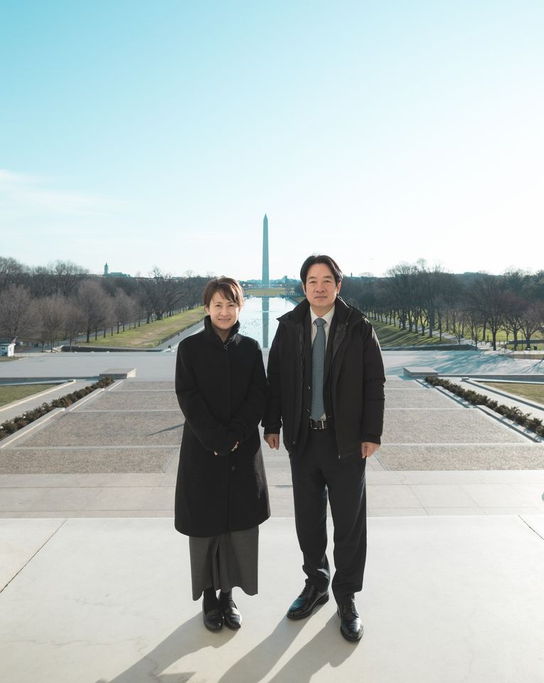

自由亚洲电台 北京时间 2023-11-20T11:46:23Z 1726446868585238935 【赖清德在社交媒体公布萧美琴为副总统搭档人选】
民进党台湾总统大选参选人 #赖清德 20日上午在社交媒体脸书公布，将与原台湾驻美代表 #萧美琴 搭档参选。
​
赖清德预计在20号下午的记者会正式宣布邀请萧美琴成为参选 2024 总统大选的竞选搭档。他说，”这是众所期待的决定，也是最好的决定。”

（圖：赖清德脸书，摄于2020年2月美国华盛顿特区的林肯纪念堂）   自由亚洲电台 北京时间 2023-11-20T10:06:39Z 1726421765910368488 【习近平自我评价：“手小，抓篮球抓不住】
APEC期间与泰国总理 #赛塔 聊及国足以2比1战胜泰国，习近平表示：“侥幸成分大......我现在对我们国家的足球队，我不敢肯定他们的水平，有起伏。” 又称自己抓不住篮球，“踢足球还行”。
详阅：https://t.co/QT0eFKoKrh   自由亚洲电台 北京时间 2023-11-20T03:08:40Z 1726316579095240838 鉴于缅甸政府军在北部遭到多个武装组织的大规模联合进攻，被困当地的266多名泰国，菲律宾和新加坡公民正撤离 #缅甸，经由中国 #昆明，飞往泰国 #曼谷 。
详见：https://t.co/pII4nCSGkI   自由亚洲电台 北京时间 2023-11-20T00:59:23Z 1726284044781138074 人权律师 #余文生 和妻子 #许艳 子儿子日前因服药送医抢救，现已脱离危险。夫妇自今年春季遭当局羁押至今七个月。
详见：https://t.co/zteA5yx4ge   