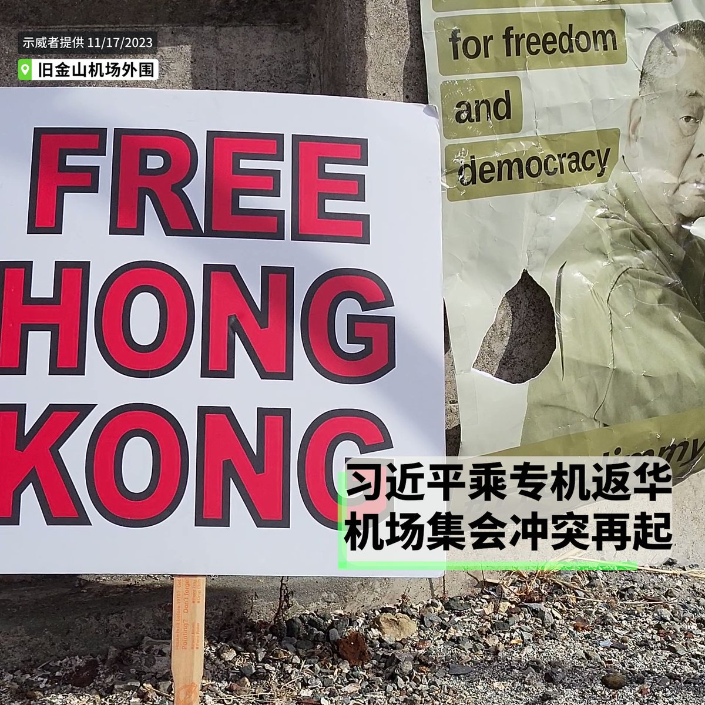

自由亚洲电台 北京时间 2023-11-19T11:26:09Z 1726079384971342001 【挪用数百万逃亡摩洛哥 | 中国男子被引渡回上海】
2021年摩洛哥政府与北京签条约，允许通缉犯“送中”。
详见：https://t.co/opWP9InMF6   自由亚洲电台 北京时间 2023-11-19T12:13:21Z 1726091264280674483 【效果图与现实之间的距离】668米的中国第一高楼，深圳 #世茂深港中心 两度拍卖无果，面临烂尾风险。
详见：https://t.co/17VxcO5TSv   自由亚洲电台 北京时间 2023-11-19T04:37:36Z 1725976570198679693 【习近平登机离美 | 机场外示威者再爆冲突】
亲中人士和抗议人士在 #旧金山 机场外再有肢体暴力推撞。#习近平 支持者用五星红旗将抗议者重重包围，有抗议者被打伤，双方最终被警方隔开。由中国 #异议人士、#藏人 和 #香港人 组成的示威队伍随后在机场附近道路游行。 https://t.co/vnUBSuraT9   自由亚洲电台 北京时间 2023-11-19T06:16:29Z 1726001457202102363 国民党 #侯友宜 和民众党 #柯文哲 决议以民调决定正副总统人选，但双方对民调数据、统计误差未达成共识。民进党 #赖清德 竞选总部主任 #姚立明 表示，蓝白协议跟九二共识很像，各说各话、各怀鬼胎。
详见：https://t.co/zDzj4PSMOP   自由亚洲电台 北京时间 2023-11-19T02:45:06Z 1725948260324372596 前众议院议长 #佩洛西 评价萧美琴：
“#萧美琴 是一位出色外交官和战略思想家，懂得倾听和理解。不仅清楚自己在 #台美 经济和文化上扮演的角色，更能理解国际安全是 #全球关系 的重中之重”。
详见：https://t.co/RZvPuKyW9D   自由亚洲电台 北京时间 2023-11-19T03:08:30Z 1725954147608904099 澳大利亚周六指责中国海军在 #澳洲 海军潜水员清除船舶螺旋桨上的渔网时，派遣 #驱逐舰 DDG-139接近，利用声波来获取水中的图像。#声波 高浓度时，这些物质会导致头晕、听力损伤和其他器官损伤。
详见：https://t.co/Pwqz9uqpqh   