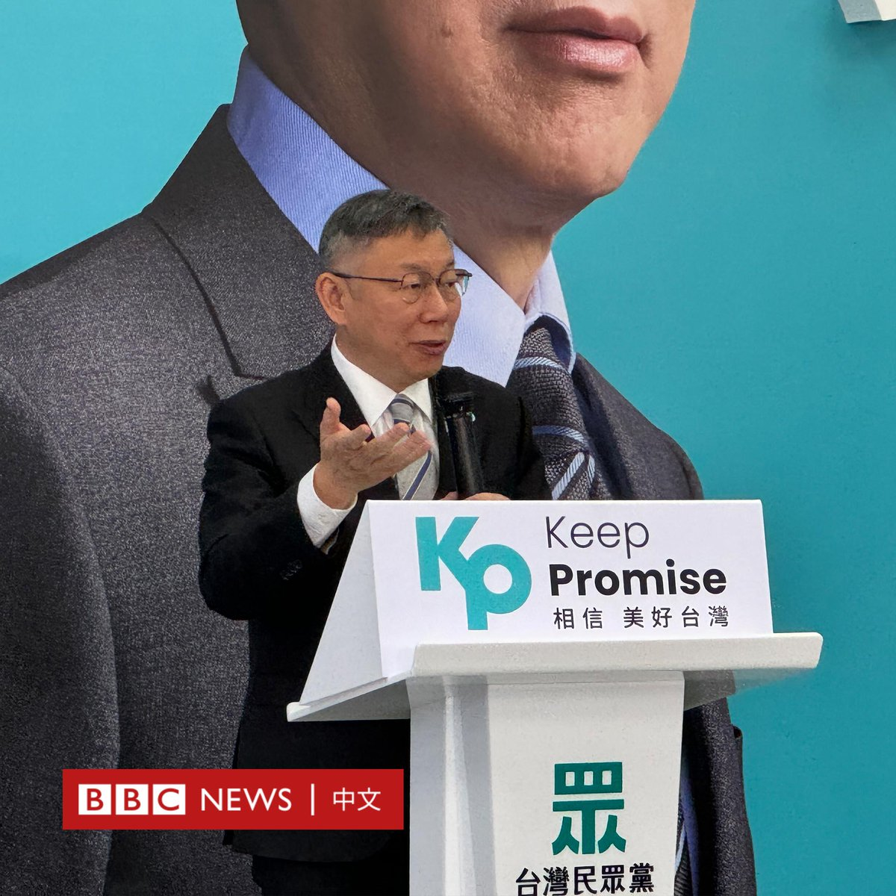

D英国广播公司BBC 北京时间 2023-11-18T14:03:13Z 1725756525036310995 台湾两个反对党国民党与民众党原定于周六（11月18日）公布其联合竞选2024大选正副总统的组合方案，因双方对民调误差认定范围未达共识而延期。
 
周三（11月15日），在前总统马英九的斡旋下，国民党主席朱立伦、总统参选人侯友宜与民众党主席、参选人柯文哲举行“蓝白合”协商会议，希望两党在大选中的联合可以对抗执政的民进党。

他们签署合作协议，表示将各自推选三名民调统计专家，依据民调结果决定最终的总统和副总统候选人分别是谁。
 
但就在人选公布前，便传出双方谈判遇阻的消息。
 
柯文哲选举办公室发言人吴怡萱周六（11月18日）表示，民调专家对于误差范围认定没有共识，国民党主张的误差范围跟民众党主张不同，因此没有达成决议。
 
中央社报导称，国民党推派代表认为误差范围为正负3个百分点，但民众党代表认为的误差范围是正负1.5个百分点。若采用正负3个百分点，误差范围达6个百分点。

另外，民众党代表还主张其中三份民调有问题，应排除不计，于是“建议延长讨论，择期再议”。 

此前，台湾中央社发布的两党合作文件显示，双方约定如果大选获胜将“成立联合政府”，“除国防、外交、两岸由总统决定，其余部会原则上依各党派立委席次分配，民众党主责监督制衡，国民党主责建设发展。”   D英国广播公司BBC 北京时间 2023-11-18T09:01:03Z 1725680484976300099 【一周热点回顾】拜登与习近平举行了备受外界关注的会晤，但如同旧金山街头亲中支持者与抗议者之间的鲜明对比，此次峰会取得多方面进展，但无法调和的争议仍为未来双边关系蒙上阴影。https://t.co/5ZDqL7f6G5   