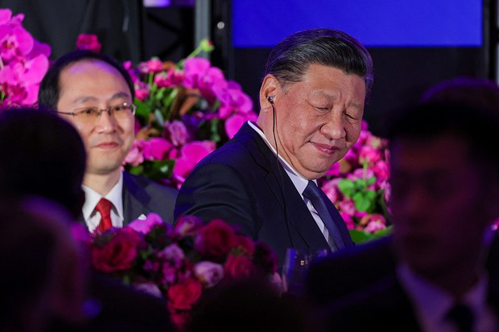
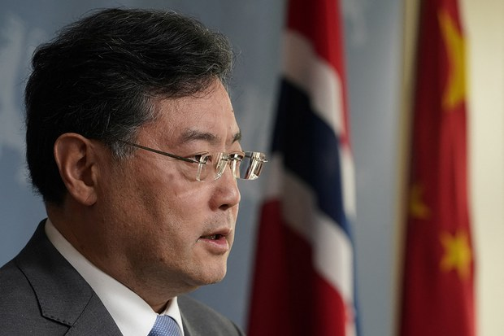
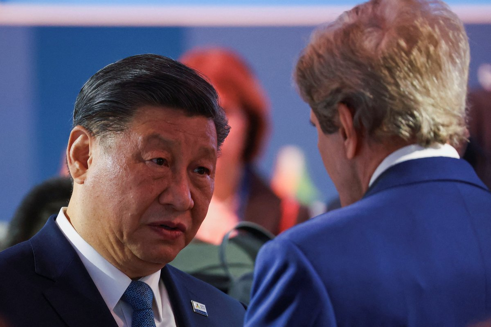
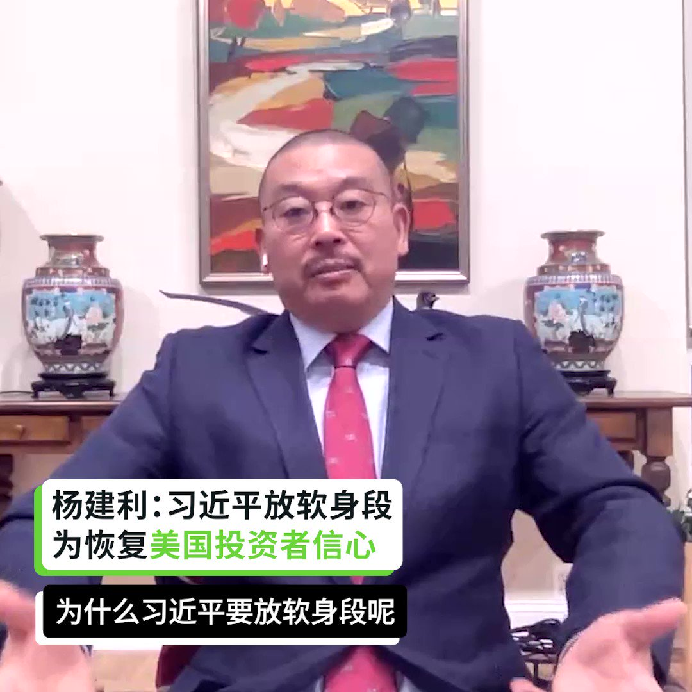
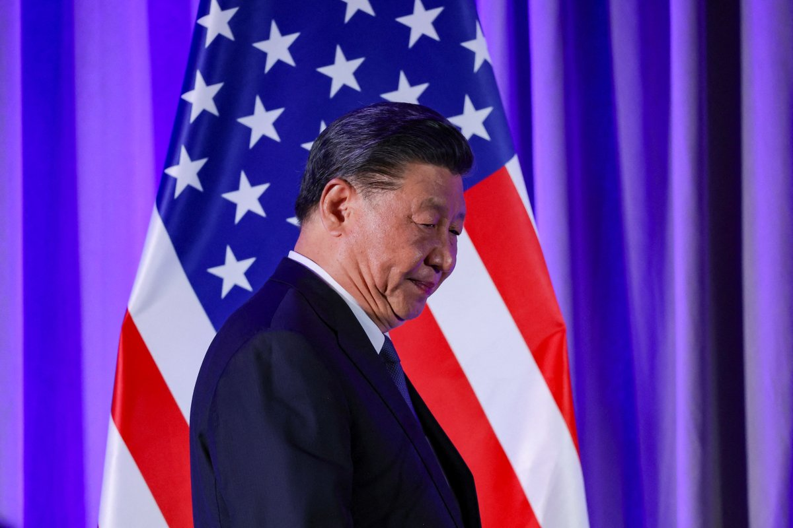

自由亚洲电台 北京时间 2023-11-18T08:59:01Z 1725679971996140016 【 #习近平 到访 #旧金山  欢迎者和抗议者肢体切磋名场面】
本片重现2023年11月14日至16日旧金山街头欢迎者和抗议者冲突场面（视频由本台记者孙诚、Jim拍摄，活动参与者提供） https://t.co/dbJWxU4ZGW   自由亚洲电台 北京时间 2023-11-18T04:43:56Z 1725615776261136554 前美官员：美中蜜月期可能长至两周
才这么短？
https://t.co/fXjlPvglza https://t.co/NJgAd97Kgl   自由亚洲电台 北京时间 2023-11-18T05:02:59Z 1725620570547691861 本周三晚间，中国国家主席 #习近平 与美国商界领袖及高级官员共进晚餐。但习近平在讲话中只强调了合作共赢，并未提及任何贸易、投资等实质性内容，以安抚美国商界对中国日趋糟糕的营商环境的担忧。
https://t.co/fTgjFqp76n   自由亚洲电台 北京时间 2023-11-18T06:14:29Z 1725638565898707016 #习近平否认攻台计划　台前国防部长表示不信
https://t.co/3WNkmlEtsG https://t.co/eMji1Po77C   自由亚洲电台 北京时间 2023-11-18T06:15:55Z 1725638926386499646 专栏 | #夜话中南海：免职只是对 #秦刚 和 #李尚福 严肃处理的前奏
https://t.co/kzYQNhy5bY https://t.co/rr6mEL6FL3   自由亚洲电台 北京时间 2023-11-18T03:03:36Z 1725590529419944055 【无滤镜的 #习近平】@APEC峰会 
（美联社/路透社/法新社图片） https://t.co/O8ffO1qziH   自由亚洲电台 北京时间 2023-11-18T00:45:43Z 1725555826776252814 【战狼变熊猫 杨建利： 习近平需要时空培养实力】
【夏明: 习近平不值得信任 投资者难恢复信心】
纽约城市大学政治学教授 #夏明， 公民力量创始人 #杨建利，在 #亚洲很想聊 解析 #习近平 此次访美，在 #拜习会 中，身段放低的原因，以及西方投资者会否重拾对中国投资的信心。
https://t.co/eE8D3qyNUs https://t.co/fw09v2DXSg   自由亚洲电台 北京时间 2023-11-18T01:31:08Z 1725567258792206554 果然秋后算账了：多位知情人士本周五透露，目前已有数名 #万圣节 的“角色扮演者”被上海国保扣查。
https://t.co/nNRsGFiiGA https://t.co/j1KmKNGfL4   自由亚洲电台 北京时间 2023-11-18T02:21:29Z 1725579930677977592 #民间外交 有用吗？
北京一位不愿具名的观察人士对本台说，在美中关系恶劣时，中国试图通过加强与美国民间的交流去影响美国政府：“这是一种洗脑式的民间外交方式，除了好大喜功营造中美关系的所谓民间外交的气氛，并没有实质性帮助中美关系尽快恢复”
https://t.co/8SWxlkVRBJ https://t.co/ftSdVAfOtO   