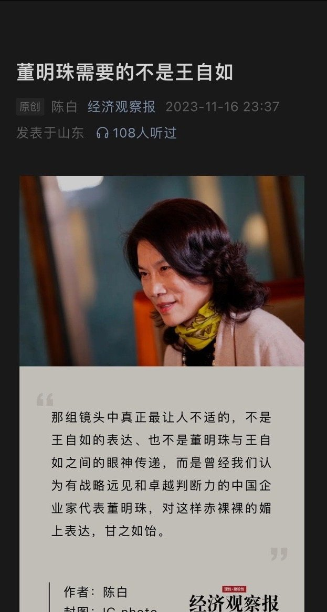
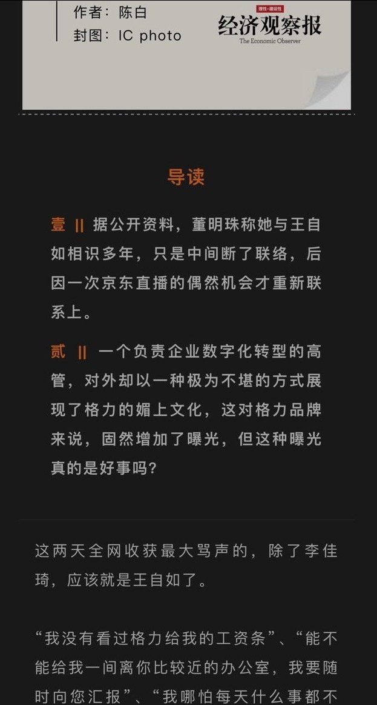
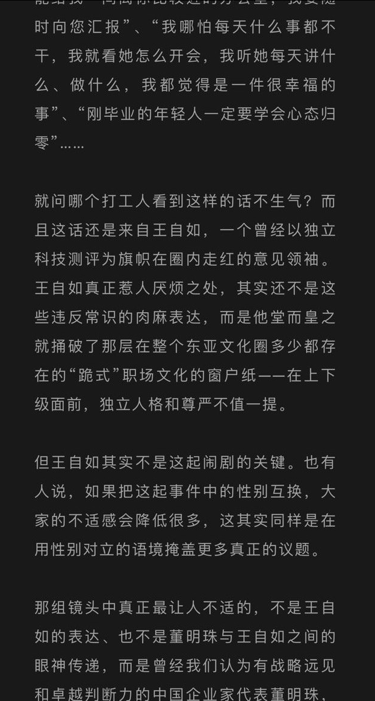
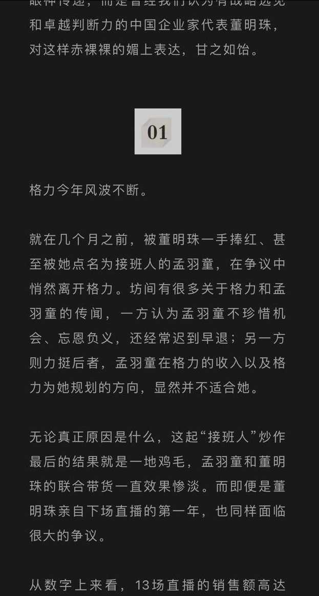

谁将十万横扫三江 北京时间 2023-11-18T08:35:17Z 1725673999940944348 王自如真正惹人厌烦之处，其实还不是这些违反常识的肉麻表达，而是他堂而皇之就捅破了那层在整个东亚文化圈多少都存在的“跪式”职场文化的窗户纸——在上下级面前，独立人格和尊严不值一提。

……

那组镜头中真正最让人不适的，不是王自如的表达、也不是董明珠与王自如之间的眼神传递，而是曾经我们认为有战略远见和卓越判断力的中国企业家代表董明珠，对这样赤裸裸的媚上表达，甘之如饴。

【网评】把董明珠换成男领导这篇文章已经没了   谁将十万横扫三江 北京时间 2023-11-18T08:38:53Z 1725674904614572307 RT @SharonH85311: 研究早期中共和国民党党史的意外发现，是我开始认同民国派的一个观点了：蒋介石的确是孙中山的意志的真正继承人。
他俩唯一的区别无非是孙中山觉得自己可以做到利用中共，而蒋介石清楚的认识到共产主义理念危险的传染性。
这么看来，蒋对孙的缅怀的确是真心诚…   谁将十万横扫三江 北京时间 2023-11-18T09:16:57Z 1725684483469533212 11月16日，安徽池州有网友发视频称池州学院学生公寓楼下发生粪水外溢，淹没楼下停放的电动车，导致学生无法通行 https://t.co/SrNAH6yUjM   