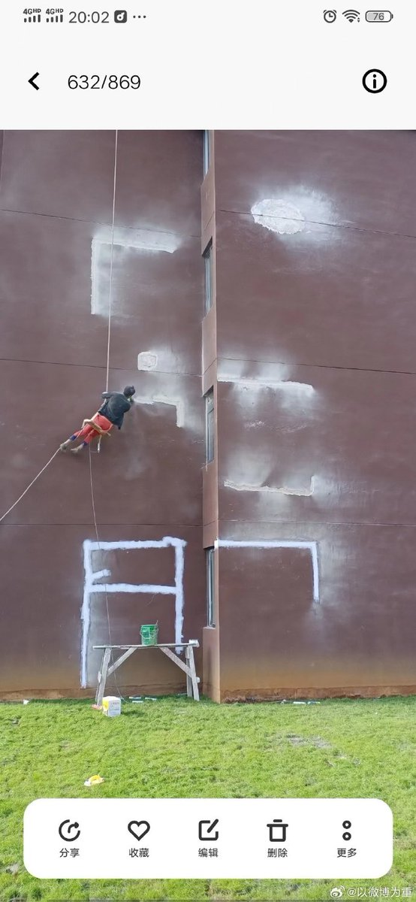
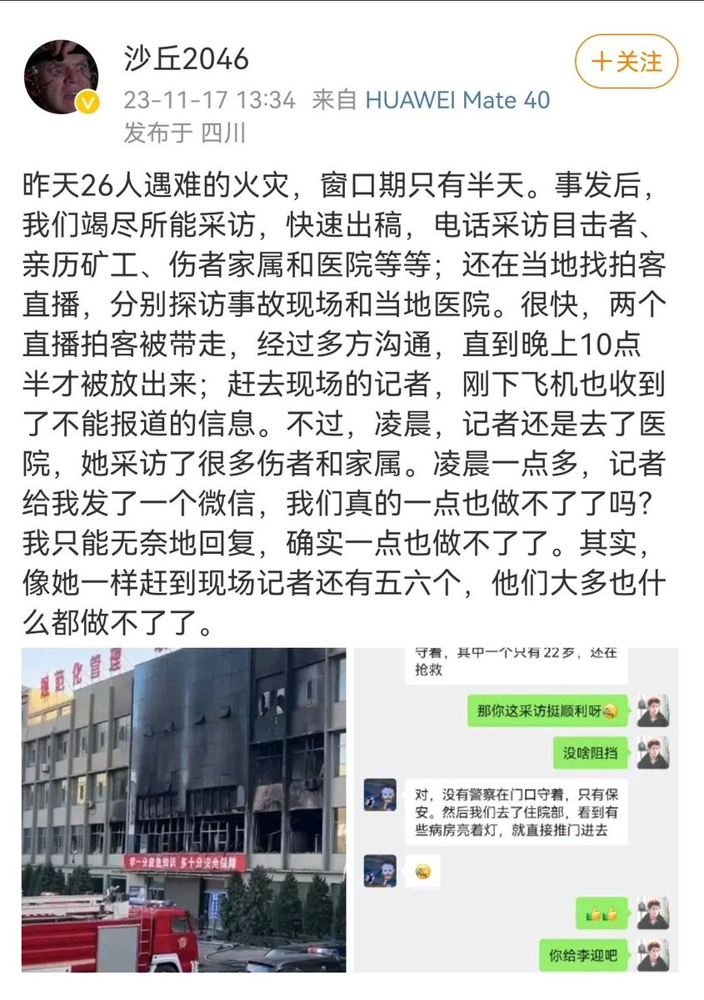

谁将十万横扫三江 北京时间 2023-11-18T17:38:00Z 1725810576528720000 发现贵州毕节下面县城的一对兄弟同时讨薪，工程不一样，个个欠工资

大家好，我叫林登拐，农民工讨薪太难了，本人自2021年在威宁县新县人民医院，陕西恒源茂建筑工程有限公司，做油漆工至今2年多了一直不给我们工资，拖欠我10多人，工资60000多元，多次打电话不接，又不给钱，本人已向威宁县劳动局反应多次没有得到处理，现在让农民工生活很困难，家庭经济跟不上，就连生病都没钱去看

本人林登福自2021年开始一直在威宁县万鸿城二期，湖南家和建设有限公司做油漆工，现欠我工资3万多元至今不给，多次讨要未得到解决处理，让我一家人生活受到了很大的困扰，老人没钱看病，负债累累，自己辛辛苦苦的血汗钱都拿不到。请求好心人给出好的建议，让我能得到自己的血汗钱，林登福。1819819590   谁将十万横扫三江 北京时间 2023-11-18T12:56:57Z 1725739850140471425 “我们真的一点也做不了了吗？”
“不能，党领导一切” https://t.co/4MP22Dnfg1   谁将十万横扫三江 北京时间 2023-11-18T12:57:16Z 1725739927781126477 RT @YesterdayBigcat: 「不堪压榨，四川旺苍客运车集体罢工」11月16至17日，由于管理部门收费太重、政府拖欠补贴以及客流日渐减少等原因，四川省广元市旺苍县的客运车车主连续两日罢工，希望政府改善运营环境。资料显示，旺苍县目前有乡村客运车185辆，其中“小黄车”…   谁将十万横扫三江 北京时间 2023-11-18T13:15:18Z 1725744467679100954 韩国正拟食狗禁令：韩国正计划于2027年禁止食用狗肉 https://t.co/HGTkYHh1v9   谁将十万横扫三江 北京时间 2023-11-18T08:35:17Z 1725673999940944348 王自如真正惹人厌烦之处，其实还不是这些违反常识的肉麻表达，而是他堂而皇之就捅破了那层在整个东亚文化圈多少都存在的“跪式”职场文化的窗户纸——在上下级面前，独立人格和尊严不值一提。

……

那组镜头中真正最让人不适的，不是王自如的表达、也不是董明珠与王自如之间的眼神传递，而是曾经我们认为有战略远见和卓越判断力的中国企业家代表董明珠，对这样赤裸裸的媚上表达，甘之如饴。

【网评】把董明珠换成男领导这篇文章已经没了   谁将十万横扫三江 北京时间 2023-11-18T08:38:53Z 1725674904614572307 RT @SharonH85311: 研究早期中共和国民党党史的意外发现，是我开始认同民国派的一个观点了：蒋介石的确是孙中山的意志的真正继承人。
他俩唯一的区别无非是孙中山觉得自己可以做到利用中共，而蒋介石清楚的认识到共产主义理念危险的传染性。
这么看来，蒋对孙的缅怀的确是真心诚…   谁将十万横扫三江 北京时间 2023-11-18T09:16:57Z 1725684483469533212 11月16日，安徽池州有网友发视频称池州学院学生公寓楼下发生粪水外溢，淹没楼下停放的电动车，导致学生无法通行 https://t.co/SrNAH6yUjM   