自由亚洲电台 北京时间 2023-11-17T11:30:57Z 1725355820534100204 【专访“中国皇帝” #王中伟：我们不能在中国被欺压，在这里还被吓唬】
旧金山街头上演全武行，清朝皇帝扮相的王中伟一战成名，令人过目不忘。
他扮成皇帝是要内涵谁？他这两天经历了什么？他为何出手？他面对的是何样的对手？
（RFA记者孙诚采访，Jim拍摄） https://t.co/3s74PWmYCW 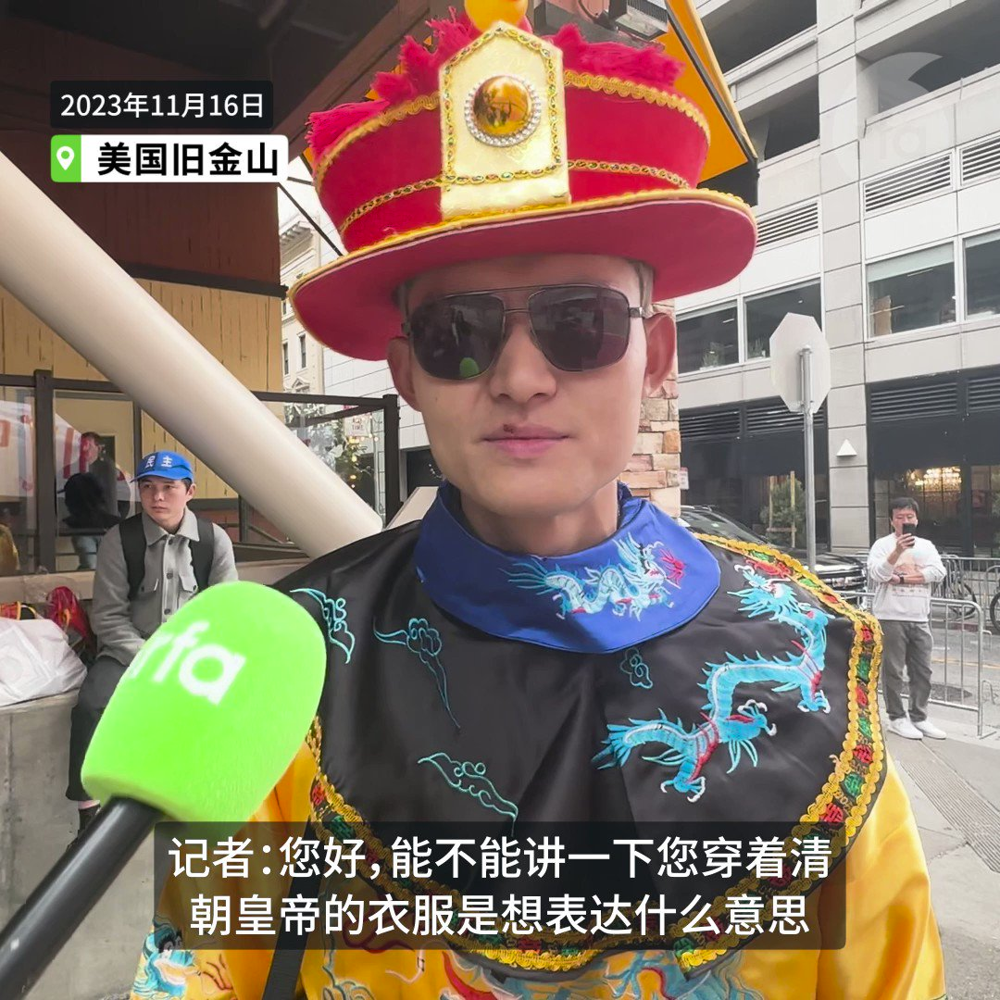  自由亚洲电台 北京时间 2023-11-17T22:57:09Z 1725528506497417285 【网民热议：习近平被边缘化了？】
亚太经济合作组织（#APEC）会议在旧金山举行，大会按惯例在会前，安排与会的各国领袖代表拍摄大合照，美国总统 #拜登 以东道主身份站在最前排的中间位置，中国国家主席 #习近平 站在前排左边的旁边位置，加拿大总理特鲁多和日本首相岸田文雄分别站在习近平的两旁。

在拍摄期间，拜登与站在旁的泰国总理赛塔时有互动，拍摄完毕后，与站在第二排的与会领袖打招呼。习近平在拍摄期间，和拜登两人并无交谈。

代替香港特首李家超出席的财政司司长陈茂波，与台湾代表、台积电创办人张忠谋同站在第二排，陈茂波站左边，靠近习近平的后方位置，张忠谋被安排站在第二排的右边，与习近平相隔多人，拍摄时两人没有互动。 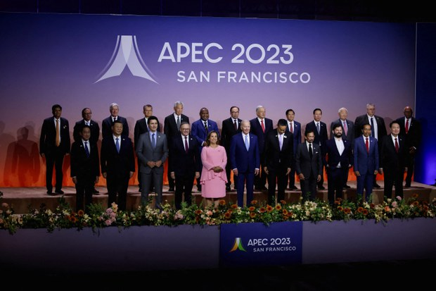  自由亚洲电台 北京时间 2023-11-17T23:14:19Z 1725532825376481643 RT @RFA_Chinese: 【APEC场外发生多起暴力冲突】
【抗议者界立建被捕】
在旧金山APEC会场外，抗议和欢迎习近平的人士继续在旧金山街头集会，发生多起暴力冲突。在冲突中，中国民主党青年部执行长界立建被警方逮捕。
#APEC #界立建 #习近平 https://t…   自由亚洲电台 北京时间 2023-11-17T23:14:24Z 1725532848705204670 RT @RFA_Chinese: 【瑞吉酒店外  相煎何急】
11月16日下午，在习近平下榻的 #瑞吉酒店 一带街道上，欢迎者与抗议者激烈冲突（郑永华提供） https://t.co/G9JGfHH3n9   自由亚洲电台 北京时间 2023-11-17T17:02:43Z 1725439311406063726 【习近平与岸田文雄会面】
【习强调战略互惠 岸田关切中国军事活动】
习近平与岸田文雄会面，新华社报道，中日重新确认全面推进战略互惠关系的两国关系定位，致力于构建契合新时代要求的建设性、稳定的中日关系。
学者表示，中国推动与日本重申关系的部分原因可能是东京与华盛顿的密切关系。在美中对抗期间，有人希望透过与日本建立所谓的战略关系来挑拨日美关系。
岸田文雄则要求中方立即取消对日本水产品的进口限制，对中国在日本附近日趋频密的军事活动，表达严重关切，并再强调台海和平稳定重要性，另敦促中方立即拆除在日本专属经济区设置的浮标。https://t.co/BlMiGZcya3
#习近平 #岸田文雄 #战略互惠 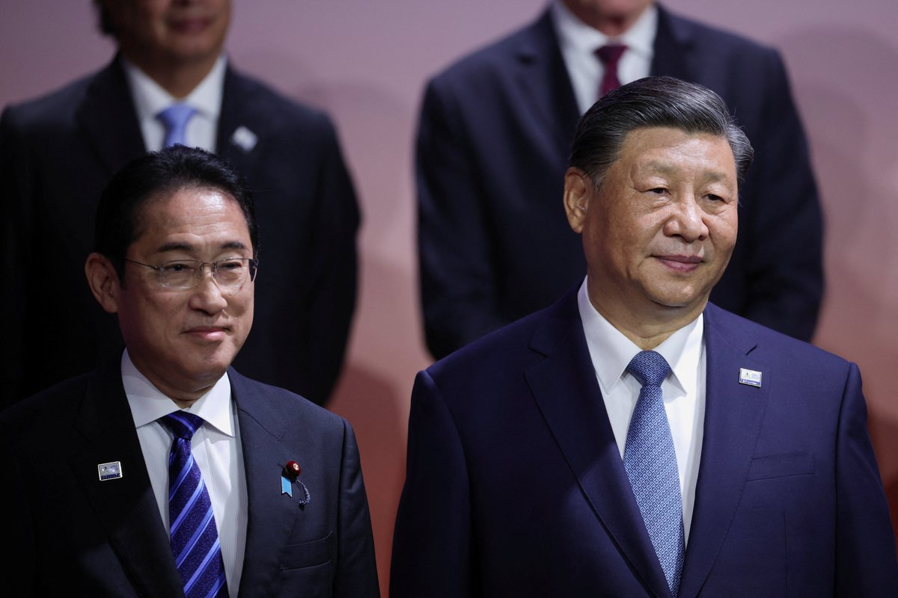  自由亚洲电台 北京时间 2023-11-17T21:39:40Z 1725509006012174345 RT @RFA_Chinese: 【11月15日旧金山Moscone Center战况小结】
中国民主党全国委员会执行长陈闯创说，11月15日在习近平下榻酒店附近的旧金山Moscone Center，不足百名抗议者和上千名亲共人士在发生激烈冲突。
他们为什么在16日又回到这里？…   自由亚洲电台 北京时间 2023-11-17T18:27:23Z 1725460616830443858 【岸田文雄会晤习近平】
【促取消海鲜禁令并释放日本人】
日本首相岸田文雄与中国国家主席习近平周四（16日）在旧金山举行的亚太经合组织（APEC）峰会期间举行会晤。面对双边关系日益紧张，习近平称两国应该“再次确认战略互惠关系”。岸田文雄则向习近平提出取消对日本海产品禁令，并呼吁释放被中国拘禁的日本人问题。详细报道：https://t.co/cQz2mDV7dK
#岸田文雄 #习近平 #APEC   自由亚洲电台 北京时间 2023-11-17T18:12:11Z 1725456794414432735 【岸田文雄会晤习近平】
【促取消海鲜禁令并释放日本人】
日本首相岸田文雄与中国国家主席习近平周四（16日）在旧金山举行的亚太经合组织（APEC）峰会期间举行会晤。面对双边关系日益紧张，习近平称两国应该“再次确认战略互惠关系”。岸田文雄则向习近平提出取消对日本海产品禁令，并呼吁释放被中国拘禁的日本人问题。详细报道：https://t.co/cQz2mDV7dK
#岸田文雄 #习近平 #APEC   自由亚洲电台 北京时间 2023-11-17T12:40:02Z 1725373203282043149 【习近平访美第三天】
【旧金山市区示威者激烈冲突】
中国领导人习近平在加州湾区参加APEC会议的第三天，抗议和欢迎他到访的人士继续在旧金山街头举行集会，继续发生多起暴力冲突。抗议者陈闯创被人用刺激性喷雾击中，另外中国民主党的界立建则被警方逮捕。有抗议者表示，他的身上有对方造成的五六处伤口。详细报道：https://t.co/Ld0NbGfBv3  #APEC #界立建 #陈闯创   自由亚洲电台 北京时间 2023-11-17T13:12:48Z 1725381450743365638 【习近平和岸田文雄会谈】
【习近平吁再次确认“战略互惠关系”并赋予新内涵】
【岸田文雄:期待全面坦诚交换意见】
中国国家主席习近平16日与日本首相岸田文雄在旧金山会晤。他说，中日关系尽管历经风雨，但整体保持发展态势。双方应“着眼共同利益，妥善处理分歧”，再次确认“战略互惠关系”定位并赋予新内涵。
岸田文雄说，日本和中国作为有着悠久历史和永恒未来的邻邦共存繁荣，作为区域和国际社会的主导力量，有责任为世界和平与繁荣做出贡献。并说：“我希望与你们共同努力，为日中关系、为下一代开辟光明的未来。为此，我期待从全面的角度与你们坦诚交换意见。”      #习近平 #岸田文雄 #APEC 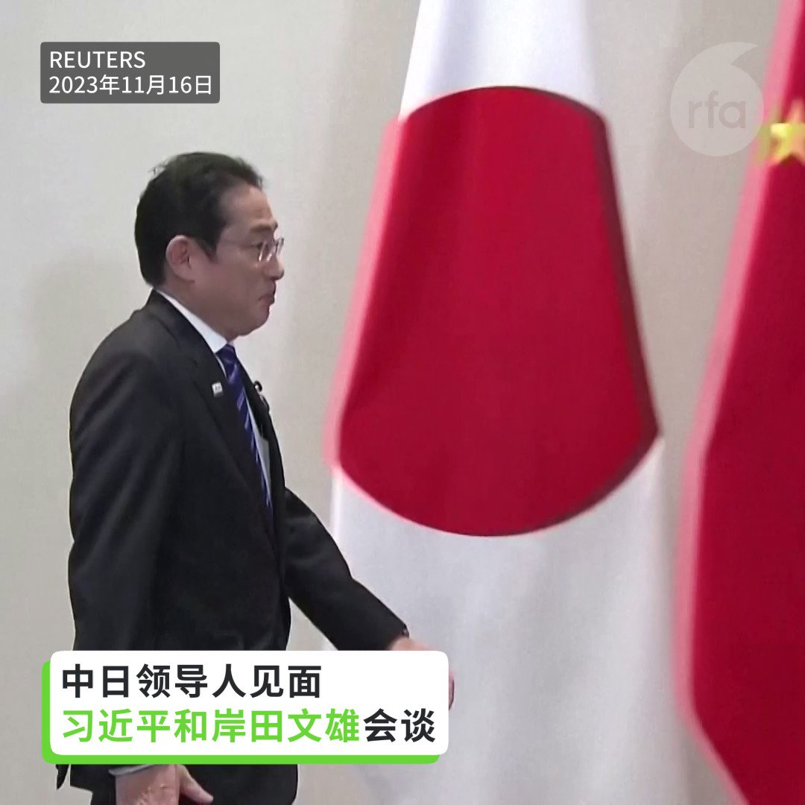  自由亚洲电台 北京时间 2023-11-17T09:22:55Z 1725323598972522724 【瑞吉酒店外  相煎何急】
11月16日下午，在习近平下榻的 #瑞吉酒店 一带街道上，欢迎者与抗议者激烈冲突（郑永华提供） https://t.co/G9JGfHH3n9 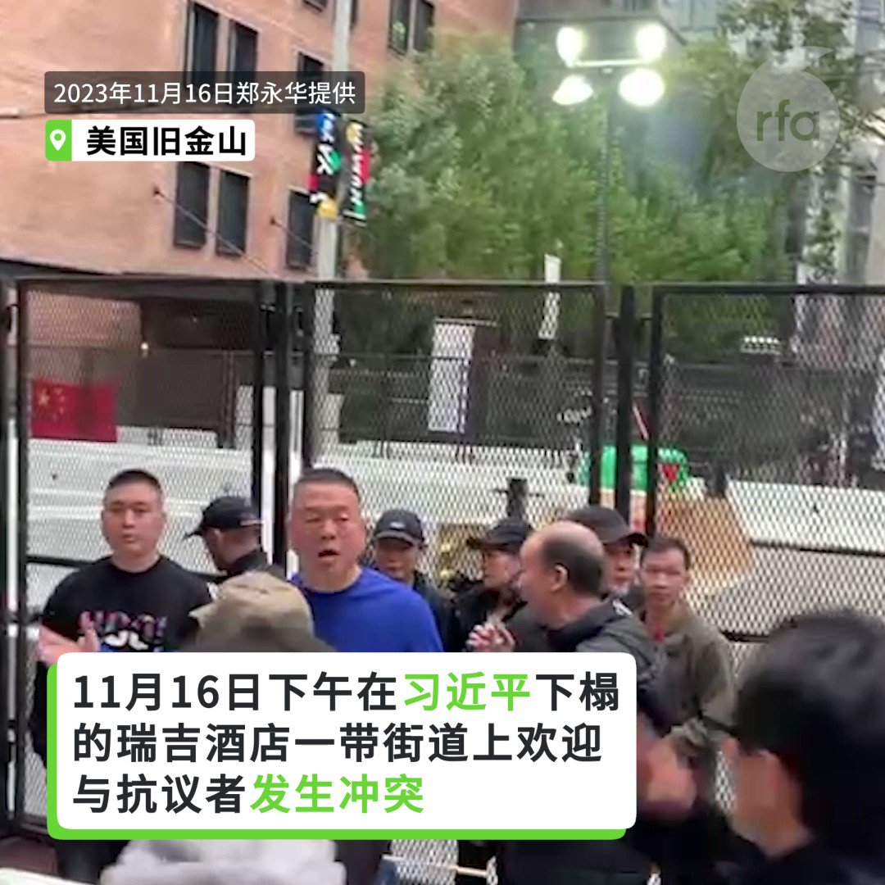  自由亚洲电台 北京时间 2023-11-17T12:08:41Z 1725365314316390674 【APEC场外发生多起暴力冲突】
【抗议者界立建被捕】
在旧金山APEC会场外，抗议和欢迎习近平的人士继续在旧金山街头集会，发生多起暴力冲突。在冲突中，中国民主党青年部执行长界立建被警方逮捕。
#APEC #界立建 #习近平 https://t.co/uuVdDooZsl 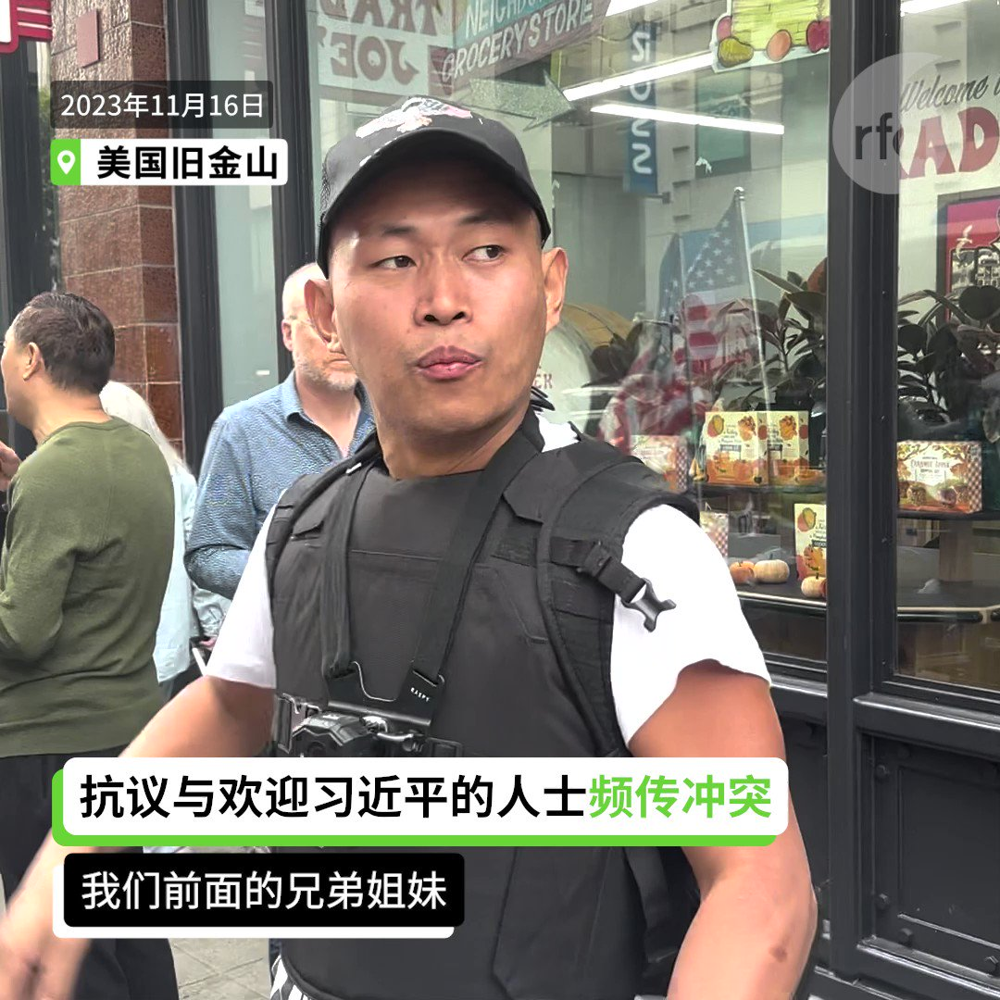  自由亚洲电台 北京时间 2023-11-17T06:19:56Z 1725277549079720322 中国国家统计局本周四发布的最新数据显示，全国主要城市楼价已连续四个月下跌。而伴随民众购房内需严重不足、房企资金链断裂，中国房地产泡沫也正濒临崩溃的边缘。那么，当局大举出手救市又能否重振颓势呢？（路透社图片）
https://t.co/BFYGqLX0vH https://t.co/pS01wmvtvf 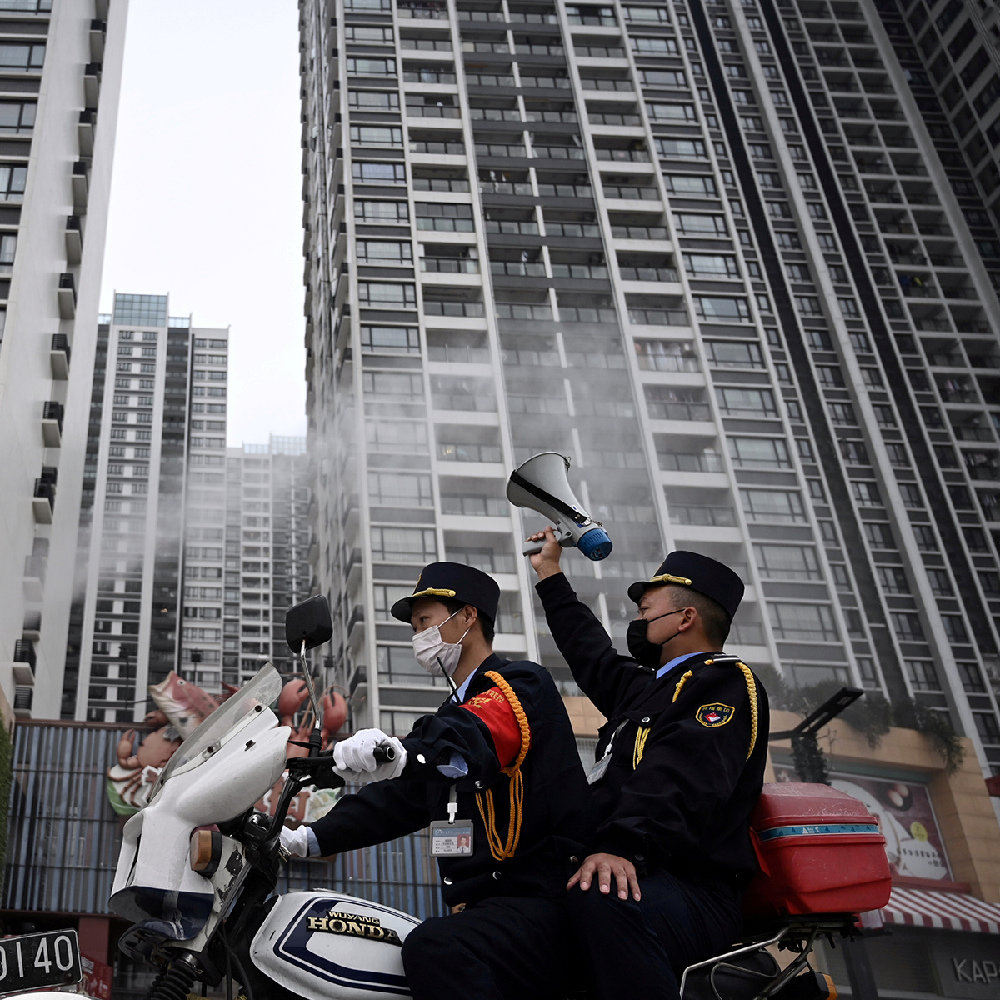  自由亚洲电台 北京时间 2023-11-17T07:22:05Z 1725293188070756424 专栏 | ＃绿色情报员：蚊子战争（上）解封后的头号敌人
https://t.co/CL7UcOzWgR https://t.co/ZPrJW5UDJQ 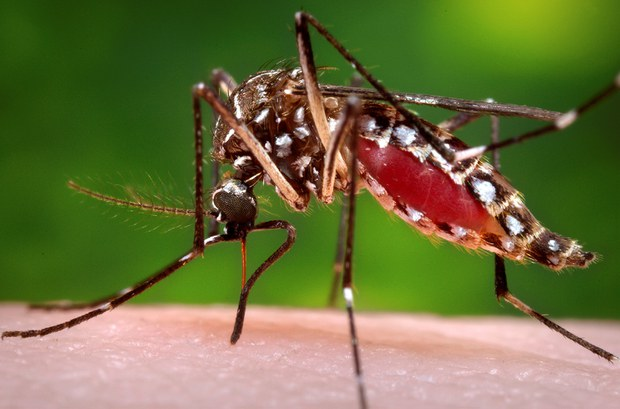  自由亚洲电台 北京时间 2023-11-17T09:05:26Z 1725319200502132941 RT @RFA_Chinese: 【熊猫欲躺平 奈何 ＃熊猫外交 不停？】
据华盛顿本地媒体https://t.co/uNu5KN4Jad报道，就在 ＃华盛顿国家动物园 的三只 ＃大熊猫 返回中国一周后，有消息显示，中国可能正在准备向美国发送更多熊猫，以显示两国关系改善。… h…   自由亚洲电台 北京时间 2023-11-17T10:17:56Z 1725337441933119507 【11月15日旧金山Moscone Center战况小结】
中国民主党全国委员会执行长陈闯创说，11月15日在习近平下榻酒店附近的旧金山Moscone Center，不足百名抗议者和上千名亲共人士在发生激烈冲突。
他们为什么在16日又回到这里？ https://t.co/IVbs7STxhD 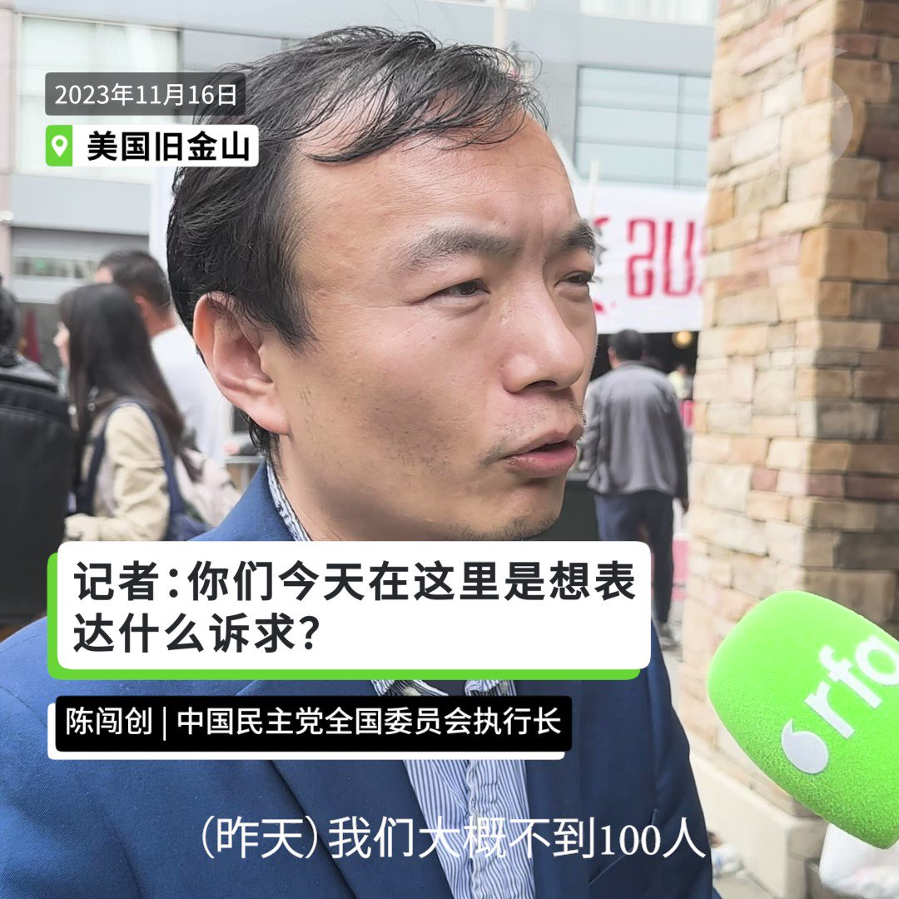  自由亚洲电台 北京时间 2023-11-17T10:27:39Z 1725339889838039330 11月16日，美国总统 #拜登 在亚太经济合作组织峰会发表演讲。他表示，此前一天与中国国家主席 #习近平 的会晤富有成果，但并不一定意味着两国关系总会是"肯巴亚"。
https://t.co/247XJXvfu1 https://t.co/rccfpufIMo 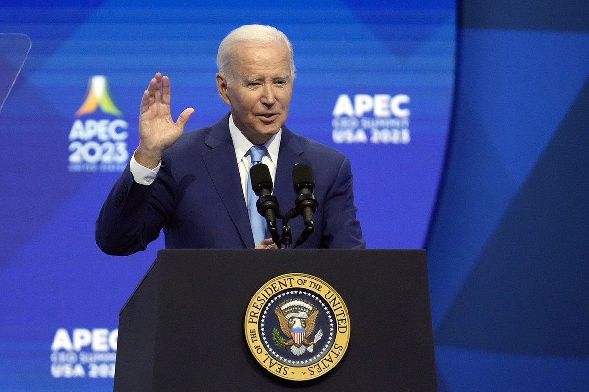  自由亚洲电台 北京时间 2023-11-17T06:34:57Z 1725281328667775245 美国总统 ＃拜登 与中国国家主席 ＃习近平 日前在旧金山举行会晤，双方针对有关重启两国军事对话、＃芬太尼 管控及 ＃台海安全 等诸多议题进行了讨论。那么，美中关系接下来会是什么样的走向呢？（美联社图片）
https://t.co/Q5zy55bWNf https://t.co/Sl6M4IXi2p 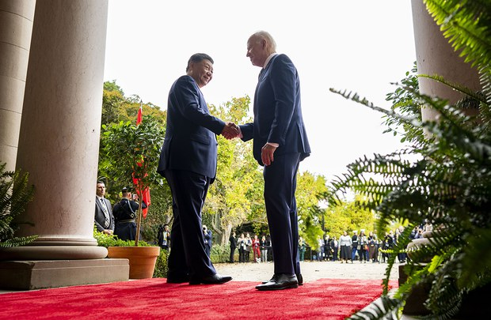  自由亚洲电台 北京时间 2023-11-17T06:50:22Z 1725285208319234357 在"＃拜习会"后，中国微博热搜前十位的话题大多关注美中关系。而中国官方媒体则炒作拜登在公开记者会和白宫声明中，都没有提到"＃不支持台独"等问题。
https://t.co/3ustg9clK9 https://t.co/SHIxuHOVMD   自由亚洲电台 北京时间 2023-11-17T07:20:10Z 1725292706702790932 【熊猫欲躺平 奈何 ＃熊猫外交 不停？】
据华盛顿本地媒体https://t.co/QM11lEe3cQ报道，就在 ＃华盛顿国家动物园 的三只 ＃大熊猫 返回中国一周后，有消息显示，中国可能正在准备向美国发送更多熊猫，以显示两国关系改善。

报道指出，中国国家主席习近平周三（11月15日）晚在旧金山出席美中贸易全国委员会和美中关系全国委员会主办的晚宴上表示，他了解到，圣地亚哥动物园和加州人民热切期盼大熊猫能重返加州，中方愿继续同美国开展大熊猫保护合作，努力满足加州人民的愿望，增进两国人民友好感情。但他在讲话中没有提及华盛顿的国家动物园。

https://t.co/QM11lEe3cQ报道说，国家动物园正在花费250万美元翻修新的熊猫园；并且在大熊猫离开华盛顿之前，动物园官员在接受采访时对熊猫很快会回到华盛顿特区表达了乐观情绪。

【＃您怎么看？ 请在评论区用一句话分享您的心情】   自由亚洲电台 北京时间 2023-11-17T08:00:10Z 1725302774928470416 欢迎收听和订阅播客【＃亚太报道】 https://t.co/MjLNSvVMqc
（２０２３－１１－１６）
拜登再称习近平为“＃独裁者”；＃旧金山抗议 与支持习近平民众再起冲突；＃美中关系 何去何从？；台湾官方感谢拜登关注 ＃台海安全；浙江异议人士 ＃朱虞夫 病情亟需关注。 https://t.co/OWURSDEnZZ 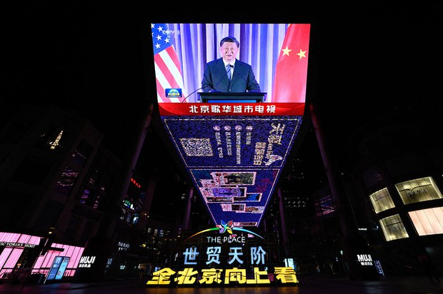  自由亚洲电台 北京时间 2023-11-17T09:05:52Z 1725319307733672402 RT @RFA_Chinese: 【#拜习会 跟记者走马观花 ＃斐洛里】
中国国家主席习近平与美国总统拜登“庄园会晤” ，本台记者凯迪   ＠KittyWang5   带您走进斐洛里庄园。 https://t.co/63lj9e47ss   自由亚洲电台 北京时间 2023-11-17T09:13:13Z 1725321156092219839 【旧金山冲突升级 陈闯创惨遭毒手】
11月16日中午，在 #旧金山 Moscone Center附近，抗议与支持 #习近平 的人群继续对峙，人数不及昨日，但冲突升级。
抗议者中国民主党全国委员会执行长 #陈闯创 @1957spirit 双眼被对方喷射辣椒喷雾，苦不堪言。
（RFA记者孙诚采访，Jim拍摄） https://t.co/BRMwT4YGds 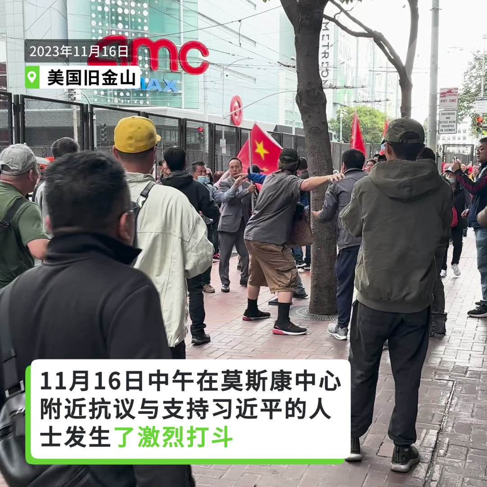  自由亚洲电台 北京时间 2023-11-17T04:35:23Z 1725251237933887524 记录1967年香港暴动的纪录片《＃消失的档案》打破地域限制，本星期正透过网络进行全球公映。导演 ＃罗恩惠 表示，当年"＃反英抗暴"是口号，人民真正的心声是反共的；一如2019年的香港，也是反对极权、争取自由。

https://t.co/6PrGRyM026 https://t.co/GZXvBbEMoy 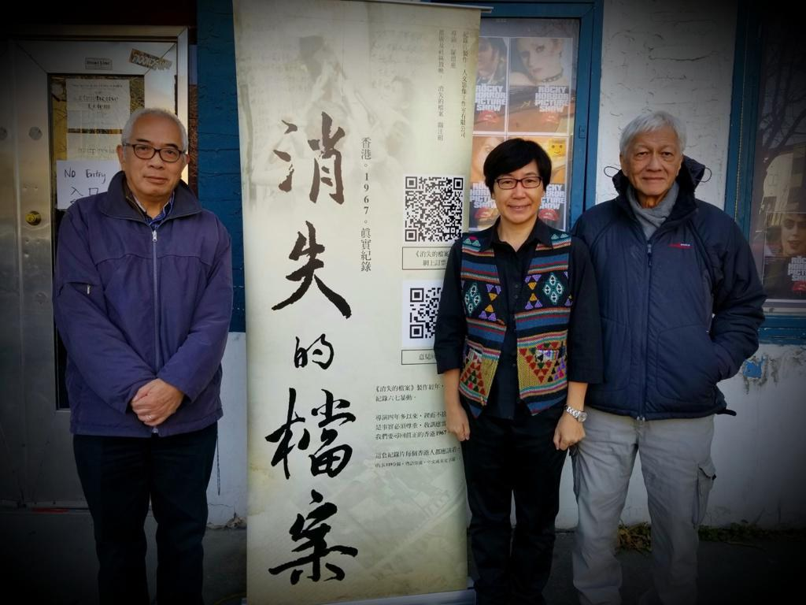  自由亚洲电台 北京时间 2023-11-17T05:17:22Z 1725261805067645386 英国智库发现，除学费以外，＃英国高校 在过去五年收受巨额中国资金，当中有三成和中国军方有关，而 ＃华为 更是最大资助者。报告又点名"＃中国学生学者联合会"和　＃孔子学院，指它们协助中共监控全球七十万中国留学生。
https://t.co/v6RtimT4Ri https://t.co/ECiXfgOqxc   自由亚洲电台 北京时间 2023-11-17T05:20:20Z 1725262551532048772 【#拜习会 跟记者走马观花 ＃斐洛里】
中国国家主席习近平与美国总统拜登“庄园会晤” ，本台记者凯迪   ＠KittyWang5   带您走进斐洛里庄园。 https://t.co/63lj9e47ss 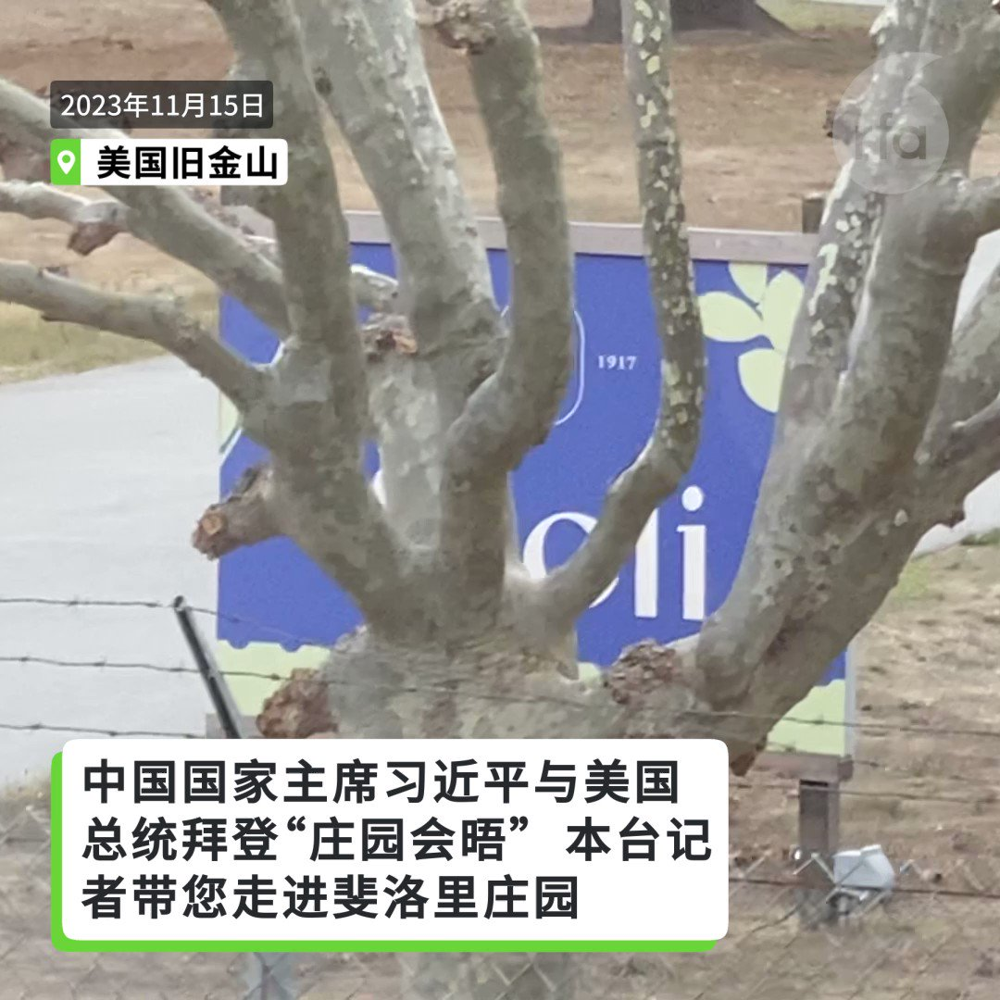  自由亚洲电台 北京时间 2023-11-17T00:29:55Z 1725189463574237383 RT @RFA_Chinese: 【习近平访美 群众冲突不断】
11月15日整天，在 #习近平 所下榻的旧金山 #瑞吉酒店 外，抗议和欢迎习近平的群众发生多场肢体冲突。
（王中伟、郑永华提供） https://t.co/p04v87ieoJ 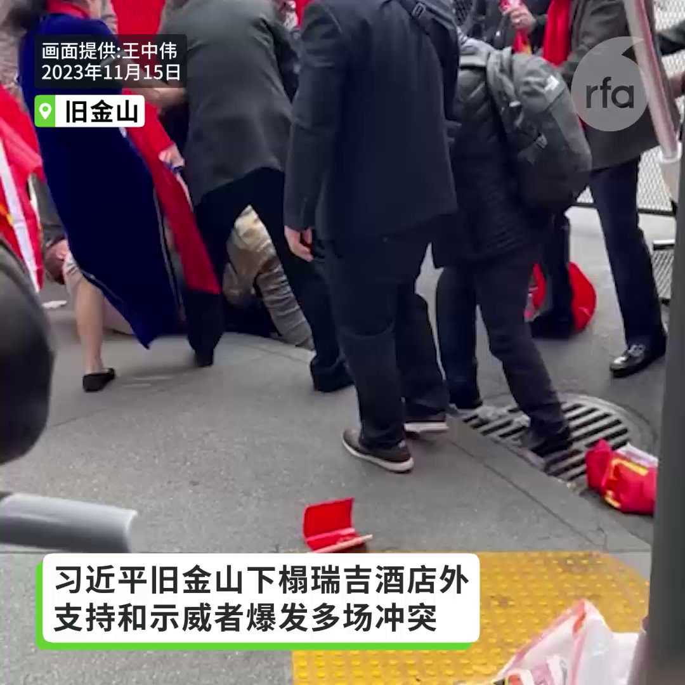  自由亚洲电台 北京时间 2023-11-17T02:43:11Z 1725223003762593966 2千美元入场券，4万美元 #与习近平同桌？来的都是谁？
https://t.co/3hXINRyaKX
黑石集团 苏世民（Stephen Schwarzman）
VISA 麦金纳尼（Ryan McInerney）
辉瑞药厂 博尔拉（Albert Bourla）
高通（Qualcomm）艾蒙（Cristiano Amon）
博通（Broadcom）霍克·谭（Hock Tan）
... https://t.co/kI8FknNlLf 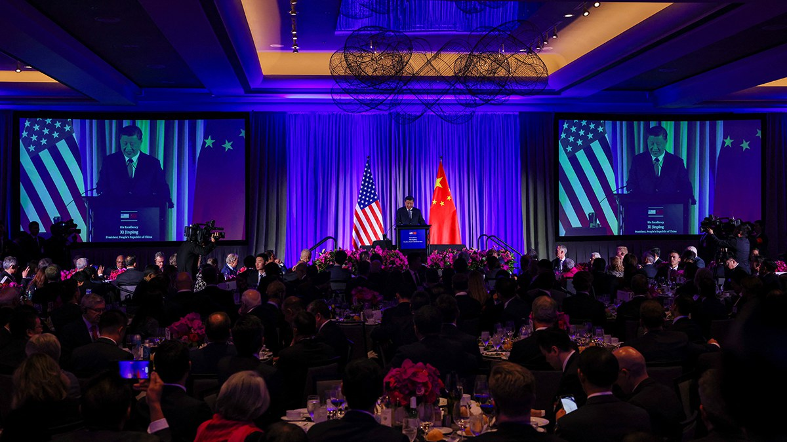  自由亚洲电台 北京时间 2023-11-17T03:26:05Z 1725233798093344945 11月15日 #拜习会 谈了两个半小时，议题包括管理两国竞争，合作打击毒品、恢复两国军方高层交流、建立人工智能对话、气候问题合作，以及增加两国间客运航班及民间互动等等。
有学者认为，这次”拜习会”将为处于激烈竞争的中美关系带来某种缓和的可能，＃您怎么看？您如何评价拜习会成果？ https://t.co/BqcVtmlp6f 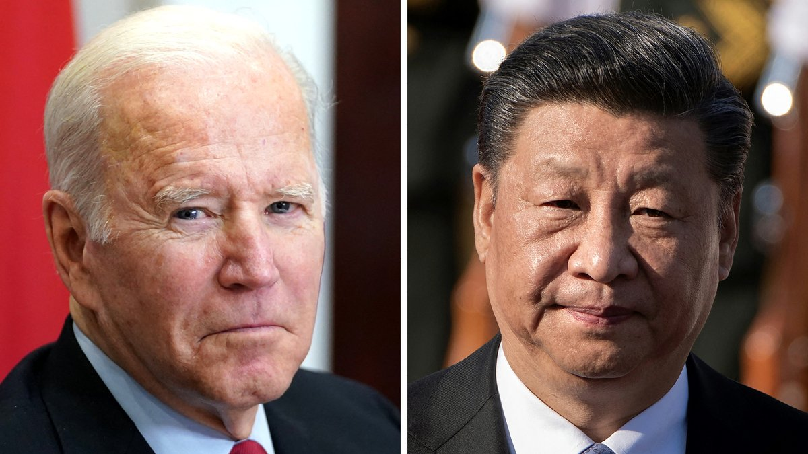  自由亚洲电台 北京时间 2023-11-17T03:54:56Z 1725241059817713706 １１月１５日，习近平在与美国商界领袖及加州侨胞晚宴时透露，中方可能会向美国送新的大熊猫，因为它们是“中美两国人民的友谊使者”。
对于中国 ＃收放自如 的“＃熊猫外交”，＃您怎么看？
https://t.co/FUaSreha4w https://t.co/9n28Pk4epv 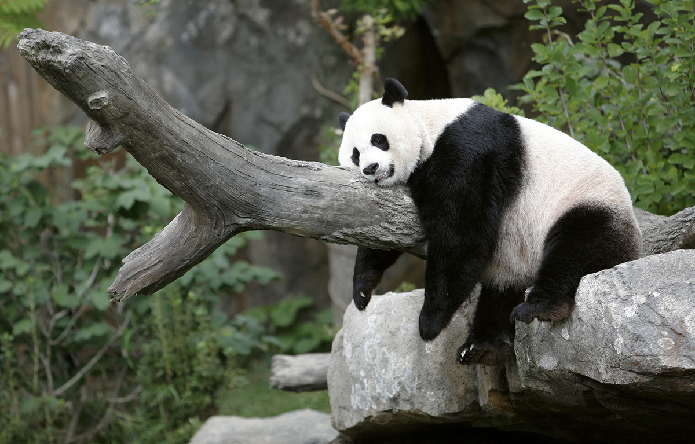  自由亚洲电台 北京时间 2023-11-17T00:30:25Z 1725189592033227196 RT @RFA_Chinese: 【又打起来了！这次在斐洛里庄园外】
在拜习会会场斐洛里庄园外，抗议与欢迎 #习近平 的人士之间发生激烈冲突。双方冲突随后被警方阻止。（RFA记者孙诚拍摄） https://t.co/WBZxjMY3Hi   自由亚洲电台 北京时间 2023-11-17T00:30:40Z 1725189652993151372 RT @RFA_Chinese: 11月15日，香港民主委员会执行总监 #郭凤仪， 在旧金山中领馆门前接受本台采访（本台记者孙诚采访，Jim拍摄） https://t.co/JwFZghEBwA   自由亚洲电台 北京时间 2023-11-17T00:42:10Z 1725192546652209596 台湾即将在明年一月举行总统大选。美国总统拜登在"#拜习会"中表示，他不预期中国介入台湾大选。而就在"拜习会"前，台湾在野的国民党与民众党达成协议，以民调决定正副总统搭档参选。不少人认为，这一规则对国民党有利，但民调专家却有不同解读。
#蓝白合
https://t.co/XarFShp9hG https://t.co/7KsZXcoFbO 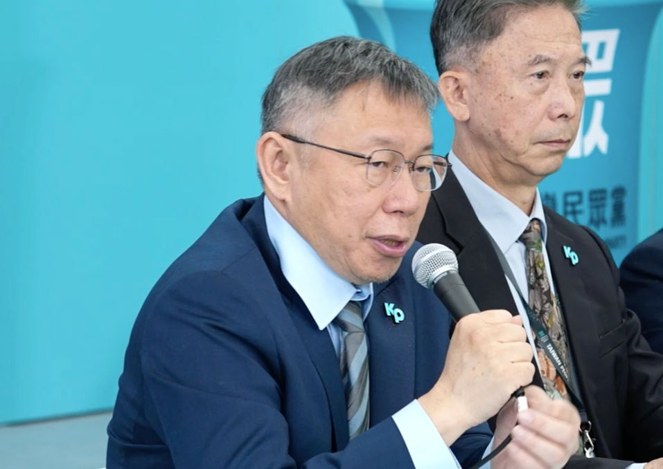  自由亚洲电台 北京时间 2023-11-17T01:18:19Z 1725201643141284119 #习近平 与 #拜登 会面后出席美国商界晚宴，表示愿 #邀请五万名美国青少年访华 、增加中美航班、优化签证政策等。参与本台《#亚洲很想聊》 节目的评论人士就此指出，习近平访美是为重建美商投资信心，以拯救中国经济。
https://t.co/113xcOFjfh https://t.co/MJ6N5JHiBV 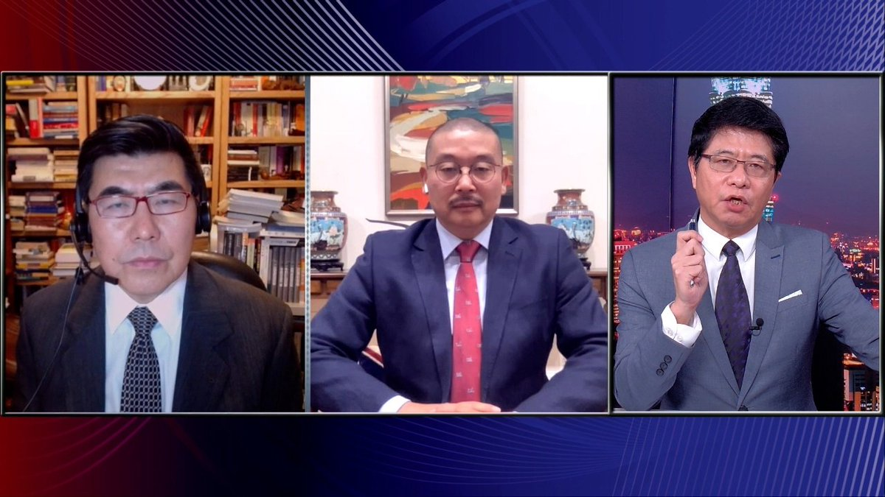  自由亚洲电台 北京时间 2023-11-17T02:06:13Z 1725213698778939819 为了前往日本不惜闯关，最终被遣返回浙江的异议人士 #朱虞夫，在遭当局软禁期间证实患上癌症，并将于11月17日接受切除手术。朱虞夫以经济状况和治疗效果为由，促请当局放行，让他到日本接受后续治疗。而家属对于朱虞夫突然身患重病感到可疑，担心另有内情。
https://t.co/M6y8o6XFmq https://t.co/Rp1Tl6ywXu 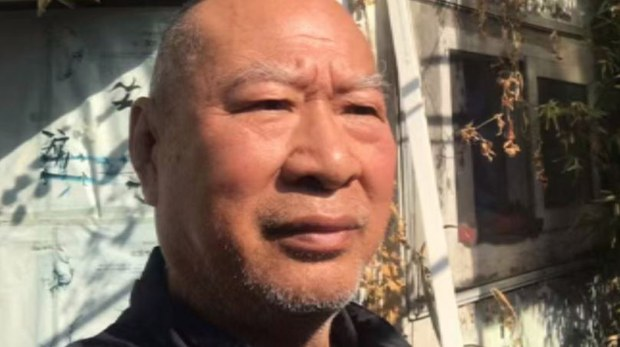  自由亚洲电台 北京时间 2023-11-17T02:19:59Z 1725217162342908401 专栏 | #军事无禁区：“#拜习会”后－美中军事交流动向
https://t.co/j3IJYrjUpz https://t.co/apLFkXX3Vd 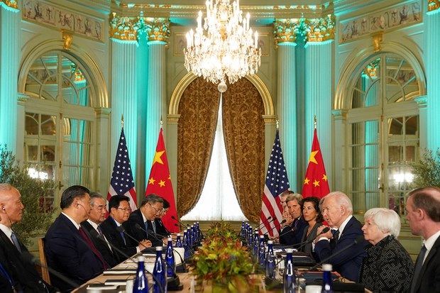  