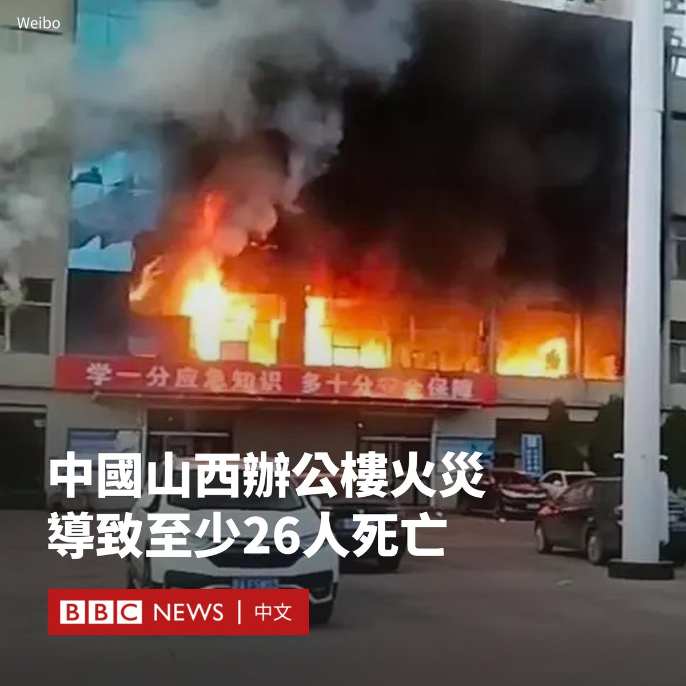
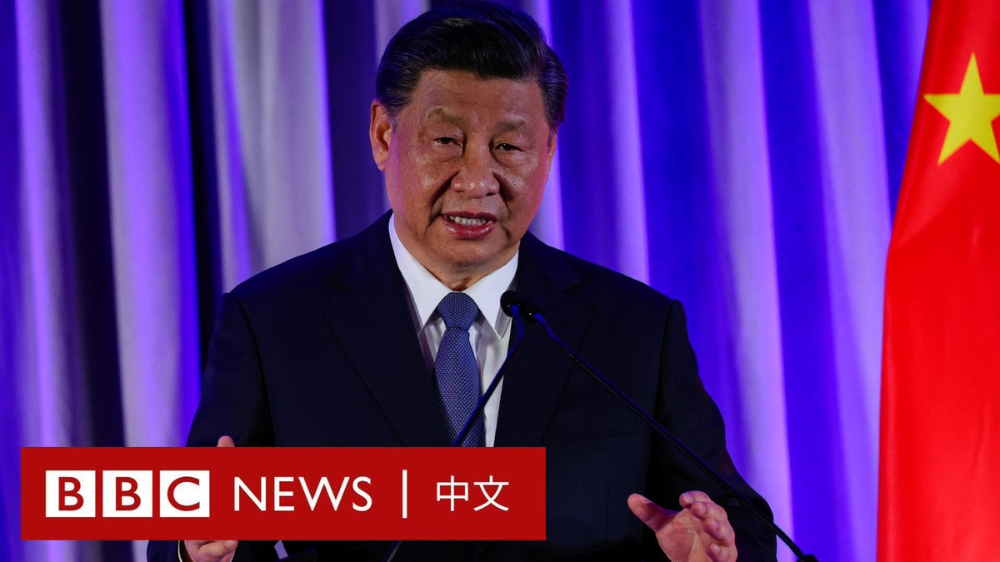
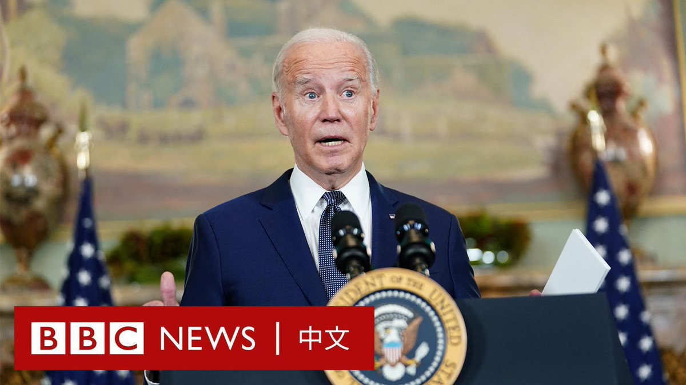
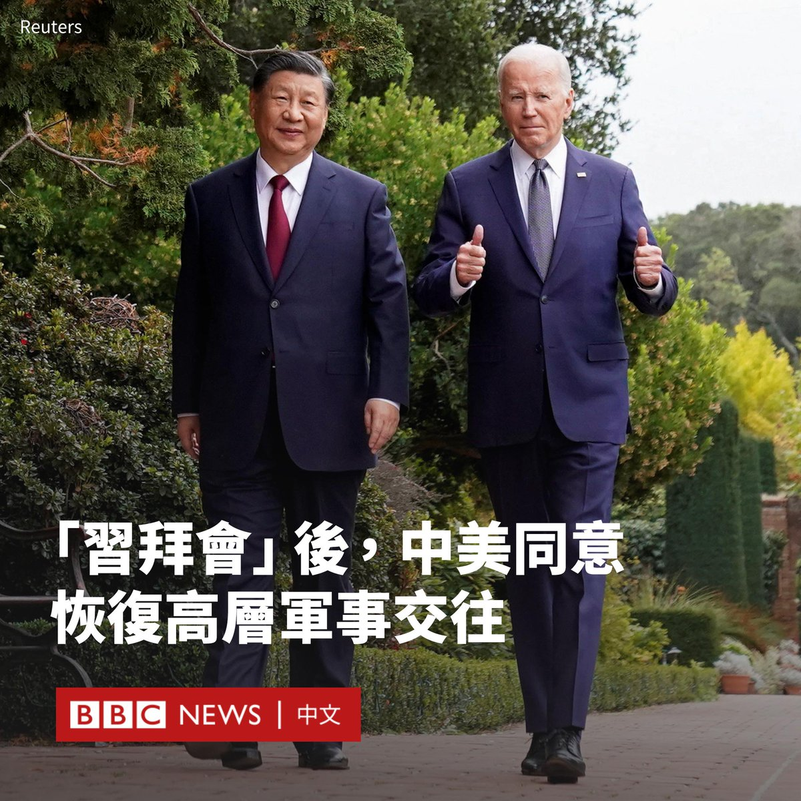
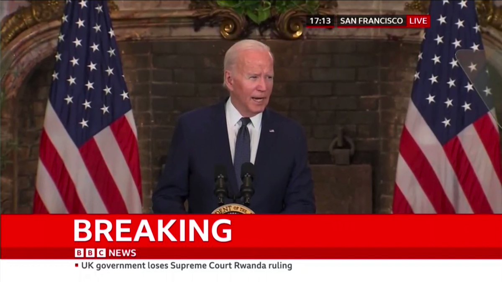
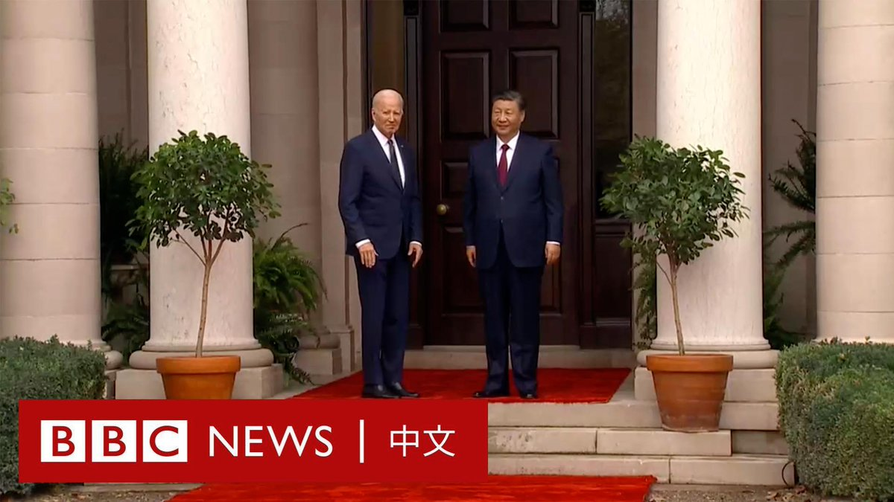
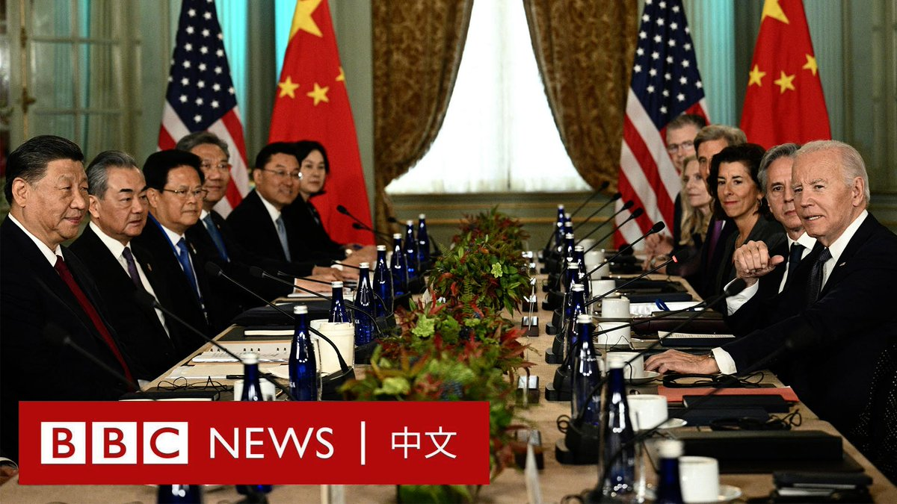

D英国广播公司BBC 北京时间 2023-11-16T21:59:16Z 1725151553500139710 英国最高法院驳回政府上诉，裁定将在英国境内“庇护申请者”转移至卢旺达的计划是不合法的。该决定使保守党政府的关键移民政策面临严重挫折。https://t.co/QTHIXPYYhi   D英国广播公司BBC 北京时间 2023-11-16T18:42:19Z 1725101989577539861 拜登与习近平举行了备受外界关注的会晤，但如同旧金山街头亲中支持者与抗议者之间的鲜明对比，此次峰会取得多方面进展，但无法调和的争议仍为未来双边关系蒙上阴影。https://t.co/rVEidHeEFw   D英国广播公司BBC 北京时间 2023-11-16T17:33:35Z 1725084689692787160 据中国官方媒体报道，北部山西省吕梁市的一座办公楼发生火灾，造成至少26人死亡。

火灾于当地时间周四07:00左右发生。起火的办公楼属于一家民营煤业公司。

据报道，该楼共有四层，起火的二层是职工浴室。

现场画面显示，这栋楼的二层窗户冒出了熊熊大火，浓烟将楼体吞没，不时还传来爆炸声。

中国媒体报道称，有64人被送往医院，其中抢救无效死亡26人，住院治疗38人。

据报道，目前大火已被扑灭，搜救工作已基本结束。当局称，已成立调查组调查事故原因。   D英国广播公司BBC 北京时间 2023-11-16T14:28:01Z 1725037992169951708 中国国家主席习近平与美国中西部农业州爱荷华州小镇的特殊缘分，可以追溯到近四十年前的一次访问。https://t.co/DXN1yV3KRf   D英国广播公司BBC 北京时间 2023-11-16T15:49:44Z 1725058556129632433 中国国家主席习近平周三（11月15日）在加州参加由美中关系全国委员会和美中贸易全国委员会举办的一场晚宴。

在与美国总统拜登（Joe Biden）会晤后，习近平对美国的商界领袖发表了一场演讲。他称，中国“愿意同美国做伙伴、做朋友”。

“中国从不赌美国输，从不干涉美国内政，也无意挑战和取代美国。”他说道。“同样，美国也不要赌中国输。”   D英国广播公司BBC 北京时间 2023-11-16T11:08:43Z 1724987834556469289 在美国总统拜登（Joe Biden）就与中国领导人习近平的会晤召开记者会后，当他走下讲台时，有记者追问他是否还会称呼习近平为“独裁者”。

拜登再次重申他认为习近平是“独裁者”，称因为“他管理的国家是一个共产主义国家”。

今年六月，拜登曾称呼习近平是“独裁者”而引起轩然大波。中国外交部指责他的言论“极其荒谬”，“是公开的政治挑衅”。   D英国广播公司BBC 北京时间 2023-11-16T09:53:18Z 1724968855817368021 美国总统拜登（Joe Biden）与中国国家主席习近平在旧金山附近一处庄园举行了两个多小时的会晤。中国官方通讯社报道称，两国同意恢复高层军事交往。

新华社在一份新闻稿中称，中美两国元首同意恢复两军高层沟通、中美国防部工作会晤、中美海上军事安全磋商机制会议，开展中美两军战区领导通话。

报道补充说，这些沟通渠道建立在“平等和尊重基础上”。

这是华盛顿希望达成的一项成果。在2022年美国时任众议院议长佩洛西（Nancy Pelosi）访问台湾后，中国切断了这一重要的对话机制。

拜登在X（推特）上写道，“我相信这是我们进行的最具建设性和最有成效的讨论。”他称，会晤以过去数月的外交工作为基础，取得“重要进展”。

此外，新华社报道称，两国领导人同意就人工智能和禁毒合作建立对话和工作组，并扩大教育、留学生、文化和体育方面的交流。

双方还同意在明年早些时候“进一步大幅增加航班”。   D英国广播公司BBC 北京时间 2023-11-16T10:21:45Z 1724976018602311787 在与中国领导人习近平进行会谈后，美国总统拜登（Joe Biden）召开记者会。

他称两人会晤的一大成果是就解决芬太尼流向美国的问题达成了一致。他称，双方正在重新启动打击毒品的工作，而该项工作“将拯救生命”。

他还宣布两国将恢复军方之间的高层接触。

拜登表示，双方还谈到美中关系中的一个关键冲突点：台湾问题。他对记者说，他“强调了台湾海峡和平与稳定的重要性”。

在提及人权问题时，拜登称他向习近平提出美国公民遭到不当拘押的问题。他称提供了一些被关押者的姓名，希望这些人能够获释，但双方并未就此达成一致。

拜登还在记者会上透露，他与习近平还就一些国际议题交换了意见，包括俄乌战争和加沙冲突。   D英国广播公司BBC 北京时间 2023-11-16T03:28:16Z 1724871960759615637 【现场画面】中国国家主席习近平抵达旧金山以南的斐洛里庄园，与美国总统拜登（Joe Biden）举行双边会晤。两人在红毯上短暂握手，随后步入室内。 https://t.co/ZgdGM2F4ql   D英国广播公司BBC 北京时间 2023-11-16T04:11:27Z 1724882826452148504 【现场画面：拜登与习近平开始会谈】

美国总统拜登（Joe Biden）与中国国家主席习近平在旧金山以南的斐洛里庄园举行会晤。这是两人时隔一年再度会面。

拜登在开场白中对习近平的来访表示欢迎，并强调了“面对面”会晤的重要性。

“我们认识很久了。”拜登说。“我们并不总是意见一致……我一直认为我们的讨论直接而坦率。”他还表示：“我们必须确保竞争不会演变成冲突”。

习近平在致辞中表示，中美关系“从来都不是一帆风顺的”，但他表示，中美“不打交道是不行的，想改变对方也不切实际”。

“对抗的后果是谁也不能承受的。”习近平说。他称相信双方有能力克服分歧，两国关系的前景是光明的。   