自由亚洲电台 北京时间 2023-11-16T09:38:05Z 1724965029055774940 RT @RFA_Chinese: 【听！旧金山中领馆外的抗议声】
11月15日上午，包括藏人、港人、维吾尔人在内的多族裔人士，在旧金山中领馆外集会，抗议 #习近平 到访加州湾区。（RFA记者Jim拍摄） https://t.co/1UPOBadk5B   自由亚洲电台 北京时间 2023-11-16T11:20:24Z 1724990774377640141 扮成维尼熊的夫妻，
来自加拿大的祝福，
焚烧五星旗的人们...
【#拜习会 场外的抗议者】
11月15日， 斐洛里庄园拜习会会场外，来自中国的异议者、香港人、越南人团体等抗议习近平到访美国 (RFA记者孙诚) https://t.co/eTpJmvR7bD 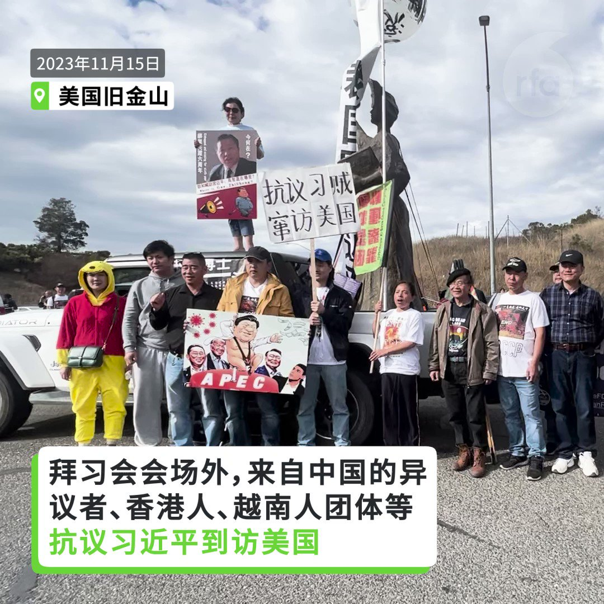  自由亚洲电台 北京时间 2023-11-16T12:27:44Z 1725007722570199090 【拜登记者会后再称习近平为独裁者】
美国总统拜登在拜习会后单独举行记者会，在离开会场前被记者问及是否还认为习近平是独裁者。拜登明确说：“他是。” #拜习会 #习近平 #独裁者 https://t.co/P6jiVbcETe 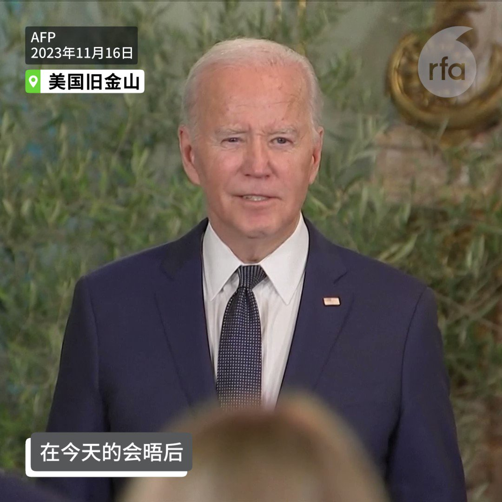  自由亚洲电台 北京时间 2023-11-16T13:32:03Z 1725023905117880517 【拜登强调台海和平稳定 主张一中政策】
【双方同意直接通话 是重要进展】
美国总统拜登在拜习会后单独召开记者会，拜登在记者会上强调台海和平稳定的重要性，并说他认为习近平很坦诚。拜登说他和习近平都同意，两国间或区域内有关切的问题，彼此应该打电话直接通话，这是很重要的进展。拜登还提到坚持一个中国政策。
#拜登记者会 #拜习会 #一中政策 #台海和平稳定 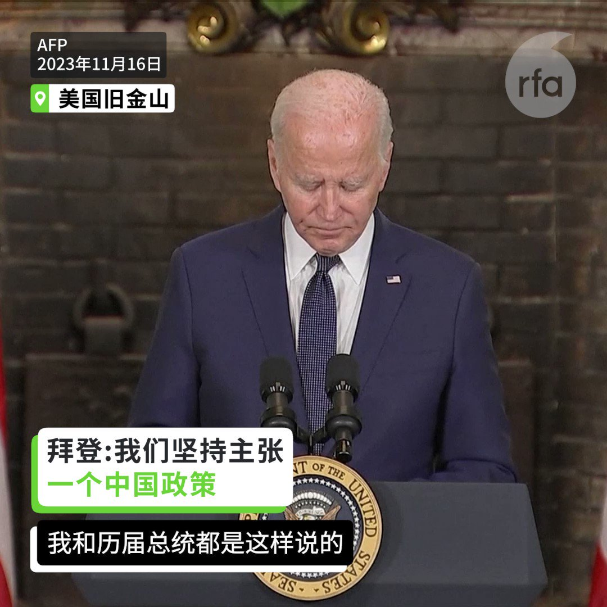  自由亚洲电台 北京时间 2023-11-16T11:46:01Z 1724997222251761681 拜习会 习近平称中国没有计划在未来几年犯台

美国总统拜登和中国国家主席习近平美国时间15日会面约四个小时，讨论从军事冲突到贩毒等一系列问题，其中包括台湾问题。
路透社报道，一位美国高级官员告诉记者，两位领导人就台湾问题进行了“实质”讨论，习近平告诉拜登，台湾是两个超级大国面临的最大、最危险的问题。
这位官员表示，这位中国领导人表示，中国没有计划在未来几年对台湾采取军事行动，但讨论了可以使用武力的条件。
拜登表示，他“强调了台海和平与稳定的重要性”。 这位美国官员表示，他还要求习近平尊重台湾的选举程序。
一位美国高级官员表示，拜登提出了“非常明确的要求”，要求两国将军事对话制度化，美国国防部长劳埃德·奥斯汀将在中国国防部长任命后与其会面。#拜习会 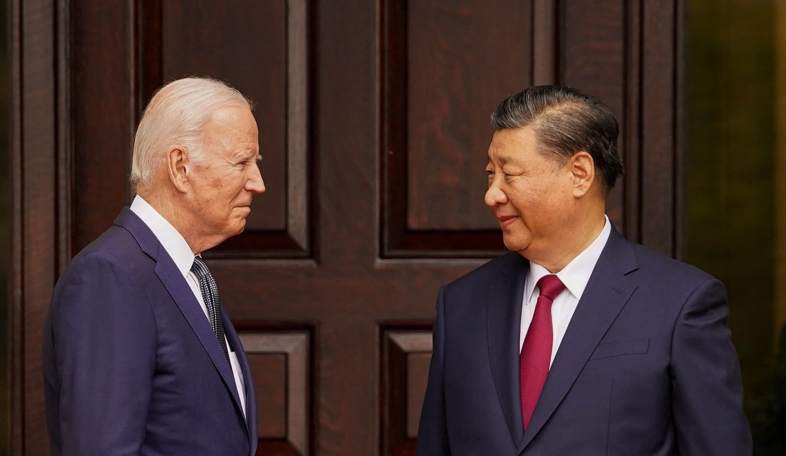  自由亚洲电台 北京时间 2023-11-16T06:38:29Z 1724919829189239179 美国一家机构近日发表民意调查报告，显示美国民众普遍认为美国政界在解决 #美中竞争 关系上的力道不足，且对中国崛起的担忧程度创1990年有记录以来历史新高。
https://t.co/o3UHYLl2sB https://t.co/CAZ8HDcamd 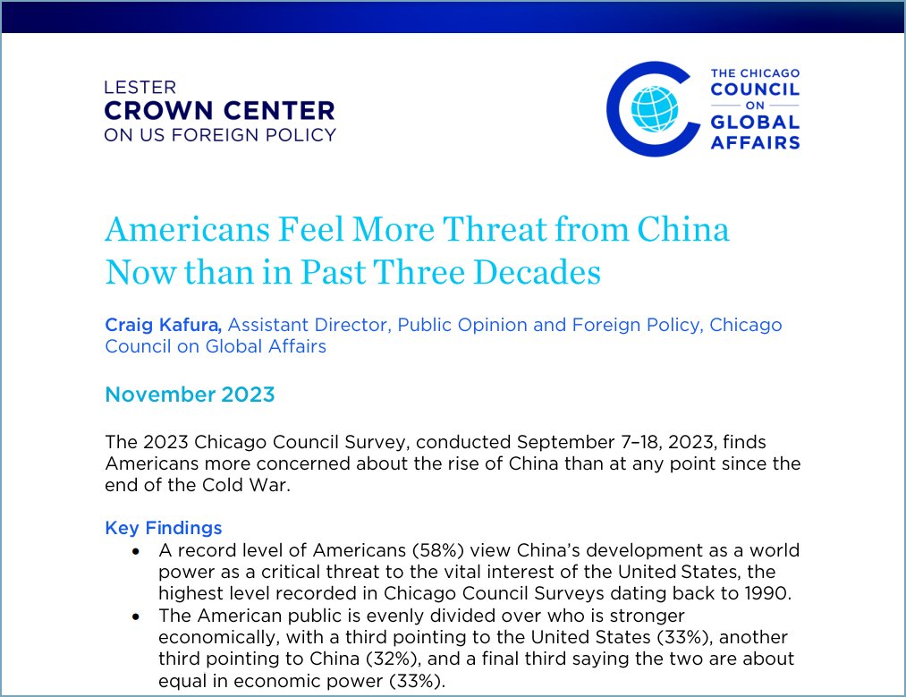  自由亚洲电台 北京时间 2023-11-16T08:52:56Z 1724953665965109364 #拜习会 在旧金山展开　最终成果如何备受各界瞩目
https://t.co/tnFSFGMxXx https://t.co/PiQ00qUrPJ 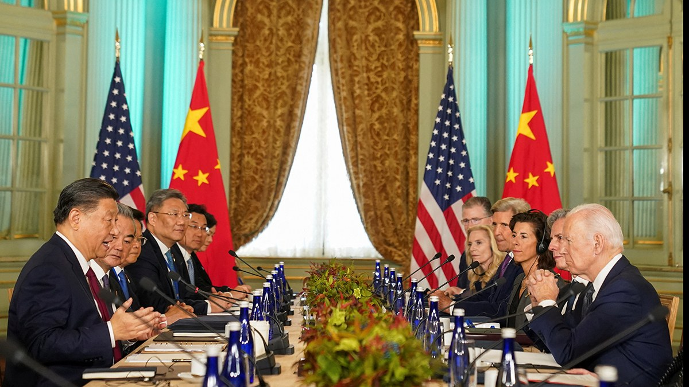  自由亚洲电台 北京时间 2023-11-16T09:42:11Z 1724966059445260319 RT @RFA_Chinese: 【抗议者们想对习近平说什么？】
11月15日，包括藏人、港人、维吾尔人在内的多个族裔人士在旧金山中领馆外进行 #抗议习近平 到访加州的集会，他们想对习近平说什么？（本台记者孙诚采访 Jim拍摄） https://t.co/sPgkyztA1A   自由亚洲电台 北京时间 2023-11-16T10:28:11Z 1724977636760330736 RT @RFA_Chinese: 11月15日，香港民主委员会执行总监 #郭凤仪， 在旧金山中领馆门前接受本台采访（本台记者孙诚采访，Jim拍摄） https://t.co/JwFZghEBwA   自由亚洲电台 北京时间 2023-11-16T06:41:02Z 1724920469386891570 专栏 | #网络博弈：关于 #许家印 更多被禁文章：《许老板，借的钱是要还的》、《恒大集团的党组织》……
https://t.co/y1kavLksdw https://t.co/jGqpo7eguo 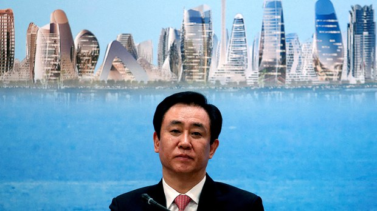  自由亚洲电台 北京时间 2023-11-16T07:16:06Z 1724929295053918226 欢迎收听和订阅播客【#亚太报道】 https://t.co/MjLNSvVMqc
（2023-11-15）
#拜习会 15日费罗丽庄园登场; “拜习会”要解决的首要问题是什么？欢迎和抗议 #习近平 的人群发生冲突；CNN揭拜习会抗议者受死亡威胁；台湾在野势力整合成功 https://t.co/5vv7sv6g5f 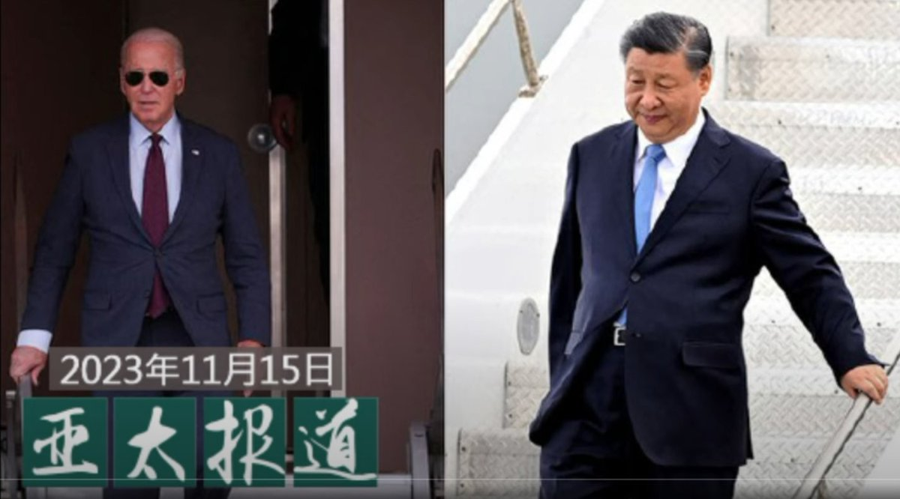  自由亚洲电台 北京时间 2023-11-16T09:06:12Z 1724957004744245680 【欢迎习近平阵营的人怎么说？】
11月15日，#拜习会 会场外，参加欢迎习近平集会的台山宁阳会馆资深顾问伍尚齐接受本台采访（记者孙诚） https://t.co/NghnEuqfEV 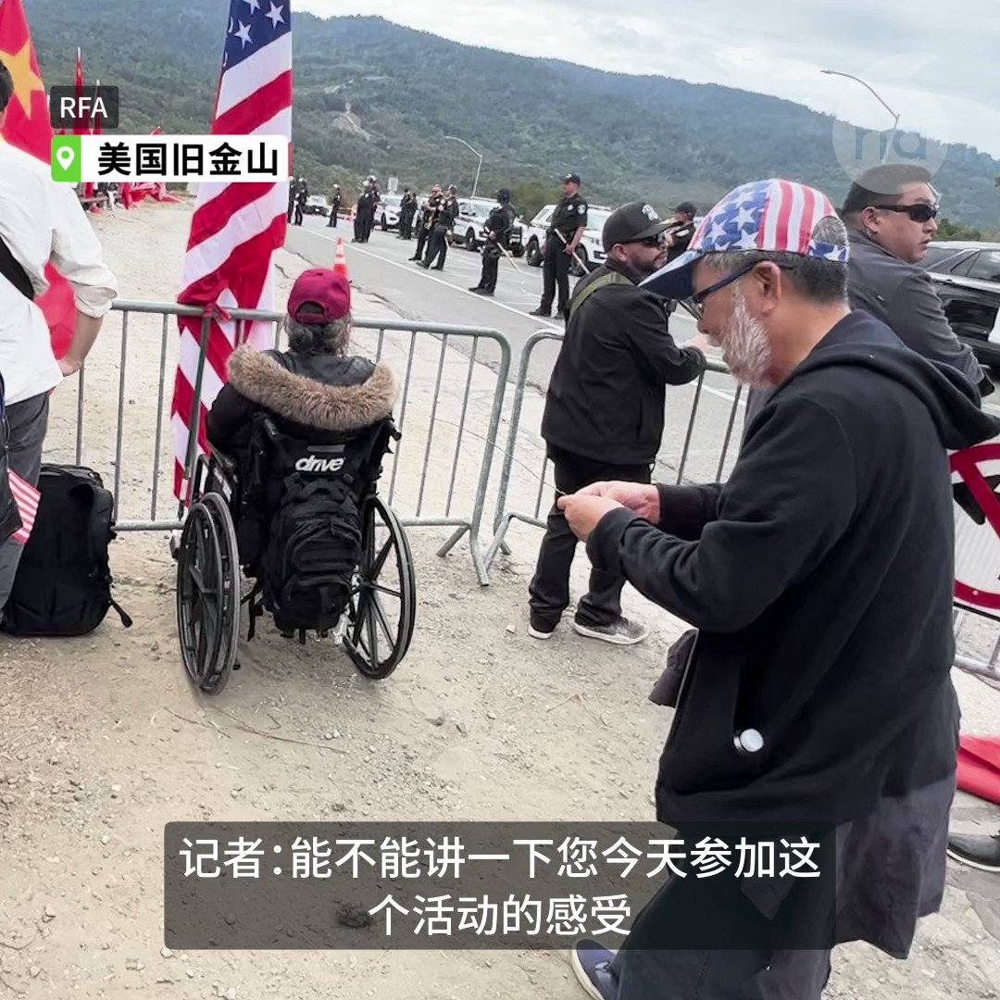  自由亚洲电台 北京时间 2023-11-16T00:39:38Z 1724829520170275065 10月15日，中国官方公布的最新经济数据显示，虽然拉动经济增长的"三驾马车"中，消费和工业生产在十月份的表现比预期好，但 ＃固定资产投资 及 ＃房地产 行业的下滑幅度仍在扩大。

https://t.co/1omwgelMuI https://t.co/g77H6tDjBL 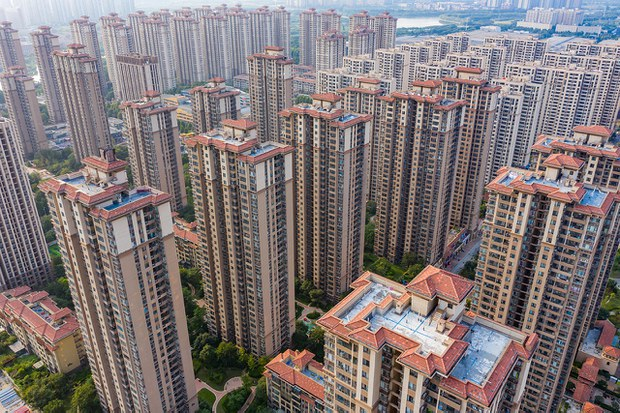  自由亚洲电台 北京时间 2023-11-16T04:23:52Z 1724885952370487572 在本周APEC峰会期间，#拜习会 于15日在加州旧金山附近的费罗丽庄园举行。这是继去年印尼巴厘岛之后，美中两国领导人再次面对面会晤。
这次会议将以怎样方式举行？主要讨论哪些议题？现在让我们连线在旧金山现场报道的记者凯迪 @KittyWang5 ，给我们介绍一下。
https://t.co/0ARfHgZhvK https://t.co/2xb8dmajxx 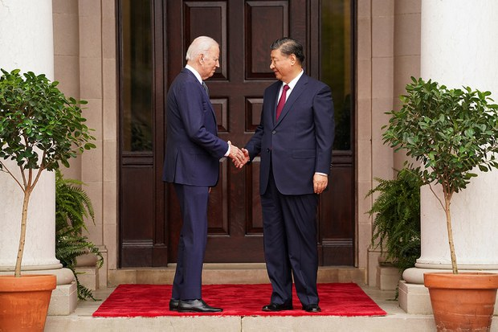  自由亚洲电台 北京时间 2023-11-16T04:42:29Z 1724890638771261458 在美国总统 #拜登 与中国国家主席 #习近平 于周三下午在旧金山会面的前几个小时，美国与中国各自发表了相同的声明，宣布美中将重启气候合作工作小组，致力于在2030年前将全球既有的 #再生能源 增加三倍，以替换煤炭、石油及天然气的使用。
https://t.co/UWXCOQxt3v https://t.co/M5BDxzlFlv 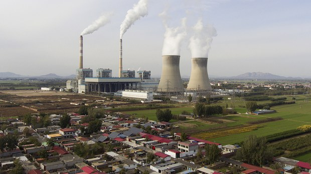  自由亚洲电台 北京时间 2023-11-16T04:49:17Z 1724892350571565512 11月15日，香港民主委员会执行总监 #郭凤仪， 在旧金山中领馆门前接受本台采访（本台记者孙诚采访，Jim拍摄） https://t.co/JwFZghEBwA 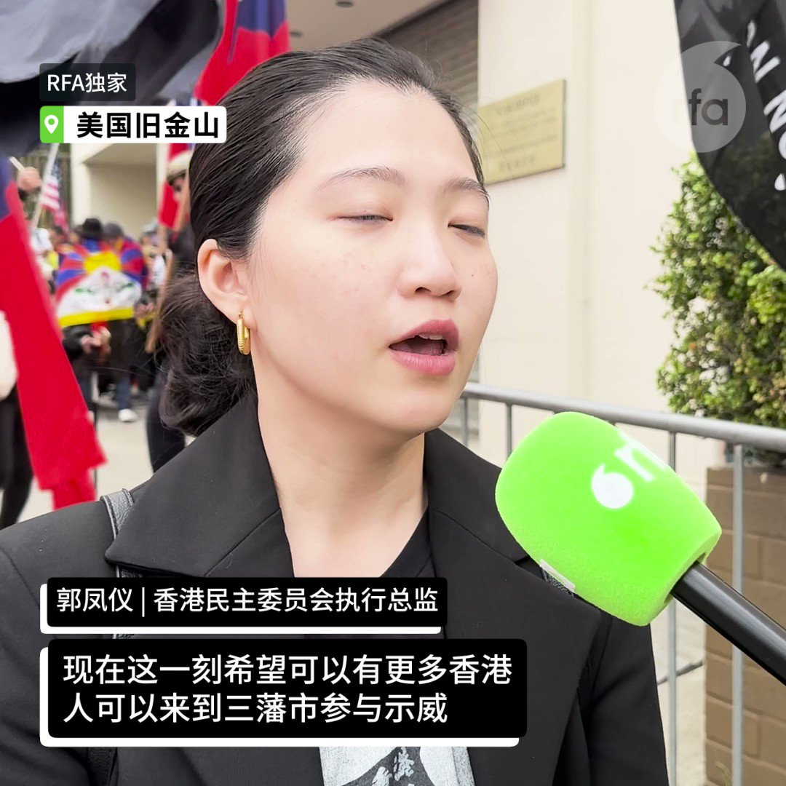  自由亚洲电台 北京时间 2023-11-16T04:56:39Z 1724894201819832802 #拜习会 前夕，中国国家主席 #习近平 在给两岸企业家峰会十周年发出的贺信里大谈 #民族主义、促统融合和壮大"#中华民族经济"。
分析认为，习近平对台湾企业家温情喊话，意在拉回脱离中国供应链的台资和外资企业。
https://t.co/PKbTTFYeX2 https://t.co/La0bjyL8OA 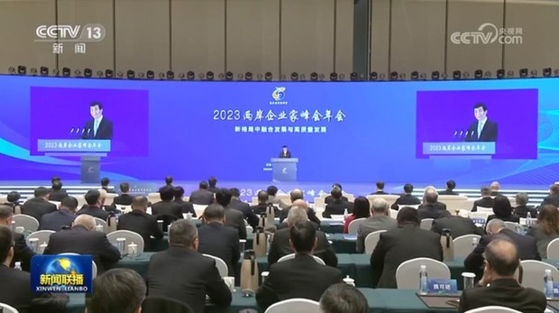  自由亚洲电台 北京时间 2023-11-16T05:36:07Z 1724904135534039436 【抗议者们想对习近平说什么？】
11月15日，包括藏人、港人、维吾尔人在内的多个族裔人士在旧金山中领馆外进行 #抗议习近平 到访加州的集会，他们想对习近平说什么？（本台记者孙诚采访 Jim拍摄） https://t.co/sPgkyztA1A 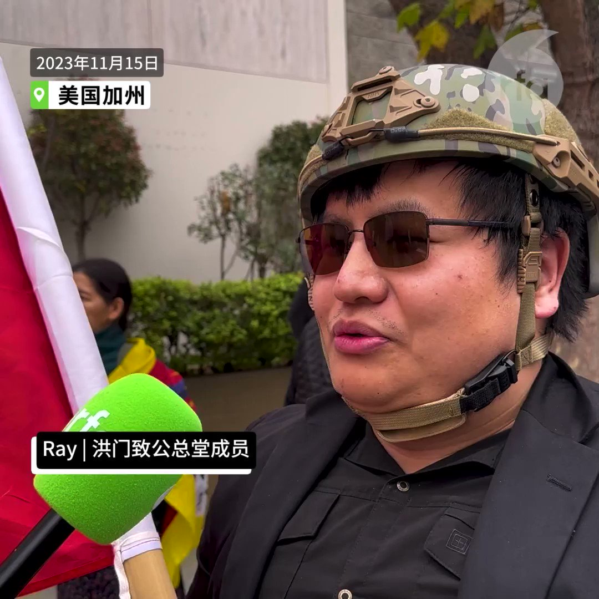  自由亚洲电台 北京时间 2023-11-16T05:47:20Z 1724906958765838798 【听！旧金山中领馆外的抗议声】
11月15日上午，包括藏人、港人、维吾尔人在内的多族裔人士，在旧金山中领馆外集会，抗议 #习近平 到访加州湾区。（RFA记者Jim拍摄） https://t.co/1UPOBadk5B 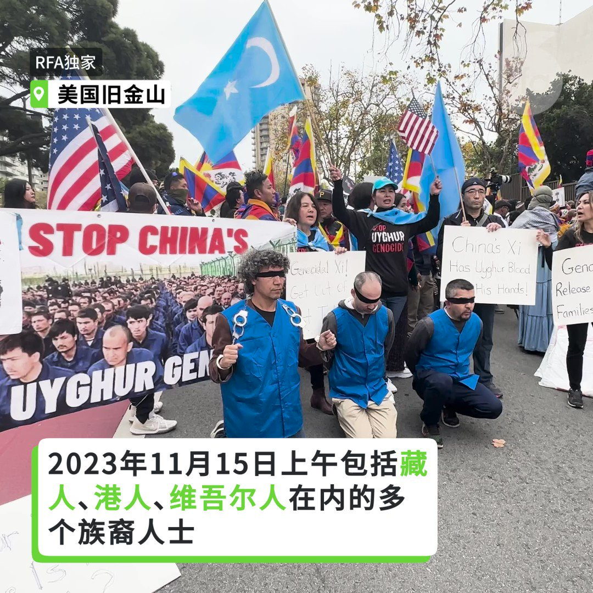  自由亚洲电台 北京时间 2023-11-16T03:16:37Z 1724869027892269230 https://t.co/0hgFDI3XEM   自由亚洲电台 北京时间 2023-11-16T03:53:09Z 1724878221819404493 #拜习会
11月15日，美国总统 #拜登 在旧金山的费罗丽庄园迎接中国主席 #习近平（路透社）。 https://t.co/l2eju4hsE7 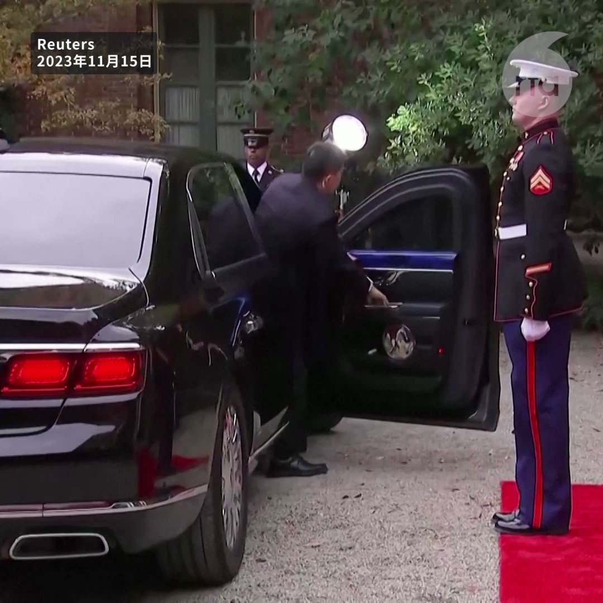  自由亚洲电台 北京时间 2023-11-16T04:06:25Z 1724881559034163657 11月15日上午，包括藏人、港人、维吾尔人在内的多个族裔人士，在旧金山中领馆外进行 #抗议习近平 到访加州湾区的集会。（本台记者Jim及藏语部拍摄） https://t.co/CR9rSDcc5g 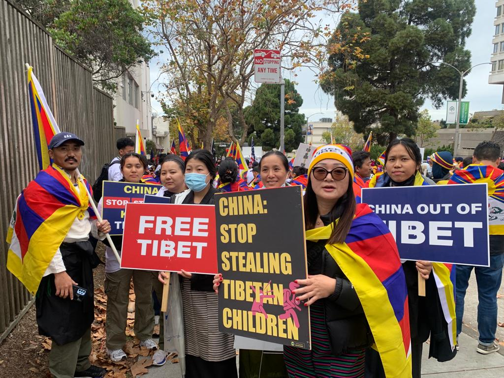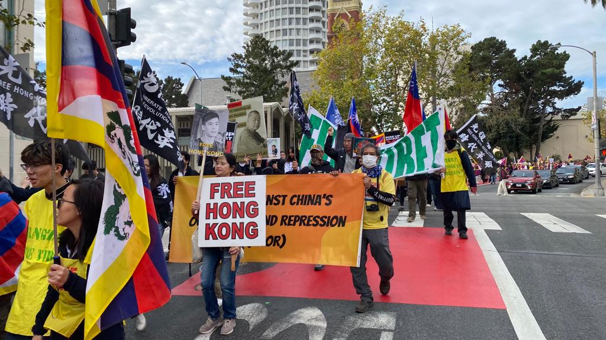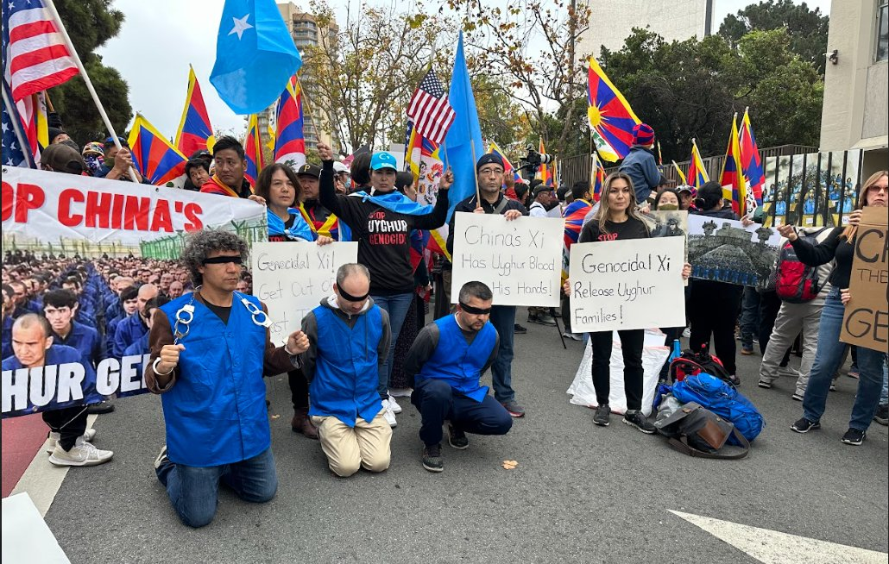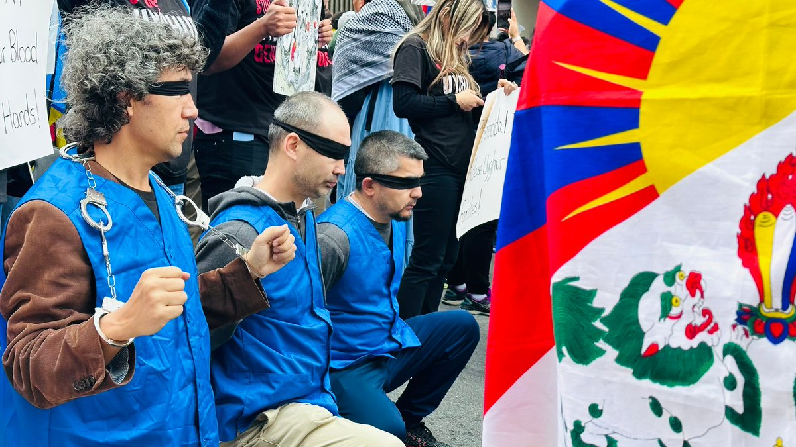  自由亚洲电台 北京时间 2023-11-16T04:09:50Z 1724882421110526075 美国总统 #拜登（Joe Biden）与中国国家主席 #习近平 15日在费罗丽庄园进行一对一会谈。
"#拜习会"要解决的首要问题是什么？美中答案有不同。详见
https://t.co/KBgl52CxzS https://t.co/WbpDStofD8 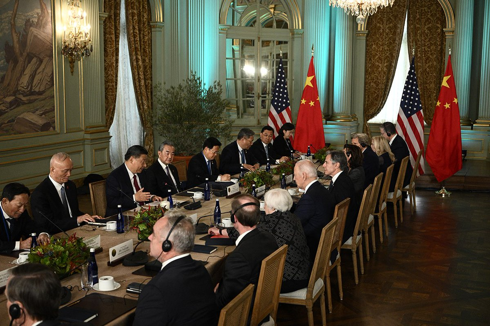  自由亚洲电台 北京时间 2023-11-16T01:55:12Z 1724848541083091268 美国有线电视新闻网CNN11月14日揭露，中国政府正发动全球最大规模的网络虚假讯息攻击行动和网络暴力，骚扰、抹黑、威胁、恐吓美国记者、评论员、政界和企业界人士，以及在美的中国异议人士、民运活动者，受害者还包括加拿大总理和议员等。

https://t.co/4nRhnbESjG https://t.co/N6cuwh1xpS   自由亚洲电台 北京时间 2023-11-16T00:03:35Z 1724820448855134276 RT @RFA_Chinese: 【黑龙江访民受迫害】
【举横幅表达诉求遭袭击】
在习近平于旧金山下塌的酒店外，来自黑龙江的贾俊伟说她的房子被强拆，父亲被迫害致死。她举横幅写道:“结束对中国人迫害! 还我父亲! 还我家园!” 遭民众持五星旗包围袭击。
#习近平 #拜习会 htt…   