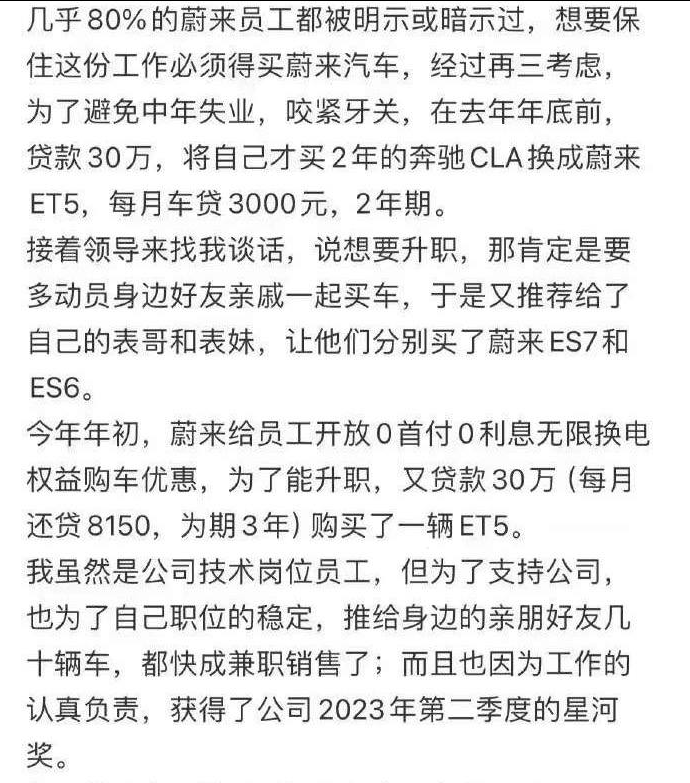
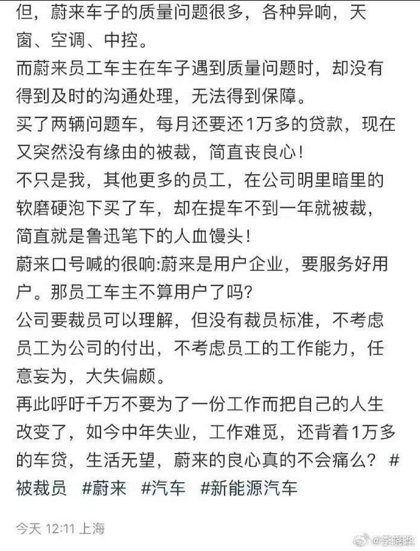
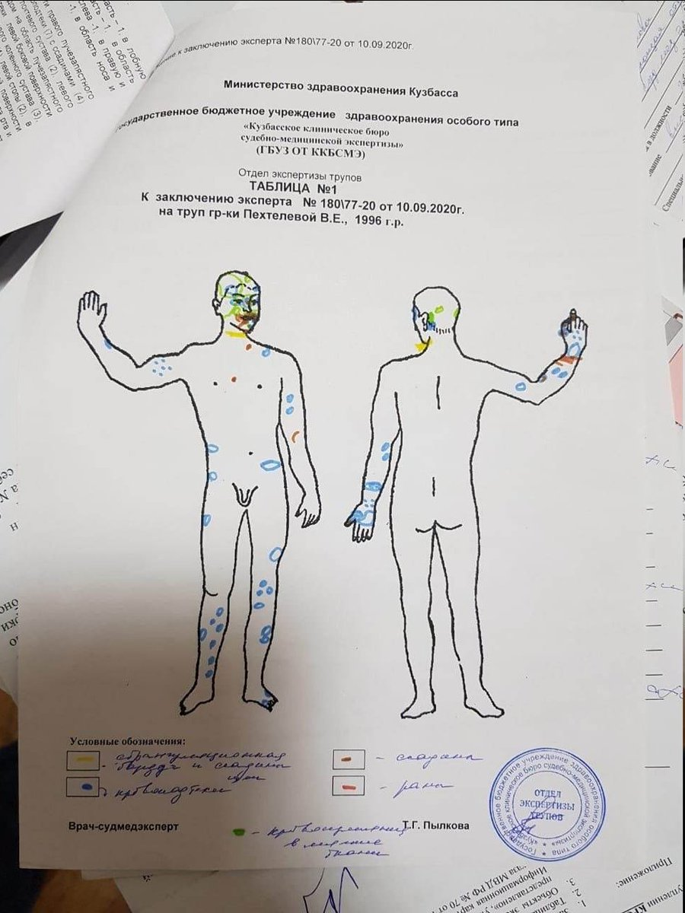
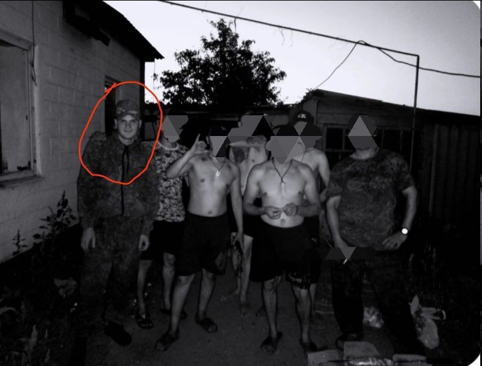
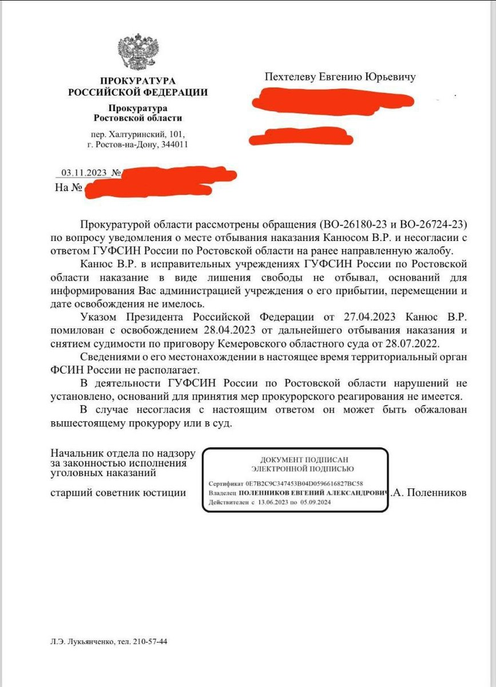

谁将十万横扫三江 北京时间 2023-11-16T23:34:36Z 1725175542125638129 RT @boiledwater: 前几天发过链接。再发下视频：

33岁的王武在上海当快递员。他总是玩命接单，身体不适也不休息。直到晕倒在大街上，好心的路人打电话将他送往医院。

王武醒来的时候，发现自己躺在病床上，医生告诉他检查的结果：“上消化道出血，肾脏严重受损，已经是尿毒…   谁将十万横扫三江 北京时间 2023-11-16T23:36:37Z 1725176052702384506 蔚来汽车忽悠员工买车，买完就裁员，榨干剩余价值 https://t.co/YMtt39A9np   谁将十万横扫三江 北京时间 2023-11-16T18:58:13Z 1725105987563167980 “薇拉父亲透露，普京不仅释放了这个恶魔，还免除了他本应赔偿薇拉父母的400万卢布精神损失费。”

薇拉·佩赫捷列娃，西伯利亚工业城市克麦罗沃的23岁大学生，2020年1月13日，她在自己的公寓内被前男友弗拉季斯拉夫·卡纽斯残忍杀害。卡纽斯对她进行了连续数小时惨无人道的折磨。薇拉的身上有111处创伤，第一处伤害出现于死前六小时。最后卡纽斯强奸了薇拉，然后用熨斗线将其掐死。

薇拉的惨叫甚至可以在街上听到。邻居前后共报警七次，就连电话录音中都能听到薇拉的呼救，而接线员每一次都回答说，“已经出警了”，“我能怎么办”，“你咋这么说话呀”，“警察会来的，没必要骂人”。当邻居忍无可忍破门而入时，薇拉已经倒在血泊之中，而警察最终都没有出现。

2022年7月28日，卡纽斯因“极为残忍的谋杀”被判处17年监禁。

2023年6月，薇拉的母亲收到一张熟人发来的照片，上面是穿迷彩服的卡纽斯和战友们在乌克兰的合影。他被俄罗斯国防部招募进“Z字冲锋队”，在乌克兰前线进行“人肉冲锋”。不同于他的炮灰同伴们，他活了下来，并且被赦免。9月，他已经在社交网络上发布自己和朋友们喜滋滋地休闲烧烤的照片。

11月3日，薇拉的父亲得到了监狱方面的正式回复：“根据俄罗斯联邦总统2023年4月27日下达的命令，V.R.卡纽斯自2023年4月28日起获赦免，无需进一步服刑，2022年7月28日克麦罗沃州法院的判决亦予撤销。”

逍遥法外的卡纽斯还被免除了所有欠下的债务和贷款，因为他现在是“特别军事行动英雄”。

【网评】一个强奸杀人犯，为国参加侵略战争，被免罪并获得“英雄”头衔。爱国主义确实是流氓的庇护所。   谁将十万横扫三江 北京时间 2023-11-16T19:03:42Z 1725107369309581359 观察者网的小编希望中国接收加沙难民，这倒没什么，毕竟他经常自称说自己北京的家里蛮大的，没事就在网上和别人比房子大小，想必是经常帮助无家可归的人。

结果他希望接收难民的理由是仇恨上海，想在上海建立哈马斯聚居区 https://t.co/SICInQP31J   谁将十万横扫三江 北京时间 2023-11-16T19:10:36Z 1725109106586055019 倒查二十年 https://t.co/levJTmpMxl   谁将十万横扫三江 北京时间 2023-11-16T09:37:09Z 1724964792178471355 2023.11.15早上10点40成都武侯星悦荟，一位50多岁的男子爬上楼顶，直接脱光衣服跳下，劝都没劝住，砸到一位路人（女性40多岁），2人均死亡。 https://t.co/61wuQKPHFU   