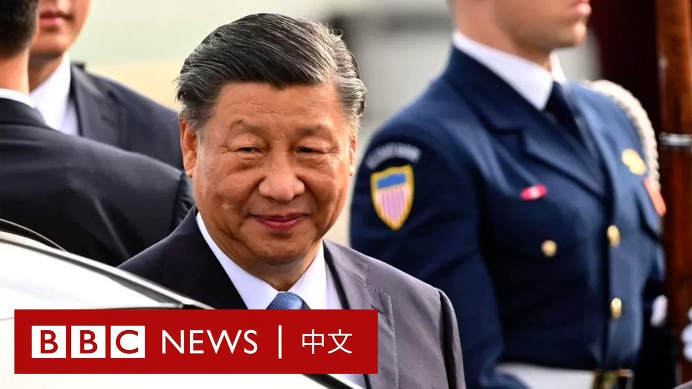
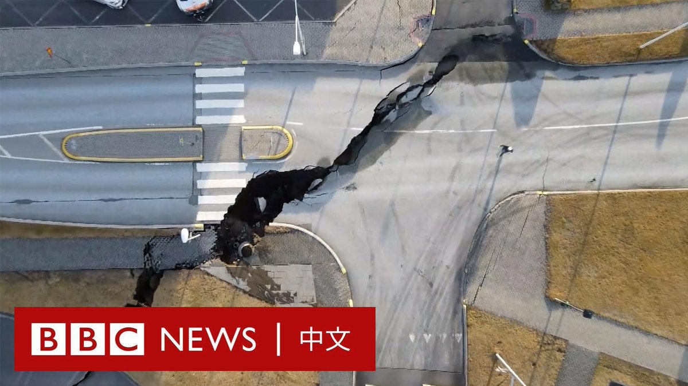
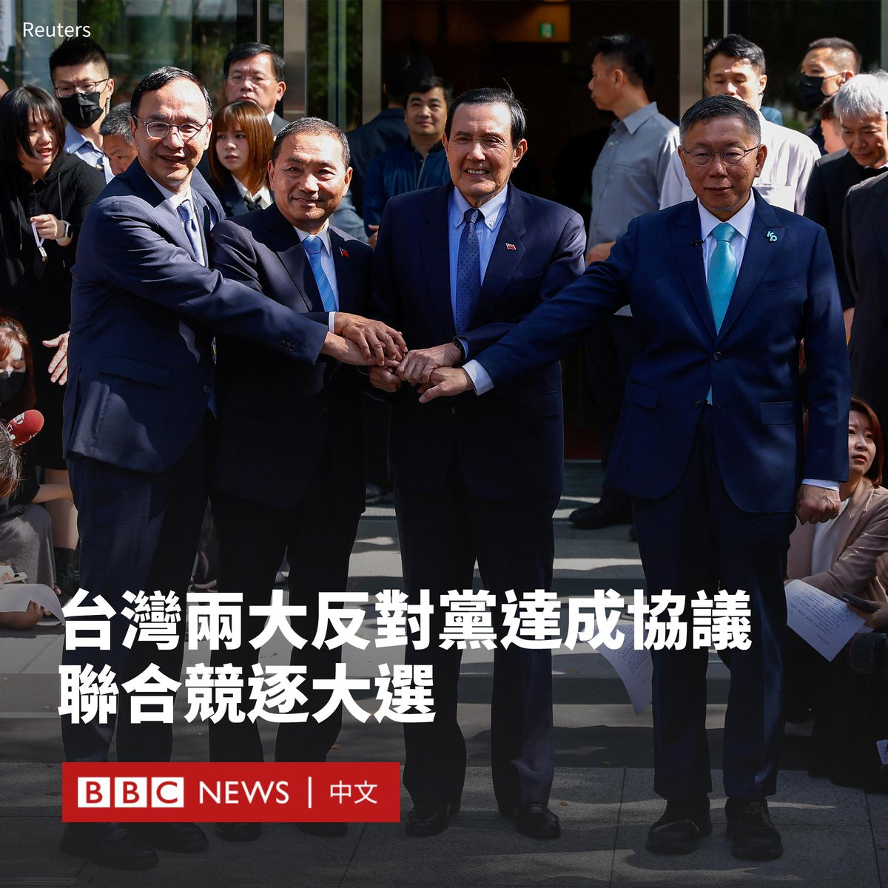
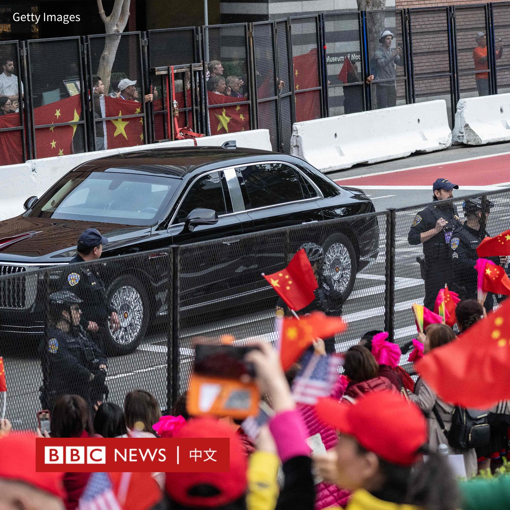
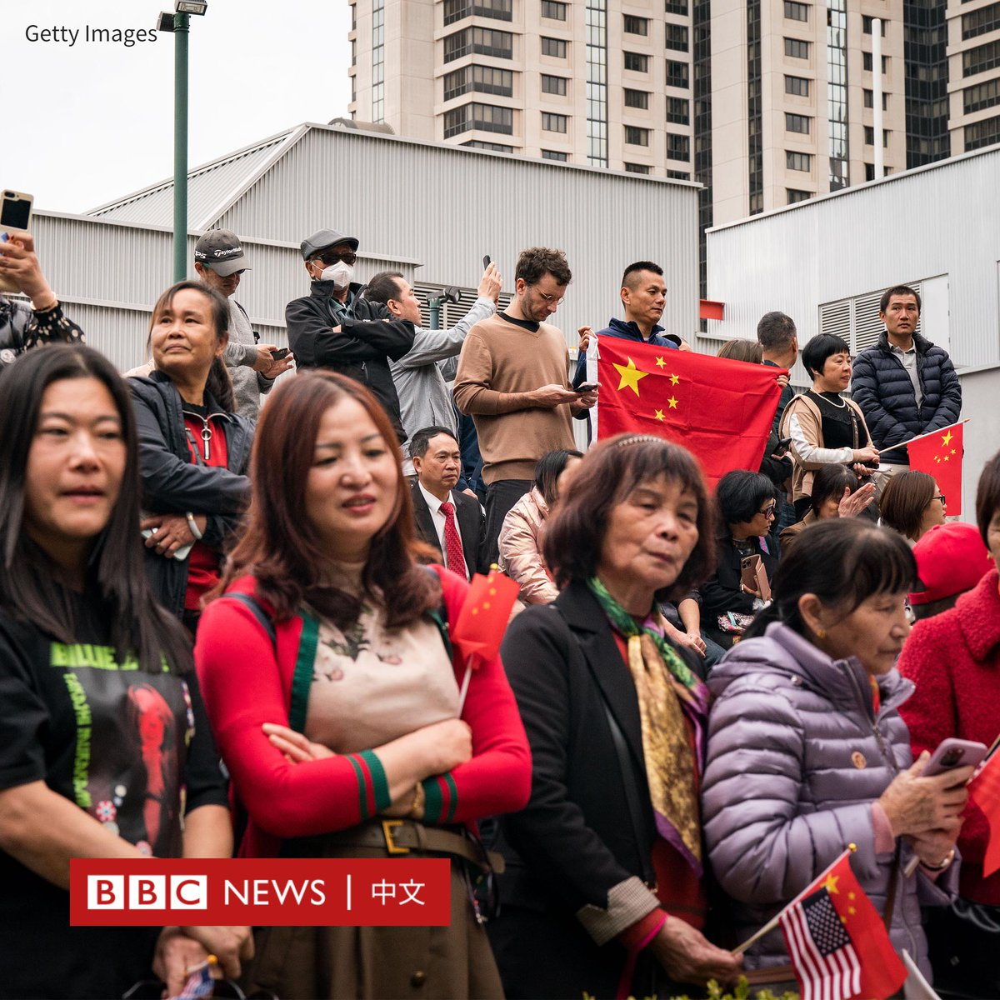
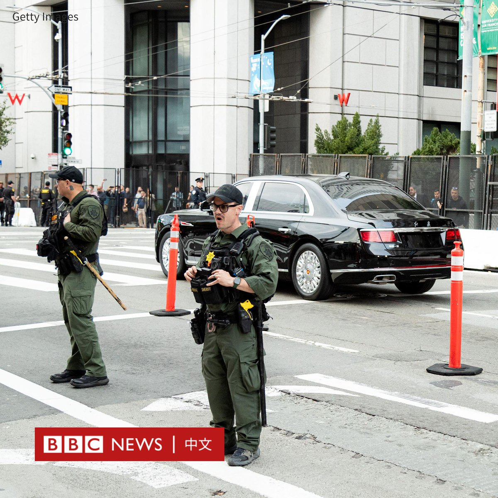
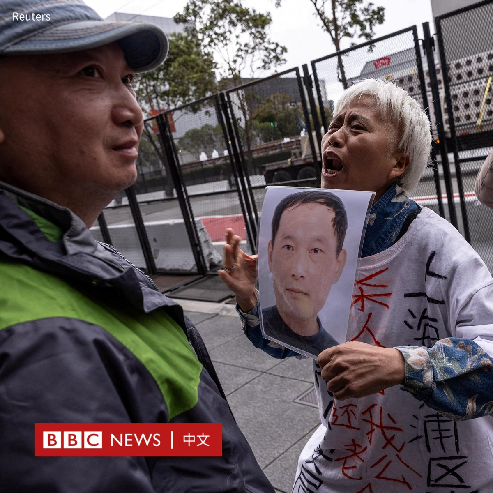
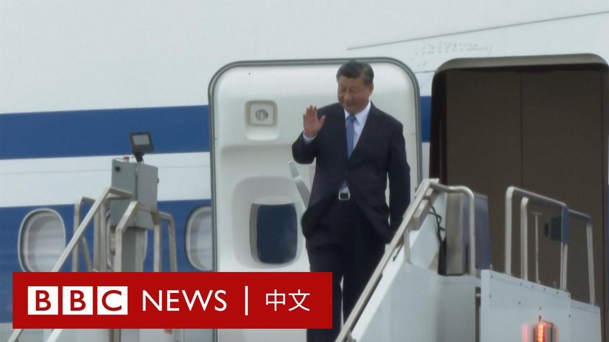

D英国广播公司BBC 北京时间 2023-11-15T18:19:19Z 1724733813300113450 中国国家主席习近平与美国总统拜登皆已抵达旧金山，将在当地时间周三（11月15日）早上于亚太经济合作组织（APEC）峰会前会晤。

相较于2017年习近平上一次访美，两国的关系在近年已急转直下，而此次访问被视为是中美紧张关系的一个缓和迹象。 https://t.co/6kJGjQZauB   D英国广播公司BBC 北京时间 2023-11-15T14:55:05Z 1724682414465970502 BBC记者获准前往冰岛被疏散的小镇格林达维克（Grindavík）。该地近期频繁发生地震，科学家认为这是火山爆发的前兆。

由于担心火山突然喷发，当局下令该地区所有人员撤离，使这座小镇成为“鬼城”。

少数居民在当局的护送下，返回家中取走物品。他们担心一旦火山喷发，将给这里带来灭顶之灾。 https://t.co/GPRwzpZuYd   D英国广播公司BBC 北京时间 2023-11-15T16:12:25Z 1724701876409741439 台湾两个反对党——国民党与民众党——同意联合竞逐台湾下一任总统和副总统。

国民党主席朱立伦、总统参选人侯友宜与民众党主席、参选人柯文哲周三（11月15日）举行协商会议，前总统马英九也参与了谈判。

两党表示同意通过11月7日至17日进行的民意调查来决定总统和副总统候选人的组成，结果将于周六（11月18日）公布。

“今天大概是一个历史性的一刻，因为在台湾的历史从来没有过联合政府，所以如何组织、如何运作都是一个尝试。”柯文哲对记者说。

侯友宜也表示：“不管这个结果如何，谁正谁副，我们共同携手合作。”

在此前的民调中，现任副总统、执政党民进党参选人赖清德几乎一直位居第一，但国民党和民众党的联合可能对其领先地位构成挑战。

自上个月以来，国民党和民众党就联合竞选总统一事进行了数次谈判，这在台湾被称为“蓝白合”，但两党未能就谁是总统候选人、谁是副手达成一致。

台湾中央社发布的两党合作文件显示，双方约定如果大选获胜将“成立联合政府”，“除国防、外交、两岸由总统决定，其余部会原则上依各党派立委席次分配，民众党主责监督制衡，国民党主责建设发展。”   D英国广播公司BBC 北京时间 2023-11-15T12:25:49Z 1724644850908217532 英国首相苏纳克意外找来与他在对华政策上意见相左的前首相卡梅伦“重出江湖”担任外相，但唐宁街称伦敦对华政策不会改变。卡梅伦承认如此重返内阁并不常见，但他希望能在“困难时期”扶首相一把。https://t.co/lmOeupJqph   D英国广播公司BBC 北京时间 2023-11-15T10:18:50Z 1724612896334987659 中国国家主席习近平的车队抵达旧金山市中心下榻的酒店，沿途有支持者聚集表示欢迎。

随着习近平的红旗轿车驶近，很多支持者手举中国国旗和横幅，并用扩音器播放爱国歌曲。

酒店附近也有抗议者和维权人士到场，他们高举“习近平还我财产”等标语。

此前，旧金山当局已在酒店和会场周边加装黑色围栏，并部署大量警员戒备。

当地时间周二（11月14日）下午3点30分左右，习近平的专机在旧金山机场降落，他受到美国财长耶伦（Janet Yellen）、加州州长纽森（Gavin Newsom）等美国高级官员的迎接。

在旋风式的访问中，习近平将与美国总统拜登（Joe Biden）会晤并出席亚太经合组织（APEC）会议。他预计还将出席与商界领袖的晚宴。

这是自2017年以来，习近平时隔六年首次访美，也是他自1985年以来首次访问旧金山，当时他是河北省正定县委书记。   D英国广播公司BBC 北京时间 2023-11-15T08:36:46Z 1724587207791710423 【现场画面】中国国家主席习近平抵达美国旧金山。他将与美国总统拜登（Joe Biden）会晤并出席亚太经合组织（APEC）会议。 https://t.co/6tz0oQHCt8   