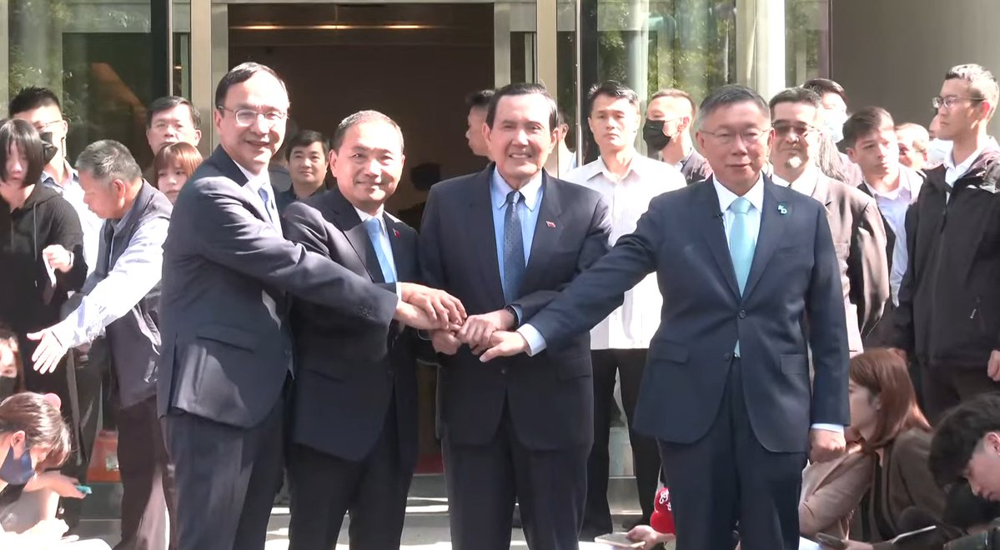
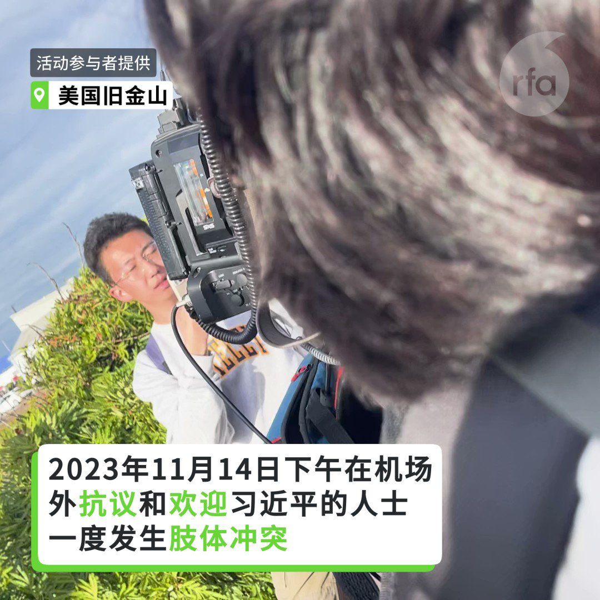
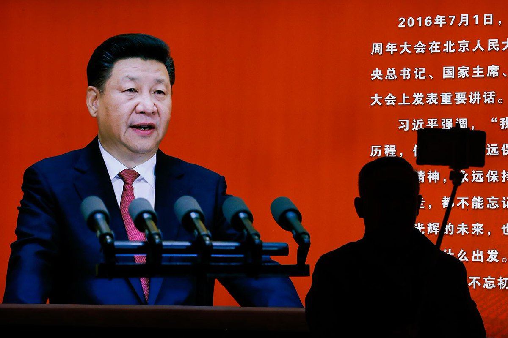
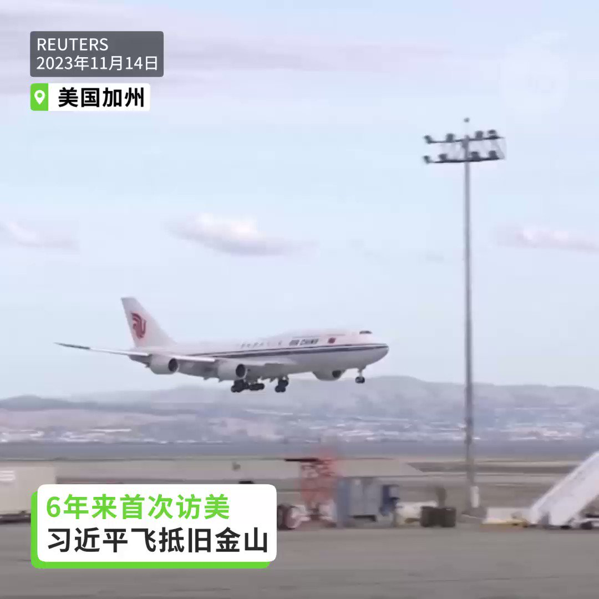
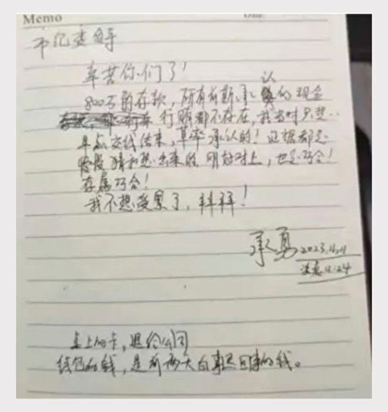
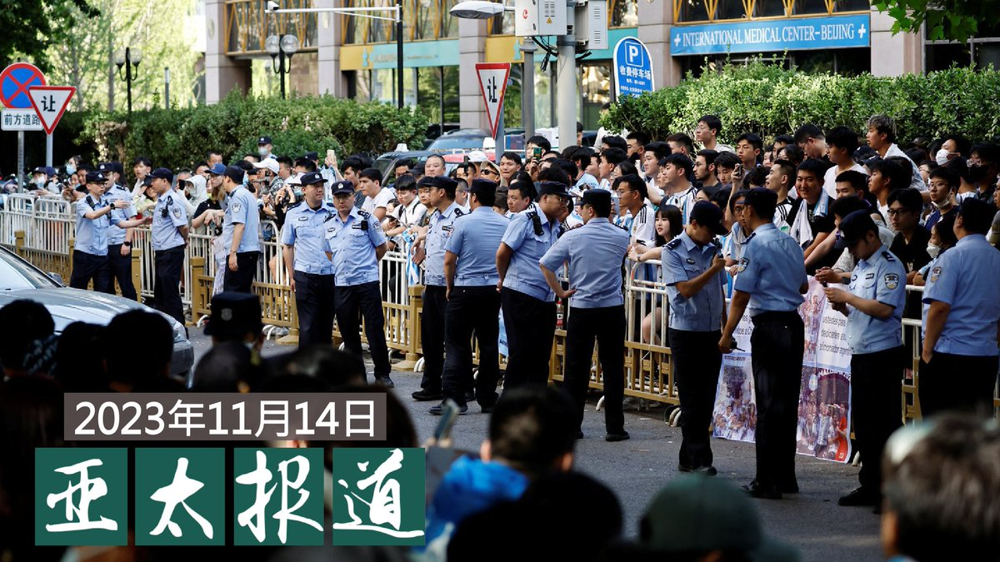
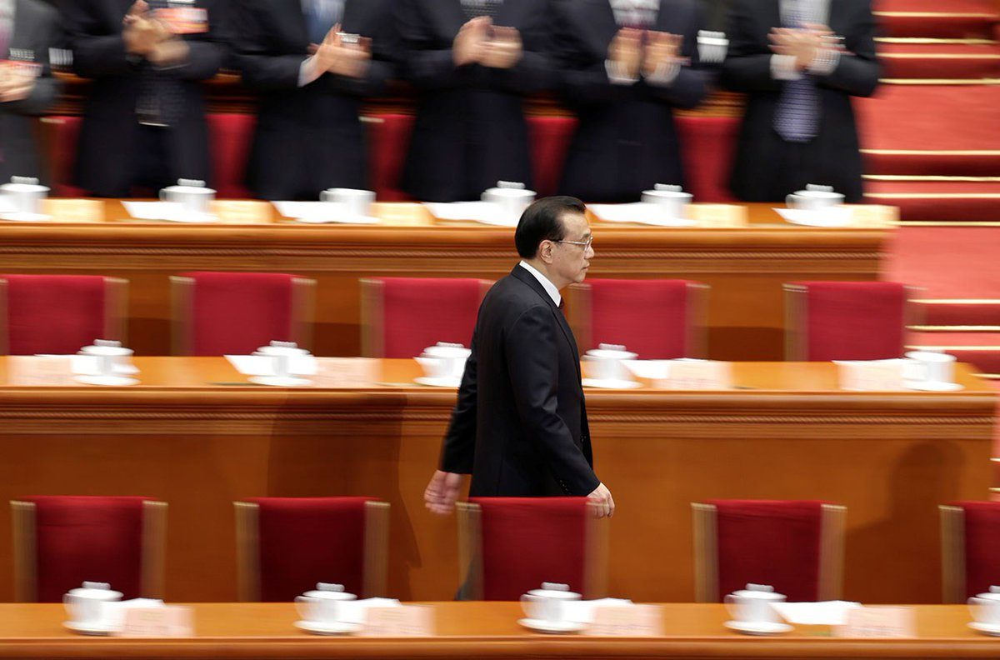
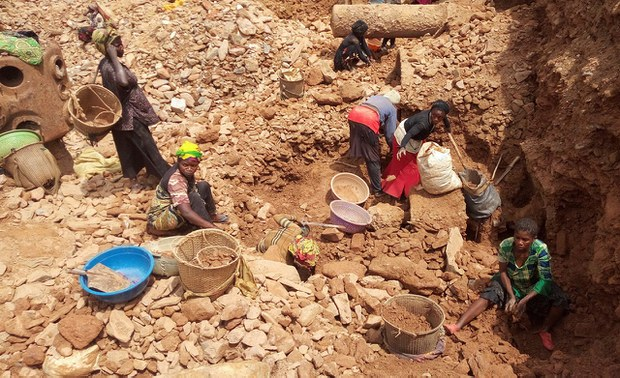
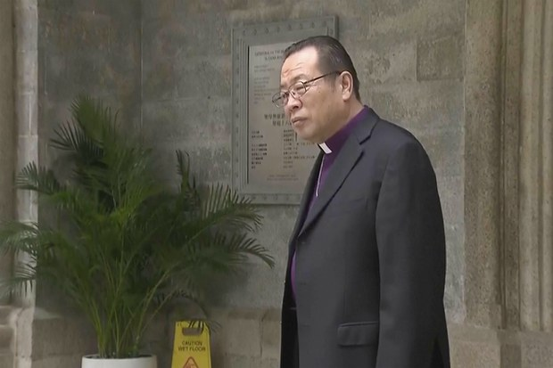
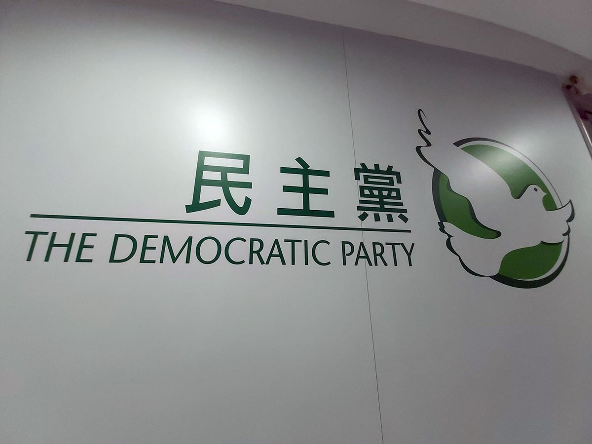

自由亚洲电台 北京时间 2023-11-15T10:48:43Z 1724620416843674001 #事实快查｜为迎接 #习近平 参加 #APEC，#旧金山 特意整理市容、加强安防？
https://t.co/1wgLcrRTZy https://t.co/RPAXiRBgsR   自由亚洲电台 北京时间 2023-11-15T13:00:46Z 1724653646015857140 【台湾“#蓝白合”达成协议】
【本周六宣布 #总统搭档人选】

台湾的总统选举出现关键性转折，在野的 #国民党 与 #民众党 15日上午在前总统 #马英九 的见证下，举行政党协商达成，民调决定蓝白合正副总统搭档人选。

根据共识声明内容，将由前总统马英九、国民党、民众党，各推荐—位民调统计专家。由民调统计专家视评估11月7日至11月17日，社会各界公布的民调结果，及国民党、民众党各提供一份内参民调的结果。

双方同意，若超过统计误差，由胜者得一点；若在统计误差范围内，由侯柯配得一点。11月18日周六上午，由马英九基金会公布结果。

此外，蓝白合后，两党共同组成竞选委员会，全力辅选总统副总统候选人，及两党推荐之立法委员候选人，不分区政党票,由各党各自努力。

在马英九见证下，国民党及民众党承诺，为台湾第三波民主改革建立典范，必须成立 #联合政府。除国防、外交、两岸由总统决定，其余部会原则上依各党派立委席次分配，民众党主责监督、制衡，国民党主责建设发展。   自由亚洲电台 北京时间 2023-11-15T10:11:42Z 1724611099935560028 2023年11月14日下午 #旧金山  抗议和欢迎 #习近平 的人士一度发生肢体冲突（活动参与者提供） https://t.co/N9Ogm3SE1H   自由亚洲电台 北京时间 2023-11-15T10:59:38Z 1724623160631263392 RT @RFA_Chinese: 【6年来首次访美 习近平飞抵旧金山】
【支持者和抗议者聚集在习近平酒店外】
中国国家主席习近平14日展开他6年来首趟美国行，这是习近平自2017年以来首次访问美国。习近平下榻的酒店外聚集大批欢迎和抗议人士，双方一度发生肢体冲突，美方出动大批警力…   自由亚洲电台 北京时间 2023-11-15T11:47:56Z 1724635317578190880 RT @RFA_Chinese: 2023年11月14日下午 #旧金山  抗议和欢迎 #习近平 的人士一度发生肢体冲突（活动参与者提供） https://t.co/N9Ogm3SE1H   自由亚洲电台 北京时间 2023-11-15T11:55:23Z 1724637192633598225 #读者广场 | #习近平，#反腐 请作表率公开财产
https://t.co/2c6BEevOfV
（美联社图片） https://t.co/iNft60HAIP   自由亚洲电台 北京时间 2023-11-15T10:27:21Z 1724615039108489444 【6年来首次访美 习近平飞抵旧金山】
【支持者和抗议者聚集在习近平酒店外】
中国国家主席习近平14日展开他6年来首趟美国行，这是习近平自2017年以来首次访问美国。习近平下榻的酒店外聚集大批欢迎和抗议人士，双方一度发生肢体冲突，美方出动大批警力。#拜习会 #习近平 https://t.co/Zot2igC8Ah   自由亚洲电台 北京时间 2023-11-15T06:23:44Z 1724553730232590463 APEC台湾领袖代表、台积电创办人 ＃张忠谋 14日搭机赴美参加APEC峰会。中央社的报道援引他的话说，将传达总统蔡英文交代，包含台湾将致力促进区域和平、打造更具韧性供应链等讯息。
张忠谋在妻子张淑芬陪同下，晚间率领代表团搭机前往美国，国安会秘书长顾立雄、外交部长吴钊燮到桃园国际机场送机，张忠谋出发前在国宾门发表行前谈话。
张忠谋表示，亚太经济合作会议（APEC）是个很重要的对话平台，蔡总统交代他要传达4个讯息。第一，台湾致力于亚太区域的和平及繁荣；第二，台湾与大家一起努力，透过能源的转型控制气候；第三，台湾要与同伴合作建立更具韧性及弹性的供应链；第四，台湾也跟同伴合作，一起减少区域里的数位落差。
张忠谋说，他会很努力的把上述的讯息传达给所有APEC会员。
这是张忠谋第6度代表蔡总统、第7度代表台湾与会。
（路透社图片）   自由亚洲电台 北京时间 2023-11-15T06:30:02Z 1724555314052415515 ＃承勇 接受纪委约谈期间自杀身亡。遗书遗书暗示遭到逼供。他经历了什么？
https://t.co/FiZMa1ynmy https://t.co/P7KjSMlbcG   自由亚洲电台 北京时间 2023-11-15T08:00:10Z 1724577998299595029 欢迎收听和订阅播客【亚太报道】 https://t.co/MjLNSvVMqc
（２０２３－１１－１４）
美国国会发布中国年度报告；港人 ＃旧金山 抗议 ＃习近平；广东山东部分 ＃派出所撤并；＃江苏民企老板跳楼身亡；＃香港民主党 年宵摊位得而复失 https://t.co/misFnvFDwa   自由亚洲电台 北京时间 2023-11-15T09:16:41Z 1724597252243505453 RT @RFA_Chinese: ＃承勇 接受纪委约谈期间自杀身亡。遗书遗书暗示遭到逼供。他经历了什么？
https://t.co/FiZMa1ynmy https://t.co/P7KjSMlbcG   自由亚洲电台 北京时间 2023-11-15T09:16:47Z 1724597279590437265 RT @RFA_Chinese: 【遭香港当局百万悬赏通缉 郭凤仪旧金山遭人身威胁】
【郭：将不惧恐吓 持续参加反习示威游行】
#香港民主委员会 联同在美的疆藏团体，在“#拜习会”举行期间举行抗议，希望各界关注中国打压人权的状况。其中名列港府 #百万悬赏 名单中的 #郭凤仪……   自由亚洲电台 北京时间 2023-11-15T09:18:26Z 1724597692406313236 RT @RFA_Chinese: 评论 | #蔡霞：#李克强 悲剧是数百万 #中共官员 的宿命 （之一）
https://t.co/hL3Ss9WnWC
 （路透社图片） https://t.co/dSPbjnqiT5   自由亚洲电台 北京时间 2023-11-15T05:11:42Z 1724535600425169043 评论 | #蔡霞：#李克强 悲剧是数百万 #中共官员 的宿命 （之一）
https://t.co/hL3Ss9WnWC
 （路透社图片） https://t.co/dSPbjnqiT5   自由亚洲电台 北京时间 2023-11-15T06:10:58Z 1724550517429526624 11月14日，美国驻赞比亚前大使舒尔茨（Eric Schultz）在美国国会及行政当局中国委员会的听证会上表示，相比中国在非洲持续扩大的影响力，这是“一场美国正在输掉的冲突”   https://t.co/EoqlKvkKzK
（ 路透社图片）
＃刚果  ＃钴矿 ＃童工  ＃强制劳动 https://t.co/IV3mLIg6bv   自由亚洲电台 北京时间 2023-11-15T01:02:06Z 1724472789170552930 据美联社14日发自香港的消息，应 #天主教香港教区 主教周守仁枢机的邀请，中国官方扶植的 #天主教爱国会 北京教区主教李山（Joseph Li），周二开始访问香港，这是历史上北京主教的首次正式访问。
周守仁枢机表示，李山主教访港将有助于加深 #梵蒂冈 与中国的连结。
据香港电台报道，被中国官方控制的天主教会任命为主教的李山，上午参观了圣母无原罪主教堂。
据罗马天主教香港教区出版的《Sunday Examiner》报道，李周一参加了在教堂举行的晚间祈祷活动，并与香港新任枢机主教周守仁互赠了礼物。 此外，李将访问教育机构和圣灵神学院。
北京近年来推动宗教中国化的政策，试图铲除外国影响，强化教会对中共的服从。估计目前中国有1000到1200万天主教徒，香港有60万。   自由亚洲电台 北京时间 2023-11-15T02:43:07Z 1724498209563885704 #香港春节年宵市场 被视为当地政治及社会气氛的缩影。但本周二，有民主派政党民主党职员以个人身份成功竞投明年龙年年宵摊位后，却遭当局取消资格。（图：记者高锋摄）
https://t.co/5HCI2jEyDd https://t.co/Q19EtgtHP9   自由亚洲电台 北京时间 2023-11-15T03:23:56Z 1724508481691271337 美国国会 #美中经济与安全审查委员会 本周二正式发布2023年度报告。报告强调，中国目前面临着严峻的内部和外部挑战，但中共政权不仅仍未考虑作出任何改变，还加大了侵略行动的力度。（路透社资料图片）
https://t.co/Yve786OBGZ https://t.co/tqUxOWClf5   自由亚洲电台 北京时间 2023-11-15T00:38:12Z 1724466774509564390 #郭凤仪 ："前几天开始，我看到越来越多人在我的社交媒体上留言，鼓励其他人来美国来三藩市抓我，去换取港府的100万悬红。所以我是一定会担心会有冲突...不过，我们是在美国，而美国也是一个法制的国度。所以要是有任何事件发生，就能说明跨境镇压在这几年越来越严重的事实"
https://t.co/eZOOW0WYhy https://t.co/duc33Hxg5b   自由亚洲电台 北京时间 2023-11-15T01:53:15Z 1724485661883765121 据路透社报道，美国国会辖下的美中经济与安全审查委员会（U.S.-China Economic and Security Review Commission, USCC）本周二发布了一篇700多页长篇报告，报告指出，中国正在规避拜登政府的半导体出口禁令，透过购买美国高科技设备，尝试在国内自行生产芯片。
报告写道，尽管美国政府也对半导体相关的生产设备祭出了出口管制，禁止出售用于生产14纳米或以下高阶芯片生产的设备，但是，中国进口商时常声称进口的设备将用于老旧的生产线，而由于终端检查的能力有限，美国政府也很难确认这些设备是否被用来生产更先进的芯片。
近期，美国政府开始调查在出口禁令下，中芯国际为何能突破技术封锁，为中国的电信巨头华为提供7纳米芯片 。中芯国际的这项技术突破成功协助华为在8月底发布了最新款的Mate60 Pro智能手机。   自由亚洲电台 北京时间 2023-11-15T00:20:00Z 1724462194249933242 #台湾 即将在明年1月13日举行总统大选。台湾的国安会秘书长顾立雄表示，无论哪个政党参选人当选，都要面对中国灰色地带的威胁。一两年内，#中国犯台 并非迫在眉睫、不可避免。
https://t.co/EpqsSSJAua https://t.co/VCKWoYXkbC   