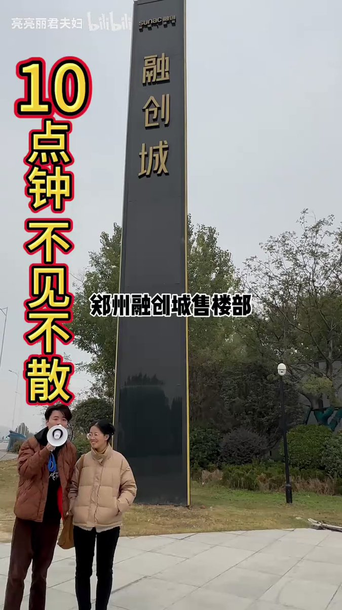
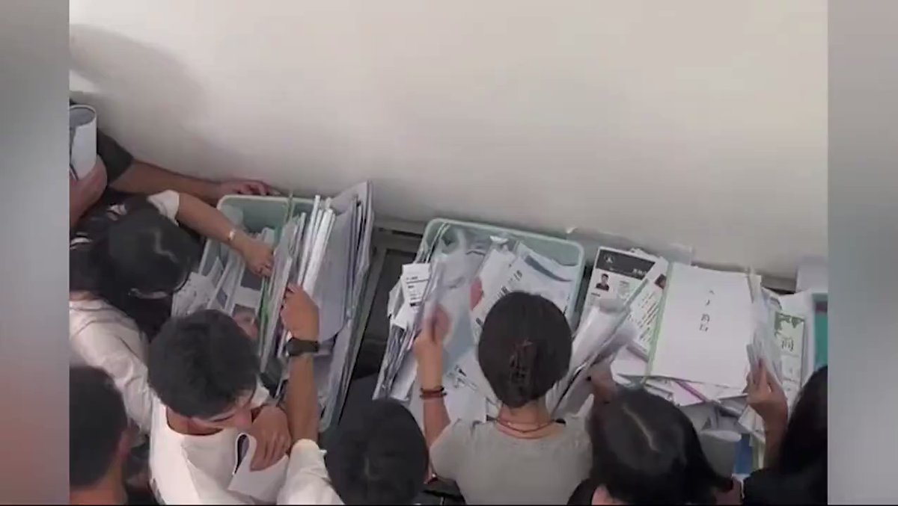
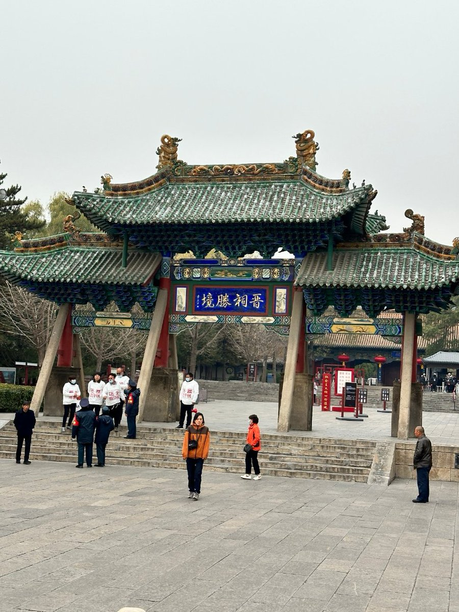
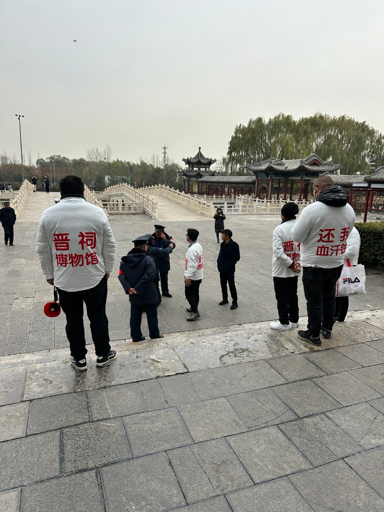
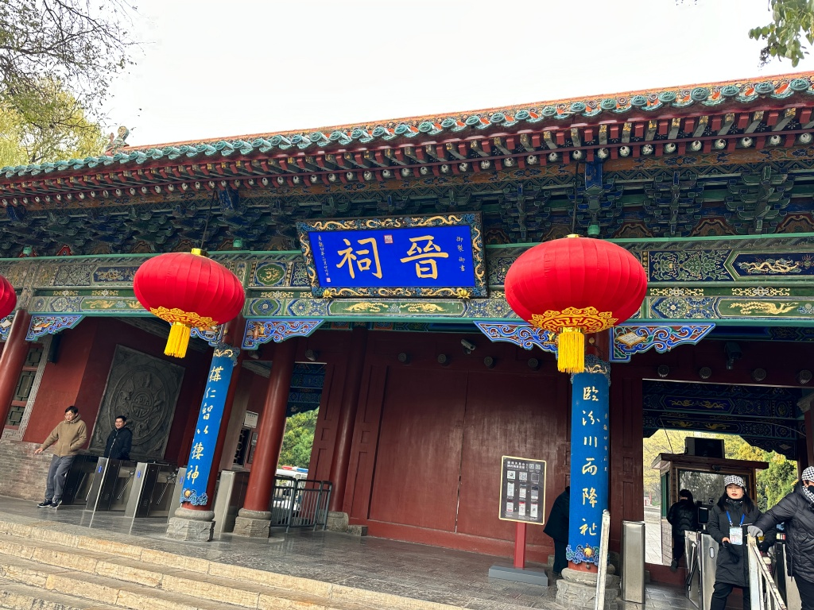
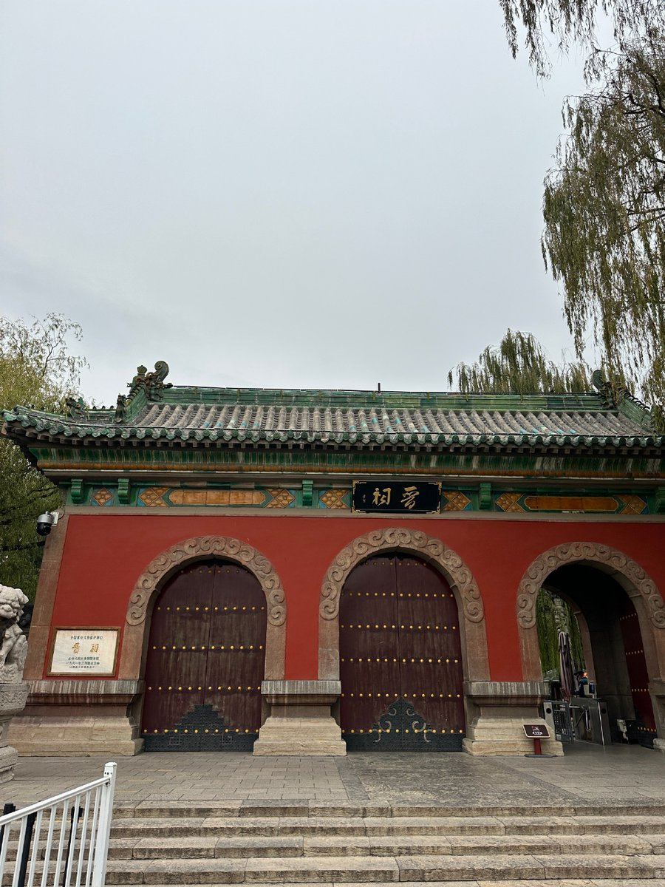
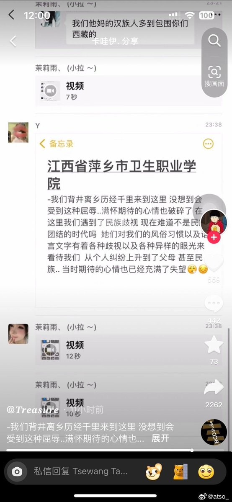
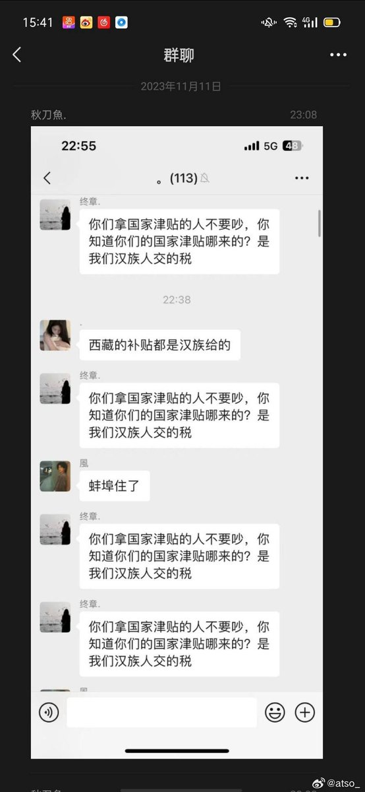
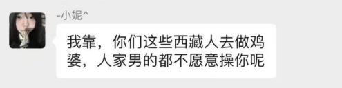

谁将十万横扫三江 北京时间 2023-11-15T20:20:38Z 1724764344125403345 RT @whyyoutouzhele: 11月15日，著名的烂尾楼维权夫妇亮亮丽君夫妇发布一系列视频，称自己前往融创城维权索要此前欠的2万块钱，遭遇融创员工殴打，并且手机车钥匙被抢走。
报警后警察未处理打人者，只是让他回去等消息。 https://t.co/hyMvM32cD3   谁将十万横扫三江 北京时间 2023-11-15T20:22:07Z 1724764714037916044 RT @whyyoutouzhele: 网友制作视频，讽刺当前校园招聘不过是学校找来企业走过场 https://t.co/ILQf6IPY04   谁将十万横扫三江 北京时间 2023-11-15T14:33:53Z 1724677081081258125 可怜的小包工头-泰安听庭有感之二

我们有幸不在出事的那一辆公交车上，但我们都在社会这辆大公交车上。雪崩之时，没有一片雪花是无辜的；没有法治，谁也不是安全的，无论你是有权还是没权，有钱还是没钱。
——王才亮律师

       2023年11月13日上午在山东泰安市岱岳区法院旁听当地律师高丙芳因代理农民工讨薪案件而被指控涉嫌虚假诉讼罪一案的第二次开庭。
        进了法院，开庭前有个小插曲。事先得到的消息是9:00开庭，我8:45到了法院但在走廊上被法警挡住了，原因是里面已经坐满了。原来这个第三法庭只有21个座位，这一次当地司法局组织了13个人来旁听。高律师的一位家属看见了我，就主动出了法庭让我进去坐下了。外面还剩下来自各地的旁听者七八个人进不来，辩护律师张新年、刘录向审判长建议在里面加几把椅子，让未进来的旁听者能够进来，或者换一个大一点的法庭。审判长没有理睬辩护人的要求，而是时间一到就敲响法槌宣布开庭，由公诉人继续举证。
      公诉人今天举出的证据是原委托高律师代理讨薪案现同为该案被告人的两位小包工头与高律师的电话录音。公诉人举出这些电话录音目的是想证明高律师在代理讨薪案之前就知道这两个包工头已经垫付了他们手下的农民工的工资后仍以农民工的名义起诉，所以构成虚假诉讼罪。
        然而，公诉人举出的这两个包工头与高律师的电话录音产生的时间是在讨薪案已经二审开庭期间，这就不仅不能证明高律师在接受委托时就已经知道农民工的工资已垫付了，反而证明高丙芳律师在接受委托时一直到法院二审结束之前都是不知道包工头已经垫付了工资的。
         听了法庭上高律师对录音的质证意见，我想到了一个问题，就是假如高律师在接受委托时已经知道了包工头已经垫付农民工的工资和包工头垫付了工资仍以农民工的名义起诉，他们就是否构成虚假诉讼罪呢？答案应该是否定的。这个问题我不展开说，我相信在法律辩论阶段，辩护律师会认真的说清这个法理。
       岱岳区法院开庭的这个案件是一个建设工程层层转包拖欠农民工工资引发的案件。
         根据我两次听庭了解到的情况，该刑事案件的被害人X建筑公司从建设单位承包了工程项目之后，又转包给了一位赵姓的大包工头。赵姓的包工头再又把工程交由这俩位小包工头组织了100多位农民工具体施工。问题出在赵姓包工头从X建筑公司转包（或分包）工程并收了一部分钱后没有支付农民工的工资就因其他的问题被抓也没有钱了。两小包工头带着下面的农民工到当地负责这个清欠农民工工资工作的行政部门，正好高丙芳律师在当地处理农民工工资催讨纠纷有一定的名声，于是有关部门就把高律师介绍给了  这俩小包工头。高律师接受委托，订了代理合同，  以100多位农民工作为原告，提起了诉讼。X建筑公司在应诉当中提出了虚假诉讼也就是原告的主体资格问题，岱岳区法院和泰安中级法院对建筑公司代理律师的观点没有采纳，裁判支持了农民工讨薪的请求。之后，岱岳区检察院介入，   由山东检察院提请抗诉得到了山东高院的支持，撤销了一二审民事判决，而检察院对于民事案件原告主体资格的调查避开了高律师，直接向泰安市岱岳区公安局报案从而引起了这个刑事案件。结果就是高律师和这两个小包工头被推到了法院的被告人席上。
         按照社会一般的认知，一般的包工头就是把工作包揽过来，招人作业，自己当头的人。建筑工程当中的包工头情况比较复杂，有大有小，实际上就是建设工程的劳工管理人，但大多数小包工头不仅是劳工管理人，其本身也是农民工，他们是农民进入城市从事建设施工劳动的领头人，也是最让人同情的人。
        由于拖欠农民工工资的现象严重，中央从法律到政策方面，都采取了相应的措施。前任总理为农民工讨薪的故事，不仅让许多农民工感到了温暖，也极大的程度化解了农民工被欠工资引发的社会矛盾。很多律师也参加到为农民工讨薪的代理活动当中，为社会和谐和公平正义做出了贡献。
        然而，在解决拖欠农民工工资问题的工作当中，包工头尤其是小包工头是绕不过去的环节。很多小包工头与农民工是同村甚至是亲属之间的关系，当农民工被欠工资而没钱回家过年的时候，小包工头往往会掏出自己的积蓄垫付一部分甚至是全部工资。小包工头的这种垫付工资的做法在道德上是应该鼓励的，但在实践中却可能把自己置于十分危险的境地，这方面有太多的例子。
         虽然法律规定建筑施工企业不得将工程违规发包、分包给不具备用工主体资格的组织以及个人，而且建筑施工企业应该将工资直接发放给农民工本人，严禁发放给“包工头”。但司法实践中，建筑施工企业与小包工头和农民工相比很多时候处于强势地位，就像岱岳区法院审理的这个案件，为农民工讨薪的高律师只收到了2万块钱律师费，却当了刑事案件的被告人。而建筑公司有钱有背景，不仅赢了官司欠的钱可以不付了，反而成了被害人，所付的110万律师费也成了经济损失。天理何在？公平正义何在？
       看着坐在被告席上不敢说一声不字的两个小包工头，实在令我可怜可悲！然而可怜可悲的不止他两个人，还有我们的法律与相关的法律人。
       俩个小包工头两害相衡取其轻，为了不进去坐牢，在检察院阶段已经认罪认罚换来了取保候审的待遇，而他们垫付的280万农民工工资可能索讨无望。
        看着这两位可怜的小包工头，我们的法律能否给他们一个公平呢？我认为有必要为他们呼吁一下，所以就写了这篇短文章，这样我能够心安一些。 人类社会很久就是：卑鄙是卑鄙者的通行证，高尚是高尚者的墓志铭。 
       我还是那句老话：我们有幸不在出事的那一辆公交车上，但我们都在社会这辆大公交车上。雪崩之时，没有一片雪花是无辜的；没有法治，谁也不是安全的，无论你是有权还是没权，有钱还是没钱。   谁将十万横扫三江 北京时间 2023-11-15T14:23:18Z 1724674418411282434 网友投稿：15日中午山西太原晋祠天龙山景区有员工讨薪 https://t.co/cmWdEt1vSe   谁将十万横扫三江 北京时间 2023-11-15T10:31:11Z 1724616002196131867 看了视频难以想象会有人对自己的同学骂的这么脏，是因为什么原因？是境外势力还是校园霸凌民族歧视？请萍乡卫生职业学院重视、调查，还原真相，舆论重视，避免变成给他人递刀子。@江西发布 @萍乡公安 source (https://t.co/jUWAgipPkO)

网友评论：新中国几十年来从来没有过名族歧视 https://t.co/8KEJ4zf9Bu   谁将十万横扫三江 北京时间 2023-11-15T10:16:16Z 1724612249023852688 RT @leigedebaba: 【磊神聊嫖娼】
磊子18号拍完俄视频后，19号前往上海，为21号采访寒国人做准备

19号晚，其按耐不住寂寞，通过微博找了小姐服务。付款15900元后，却惨遭诈骗

随后越想越气，于21日报警，不敢说自己的真实目的，慌称是拍反诈视频

欢迎大家…   