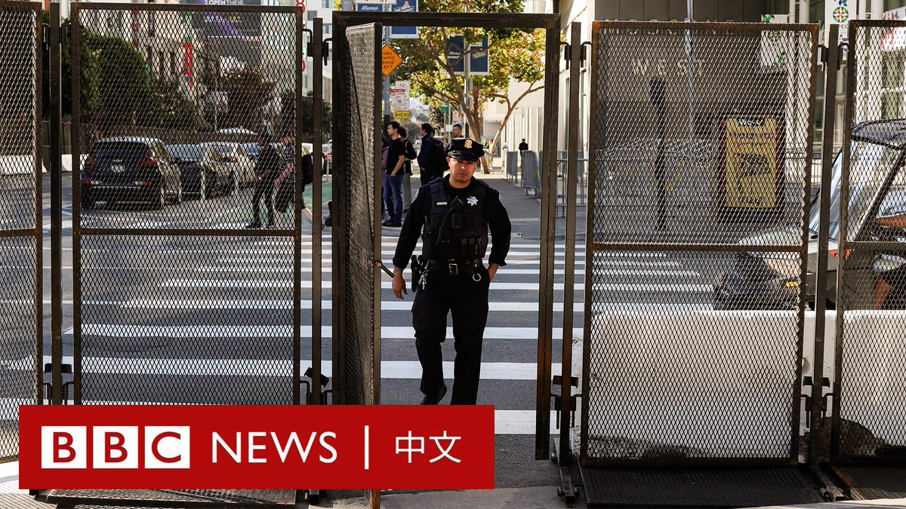
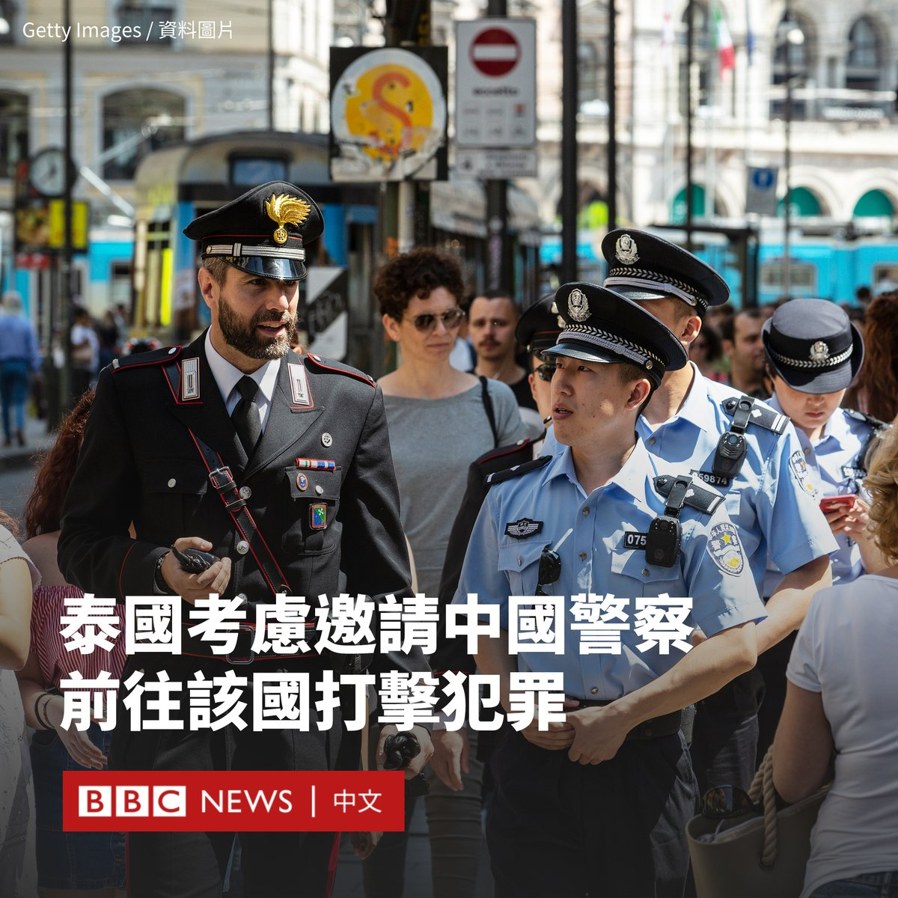
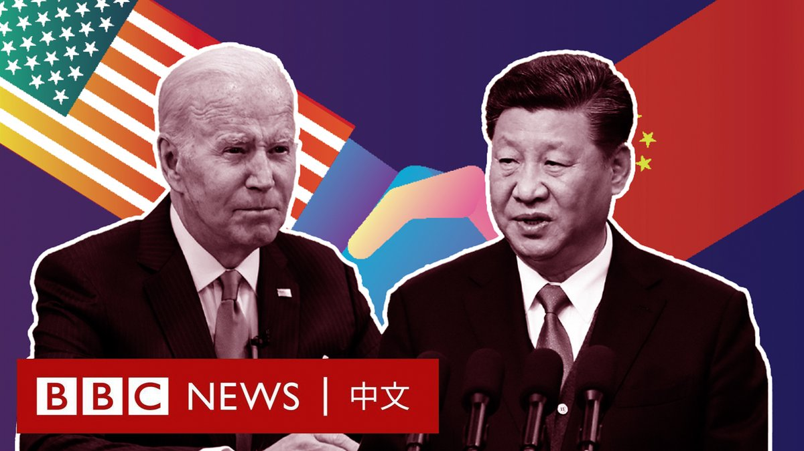
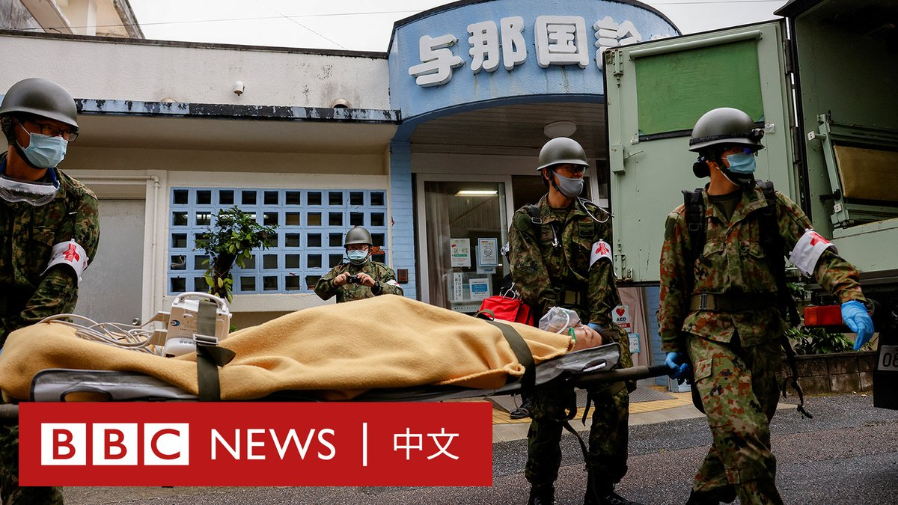

D英国广播公司BBC 北京时间 2023-11-14T17:44:20Z 1724362622307582251 随着“习拜会”与亚太经合组织（APEC）峰会将在旧金山登场，这座加利福尼亚城市已高度戒备。

当局加派警力，并在主要街区安装围栏、清理街道。美国媒体报导，市政府还在会议登场前移走了无家可归者的帐篷。 https://t.co/27aJKvdUZ9   D英国广播公司BBC 北京时间 2023-11-14T15:31:07Z 1724329094576521353 泰国计划邀请中国警察前往该国共同打击犯罪，以增强中国游客的信心，这在泰国社交媒体引发争议。

据泰国媒体报道，旅游部门官员表示，可能的合作包括在泰国多个旅游景点安排中国警察进行巡逻。

但另一名泰国政府发言人后来否认了该说法，称合作仅限于邀请中国警方赴泰一起工作，共享数据信息。

目前尚不清楚两国警方最终将如何开展合作。

泰国总理赛塔（社他；Srettha Thavisin）周日（11月12日）与泰国观光局和旅游警察局官员举行会议。

在会晤后，泰国观光局长塔帕妮·盖佩奔（Thapanee Kiatphaibool）表示，当局将开放中国警察进入泰国部分城市巡逻。

“泰国有必要有中国警察，因为这有助于我们向中国游客展示泰国正在加强安全措施。”塔帕尼说。

她表示，当局将与中国驻泰使馆进行协商，可能会效仿意大利模式。中国与意大利警员从2016年起，每年旅游旺季都会在各自的旅游圣地进行联合巡逻。这一合作在2022年终止。

此举受到一些泰国网友的批评。一些人批评这将“损害泰国的主权”，还有人担忧中国警方将借此打压海外异见人士。

泰国政府发言人柴·瓦查隆克（Chai Wacharonke）否认两国警员将一起巡逻，他表示，合作主要是中国警方前往泰国提供信息支持。

他称，该计划旨在打击在泰国活动的中国犯罪组织，与泰国的主权无关。

泰国原本期待中国重新开放出境游可以推动该国依赖的旅游业快速复苏，但今年迄今为止，中国入境游客总数为280万人，远低于2019年的1100万人。   D英国广播公司BBC 北京时间 2023-11-14T13:10:17Z 1724293654007718032 在哈马斯对以色列发动突袭前，以色列经历了数月的抗议浪潮，以及可能是该国历史上最严重的政治撕裂。事发时，一些原本为抗议政府而组建起来的组织，实际上却领导着救援工作。

不过，对于总理内塔尼亚胡的领导，以色列国人的看法并不一致。https://t.co/qxvFGxik05   D英国广播公司BBC 北京时间 2023-11-14T10:13:00Z 1724249037677941146 美国总统拜登（Joe Biden）与中国国家主席习近平自去年巴厘岛峰会后，一直没有见过面。两国关系陷入上世纪70年代以来的最低谷。

但近期，两国政府证实，两人将于周三（11月15日）在旧金山再次面对面会晤。
 
从巴厘岛到旧金山，BBC中文带您一起回顾中美两国关系跌宕起伏的一年。 https://t.co/fNKTA1kClN   D英国广播公司BBC 北京时间 2023-11-14T09:12:01Z 1724233693714374712 日本自卫队在冲绳的与那国岛进行防灾演练，该地为离台湾最近的日本国土，和宜兰距离少于110公里。

有鉴于台海情势升温与俄罗斯入侵乌克兰，日本政府近年提高国防预算，并积极推动和台湾仅有一海之隔的冲绳拟定战时应变与疏散计划。 https://t.co/dSEWWbLh3l   