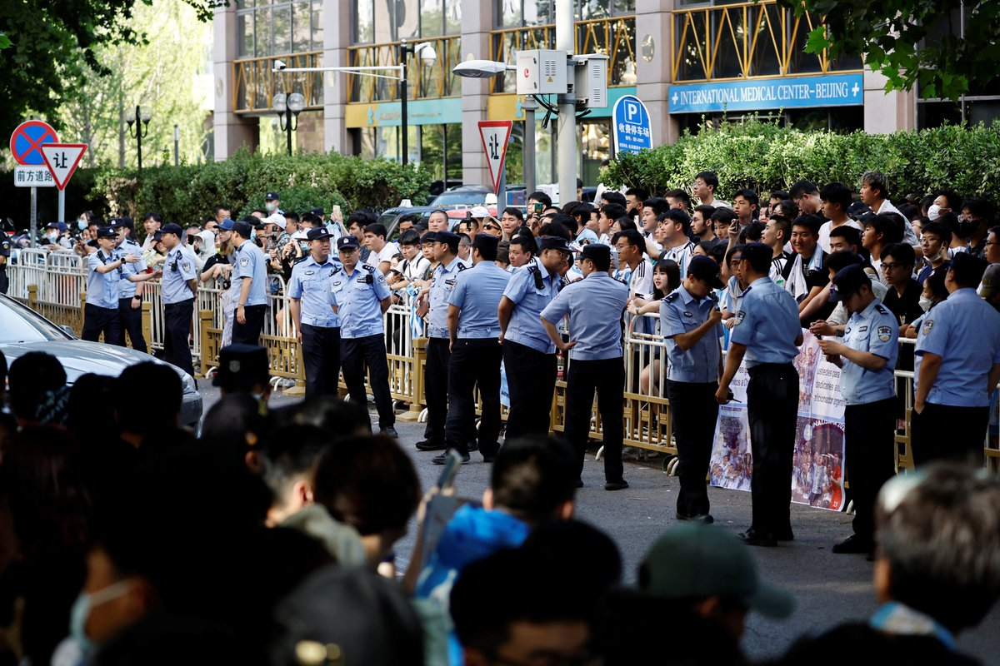
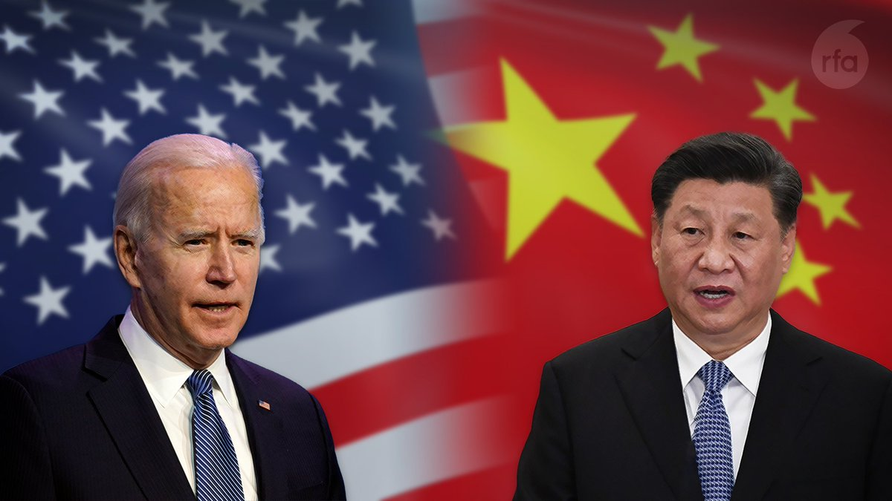
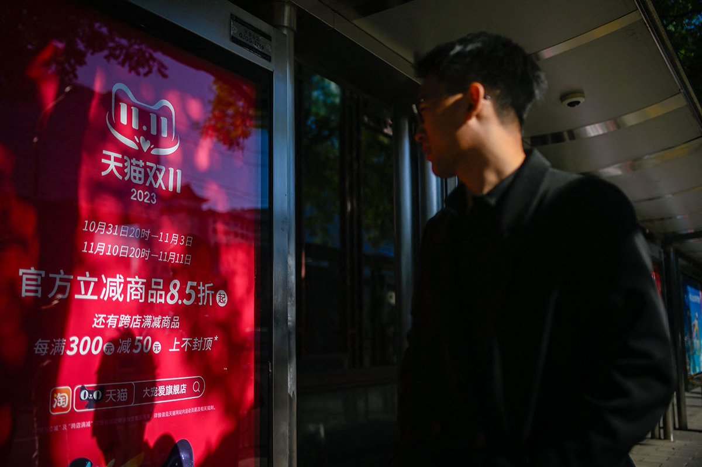
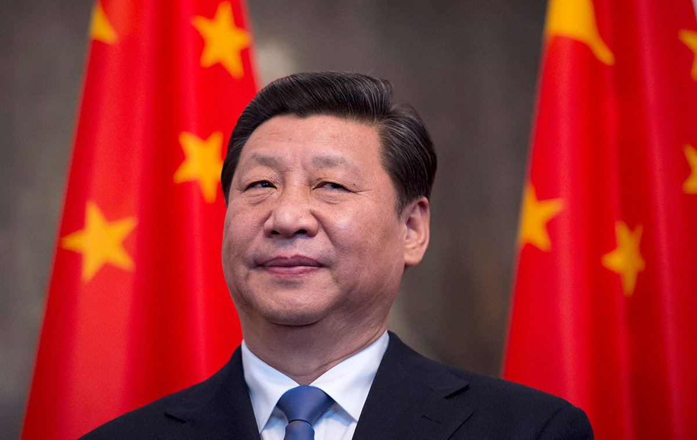
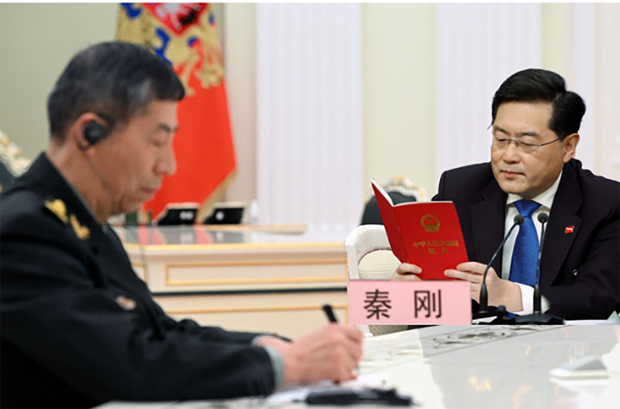
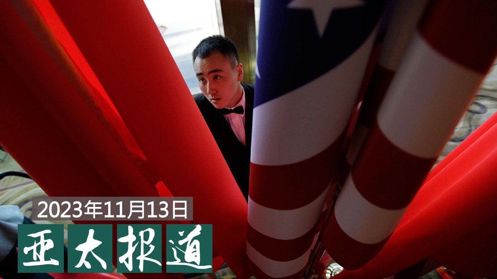
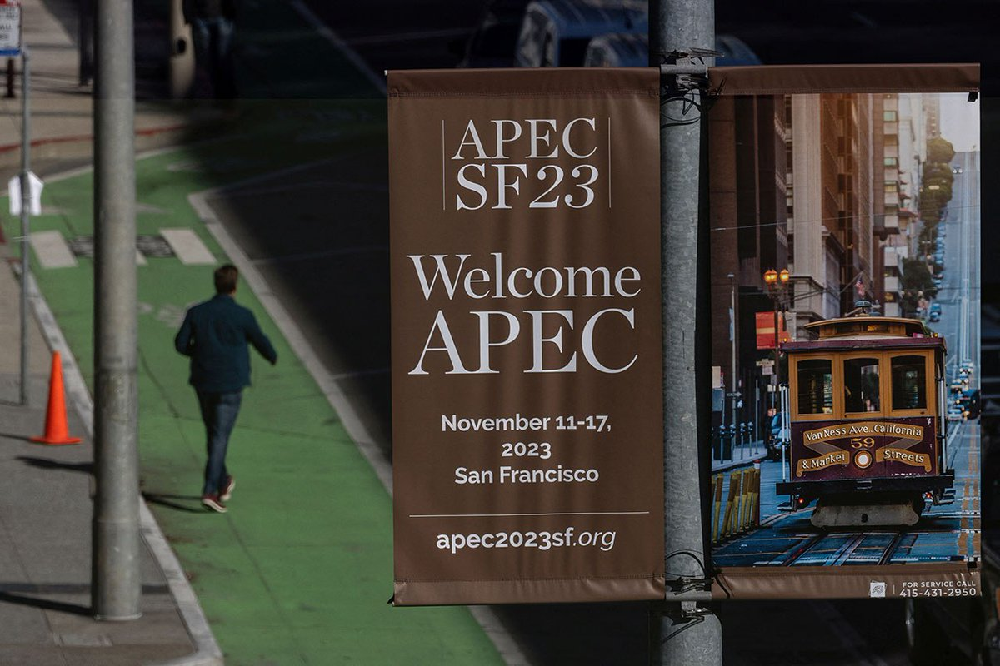
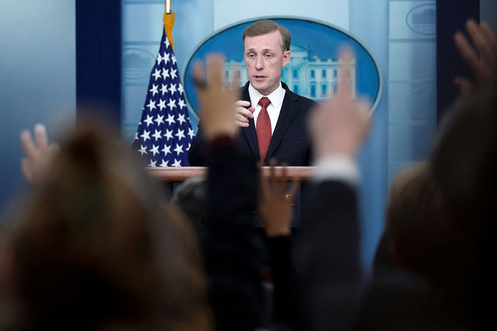

自由亚洲电台 北京时间 2023-11-14T16:18:15Z 1724340957590741067 【遭香港当局百万悬赏通缉 郭凤仪旧金山遭人身威胁】
【郭：将不惧恐吓 持续参加反习示威游行】
#香港民主委员会 联同在美的疆藏团体，在“#拜习会”举行期间举行抗议，希望各界关注中国打压人权的状况。其中名列港府 #百万悬赏 名单中的 #郭凤仪 表示，她公布将参与抗议活动后，收到不同的恐吓，更有人鼓吹把她送进中领馆领赏等。她已通知美国国会和联邦调查局等跟进。
（孙诚 舊金山採訪）   自由亚洲电台 北京时间 2023-11-14T13:14:44Z 1724294774037918079 RT @RFA_Chinese: 【欢迎加入自由亚洲电台电报群】https://t.co/UkKZmFSRkG https://t.co/Qid2LNZxJn   自由亚洲电台 北京时间 2023-11-14T14:12:51Z 1724309400981324099 【广东山东部分派出所撤并】
【辅警面临裁员 网格员工作加重】
近期，中国广东、山东等地公安局通过裁撤、合并的方式减少派出所数量。当局对此解释为“优化整合”，提高工作效率。据多位知情人士表示，派出所大量辅警面临被裁员，此举是为了减少财政支出，但编制内警员和街道网格员的压力增大。详细报道：https://t.co/CzgNFxPTLU   自由亚洲电台 北京时间 2023-11-14T10:41:52Z 1724256302690615304 【拜习会如何谈台湾问题？】
【台湾国安会：美国不会让步】
拜习会登场前夕，台湾的国安会秘书长顾立雄分析，台湾的安全与科技管制是美国无法让步的议题，最终应会沦为各说各话。他认为在中国领导人习近平一人统治下，美国希望借由峰会对话，直接了解习近平的想法。他说，目前中共内部习家军“权力竞逐”下，国安部门的权势已经大于国务院。详细报道：https://t.co/SIhNdFnrqr #拜习会   自由亚洲电台 北京时间 2023-11-14T11:12:15Z 1724263949573489022 RT @RFA_Chinese: 欢迎收听和订阅播客【#亚太报道】 https://t.co/MjLNSvVMqc
（2023-11-13）
习访美前中国官媒风向大转弯；中国 #民运人士 发表"#国是会议"宣言；企业高管频失联跳楼 #营商环境 寒意浓；日男子被以 #间谍罪 判刑…   自由亚洲电台 北京时间 2023-11-14T04:37:34Z 1724164622360657959 曾被誉为中国社会消费力奇迹的"#双11"踏入第15个年头。虽然主要电商平台均表示，今年的销售有增长，但中国媒体和网民却评论是"冷清收官"。而"双11冷清的原因"更登上微博热搜。
https://t.co/lEIrNT92um
为什么"双11"神话不再？ #您怎么看？ https://t.co/6cQCpnPRO7   自由亚洲电台 北京时间 2023-11-14T07:00:07Z 1724200499807912007 【评论 | #余杰：#习近平 的反美"新九评"】
https://t.co/Gg68utm8XZ https://t.co/2biQPM27UZ   自由亚洲电台 北京时间 2023-11-14T08:06:42Z 1724217254521573859 专栏 | #夜话中南海：为什么说由人大常委会决定国务委员去留是假“合法”真违宪
https://t.co/5KEBdLC4je https://t.co/xcgg0hphFN   自由亚洲电台 北京时间 2023-11-14T08:35:58Z 1724224619782262819 欢迎收听和订阅播客【#亚太报道】 https://t.co/MjLNSvVMqc
（2023-11-13）
习访美前中国官媒风向大转弯；中国 #民运人士 发表"#国是会议"宣言；企业高管频失联跳楼 #营商环境 寒意浓；日男子被以 #间谍罪 判刑12年 https://t.co/pIDD3XSm1z   自由亚洲电台 北京时间 2023-11-14T05:00:09Z 1724170307207118894 #亚太经济合作组织会议 于本周日在美国加州旧金山召开。在对抗 #气候变化 的议题上，二十一个环太平洋经济体领导人能否制定有效的共同政策？
https://t.co/JumOITNTFf https://t.co/kE5kZInkW1   自由亚洲电台 北京时间 2023-11-14T05:33:28Z 1724178690714763544 美国媒体《华尔街日报》近日报道发现，在中国失联的政商两界人士越来越多，最新案例包括视频直播平台 #斗鱼 的首席执行官 #陈少杰 自十月以来失联；此外，在深圳上市的 #沃华医药 董事长 #赵丙贤 被采取留置措施，配合监委机关协助调查。

https://t.co/DdK24NE6lZ https://t.co/DUD3JqzT4i   自由亚洲电台 北京时间 2023-11-14T06:00:12Z 1724185420358201688 #拜习会 即将在11月15日登场，美国国家安全顾问 #沙利文 12日表示，美国总统拜登寻求与中国重新建立军事关系。
中国外交部13日在回应拜习会相关议题时表示，中方不惧怕竞争，但反对以竞争定义中美关系。
https://t.co/h72cCbJ0ID https://t.co/us8bh8met2   自由亚洲电台 北京时间 2023-11-14T06:02:54Z 1724186099877093475 据彭博社报道，中国正考虑在美国总统 #拜登与 中国国家主席 #习近平 在旧金山会晤期间，解除过去四年对采购 #波音737MAX 客机的禁令。
波音737MAX客机先后在2018、2019年发生空难，中国民航局2019年3月下令同款机型全部停飞。至少从2018年以来，中国就没有采购过这一机型。此后美中关系日益紧张，也影响了这款飞机的交易。
有知情人透露，中国正考虑在拜习会期间解除这一禁令，作为双方关系解冻的信号。但协议细节还在协商中，依然可能在拜习会前改变或取消。
报道指出，如果这一协议达成，将是波音市场的一项突破，此前波音在中国的市场领先地位被空中巴士取代。
但习近平可能不会直接宣布向波音下订单，而是以备忘录或意向书的形式代替。   自由亚洲电台 北京时间 2023-11-14T03:21:06Z 1724145381955768516 英国内政大臣Suella Braverman被撤职，触发内阁高层人事调动，前首相 #卡梅伦 获委任为外交大臣。
卡梅伦任首相期间曾开创英中关系"黄金时代" ，卸任后更屡次被揭和北京有千丝万缕的关系，甚至为"#一带一路"倡议。他"回朝"出任外相，将如何影响 #英中关系？
https://t.co/U2H6BYX6Cj https://t.co/U4R7hZY4GF   自由亚洲电台 北京时间 2023-11-14T00:38:50Z 1724104543187939678 中国国家主席 #习近平赴美 前夕，官媒新华社连发五篇“推动中美关系回归正轨系列评论”。商务部也准备修正对外国企业差别待遇的规定。
中国政府是真心改弦易辙，要跟美国搞好关系吗？还是中方对美方放软姿态的“战略欺诈”？https://t.co/BgGbTYG7xA
#您怎么看？ https://t.co/5TRg1Iqtoc   自由亚洲电台 北京时间 2023-11-14T01:25:32Z 1724116297917648909 中国外交部官网周一（11月13日）发布消息称，中国国家主席习近平特使、国务委员 #谌贻琴 将于11月15日至18日访问 #马尔代夫；随后，谌贻琴将于11月18日至21日访问斯里兰卡。
美国《华尔街日报》在同一天发表文章指出，印度和中国为争夺在印度洋上的影响力而展开激烈竞争，马尔代夫这个小小的群岛国家便是双方角力的缩影。
报道指出，马尔代夫从中国获得了大量贷款，修建了新高楼、道路和地标性桥梁。印度也为马尔代夫一个耗资5亿美元的桥梁项目提供了资助。印度官员称，这么做就是为了对中国作出回应。
报道还说，马尔代夫见证的这场拉锯战正在印度周边的南亚各国上演，在总理莫迪的领导下，印度一直在加强与主要邻国的关系。
报道强调，中国通过“#一带一路”倡议成为了全球最大的发展融资来源国，在此过程中发展了对南亚和东南亚的影响力；而印度也在斯里兰卡、孟加拉和缅甸等国投入了数十亿美元用于基础设施项目和援助。   