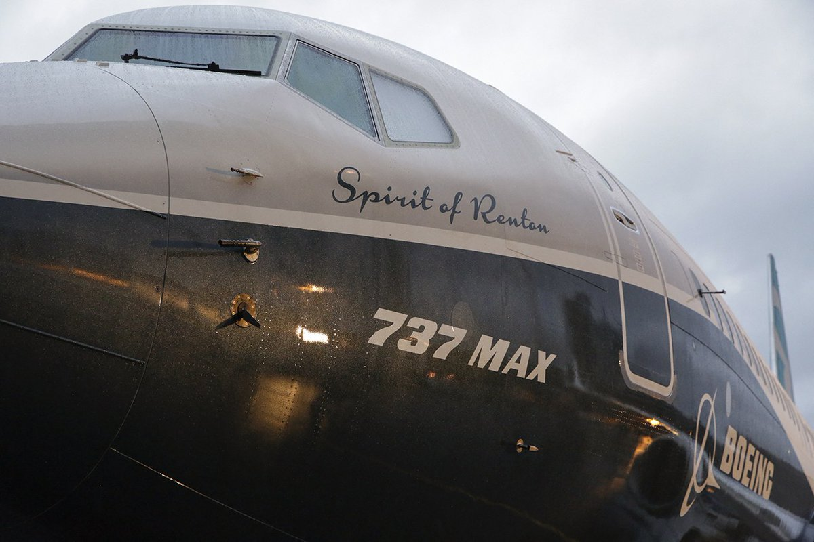
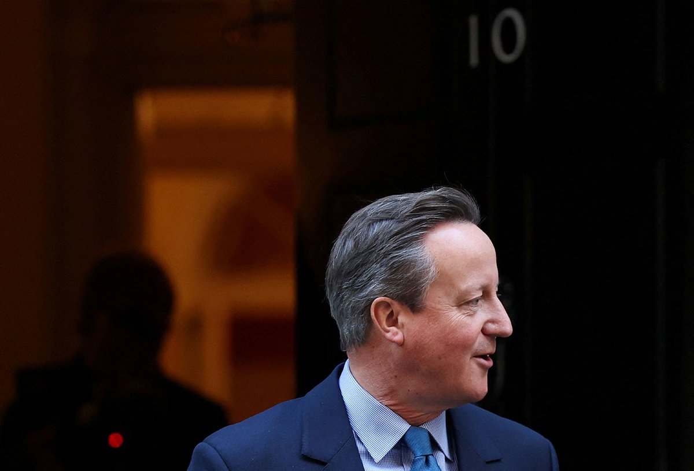
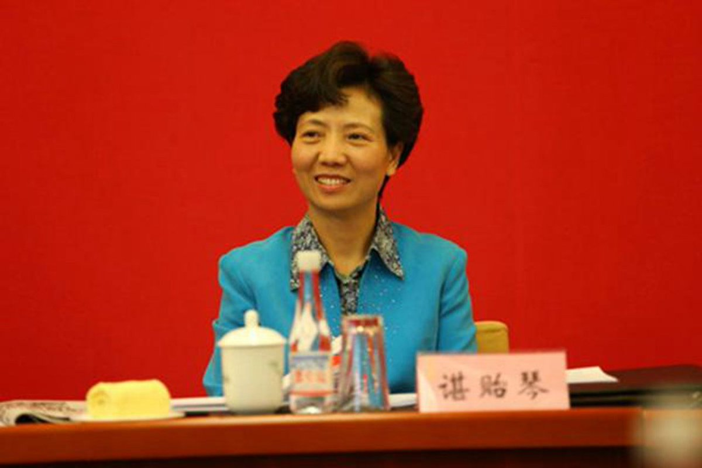

自由亚洲电台 北京时间 2023-11-14T06:02:54Z 1724186099877093475 据彭博社报道，中国正考虑在美国总统 #拜登与 中国国家主席 #习近平 在旧金山会晤期间，解除过去四年对采购 #波音737MAX 客机的禁令。
波音737MAX客机先后在2018、2019年发生空难，中国民航局2019年3月下令同款机型全部停飞。至少从2018年以来，中国就没有采购过这一机型。此后美中关系日益紧张，也影响了这款飞机的交易。
有知情人透露，中国正考虑在拜习会期间解除这一禁令，作为双方关系解冻的信号。但协议细节还在协商中，依然可能在拜习会前改变或取消。
报道指出，如果这一协议达成，将是波音市场的一项突破，此前波音在中国的市场领先地位被空中巴士取代。
但习近平可能不会直接宣布向波音下订单，而是以备忘录或意向书的形式代替。   自由亚洲电台 北京时间 2023-11-14T03:21:06Z 1724145381955768516 英国内政大臣Suella Braverman被撤职，触发内阁高层人事调动，前首相 #卡梅伦 获委任为外交大臣。
卡梅伦任首相期间曾开创英中关系"黄金时代" ，卸任后更屡次被揭和北京有千丝万缕的关系，甚至为"#一带一路"倡议。他"回朝"出任外相，将如何影响 #英中关系？
https://t.co/U2H6BYX6Cj https://t.co/U4R7hZY4GF   自由亚洲电台 北京时间 2023-11-14T00:38:50Z 1724104543187939678 中国国家主席 #习近平赴美 前夕，官媒新华社连发五篇“推动中美关系回归正轨系列评论”。商务部也准备修正对外国企业差别待遇的规定。
中国政府是真心改弦易辙，要跟美国搞好关系吗？还是中方对美方放软姿态的“战略欺诈”？https://t.co/BgGbTYG7xA
#您怎么看？ https://t.co/5TRg1Iqtoc   自由亚洲电台 北京时间 2023-11-14T01:25:32Z 1724116297917648909 中国外交部官网周一（11月13日）发布消息称，中国国家主席习近平特使、国务委员 #谌贻琴 将于11月15日至18日访问 #马尔代夫；随后，谌贻琴将于11月18日至21日访问斯里兰卡。
美国《华尔街日报》在同一天发表文章指出，印度和中国为争夺在印度洋上的影响力而展开激烈竞争，马尔代夫这个小小的群岛国家便是双方角力的缩影。
报道指出，马尔代夫从中国获得了大量贷款，修建了新高楼、道路和地标性桥梁。印度也为马尔代夫一个耗资5亿美元的桥梁项目提供了资助。印度官员称，这么做就是为了对中国作出回应。
报道还说，马尔代夫见证的这场拉锯战正在印度周边的南亚各国上演，在总理莫迪的领导下，印度一直在加强与主要邻国的关系。
报道强调，中国通过“#一带一路”倡议成为了全球最大的发展融资来源国，在此过程中发展了对南亚和东南亚的影响力；而印度也在斯里兰卡、孟加拉和缅甸等国投入了数十亿美元用于基础设施项目和援助。   