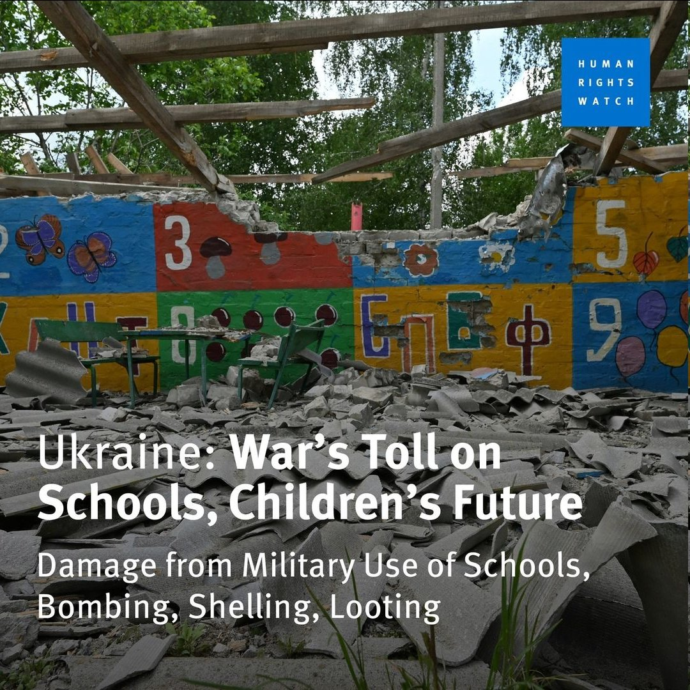
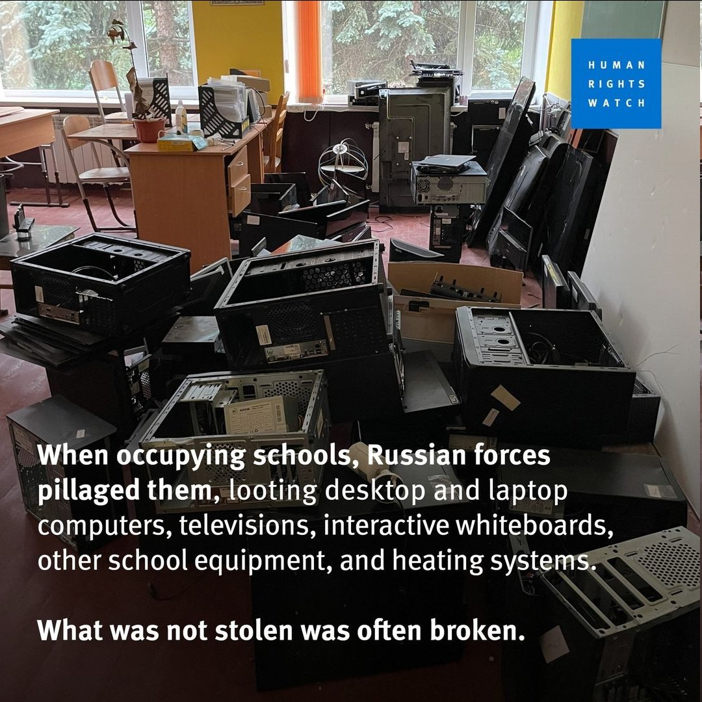
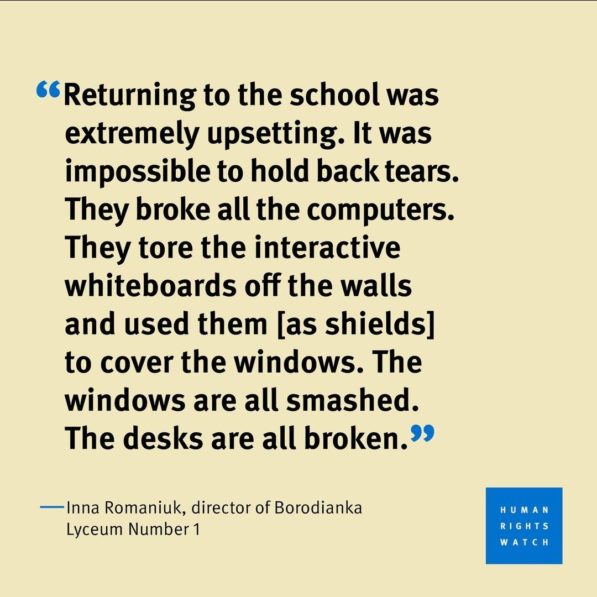

谁将十万横扫三江 北京时间 2023-11-14T20:36:49Z 1724406029298102377 俄罗斯军队摧毁了乌克兰各地的学校和幼儿园。自2022年2月以来，已有超过3790个教育设施受灾。俄罗斯军队洗劫了这些学校，抢走了台式电脑和笔记本电脑、电视、教学白板以及其他学校设备和供暖系统。那些没有拿不走的东西也常常被损坏。

乌克兰人自述：回到学校是非常令人沮丧的。我无法忍住眼泪。俄军砸烂了所有的电脑，又扯下了墙上的互动教学白板当盾牌用。所有的窗户都被打碎了。课桌也都被破坏了。

人权机构：乌克兰的儿童在这场战争中付出了高昂的代价，因为对教育的攻击是对孩子们的未来的攻击。国际社会应该谴责俄罗斯军队对乌克兰学校的毁坏和掠夺。 source (https://t.co/Syeo7VzoP5)   谁将十万横扫三江 北京时间 2023-11-14T20:32:45Z 1724405004281454694 网友投稿：珠海一男子横停奔驰堵小区通道遭网暴，涉事男子为绘威集团董事长陈某某，经营办公耗材
有网友曝光，“眼镜衬衫男”是珠海市教育局办公室主任李翔同志，听说负责着整个珠海市教育系统的耗材审批工作。疑是该董事长给主任送礼 https://t.co/4BIvFPL6ld   