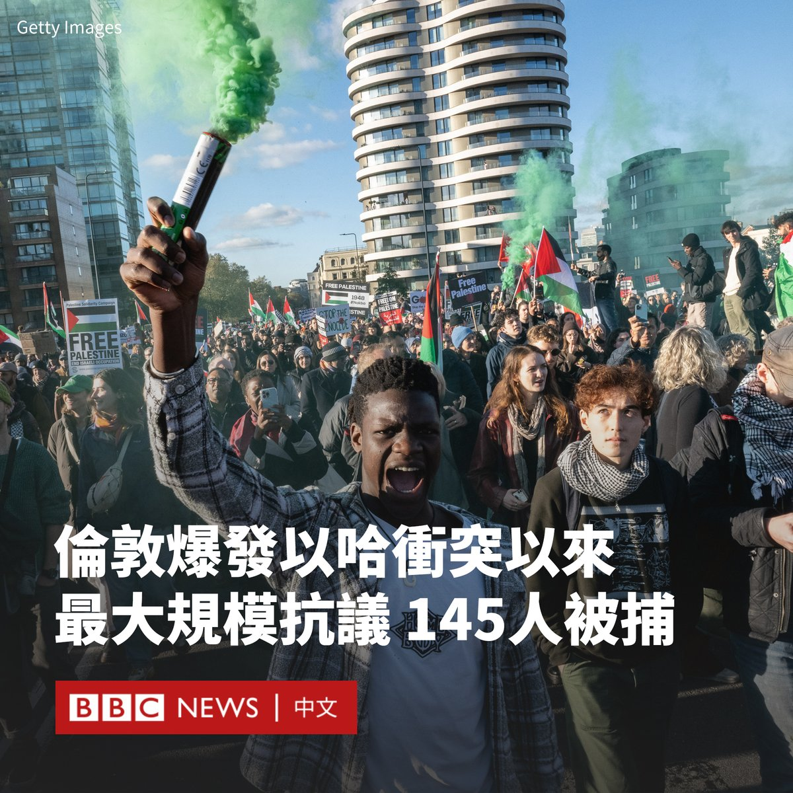
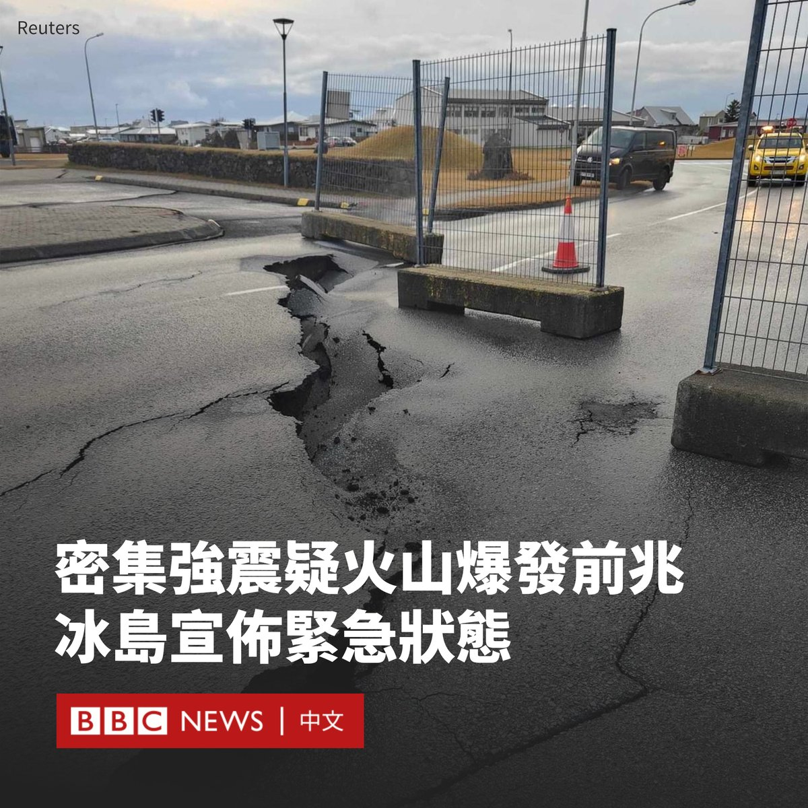
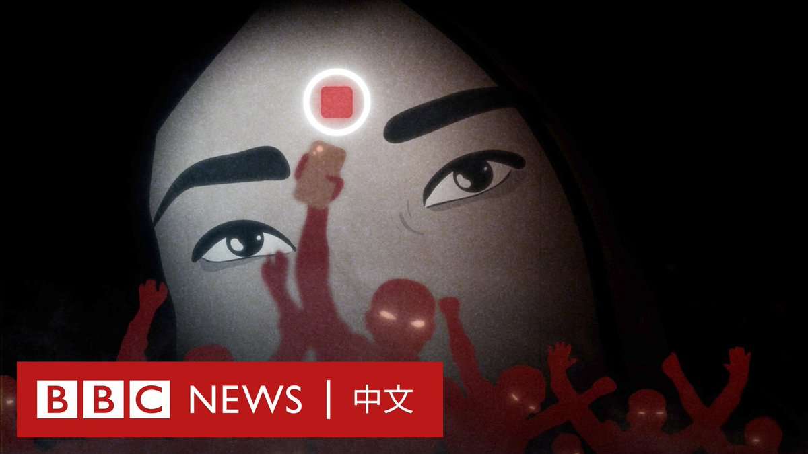
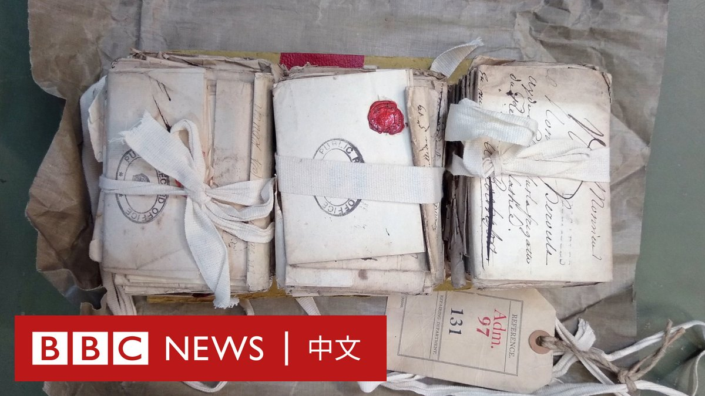

D英国广播公司BBC 北京时间 2023-11-13T17:09:26Z 1723991449606439106 周六（11月11日），有数十万亲巴勒斯坦抗议者在伦敦市中心游行，呼吁加沙停火。

这次集会是自以色列和哈马斯战争开始以来最大规模的一次。警方估计有30万人参加，组织者则称有80万人参加。

伦敦警方表示，有超过145名抗议者被逮捕，很多被捕者是反对这些示威者的极右翼团体成员。其中七人遭到起诉。

据报道，当日警方在多地与他们爆发混战，有九名警察受伤。有影片显示，有右翼团体人士推搡警察，并高呼：“你们不再是英国人了”。

警方称，还有一群人数约150人的亲巴勒斯坦抗议者脱离了主要游行队伍，他们带着面具并燃放烟花。当有烟花被投掷到警察脸上时，警方对他们进行了拘留。

警方表示，对包括反犹太仇恨犯罪在内的其他犯罪行为的调查仍在继续。

英国首相苏纳克（Rishi Sunak）形容当天为“不可接受的场面”，称参与犯罪者必须受到法律的制裁。他还谴责有人在支持巴勒斯坦游行期间“唱反犹太口号并挥舞亲哈马斯的标语”。

示威活动当天恰逢停战日，英国官员此前曾多次试图禁止示威。但伦敦警方认为不能禁止抗议。

周日（11月12日），法国全国有18万人上街游行集会，谴责针对犹太人的行为飙升，其中巴黎的游行集会有超过10万人参与。

总统马克龙（Emmanuel Macron）没有出席，但表达了对抗议活动的支持。他呼吁公民站出来反对“令人难以忍受的肆无忌惮的反犹太主义再现”。   D英国广播公司BBC 北京时间 2023-11-13T15:35:20Z 1723967770474283447 美中两国元首拜登和习近平将在旧金山展开令外界等待多时的会晤。我们能从中期待什么？陷入冰冻期的美中关系能否解冻？https://t.co/A4gBBLGi6S   D英国广播公司BBC 北京时间 2023-11-13T13:12:36Z 1723931850010485051 冰岛在发生一系列地震后宣布进入紧急状态。当局表示，由于有迹象表明岩浆在地下迅速扩散，该国西南部火山喷发的风险非常大。

作为预防措施，当局已将居住在西南部城镇格林达维克（Grindavík）的数千名居民疏散。

冰岛气象局表示，火山爆发的风险相当大。该机构表示，雷克雅内斯半岛或附近地区发生火山喷发的可能性增加了。

根据声明，火山喷发可能在未来几天的任何时候开始。

当局表示，在上周六（11月11日），一条地下岩浆或熔岩河向东北方向蔓延，穿过格林达维克，向内陆延伸了约10公里。其深度不到800米，而当天早些时候为1500米。

自10月下旬以来，冰岛西南部已记录到超过20,000次地震。它们集中在雷克雅内斯半岛。在2021年火山爆发之前，该半岛的火山活动沉寂了800年。

当局还将航空警报提高到橙色，表明火山爆发的风险增加。火山喷发时会对航空业构成严重危害，因为其会将高度磨蚀性的火山灰喷向大气层，导致飞机引擎和飞行控制系统故障，并降低能见度。

2010年冰岛的一次火山大爆发导致欧洲和北美之间的航线大面积中断，航空公司取消了超过10万个航班，损失估计达30亿美元。   D英国广播公司BBC 北京时间 2023-11-13T11:23:04Z 1723904284809744791 在印度东北部的曼尼普尔邦，两名妇女六个月前被暴徒剥掉衣服、裸体游街示众，并据报遭到轮奸。她们的遭遇在一段网络疯传的影片中被公开。

她们接受BBC的采访，讲述了其痛苦经历——隐姓埋名的生活，以及为伸张正义而进行的斗争。 https://t.co/Jku4Dky1Hl   D英国广播公司BBC 北京时间 2023-11-13T09:06:16Z 1723869857660424379 一批七年战争时期遭英国海军没收的信件在尘封超过250年后终于重见天日。它们多半由一艘法国战舰船员的亲人在1757和1758年间寄出，但从未被送到对方手上。

剑桥大学的一名历史学者发现了这批信件，他说信的内容让大众得以一窥这些船员和家人18世纪的日常生活。 https://t.co/6arFD0dL5w   