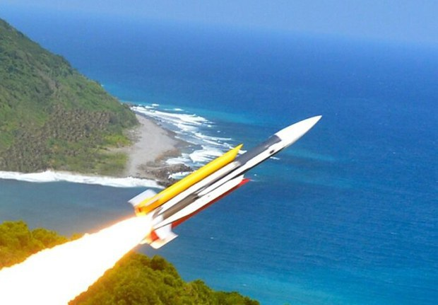
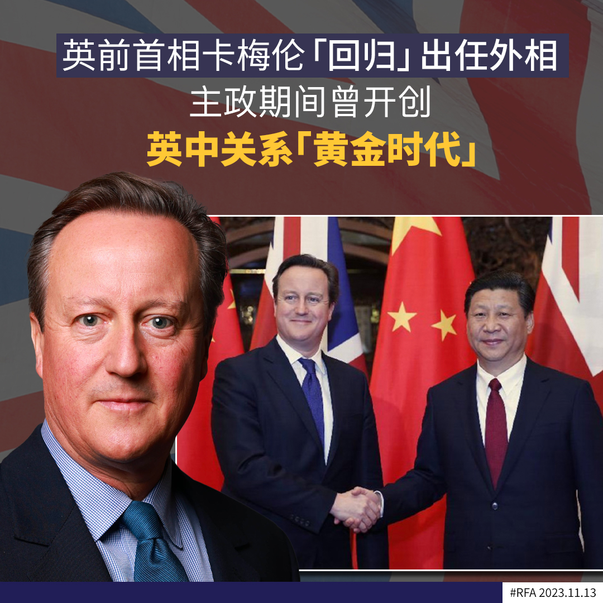
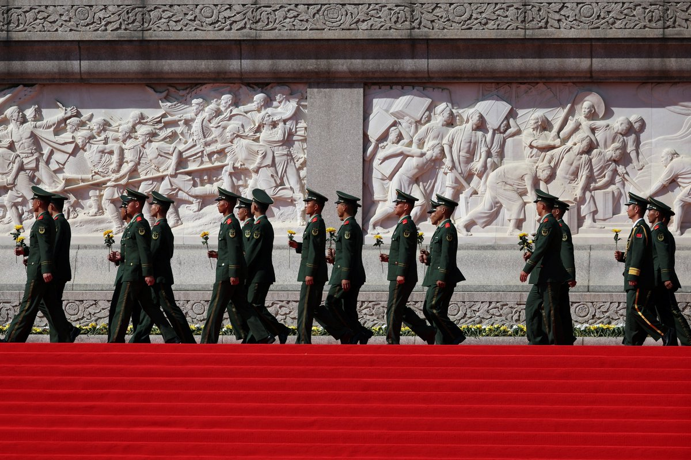
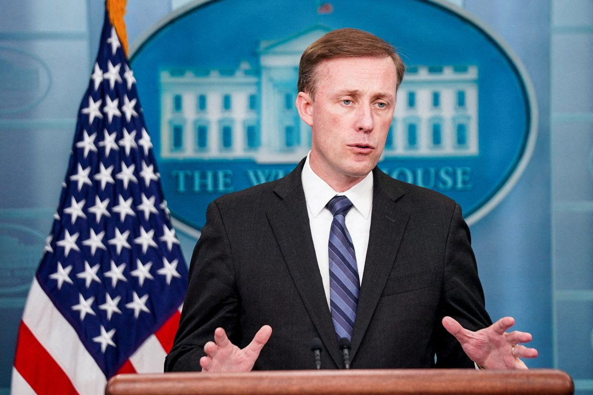
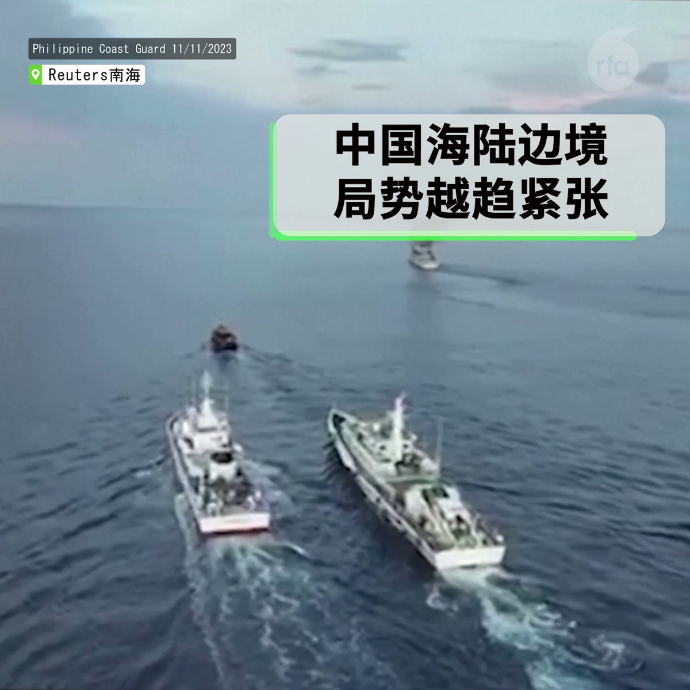

自由亚洲电台 北京时间 2023-11-13T23:50:43Z 1724092437814026429 【台湾部署 #极音速导弹　射程可达北京】
据台湾中时新闻网报道，知情人透露，台湾已在导弹部队部署了自己研发的擎天极音速巡弋导弹，其射程达2000公里，可以打击北京市。
报道指出，这一导弹是台湾中科院研发的，台湾空军为此拨出了135亿新台币作为预算，去年底完成测试，今年量产，目前已正式部署在空军防空暨导弹指挥部某导弹部队。台湾政府第一阶段准备生产10套发射系统，部署15到20枚导弹，分布在台湾北部和中部地区。台湾《上报》称，这也是台军首度具备远距打击战略性导弹。
另外，中时新闻网报道称，截至去年底，台湾向美国军购案，目前美国只交付了8503亿元新台币的军事物资，另有8300亿元的装备延迟交货。台湾国防部没有就此作出进一步说明。   自由亚洲电台 北京时间 2023-11-13T19:08:32Z 1724021422199312390 【英前首相卡梅伦“回归”出任外相】
【主政期间曾开创英中关系“黄金时代”】

英国唐宁街10号首相府周一（13日）宣布，委任前首相 #卡梅伦（David Cameron）出任外交大臣，而原外相克萊弗利（James Cleverly）将出任内政大臣，接替被辞退的布雷弗曼（Suella Braverman）。

布雷弗曼上周在未经首相府同意下，在报章公开撰文，批评伦敦警察厅批准在周六（11日）英国“国殇纪念日”（Remembrance Day）举行的声援巴勒斯坦示威，违反内阁官员守则，被首相蘇納克（Rishi Sunak）撤职，触发内阁改组。

值得留意的是，卡梅伦在2010年至2016年出任英国首相期间，开创英中关系“#黄金时代”（Golden era），大力推动和中国的经贸等各方面合作。卡梅伦在2010年11月率领4名内阁大臣和近50名英国工商界领袖代表团访问北京，而中国国家主席 #习近平 也在2015年10月访问英国，和卡梅伦一同品尝英国名物黑啤酒和炸鱼薯条，把两国关系推向高峰。

现任首相 #蘇納克（Rishi Sunak）去年11月发表外交政策演说时，虽曾明言英中关系“黄金时代”已经结束，但过去一年间却频频转向，不仅违背关闭孔子学院的选举承诺，更多次派高层官员访华，近日甚至力排众议，邀请中国派员出席由英国主办的人工智能（AI）安全峰会。

這次卡梅伦回朝出任外相，外界密切关注将如何影响英中关系未来走向。

记者：吕熙（伦敦）   自由亚洲电台 北京时间 2023-11-13T16:31:38Z 1723981937642275027 【日籍男子间谍罪判囚12年】
 【日媒：岸田或在APEC提此案】
#日本 一名男子被控在华从事 #间谍 活动，被长沙市中级法院判刑12年，该男子提出上诉至湖南省高院。法官裁定维持原判。日媒报道，首相 #岸田文雄 可能在 #APEC 期间向 #习近平 提出此案。https://t.co/R1D3e4ba0z https://t.co/D38W7Zol9M   自由亚洲电台 北京时间 2023-11-13T17:30:47Z 1723996821968789557 【#沙利文：#拜登 希望重建于中国军事关系】
【中外交部：美方应以实际行动 #反台独】
【台陆委会：美国应不会针对 #台湾 有新说法】
在 #拜习会 前夕，各方放话，透露对美中元首会面的期待和底线。
详细报道：
https://t.co/4WgcDxBYax https://t.co/djsLVjKm5P   自由亚洲电台 北京时间 2023-11-13T09:40:20Z 1723878429966118942 【中国海陆边境局势升温 | 四国鼎立摩拳擦掌】
在 #南海，中国菲律宾冲突再起，四小时对峙期间，中国海警船包围 #菲律宾 补给舰，向其发射水炮；在 #东海，日本在台湾附近一岛屿进行灾难演习，为 #台海危机 作准备；同一时间，印度总理 #莫迪 高调前往中印边境敏感地区，与官兵共同庆祝排灯节。 https://t.co/PSoGGoscVk   自由亚洲电台 北京时间 2023-11-13T07:09:25Z 1723840452313415734 周六，#浙江 温州永嘉县桥头镇一处楼房在翻修过程中发生垮塌，有四人死亡。上周，#黑龙江 一体育馆在大雪中倒塌，造成三人死亡。7月，黑龙江一所学校 #体育馆 的屋顶在大雨中塌陷，造成11人死亡。
详阅：https://t.co/I9RQ6jSaJu   自由亚洲电台 北京时间 2023-11-13T08:39:35Z 1723863142248112169 RT @RFA_Chinese: 【民运人士筹备“国是会议” | 美国会议员到场声援】
习近平美国现身在即，民主运动领袖 #王丹、#魏京生 和 #王军涛 在新闻发布会上宣布，#国是会议 将于明年二月召开。有民运人士大胆提出，可逐渐将该会议演化为民主议会，最终进驻中国。美国国会议…   自由亚洲电台 北京时间 2023-11-13T04:34:01Z 1723801341544321164 #沃华 医药公司董事长 #赵丙贤 被留置，配合监委机关协助调查, 调查内容不明，但沃华公告称，所涉事项与公司无关，公司控制权没有发生变化。
详阅：https://t.co/SOwdvA563h   自由亚洲电台 北京时间 2023-11-13T05:23:24Z 1723813769296429233 中国 #国企 在尼泊尔建设的国际机场可能存在腐败问题，遭 #尼泊尔 当局调查。#机场 今年1月开业，但未能吸引任何定期的国际航班。尼泊尔请求将贷款转为赠款，但中国不同意。
详阅：https://t.co/ZsJ4oi5aYv   自由亚洲电台 北京时间 2023-11-13T02:27:22Z 1723769469334409707 微信公众号“#常州华立”11月11日发布消息，称其董事长 #承勇 被市纪委约见，谈论杨康成副区长放款事宜，被逼承认接受800万元存款和现金 #行贿，凌晨4:36分，承勇跳楼以证清白。
详见：https://t.co/IfBwutMTCc   