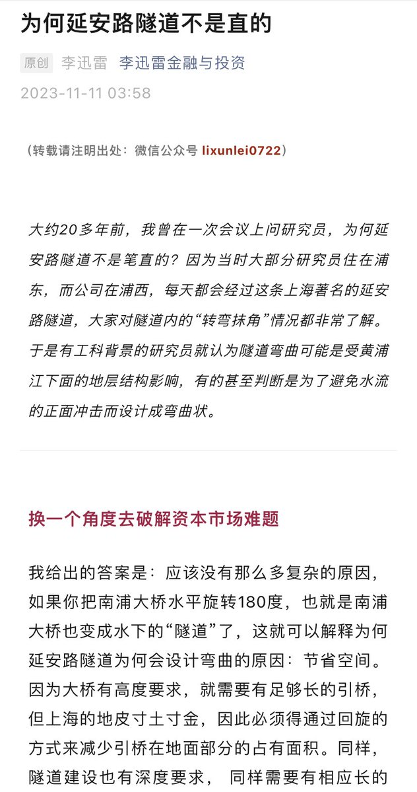
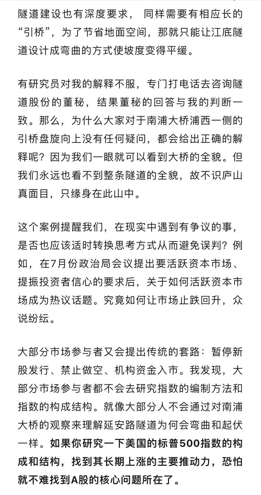
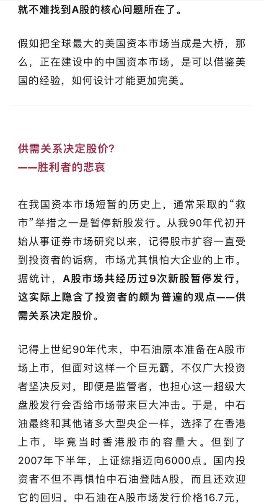
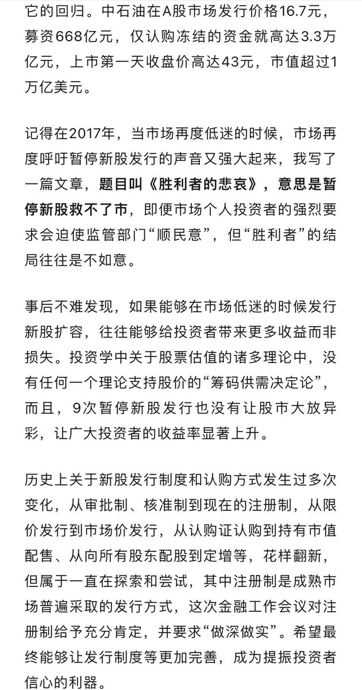

谁将十万横扫三江 北京时间 2023-11-13T19:55:38Z 1724033275667304588 RT @whyyoutouzhele: “体验服”
11月10日，杭州全过程人民民主实践中心
游客可通过VR沉浸式全过程的体验中国民主进程，还可DIY自己的角色形象。 https://t.co/bwwle6ipS8   谁将十万横扫三江 北京时间 2023-11-13T15:56:53Z 1723973191151095863 RT @Pandazhq: 李迅雷这篇文章在财经圈刷屏了 https://t.co/y8c52FRxC3   谁将十万横扫三江 北京时间 2023-11-13T15:40:34Z 1723969085992734729 RT @starlightcaesar: 专制国家里，男人是国家的奴隶，女人是男人的奴隶。男人被国家奴役，女人被男人奴役。所以一旦男人无法再奴役女人，就真的太凄惨了。在不改变社会制度的前提下，统治者要想维护社会的稳定，就必须让男人重新获得奴役女人的权利。所以通常情况下，越专制的…   谁将十万横扫三江 北京时间 2023-11-13T16:11:18Z 1723976819857404365 RT @jakobsonradical: 香港的管理者有病是吧？😅 https://t.co/JW8Ioc7XcE   谁将十万横扫三江 北京时间 2023-11-13T16:21:09Z 1723979298577768624 苏丹女孩走上街头呼吁革命。
过去六个月苏丹至少有 700 万人流离失所。 https://t.co/uqOOiVgtds   谁将十万横扫三江 北京时间 2023-11-13T08:49:14Z 1723865570221699279 RT @CnFeminism: 分享｜打工文化艺术博物馆（2008–2023）线上版
https://t.co/CnXMNqTGBt
这家中国内地唯一以打工为题的博物馆坐落于北京皮村，于2008年5月1日对外开放。经历了15年的免费开放后，因拆迁不得不于今年5月20日关闭。博物…   