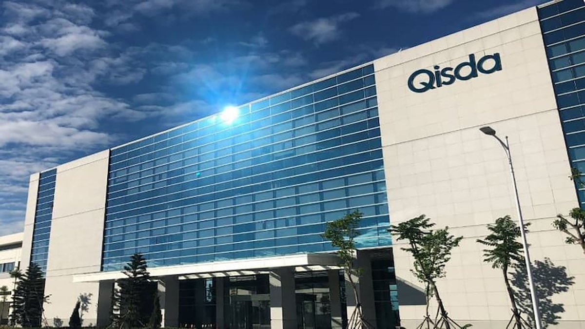

自由亚洲电台 北京时间 2023-11-12T09:51:16Z 1723518795380052097 RT @RFA_Chinese: 【博明：#习近平对战争过于乐观 】
【习近平认世界大乱 中国形势大好】
美国前副国家安全顾问 #博明（Matt… https://t.co/U9R1sn9n5g   自由亚洲电台 北京时间 2023-11-12T09:52:02Z 1723518985780506814 RT @RFA_Chinese: 2023年11月10日下午，#习近平 到访 #旧金山 参加 #APEC 会议前夕，抗议人群在旧金山中领馆外游行。 https://t.co/MaBpemX5ZN   自由亚洲电台 北京时间 2023-11-12T09:52:05Z 1723519001022628302 RT @RFA_Chinese: 2023年11月10日下午，#抗议习近平到访旧金山 的车队出发前，自由雕塑公园负责人 #陈维明 发表演说。（孙诚拍摄） https://t.co/DTYpiduUhx   自由亚洲电台 北京时间 2023-11-12T09:52:09Z 1723519016054985141 RT @RFA_Chinese: 2023年11月10日下午，#抗议习近平到访旧金山 的车队驶过旧金山中领馆外。
本次车队游行，由 #中国民主教育基金会、#中国民主人权联盟、#中国民主阵线、#自由雕塑公园、#中国民主党、#洛杉矶民主平台 等团体举办（孙诚拍摄） https://…   自由亚洲电台 北京时间 2023-11-12T06:57:02Z 1723474944623890497 爱沙尼亚：10月份波罗的海受损管道旁的锚，可能属于香港注册“新新北极熊号”;
中国：愿意根据国际法提供必要资讯；
新新北极熊号：拒绝置评；
俄罗斯：“胡扯”。
详阅：https://t.co/nozaNJ47WA   自由亚洲电台 北京时间 2023-11-12T08:37:36Z 1723500252982809026 【美国用“全套工具” 支持台湾自卫】美国 #在台协会 主席罗森伯格感恩节演讲时指出，#拜登 政府正在使用总统拨款和外国军事融资，支持 #台湾 增强自卫能力、增强韧性、强化威慑。
详阅：https://t.co/ebPtlRvLkI   自由亚洲电台 北京时间 2023-11-12T09:14:21Z 1723509503751069854 【超时工作一个月 | 电子公司职员猝死】来自昭通23岁的小徐，今年7月4日被苏州 #环宇集团 旗下劳务派遣公司派遣到 #佳世达 电子公司工作33个工作日，每天12个半小时，其中连续18天值夜班。8月11日下班两天后，小徐被工友发现猝死在厂方提供的宿舍里。
详阅：https://t.co/cPJ07CqJ5M https://t.co/TnnV0f1Djg   自由亚洲电台 北京时间 2023-11-12T04:32:04Z 1723438462970286098 【北约：不依赖中国科技 避免重蹈覆辙】
“虽然中国不是我们的对手，但 #中国 不认同我们的价值观，缺乏透明，不尊人权，决心基于自己的需求塑造 #网络空间 的未来。” — 秘书长 #斯托尔滕贝格
详阅：https://t.co/diYQJ9rPHU   自由亚洲电台 北京时间 2023-11-12T05:10:52Z 1723448229247733914 【民营企业家 #刘会茹 被释放】2021年她被以非法吸收公众存款罪判刑三年。其律师为刘进行无罪辩护，庭上发言《摘瓜抱蔓不可取，#司法不公 失人心》。
“这个案子必将载入当代中国法治史，有的人必将被载入当代中国耻辱史。” — 辩护律师
详阅：https://t.co/vzGQRr2VkD   自由亚洲电台 北京时间 2023-11-12T06:09:49Z 1723463063280484732 【台外长做访问  伤害中国人民感情了?】
#吴钊燮 接受泰国公共电视台专访表示，中国正迫使台湾屈服，以达到“不战而屈人之兵”。播出后引发中国驻泰国大使馆强烈不满，抨击该媒体为“#台独分子”提供散布谬论平台，是对 #新闻 自由的滥用。
详阅：https://t.co/9FVdxnFuJa   自由亚洲电台 北京时间 2023-11-12T06:12:49Z 1723463818192326955 RT @RFA_Chinese: 【APEC前夕多重信号 | 中美关系看不懂】
万众瞩目的 #旧金山 亚太经合组织会议召开前夕，中美发送相反的政治讯息：一方面，美国印尼元首开小会，公开提出维护航行自由，锋芒直指中国；另一方面，美国财长 #耶伦 和 #何立峰 副总理会晤，达成多项…   自由亚洲电台 北京时间 2023-11-12T01:02:17Z 1723385670326952428 【双十一营销把戏："先提价再折扣"】去年“#双十一”总销售额达到1.1万亿元人民币，而今年 #Bain 问卷调查发现，77%的消费者不打算在 #购物节 期间去买超出平时消费的东西。
详阅：https://t.co/fJOdw4ZWfh   