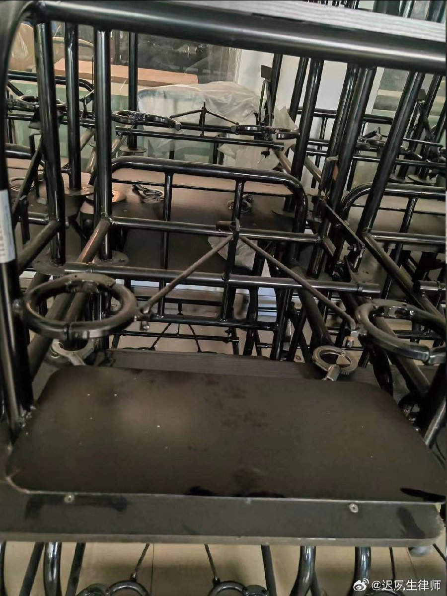
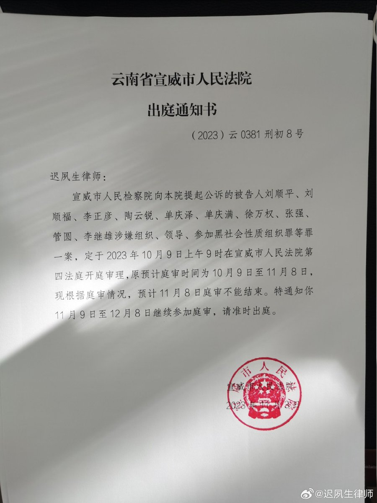
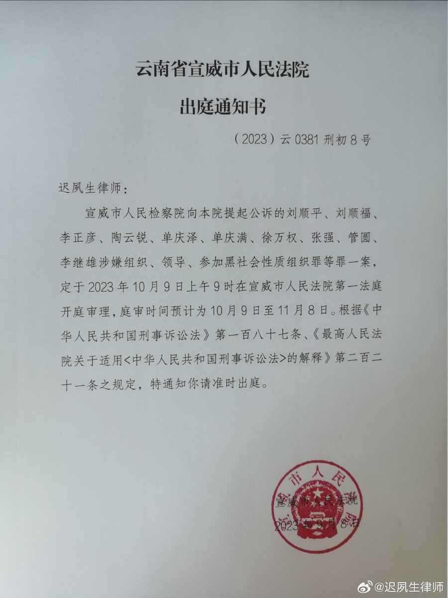

谁将十万横扫三江 北京时间 2023-11-12T19:40:32Z 1723667087338709084 第一位跨性别州参议员，第一位酷儿女性立法者，第一位黑人酷儿男性立法者，第一位女性市长。看得见的多元，听得见多元。 source (https://t.co/vylrszZ91C) https://t.co/M4Dh3z8Enp   谁将十万横扫三江 北京时间 2023-11-12T11:08:43Z 1723538284213912033 这就是我2023年11月6日早8:50左右进入法庭，看见庭审现场由审判长、宣威法院女副院长丁敏换来的铁制座椅，此前是十名被告人坐的一般座椅。我辩护的李正彦是55岁老年人，腰间盘有问题，且此案自10月9日连续开庭，又延长至12月8日才能结束，被这种固定手脚腰的座椅固定后再开庭多日，被告人们太难了！[泪][衰]

【网评】迟律师拍的那把宣威法院被告人铁座椅，引发冲突和无数关注后，它的面目今天曝光。这把铁座椅是什么，有什么功能或作用，它的对象是什么人，它是否适用该案被告人？ source (https://t.co/Tdg5MmlLu3)   谁将十万横扫三江 北京时间 2023-11-12T11:25:26Z 1723542491037896957 近日，B站一个“台湾公务员吃什么？市政府食堂普通人也能进”视频引发舆论关注，视频中的一餐8台币，换算人民币两元，引起众多网友感慨

这大楼都不敢进去。

机关食堂普通人可以吃？

没有特供吗？

也有网友说：小岛还是物资匮乏，这食堂这么贵也就普通水平。2块钱天津都能吃上卤牛肉，炸虾或者羊腿了

有点贵了，我这一两元钱吃的比这好

等你回来一起过好日子

真心想统一他们，让他们可以在无人打扰的宽大的办公大楼里工作，吃上专门的工作餐。   谁将十万横扫三江 北京时间 2023-11-12T11:31:45Z 1723544082667237394 RT @CDTChinese: 伤害中国人民感情，这是一个中国外交官和党媒的常用短语，通常用于指责冲突对立面的冒犯。据统计，截止2020年，超过30个国家和地区“伤害”过中国人民。其中印度9次，法国16次，美国62次，日本96次。 https://t.co/VlY4wY0WRF   