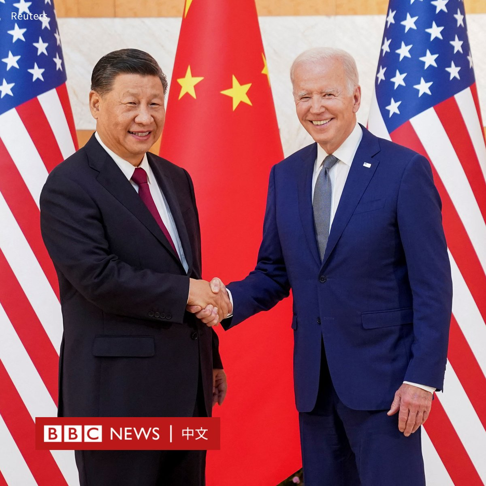

D英国广播公司BBC 北京时间 2023-11-11T14:54:58Z 1723232833878008256 【一周热点回顾】自缅北华人武装发起军事行动以来，缅甸军政府遭受2021年2月政变以来最沉重的挫败。在短短几天之内，军政府失去了对接壤中国边境地区的大部分控制权。https://t.co/hsJpCJhxgz   D英国广播公司BBC 北京时间 2023-11-11T12:20:03Z 1723193848187232516 【一周热点回顾】BBC国际事务编辑鲍文（Jeremy Bowen）报道说，避免更多战争的唯一可能就是建立与以色列毗邻的巴勒斯坦国，但在目前双方领导人的领导下，这似乎不可能实现。如果根深蒂固的偏见无法被打破，持续的冲突将无可避免。https://t.co/JK6JFAl75B   D英国广播公司BBC 北京时间 2023-11-11T01:15:34Z 1723026626794201499 中国和美国政府宣布，中国国家主席习近平将访问美国，与总统拜登（Joe Biden）会晤。这是时隔一年后，两国领导人再次会面。

白宫表示，拜登将在11月15日会见习近平。两人将讨论美中双边关系议题以及一系列地区和全球问题。

白宫在一份声明中说，两人还将讨论美中如何“继续负责任地管理竞争，并在双方利益一致的地方共同努力，尤其是应对影响国际社会的跨国挑战方面”。

中国外交部也证实，习近平是应拜登邀请，于11月14日至17日前往旧金山举行中美元首会晤，同时出席亚太经合组织（APEC）会议。

据美国媒体报道，习近平预计还将在峰会期间与美国商界领袖共晋晚餐。

习近平此行也是他六年来首次访问美国。2017年4月，习近平前往佛罗里达州海湖庄园，同时任总统特朗普（Donald Trump）举行中美元首会晤。   