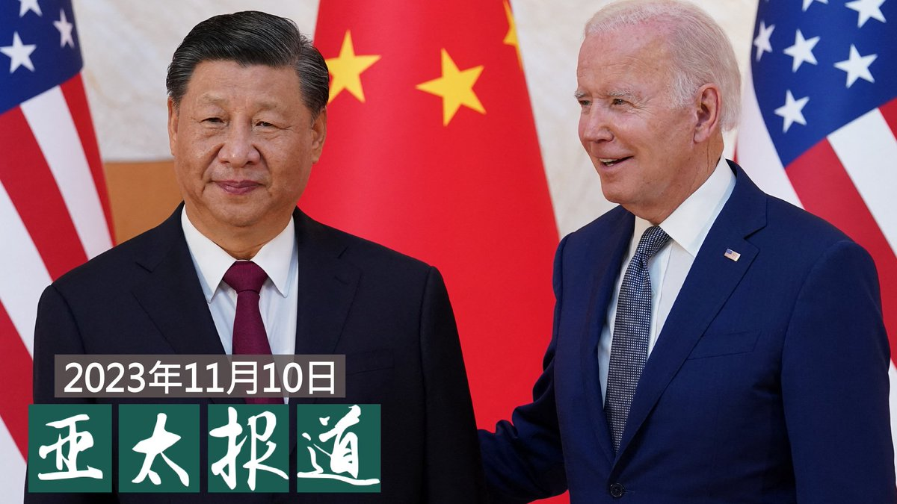
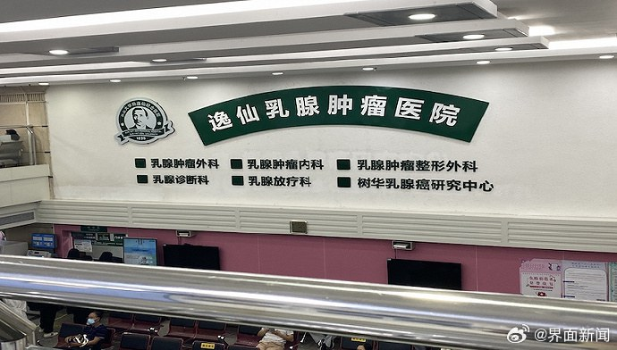

自由亚洲电台 北京时间 2023-11-11T08:24:50Z 1723134653094310370 欢迎收听和订阅播客【#亚太报道】 https://t.co/MjLNSvVMqc
中国官方“唱好”对美关系；#蔡英文 呼吁在 #亚太经合组织峰会 传递 #台湾 信息；#国资委“欢迎”民企主动参与 #国企混改； #强制寄宿 是为保障 #藏人 受教育权利吗？ https://t.co/S2p4w0u2Qb   自由亚洲电台 北京时间 2023-11-11T05:45:51Z 1723094646665183605 美国财政部长 #耶伦 周四、周五（11月9日至10日）在美国加州旧金山与中国副总理 #何立峰 进行了会晤。
 https://t.co/tUb7Q2TVIC   自由亚洲电台 北京时间 2023-11-11T03:17:15Z 1723057246488170799 本周早些时候，中文社媒上广泛流传着一则消息，称中国 #中山大学孙逸仙纪念医院 乳腺肿瘤中心实验室多名研究人员被发现患癌，引发外界震惊。
据有官方背景的大象新闻报道，医院方面对这一情况前后出现了矛盾的说法。直到周三（11月8日），医院才出面证实，该实验室有三名人员患癌，其中2名现为该院乳腺外科医生，在临床工作；另外1名不是该院职工或学生，为外地来院进修人员。
报道指出，外界有人质疑患癌与实验室的试剂有关。但医院方面说，该实验室严格按照标准运作，所有实验室工作人员都接受过安全培训。医院又强调，鉴于个体癌症发生的诱因极其复杂，欢迎第三方机构进行评估调查。   自由亚洲电台 北京时间 2023-11-11T04:15:00Z 1723071780167061999 专栏 | #夜话中南海：#二十届三中全会 迟迟不开，是因为经济还是人事？
https://t.co/cTrfEW68Hm https://t.co/qkw7O7dNxO   自由亚洲电台 北京时间 2023-11-11T00:38:49Z 1723017377242390943 中国国资委宣佈 #国企改革 三年行动圆满收官不到10个月，近日再提出国企发展的新方向，欢迎 #民企 主动参与国企混改，改变了过往由国企主动进入民企混改的做法。新的方向对目前已疲弱的民营经济会带来机遇或是冲击？

 https://t.co/HN2yg2DdEI   自由亚洲电台 北京时间 2023-11-11T00:09:31Z 1723010002552754467 本周五，中国国务院新闻办公室发表有关 #西藏治理政策 的白皮书，强调“#治边先稳藏”，严厉打击各种分裂破坏活动。白皮书还针对 #藏族儿童 被当局强制送往寄宿学校的问题，进行了辩护。

 https://t.co/qmpfkWgF31   