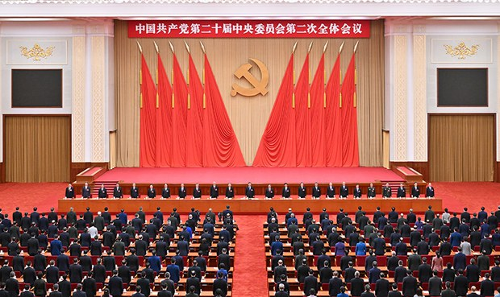

自由亚洲电台 北京时间 2023-11-11T04:15:00Z 1723071780167061999 专栏 | #夜话中南海：#二十届三中全会 迟迟不开，是因为经济还是人事？
https://t.co/cTrfEW68Hm https://t.co/qkw7O7dNxO   自由亚洲电台 北京时间 2023-11-11T00:38:49Z 1723017377242390943 中国国资委宣佈 #国企改革 三年行动圆满收官不到10个月，近日再提出国企发展的新方向，欢迎 #民企 主动参与国企混改，改变了过往由国企主动进入民企混改的做法。新的方向对目前已疲弱的民营经济会带来机遇或是冲击？

 https://t.co/HN2yg2DdEI   自由亚洲电台 北京时间 2023-11-11T00:09:31Z 1723010002552754467 本周五，中国国务院新闻办公室发表有关 #西藏治理政策 的白皮书，强调“#治边先稳藏”，严厉打击各种分裂破坏活动。白皮书还针对 #藏族儿童 被当局强制送往寄宿学校的问题，进行了辩护。

 https://t.co/qmpfkWgF31   