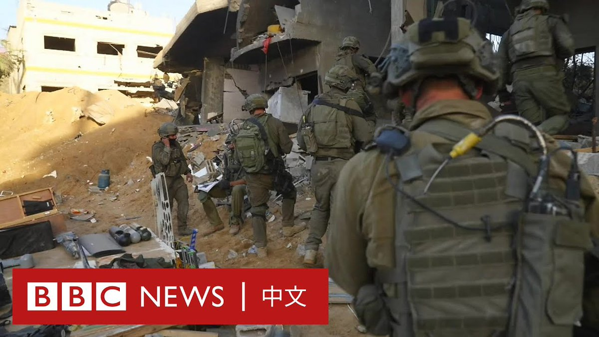

D英国广播公司BBC 北京时间 2023-11-10T08:59:46Z 1722781056833884567 【特别报导：BBC记者跟随以色列军队进入加沙】

在以色列称其已控制加沙地带北部后，BBC国际事务编辑杰里米·鲍文（Jeremy Bowen）随以色列国防军进入加沙。

他看到一片断壁残垣，几乎目光所及之处都沦为瓦砾。以色列国防军展示了他们所称的哈马斯以民宅作为掩护的武器工厂。

虽然BBC对本报导有编辑控制权，但以色列军方要求查看跟随他们拍摄的画面。   