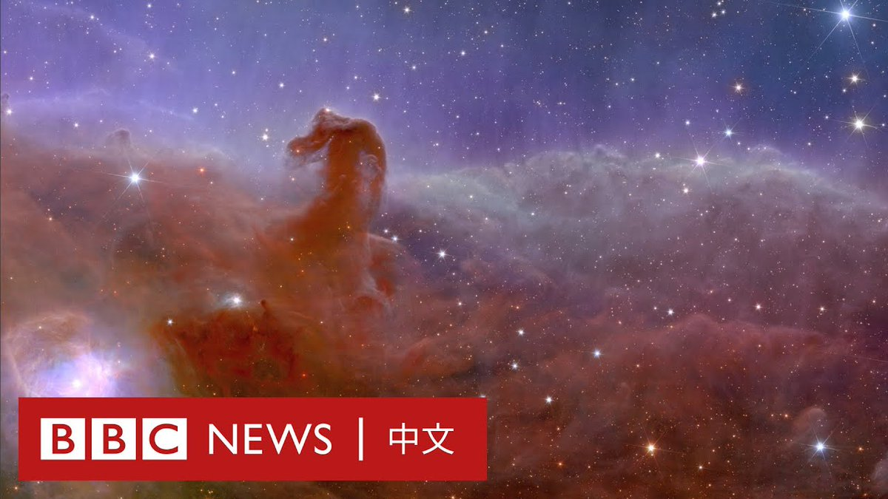
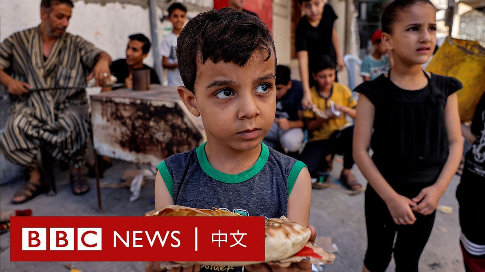
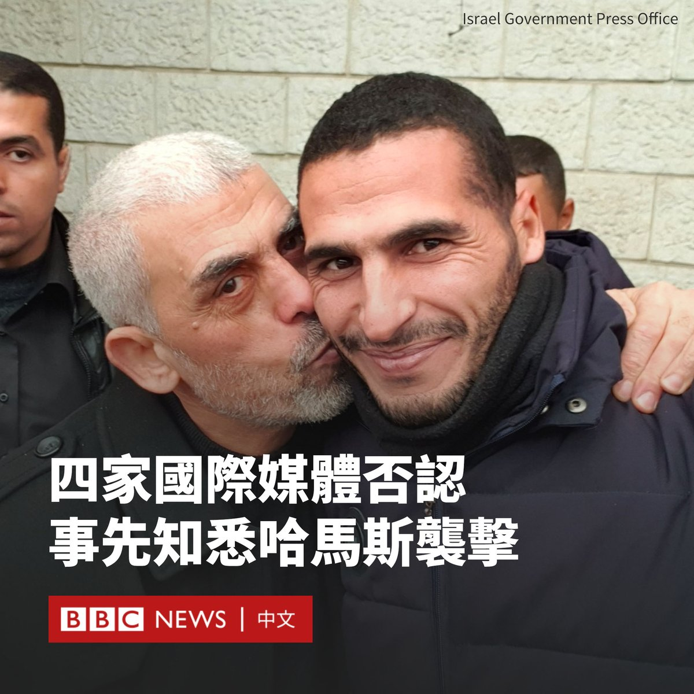
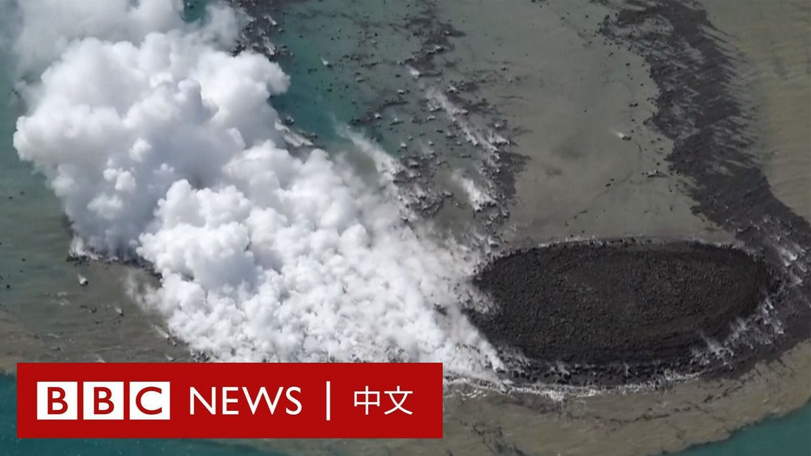
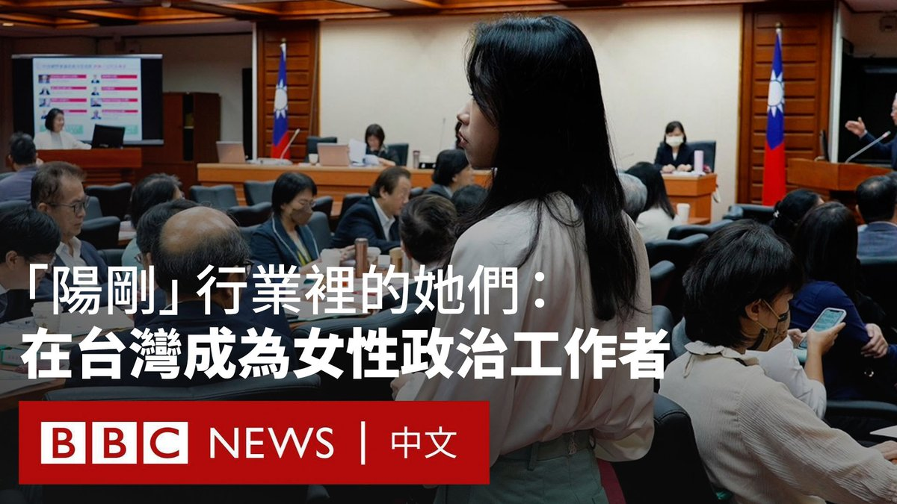

D英国广播公司BBC 北京时间 2023-11-10T20:00:02Z 1722947220335448209 2023年7月甫发射升空的欧几里得（Euclid）太空望远镜带回了首批影像。这项由欧洲太空总署主导的计划是为了探究“暗物质”与“暗能量”，这两者虽存在于大部分宇宙，但人类对它们了解甚少。 https://t.co/nz3KuxWNhS   D英国广播公司BBC 北京时间 2023-11-10T14:36:12Z 1722865722051965381 加沙地带遭到战火蹂躏，许多儿童成为受害者。联合国秘书长古特雷斯（António Guterres）本周警告，加沙正在变成“儿童的墓地”。

BBC记者在加沙记录了这场战争对儿童的影响。在炮火之下，很多孩子仍在努力搭起自己的世界。有女童表示，她的妈妈要她和兄弟姐妹们“彼此拥抱、牵着彼此的手”。 https://t.co/ynOIjMnQrp   D英国广播公司BBC 北京时间 2023-11-10T18:17:19Z 1722921371339227512 在以色列政府抨击四家国际媒体与加沙自由记者的合作后，这些媒体机构均否认事先知晓哈马斯将发动袭击。

以色列通讯部长什洛莫·卡希（Shlomo Karhi）此前告诉路透社、美联社、《纽约时报》和CNN，“你们组织中的个人……事先知道这些可怕的行为”。

路透社、美联社、CNN和《纽约时报》均否认对袭击事先知情，并称没有事先安排任何记者以提供照片。

《纽约时报》称这些指控“不真实且令人愤慨”。该报在一份声明中表示：“做出这样的指控是鲁莽的，其将我们在以色列和加沙的记者置于危险之中。”

“袭击发生时，没有美联社员工在边境，也没有任何美联社员工在任何时候越过边境。”美联社在一份声明中说。

路透社也反驳称，路透社发布的照片“是在以色列称有枪手越过边境超过45分钟后拍摄的”，该社此前与这两名加沙自由摄影师无关，不存在“在哈马斯内部安插记者”的情况。

此前，亲以色列媒体监督组织“诚实报道”（Honest Reporting）发文称，驻加沙的摄影记者在袭击发生的当天早上出现在边境地区，引发“严重的道德问题”，并暗示其可能与哈马斯“相协调”。

以色列战时内阁成员本尼·甘茨（Benny Gantz）表示，如果查实这些记者事先知道10月7日的袭击，他们应该被视为恐怖分子。

此外，“诚实报道”还指控，一位名为哈桑·埃斯拉亚（Hassan Eslaiah）的加沙自由摄影师为美联社和CNN工作，而有照片显示他曾与加沙哈马斯领导人叶海亚·辛瓦尔（Yahya Sinwar）亲密合影。

CNN与美联社表示，已经停止与该摄影师的合作。   D英国广播公司BBC 北京时间 2023-11-10T16:04:46Z 1722888011829194929 日本近海一座海底火山10月下旬开始喷发，让人们捕捉到一座新小岛形成的罕见景象。

日本气象厅的分析师表示，在11月初，这座由火山灰和岩石堆积而成的岛屿直径约为100米，高出海面20米。 https://t.co/9LzRr72C2E   D英国广播公司BBC 北京时间 2023-11-10T12:53:22Z 1722839845096305030 “这个行业非常的阳刚。”

在 #MeToo📷 浪潮席卷台湾政治圈后，当地女性政治工作者的经历走进大众视野。

随着2024台湾大选接近，各候选人与团队的竞选活动正如火如荼进行，而在媒体聚光灯背后的女性政治工作者面临着怎样的处境？

BBC中文以三位不同岗位、世代和政党的政治圈女性为切片，带你走近她们的生活。

▶️观看影片：https://t.co/MO6BDW3qro   D英国广播公司BBC 北京时间 2023-11-10T11:25:30Z 1722817731974615117 随着巴勒斯坦人死亡人数持续攀升，一些国际人权组织指责以色列对加沙人民犯下了战争罪。以色列则表示自己有权自卫并摧毁哈马斯。https://t.co/xgW1pQADIX   D英国广播公司BBC 北京时间 2023-11-10T08:59:46Z 1722781056833884567 【特别报导：BBC记者跟随以色列军队进入加沙】

在以色列称其已控制加沙地带北部后，BBC国际事务编辑杰里米·鲍文（Jeremy Bowen）随以色列国防军进入加沙。

他看到一片断壁残垣，几乎目光所及之处都沦为瓦砾。以色列国防军展示了他们所称的哈马斯以民宅作为掩护的武器工厂。

虽然BBC对本报导有编辑控制权，但以色列军方要求查看跟随他们拍摄的画面。   