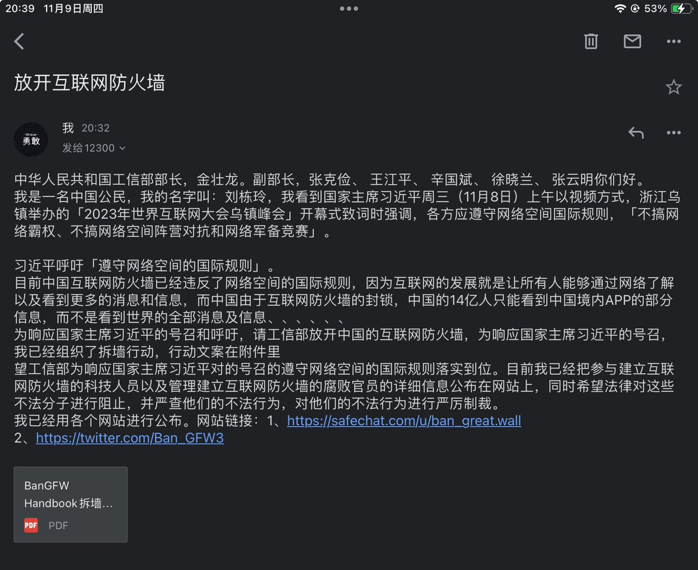

拆墙运动公号 北京时间 2023-11-10T04:20:00Z 1722710651565474263 #拆墙运动 针对习近平周三（11月8日）上午以视频方式，在浙江乌镇举办的「2023年世界互联网大会乌镇峰会」开幕式的致辞已经给中国工信部实名发送邮件，
邮件内容：中华人民共和国工信部部长，金壮龙。副部长，张克俭、 王江平、 辛国斌、 徐晓兰、 张云明你们好。
我是一名中国公民，我的名字叫：刘栋玲，我看到国家主席习近平周三（11月8日）上午以视频方式，浙江乌镇举办的「2023年世界互联网大会乌镇峰会」开幕式致词时强调，各方应遵守网络空间国际规则，「不搞网络霸权、不搞网络空间阵营对抗和网络军备竞赛」。

习近平呼吁「遵守网络空间的国际规则」。
目前中国互联网防火墙已经违反了网络空间的国际规则，因为互联网的发展就是让所有人能够通过网络了解以及看到更多的消息和信息，而中国由于互联网防火墙的封锁，中国的14亿人只能看到中国境内APP的部分信息，而不是看到世界的全部消息及信息、、、、、、
为响应国家主席习近平的号召和呼吁，请工信部放开中国的互联网防火墙，为响应国家主席习近平的号召，我们已经组织了拆墙行动，行动文案在附件里
望工信部为响应国家主席习近平对的号召的遵守网络空间的国际规则落实到位。目前我们已经把参与建立互联网防火墙的科技人员以及管理建立互联网防火墙的腐败官员的详细信息公布在网站上，同时希望法律对这些不法分子进行阻止，并严查他们的不法行为，对他们的不法行为进行严厉制裁。
我已经用各个网站进行公布。网站链接：1、https://t.co/QVIpSvBisF
2、https://t.co/EVfkhsi1B7

#拆墙运动 #BanGFW   