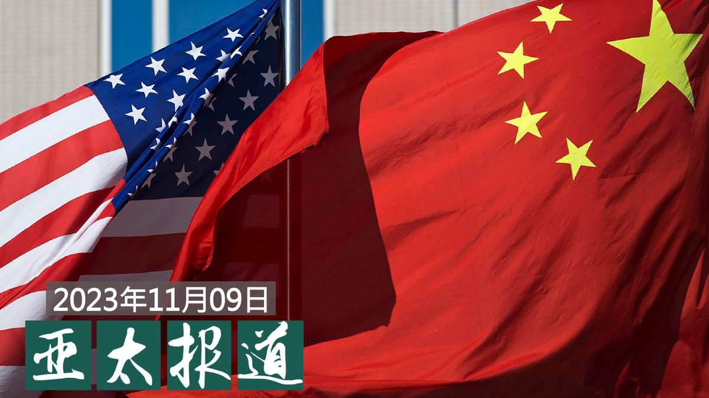

自由亚洲电台 北京时间 2023-11-10T06:32:00Z 1722743870746980646 【下周旧金山会很热闹！】
#习近平 将于下周前往旧金山参加 #亚太经合组织峰会，这是他自2017年以来首次访问美国。
不仅有在美中国访民表示会拦截其车队“喊冤”，多个人权组织及国会议员也纷纷敦促美国政府，在 #人权 议题上向习近平施压。 https://t.co/rcABQTfSF9   自由亚洲电台 北京时间 2023-11-10T06:42:51Z 1722746602824315092 专栏 | #财经时时听：中国出现25年来首度 #外国直接投资 赤字

 https://t.co/xTh7OFNvKm   自由亚洲电台 北京时间 2023-11-10T07:48:27Z 1722763111336227326 RT @RFA_Chinese: 11月9日晚，在搭乘了19小时的航班后，旅居华盛顿的大熊猫美香、添添、小奇迹抵达成都。评论指出，中国要求美国归还大熊猫反映美中关系整体恶化的现状，或象征中美“熊猫外交”的时代的结束。 https://t.co/NYvHHL2RvH   自由亚洲电台 北京时间 2023-11-10T08:00:07Z 1722766047726666076 欢迎收听和订阅播客【亚太报道】 https://t.co/MjLNSvVMqc
(2023-11-9) 海外舆论聚焦“#拜习会”与 #中国人权 状况；美中军事交流再成热点；中国十月份 #物价指数 下滑；江苏、安徽、湖北等多地重启 #国道收费；湖北襄阳一医院被曝 #贩卖出生证明。 https://t.co/EXYXP4H4QJ   自由亚洲电台 北京时间 2023-11-10T06:17:24Z 1722740195664216452 自今日起，#中美定期直飞客运航班 再次增加，从目前的每周48班增加到每周70班，双方航空公司每周各运营35班。

 https://t.co/JD61Qz8JFA   自由亚洲电台 北京时间 2023-11-10T02:42:39Z 1722686153214828951 来自英、美、加、澳等国的十位天主教领袖近日联署，促请港府释放本身是天主教徒的香港传媒大亨 #黎智英。英国人权组织"香港监察" @hk_watch 亦发布首份 #香港宗教及信仰自由报告，揭示香港宗教界人士如何被迫自我审查以及北京进一步在港推行 #宗教中国化 的情况。

 https://t.co/P03biQKTbp   自由亚洲电台 北京时间 2023-11-10T03:16:15Z 1722694608705163688 在暗访视频中，#叶有芝 说：“就是你在这儿生的孩子，一模一样的，这是真真实实的。办入院、办出院，然后三网（出生证明网、防疫网、分娩网）都有。你要找我，真的是太对了。”
【襄阳一医院院长涉 #贩卖出生证明 背后有怎样的产业？】
 https://t.co/YY6grXeQMP   自由亚洲电台 北京时间 2023-11-10T04:03:49Z 1722706580922327289 因有投诉指知名国际服装品牌 #飒拉(#Zara) 涉嫌从中国 #维吾尔强迫劳动 中获利，加拿大政府宣布对加拿大飒拉公司(Zara Canada Inc.)启动调查。
之前有拉夫劳伦(Ralph Lauren)、耐克(NIKE)、沃尔玛(Walmart)和王朝金矿(Dynasty Gold)等企业都遭到调查。

 https://t.co/jN8YDKYPBS   自由亚洲电台 北京时间 2023-11-10T00:36:01Z 1722654284637208755 官方数据显示，#中国消费价格指数 在历经两个月企稳后十月份再度下滑，而 #工业生产者出厂价格 (PPI)指数已连续十三个月下降。中国经济重新陷入 #通缩 阴影。

 https://t.co/pvc2RK5wjY   自由亚洲电台 北京时间 2023-11-10T01:41:00Z 1722670638811517360 从2000年开始就旅居美国华盛顿的大熊猫 #美香（25岁）和 #添添（26岁），还有在华盛顿出生的熊猫“#小奇迹”。11月8日乘机从华盛顿起飞，现已抵达中国成都。
#美香一家抵达成都# 上了微博热搜。 https://t.co/41yOOgfPwL   