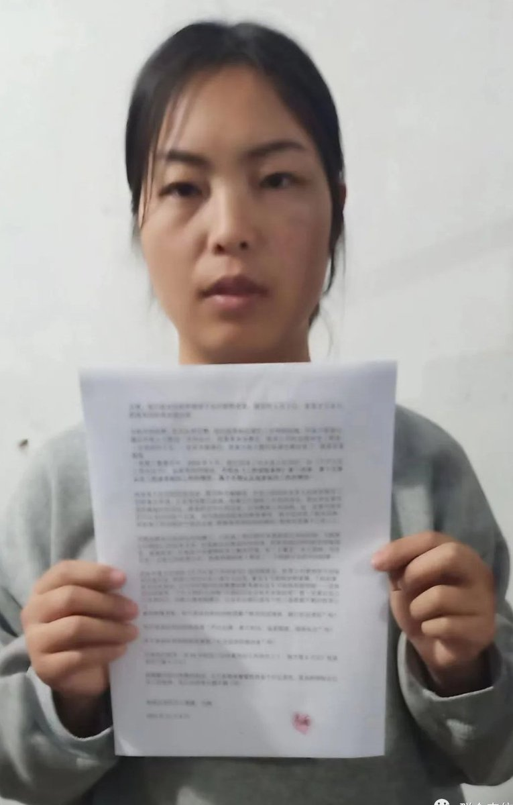
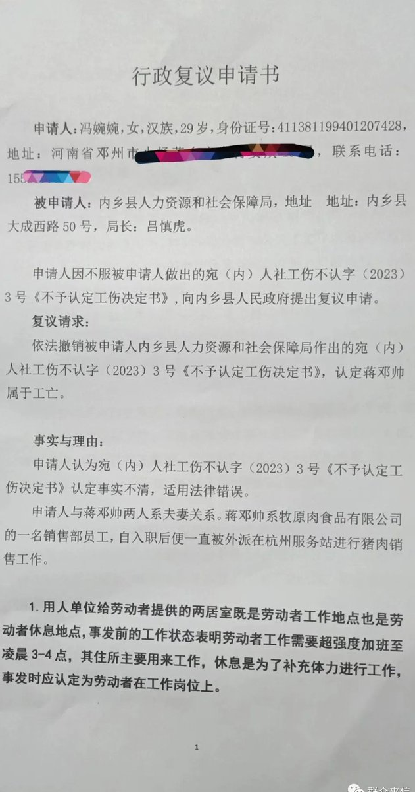
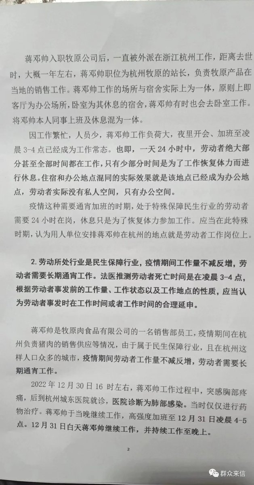

谁将十万横扫三江 北京时间 2023-11-10T10:57:46Z 1722810751243747501 讲点有用的。枫桥经验，恐怕要全面推广了。虽然一直讲要推广，但这一次，可能会有制度化流程化的东西。城区也有可能借鉴。会有很细的一些东西出现。会改变很多基层工作人员的工作路径和工作内容。

目标：“群众零上访、干部零违纪、百姓零刑事、人民零邪教”。

状态：“小事不出村（社区）、大事不出镇（街道）、矛盾不上交”。

原则：加强党建，充分发动群众、组织群众、依靠群众，解决群众自己的事情。

手段：政治、自治、德治、法治、智治。

商业机会：社区、基层和民企党建，物业公司转型，律师事务所下沉，特色APP开发。

其它机会：参与过扶贫攻坚、基层治理、工业一线的，机会将很大。

【网评】一定会越来越好，实现四个零

【网评】刚才有人提问这个问题，看这条吧

【网评】这两天补学了上世纪六十年代发明创造的枫桥经验史……很强大。

【网评】爱因斯坦的时光理论有可能是真的。 source (https://t.co/DalYEKTAJT)   谁将十万横扫三江 北京时间 2023-11-10T08:43:18Z 1722776912706371951 网友投稿：家人在上市公司牧原工伤死亡一条命只值五万

我叫冯婉婉，29岁，是河南南阳的一名中学女教师。
我怀里的宝宝才刚一岁。但是他已经没有了爸爸，我也早早失去了丈夫。
我的丈夫蒋邓帅，生前是大名鼎鼎的世界五百强企业、河南首富南阳牧原公司的一名员工。
2023年新年第一天，才33岁的蒋邓帅死在了自己工作岗位上。但是一直到现在，牧原不仅没有给我们最基本的抚恤，而且还以常人根本不能想象的冷血，一遍一遍往我们孤儿寡母的心口捅刀子。我已经濒临崩溃，再也不能忍受它的欺凌。一定要公开揭露这个自称“敬天爱人”、“践行社会责任”，其实是吃人不吐骨头的资本丧尸！
蒋邓帅是2022年1月18日正式签合同入职牧原的。他的具体岗位，是在牧原肉食品有限公司杭州服务站销售部。从上班第一天开始，到最终死在杭州，将近一年时间里，他只回过家三次。
第一次，是我们结婚。
第二次，是我们的孩子出生。
第三次，是把他的骨灰盒抱回家……
这不是他职务有多高、挣钱有多少，而是他整天都在加班、加班、加班……一直到死的那一天，仍然在为牧原拼命加班！
牧原属于民生保障行业，蒋邓帅作为其派驻杭州的销售部员工，正是负责牧原猪肉在杭州的销售供应，加班工作本来就是常态。别说是在杭州了，就连我生孩子时、他休假回家那几天，也是不停地接电话打电话，一天到晚都是处理工作上的事！在家其实跟工作中一个样，休假完全就是居家办公。所以疫情期间的工作量更是可想而知，不减反增，经常是通宵达旦——梳理蒋邓帅生前三天的工作记录，全是这样：
2022年12月30日下午16点左右，正在工作中的蒋邓帅因胸部持续疼痛，到杭州城东医院就诊。病历显示，17点48分医院诊断为肺部感染，开药后返回服务站。
虽然医院诊断没有明确写明“新冠肺炎感染”，但如果是在头几天“动态清零”的时候，蒋邓帅这种情况肯定是要被隔离的，不想休息也得休息。当然当时我们国家的疫情防控已经放开了，不需要再强制隔离。但是这种病最常规的处理，还是应该休息治疗吧？——但是蒋邓帅没有。第二天白天一整天，他没有得到公司安排的任何休息，仍然在带病坚持工作。
当天晚上，他又和同事们加班开会，令人难以置信的是，甚至开会开到了凌晨4、5点！跟家人的微信记录显示，至少在凌晨3点41分的时候，他的领导还在讲话，他给家属连发两个泪流满面的表情，抱怨“四点了啊”、领导还不让睡觉！2022年12月31日白天，“肺部感染”的蒋邓帅继续这种高强度的工作，“进行系统报单，处理客户问题和解决产品售后情况以及跟进客户付款进度等，完成日常工作”。
单位所在地、杭州市上城区湘江公寓镜心苑的物业监控显示，一直到当晚19：14，在外奔波一天的蒋邓帅才与同事一起回到办公住宿地。
他的办公室就是宿舍。2023年1月1日早上9点左右，同事发现他昏迷在宿舍，遂打120。120当时就认为人已经不行了，但还是拉到医院后宣布死亡。
蒋邓帅才33岁，平常身体健康，根本没有任何基础病。突发死亡的原因，只能是感染新冠肺炎后没有得到及时救治和休息，持续高强度工作所致。
当天上午十点，牧原公司给家属打电话通知了这个噩耗。我抱着当时才五六个月的孩子，跟公公婆婆一起赶到杭州。在殡仪馆里，见到了已成为一具冰冷尸体的丈夫。
冰冷的现实难以接受，但也必须得接受。我们含痛忍悲，整理蒋邓帅的遗物，为他料理后事。
牧原公司从南阳总部派去了一位律师黄俊威，和杭州服务站的站长常红林一起，帮我们处理后事。现在想想，他们的主要任务，其实就是代表公司做我们的工作。两个人轮番劝说人死不能复生，唯一现实的，就是给孩子多争取点抚恤金，让孩子的未来尽可能有个保障，也才能让蒋邓帅死得瞑目。
他们说，蒋邓帅的情况符合工伤死亡的条件。他们牧原给职工缴纳的工伤保险在内乡县是最齐全的，缴税也最多，跟人社局以及内乡县政府各个部门的关系保持得最好。人社局对他们也都一向很照顾，办什么事都很畅通。所以他们按照工伤死亡向人社局申报，能很快为家属争取到150万的工亡抚恤待遇。说这是蒋邓帅用自己的一条命为孩子争取到的抚养金，劝我们为了孩子也要配合公司的工作。尽快把遗体火化，带回老家入土为安。
他们要求我们，“对相关信息严格保密，保证不向任何第三方告知”，“不在任何场合以任何方式（包括但不限于媒体、杂志、网络）发表该事件言论”。
在当时那种情况下，我早就如失魂魄，心神恍惚。只知道抱着孩子恸哭，全是公公婆婆在给他们沟通。而公公婆婆又都是从农村出来的普通人，根本不懂得相关法律，更不知道怎样保护自己的权益，就在他们连哄带劝之下，跟律师签了一份手写的协议。
当时疫情防控刚放开，连殡仪馆火化都得排队。孩子才几个月，在杭州也确实不方便。他们就安排我带着孩子先回新野老家，随后到1月7日，家里才又去人，把蒋邓帅的骨灰接回家。
从杭州到新野，从火化到安葬，他们没有给过我们一分钱的抚恤。只说尽管放心，随后申报之后都会一次性给付。但是骨灰安葬后，牧原公司的态度却有了转变。一会说材料不全，一会说手续难办，原来大包大揽的承诺全都没有了，就是反复推拖。
一直推了整整半年，2023年7月，他们送来了内乡县人社局的一份《不予认定工伤决定书》。说蒋邓帅的情况，不符合《工伤保险条例》第十四条、第十五条认定工伤或者视同工伤的情形，属于不得认定或者视同工伤的情形……
内乡县人社局的这份决定，我当然不能接受，并且已经向内乡县人民政府提交了行政复议申请，正在等待复议结果。如果它们维持人社局的决定，我也肯定要向法院提起行政诉讼。就是把官司打到北京、打到最高人民法院，也一定要为我死去的丈夫讨回这个公道。因为我前面叙述的都是事实，我不仅研究了相关法律，也咨询了劳动保护方面的专家，根据蒋邓帅的实际情况，他肯定是属于工伤工亡。
当然这都是行政诉讼的范畴了，已经成了我们和内乡县政府之间的纠纷，与牧原公司貌似已经没有关系。但是我在此想说的恰恰是，所有形成这种纠纷的罪魁祸首，就是牧原！正是这个活着榨取员工剩余价值，死了又毫无一点人情味，完全不负一点责任的牧原公司，把我和我的家人推进了一个肉眼可见的司法泥潭！
在内乡县人社局的《不予认定工伤决定书》送到我家后，牧原公司竟然恬不知耻地对我们说，牧原公司可以从人道主义出发，拿出5万块钱安慰家属、了结此事，甚至还有脸说，公司当时垫付的丧葬费还要考虑从这5万块钱里面扣除……这他妈的到底是一个什么样的企业啊！万恶的旧社会也无非如此吧？我一定要以自己的亲身经历、切肤之痛来揭露它，让全社会都知道这个吃人连渣都不剩的牧原公司！
秦英林秦老板，你不是说你和你的牧原要“担当历史使命，践行社会责任”吗？
你不是说你和你的牧原要“严以自律、勇于担当、追求极致、服务社会”吗？
你不是说你和你的牧原要做“社会进步的推动者”吗？
可是你们牧原一名33岁的员工活活累死在工作岗位上了，他才值5万元？他甚至还不值5万元？
我要撕开你们伪善的面皮，让大家都来看看牧原是个什么货色，是怎样榨取自己员工血肉、吃人吃到骨头都不剩！又是怎样耍弄卑鄙无耻的手段、欺负员工的孤儿寡母的！牧原过劳死员工遗属 冯婉婉
2023年11月9日   谁将十万横扫三江 北京时间 2023-11-10T09:13:55Z 1722784618196463864 RT @xxLilHy: 希拉里真的 太有魅力了 这段讲话中 我甚至能看见她身上散发出的强大的女性力量的光辉 是一种来自温柔的理性的力量
 https://t.co/oqSBEuV2Ns   