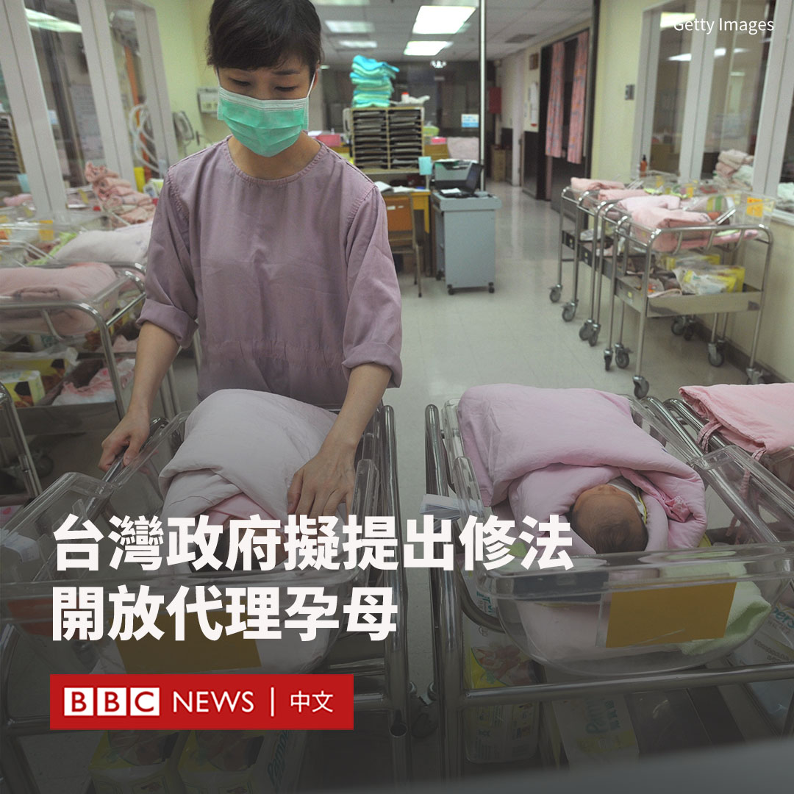
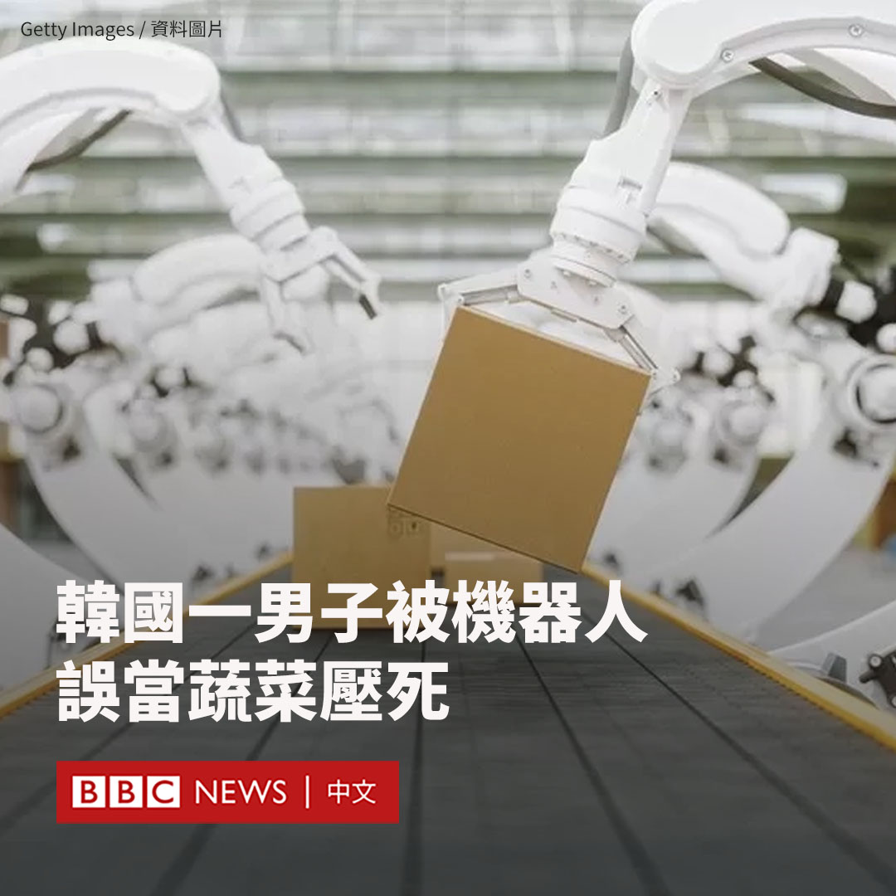

D英国广播公司BBC 北京时间 2023-11-09T18:51:40Z 1722567625304047767 自缅北华人武装发起军事行动以来，缅甸军政府遭受2021年2月政变以来最沉重的挫败。在短短几天之内，军政府失去了对接壤中国边境地区的大部分控制权。https://t.co/EcuzKMgiPo   D英国广播公司BBC 北京时间 2023-11-09T20:14:26Z 1722588454851313764 在美国生活了23年后，两只成年大熊猫——美香和添添——以及它们三岁的幼崽小奇迹被送上一架名为“熊猫特快”的联邦快递飞机，在19个小时的飞行后返回中国。 https://t.co/yiL4bJvxAg   D英国广播公司BBC 北京时间 2023-11-09T14:26:17Z 1722500841096069569 美国国会议员动议《香港制裁法》，引起香港亲北京政团连日到美国驻港总领馆抗议，香港保安局长形容此为“黑帮为保障走狗”的行为。https://t.co/qOq3ISi1bv   D英国广播公司BBC 北京时间 2023-11-09T17:26:24Z 1722546166947319861 台湾卫生福利部长薛瑞元周三（11月8日）表示，当局计划修法解除人工生殖技术的限制，将“代理孕母”纳入其中。

他表示，一份修正草案有望在2024年底前送至立法院决定。

目前，台湾《人工生殖法》的生育权局限于传统异性夫妻，虽然允许人工授精和试管婴儿，但对象只限不孕、重大遗传性疾病或有医学正当理由之夫妻。

这意味着尽管台湾四年前已通过同性婚姻合法化，但单身人士和同性伴侣都被拒于医院门外。

这一话题在过去近30年间曾多次引发辩论。呼吁解除该限制的人认为，其剥夺了单身者及同性伴侣的生育权。但支持限制措施的人认为，代孕恐导致子宫和婴儿被商品化。

据台湾媒体报道，官员表示，此次对于“人工生殖法”的修正草案可能将受术对象范围扩大至单身女性、同性和代理孕母。但如果立法院拒绝修订该草案，当局也会遵从民意。

与韩国、日本及中国大陆类似，台湾社会正面临日趋严重的人口危机。随着大选临近，民众党总统参选人柯文哲近日也提出松绑代孕的政策。   D英国广播公司BBC 北京时间 2023-11-09T15:34:37Z 1722518037465842008 澳大利亚连锁式零售商凯马特（Kmart）销售的一款写有“Merry HAM-MAS”字样的圣诞礼品袋在被犹太团体投诉后从网上下架。

Kmart网站上目前已删除的产品页面曾显示，这款礼品袋以圣诞食品为主题，一面印有“令火腿保持新鲜的打印指南”，另一面则以大写字母写有“Merry HAM-MAS”（圣诞火腿节快乐）的双关语。

澳大利亚犹太协会表示，由于这个礼品袋与巴勒斯坦武装组织哈马斯（Hamas）“撞词”，而哈马斯是澳大利亚和其他几个国家禁止的恐怖组织，他们“礼貌地建议”将其下架。

澳大利亚犹太协会在推特上写道：“虽然这可能有趣（犹太协会也开过一些不政治正确的玩笑），但这真的看上去不好”，并附上礼品袋的照片。

“我们怀疑某些产品经理可能会给公司带来一些尴尬。”

Kmart的母公司为事件作出道歉。大约一个小时后，该团体在更新中表示，公司的高级管理层已经与他们联系，保证将礼品袋从网站下架。

一位发言人通过声明表示：“这次我们做错了，我们毫无保留地道歉”、“设计这款产品时，我们显然没有考虑到所有的影响，该产品已被下架。”   D英国广播公司BBC 北京时间 2023-11-09T11:41:38Z 1722459405520867359 韩国庆尚南道的一名男子被机器人压死，原因是机器人把他当成需要处理的一盒蔬菜。

该男子40多岁，是一家机器人公司的员工。据韩国媒体报道，事发时，他正在农产品物流中心的分拣区对机器人的传感器进行检修。

韩联社报道称，机器臂把这名男子误当成一箱蔬菜，将其捡起并挤压，导致其脸部和胸部严重受伤。

他被送往医院，但因伤重不治身亡。

据韩联社报道，涉事机器人负责转运打包成箱的辣椒，将它们转移到托盘上。

他的一名同事随即报案并将该男子送医。警方正在调查现场安全管理负责人是否玩忽职守。   D英国广播公司BBC 北京时间 2023-11-09T08:57:50Z 1722418182177132732 中国一名自发调查拐卖儿童的民间人士实名举报一家民办医院为非法贩卖的婴儿“洗白”身份的链条，引发卫生部门介入调查。https://t.co/yRdimzrqIB   