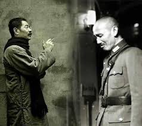

Petrichor 北京时间 2023-11-09T13:29:17Z 1722486493715873813 在中国近代文学史上，鲁迅先生曾是年轻人心中的一面旗帜，他把文学当成匕首与投枪。

鲁迅靠骂出了大名，但凡他看不惯的人和事，他都会“痛下杀手”，是有名的文学战狼。

1930年12月，兼任着教育部长的蒋介石收到密告：“教育部那个特约编辑周豫才，就是骂人的鲁迅。”

告密者的本意是想借此邀功，没想到蒋介石说：“我很高兴能与鲁迅共事。我素来很敬仰他，还想和他会会面。”

鲁迅在教育部任职时，一个月有300元现大洋的薪水，后来鲁迅在教育部的职务被免，但每月300元的现大洋还继续拿了多年。 这不能不说与蒋介石爱惜人才、尊重知识分子有关。   Petrichor 北京时间 2023-11-09T08:48:52Z 1722415926555918589 这是小学四年级的俄语教科书。

不学英语学俄语，难道让中国孩子重跟俄学习列宁闹革命吗？

上网查了一下，这些教科书2022年9月份就亮相了。

顺便看到篇网易上一个学渣写的文章：《七年级“俄语”课本走红，学生兴致满满，学渣直呼翻身机会来了！》🤣🤣🤣 https://t.co/50CWOz7McM   