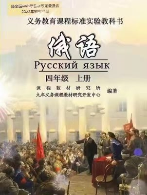
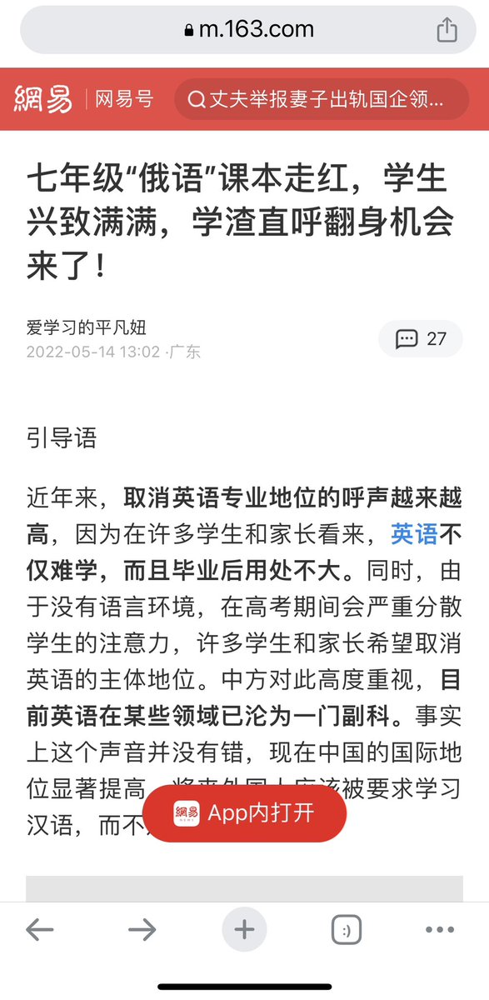

Petrichor 北京时间 2023-11-09T08:48:52Z 1722415926555918589 这是小学四年级的俄语教科书。

不学英语学俄语，难道让中国孩子重跟俄学习列宁闹革命吗？

上网查了一下，这些教科书2022年9月份就亮相了。

顺便看到篇网易上一个学渣写的文章：《七年级“俄语”课本走红，学生兴致满满，学渣直呼翻身机会来了！》🤣🤣🤣 https://t.co/50CWOz7McM   