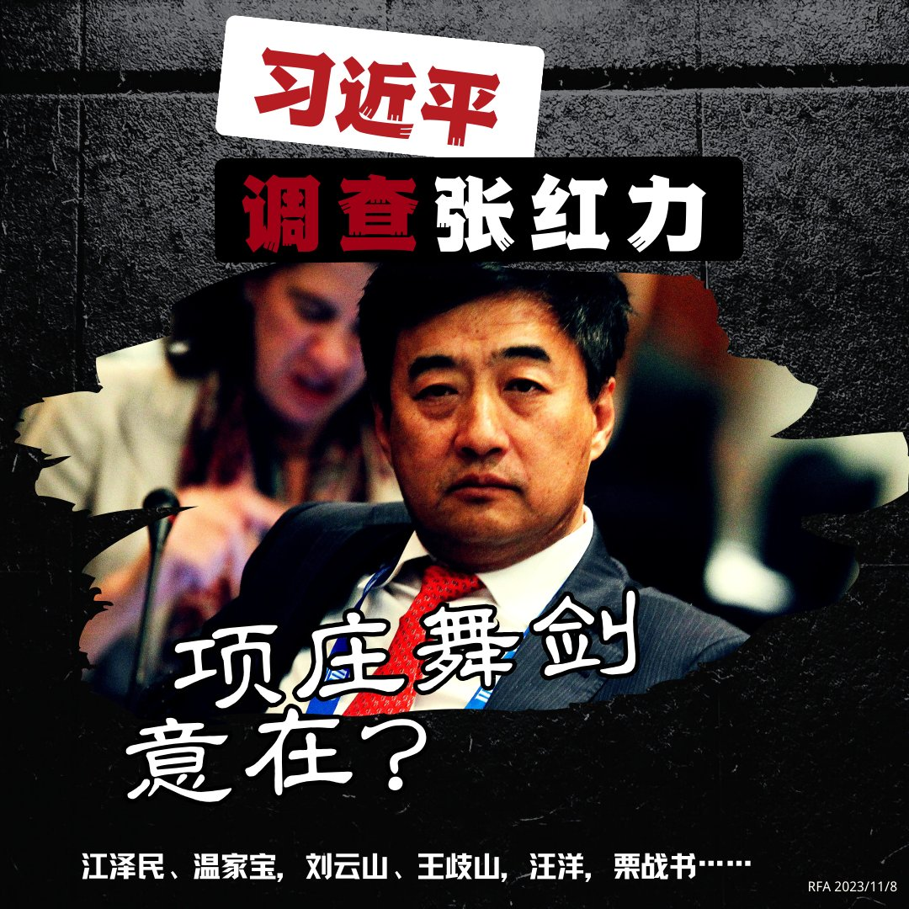
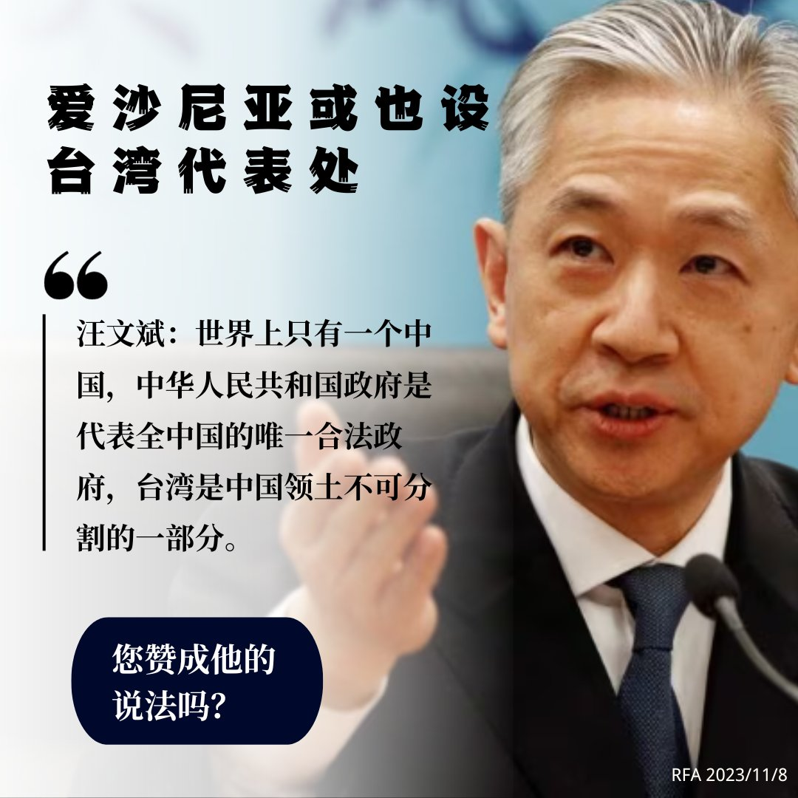
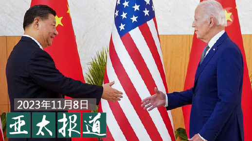

自由亚洲电台 北京时间 2023-11-09T12:01:19Z 1722464356670095817 RT @RFA_Chinese: 【#张红力 会不会是下一场政治斗争的风暴眼？】
曾经的外资投行界“打工皇帝”，后成为中国工商银行排名第一的副行长张红力，在离任五年后被中央纪委国家监委调查，“涉嫌严重违纪违法”。张红力被调查震撼中国金融圈。… https://t.co/2WRD…   自由亚洲电台 北京时间 2023-11-09T06:18:52Z 1722378179149529430 【#张红力 会不会是下一场政治斗争的风暴眼？】
曾经的外资投行界“打工皇帝”，后成为中国工商银行排名第一的副行长张红力，在离任五年后被中央纪委国家监委调查，“涉嫌严重违纪违法”。张红力被调查震撼中国金融圈。

早在2019年，《纽约时报》报道《德银中国生意经：赠送高官奢侈礼物、雇佣权贵亲属》就揭露张红力在担任德意志银行亚太区总裁时，游走于中共权贵集团，通过行贿和招聘几十名中共领导人和中国大型国企高管子女和亲戚，赢得中国业务，涉及江泽民、温家宝，刘云山、王歧山，汪洋，栗战书等。

分析人士告诉美国有线电视新闻网，调查张红力代表习近平标志性反腐败运动的扩大，以及进一步巩固其权力的努力。#您怎么看？   自由亚洲电台 北京时间 2023-11-09T06:30:01Z 1722380982156939493 专栏 | #纵横大历史： 文革系列 第六十九讲　恐怖的 #红八月（二）
 https://t.co/FHbjFNdSRo   自由亚洲电台 北京时间 2023-11-09T07:00:04Z 1722388547871940793 专栏 | #中国透视：#澳总理访华，全球期待奇迹：#杨恒均 获释
 https://t.co/imu3JIJ1yb   自由亚洲电台 北京时间 2023-11-09T08:00:12Z 1722403679674978311 https://t.co/nflBUEuFPw   自由亚洲电台 北京时间 2023-11-09T04:57:31Z 1722357704205984222 专栏 | #周末茶馆： 结婚贵结婚难？中国结婚人数为何越来越少
 https://t.co/ci2a70MdJM   自由亚洲电台 北京时间 2023-11-09T05:03:19Z 1722359163366621230 中国知名律师 #迟夙生 本周一出庭辩护时手机被法院没收，气得差点病倒。熟悉整起事件经过的人向本台透露了当时情况及可能原因。

 https://t.co/0WGgMe2pvG   自由亚洲电台 北京时间 2023-11-09T05:11:03Z 1722361112375833031 各界瞩目的"#拜习会"很可能于下周在美国旧金山登场。本周，双方正在紧锣密鼓地展开一系列谈判协商。那么这场峰会可能给美中关系带来怎样的影响？能否有任何突破？美中各自又想从中得到什么？
本台记者凯迪 @KittyWang5 有详细报道 

 https://t.co/wA4x1mDFBt   自由亚洲电台 北京时间 2023-11-09T05:31:36Z 1722366282677489767 #事实查核 | 美国政府正应国会报告要求扩充 #核武 吗？
 https://t.co/JNC5yc72XY   自由亚洲电台 北京时间 2023-11-09T05:33:55Z 1722366865660612830 专栏 | #网络博弈：《当人们纪念 #李克强 总理时到底在纪念什么》有何敏感？
 https://t.co/5PK8zDZ6oD   自由亚洲电台 北京时间 2023-11-09T05:34:55Z 1722367119122419898 据美国新闻周刊周三（11月8日）报道，缅甸靠近中国边境地区的军事冲突可能危及中国“#一带一路”倡议在该地区价值数十亿美元的项目以及两国间的主要贸易通道。中国已经派遣外交部部长助理农融访问了 #缅甸，呼吁双方保持冷静。

 https://t.co/CYX7sjAgg6   自由亚洲电台 北京时间 2023-11-09T05:43:35Z 1722369300063825973 曾经的外资投行界“打工皇帝”，后成为中国工商银行排名第一的副行长张红力，在离任五年后被中央纪委国家监委调查，“涉嫌严重违纪违法”。张红力被调查震撼中国金融圈。

早在2019年，《纽约时报》报道《德银中国生意经：赠送高官奢侈礼物、雇佣权贵亲属》就揭露张红力在担任德意志银行亚太区总裁时，游走于中共权贵集团，通过行贿和招聘几十名中共领导人和中国大型国企高管子女和亲戚，赢得中国业务，涉及江泽民、温家宝，刘云山、王歧山，汪洋，栗战书等。

分析人士告诉美国有线电视新闻网，调查张红力代表习近平标志性反腐败运动的扩大，以及进一步巩固其权力的努力。#您怎么看？   自由亚洲电台 北京时间 2023-11-09T05:44:43Z 1722369584127217929 【#您怎么看】11 月 8 日，中国外交部敦促爱沙尼亚不要允许台湾在该国开设任何官方机构，据报道，中国大使威胁说，如果台湾在这个波罗的海国家设立代表处，他将离开爱沙尼亚。此前，立陶宛与台湾建立台湾名称办事处，引发中国抗议至今危机未解。台湾外交部长吴钊燮本周将访问爱沙尼亚、立陶宛和拉脱维亚这三个波罗的海国家。台湾已在拉脱维亚和立陶宛设有代表处。   自由亚洲电台 北京时间 2023-11-09T06:04:51Z 1722374650402124014 据路透社报道，英国名校 #德威国际学校（DCI）正在出售其在亚洲的分校，其中有9家在中国，占比最大。
英国顶级私校 #哈罗中学 及 #威斯敏斯特公学 已在2021年退出中国大陆市场。 https://t.co/q38HseZxgL   自由亚洲电台 北京时间 2023-11-09T06:15:21Z 1722377291597238324 欢迎收听和订阅播客【#亚太报道】 https://t.co/MjLNSvVMqc
#拜习会 即将登场，#美中关系 能 “止跌企稳”吗 ？#中国增持黄金 减 #美元储备；#记者节：中国记者还有多少生存空间？湖南异议人士 #郭闽 抵达美国；黑龙江律师 #迟夙生 手机无理被扣突发疾病 https://t.co/8Jyp8Yho4L   自由亚洲电台 北京时间 2023-11-09T00:55:10Z 1722296715661951446 湖南异议人士 #郭闽 近期抵达美国。郭闽向本台透露，他曾多次被中国边检人员禁止出境，理由是"可能危害国家安全"。
另据株洲人士披露，自今年初以来，已有十多位异议人士流亡美国。

 https://t.co/JJ8vbQG6ma   自由亚洲电台 北京时间 2023-11-09T01:09:59Z 1722300446352847064 台湾面对中国军事威胁，美国前副国安顾问 #博明（Matt Pottinger）认为，战争往往肇因于侵略者的过度乐观，#台湾 应与民主阵营结盟共同防御，削弱中国对台发动战争的自信，可减低 #台海危机。博明还呼吁日本在是否协防台湾上作出表态。

 https://t.co/XLLRxlVp02   自由亚洲电台 北京时间 2023-11-09T01:24:50Z 1722304180293923317 RT @RFA_Chinese: #事实查核｜美军高级军官在 #加沙 地带被狙击身亡？ https://t.co/1MWxJTvrpb   自由亚洲电台 北京时间 2023-11-09T02:26:02Z 1722319582231482816 #碧桂园 股价一度大涨　#中国平安 真的要收购控股权？
 https://t.co/DMdtZOgxBX   自由亚洲电台 北京时间 2023-11-09T03:16:21Z 1722332245997015112 11月8日又是一年 #记者节。在中国社媒平台微博上，“揭露 #三鹿毒奶粉 的记者怎么样了”这一词条获得极大热度。有微博网友表示，“如果英雄得不到保护，正义终将破灭”。还有网友说：“虚假报道的记者依然如故，理想已经崩塌太久，记者队伍急需雷霆监督。” https://t.co/UBuuA8vniv   自由亚洲电台 北京时间 2023-11-09T04:02:18Z 1722343809957466148 评论 | #陈破空：#李克强 突然离世，悼念潮引人沉思
 https://t.co/citidafHeY   自由亚洲电台 北京时间 2023-11-09T01:31:54Z 1722305960176435273 据彭博社报道，知情人士透露，美国总统拜登上周被告知，中国军方上个月与 #阿曼 官员讨论了在阿曼设立军事基地的事项，后者表示愿意接受相关协议。双方可能在接下来的几周进一步商谈。

 https://t.co/84Sjl9knsq   