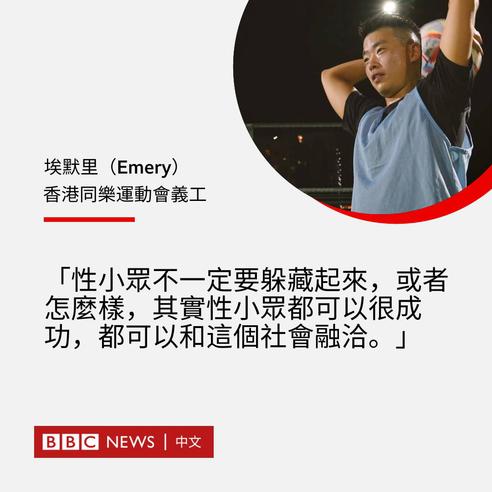
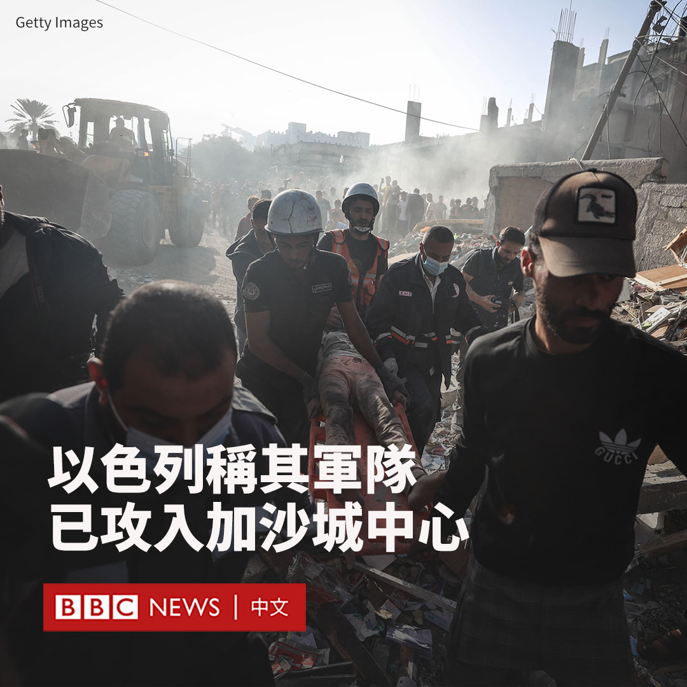
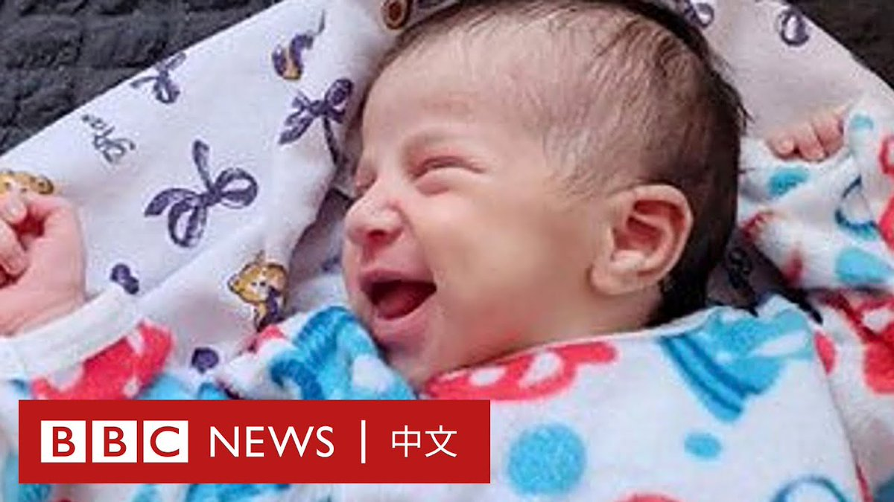
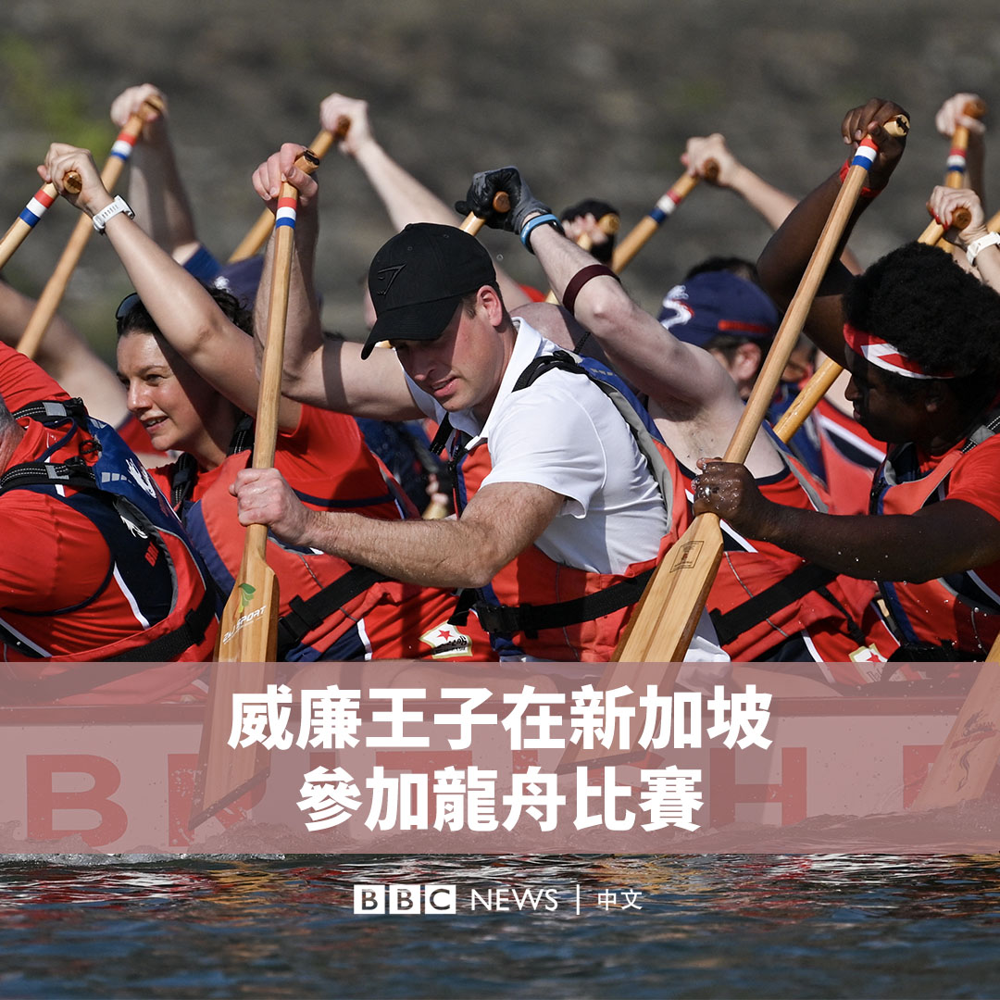
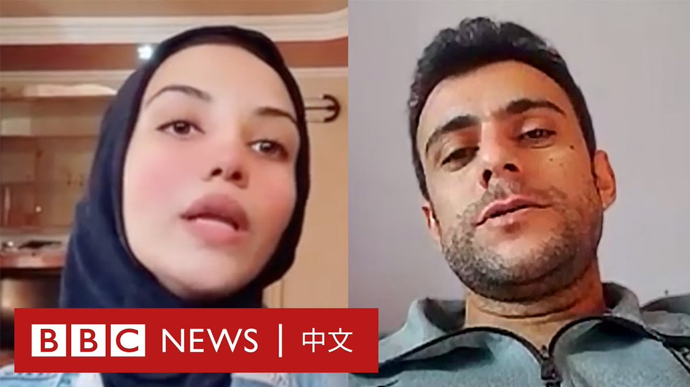

D英国广播公司BBC 北京时间 2023-11-08T20:25:45Z 1722228915551564140 第11届同乐运动会（Gay Games）正在香港举行。这是该活动开办40多年来首次落户亚洲地区。

埃默里（Emery）是同乐会的义工，他是一位热衷于运动的跨性别男性。他称，希望透过这次运动会，令性小众与社会各界连结起来。

▶️ 观看影片：https://t.co/qzQiZNaqpY https://t.co/mgAlXe12dH   D英国广播公司BBC 北京时间 2023-11-08T16:59:28Z 1722177003422699626 在哈马斯10月7日对以色列发动突袭满一个月之际，以色列国防部长约阿夫·加兰特（Yoav Gallant）表示，以军已“进入加沙城的中心地带”。

他表示，以色列士兵“在陆海空三军的全面协调下攻入加沙城”。

以色列总理内塔尼亚胡（Benjamin Netanyahu）表示，该国部队正在包围加沙城并在其“内部开展行动”。

内塔尼亚胡周一（11月6日）曾表示，以色列将在战后对加沙承担“全面安全责任”。周二（11月7日），他的一名战时内阁成员对此番言论进行了解释。

以色列战略事务部长罗恩·德梅尔（Ron Dermer）对BBC说，总理的意思是以色列将确保该飞地仍然是一个非军事区，军方将在那里开展安全行动，以打击他所称的任何新的恐怖威胁。他说以色列不会重新占领或统治该地区。

七国集团（G7）周三（11月8日）发表声明，表示支持加沙地带的人道主义暂时停火和走廊，以方便援助、平民迁移和人质释放。

但七国集团外长在声明中也提及以色列有权“根据国际法”进行自卫。

据哈马斯管理的卫生部称，加沙已有10,300多人丧生，其中包括逾4100名儿童。

美国国务院表示，目前已有400多名美国公民通过拉法口岸离开加沙进入埃及。   D英国广播公司BBC 北京时间 2023-11-08T15:29:09Z 1722154273008714202 乌克兰武装部队总司令扎卢日内（Valery Zaluzhny）的一位亲近助手在收到一份装有手榴弹的生日礼物后身亡。

39岁的根纳季·柴斯狄亚科夫少校（Gennadiy Chastiakov）带着同事送的礼物回家，他与儿子一起打开礼物时，手榴弹突然爆炸。

柴斯狄亚科夫少校被炸死，他13岁的儿子重伤。

内政部长伊戈尔·克里门科（Ihor Klymenko）表示，当柴斯狄亚科夫的儿子试图转动保险拉环时，他“从孩子手中拿过手榴弹，并拉动了拉环，造成惨烈爆炸”。

检察官后来澄清说，他在试图从儿子手中夺过手榴弹时，不小心引爆了手榴弹。

官员将这起爆炸称作一起“悲剧性的意外事件”，呼吁公众等待官方调查结果。警方表示，这起爆炸是因为不慎处理弹药而造成。

但据报导，不久后调查人员在该住宅中还发现了另五枚手榴弹。克里门科称，这些手榴弹是军队中一位同事送给他的礼物。

后来调查人员在搜查这位同事时，又发现了两枚类似手榴弹。据报导，他是一名陆军上校。

现场照片显示，住宅地板上还有其他手榴弹和礼品袋。柴斯狄亚科夫显然是将手榴弹和一瓶威士忌放在同一个袋子里，并带回家。

有乌克兰媒体报导称，他的同事曾表示： “很难给你惊喜，所以我给你手榴弹和一瓶上好的威士忌”。

扎卢日内称，该事件令乌克兰军队及他本人遭受难以言喻的痛苦和重大损失，他称自俄罗斯全面入侵以来，柴斯狄亚科夫少校一直是“可靠的肩膀”。   D英国广播公司BBC 北京时间 2023-11-08T13:19:33Z 1722121659484704860 朱玛娜是一名来自加沙的记者，以哈冲突开始时，她已经怀孕九个月，正准备迎接第二个孩子塔利亚。
 
分娩当日，朱玛娜所在医院的隔壁建筑遭到轰炸。她讲述了当日的经过：“我当时只能想着，不管在什么情况下我都要生下我的宝宝。” https://t.co/ReJSgpV94M   D英国广播公司BBC 北京时间 2023-11-08T11:14:36Z 1722090213747675151 英国威尔士亲王威廉王子（Prince William）在新加坡同英国龙骑士龙舟队一起划龙舟，并加入了一场竞赛。

他和其他19名桨手两人一组，跟随节拍，奋力划桨。

这是威廉王子时隔11年再次到访新加坡，此行的目的是出席由他发起的“为地球奋斗”环境奖（The Earthshot Prize）颁奖礼。 https://t.co/iVuwoHID2k   D英国广播公司BBC 北京时间 2023-11-08T08:56:21Z 1722055421463240934 战争开始后，加沙居民哈立德和法丽达每天记录着以色列空袭下的生活。透过影像，他们和BBC分享了这段日子的遭遇、生活挣扎以及失去亲友的心情。

因加沙南部情势恶化，法丽达在短暂离开后又搬回北部；而在10月31日的一场轰炸后，BBC便与哈立德失去了联系。 https://t.co/QY3Xuhp1B0   