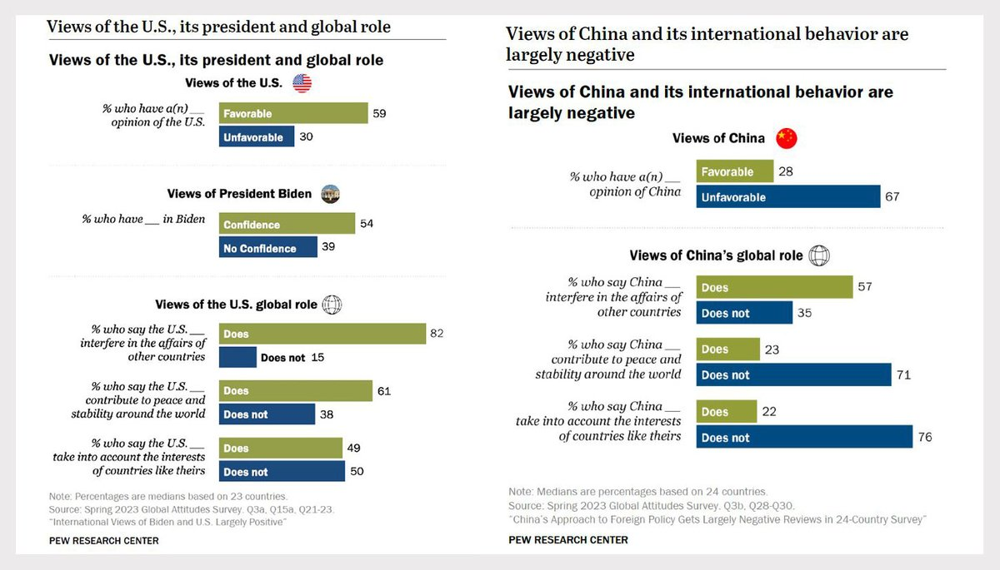

自由亚洲电台 北京时间 2023-11-08T07:00:06Z 1722026168696942646 #事实查核｜美军高级军官在 #加沙 地带被狙击身亡？ https://t.co/1MWxJTvrpb   自由亚洲电台 北京时间 2023-11-08T07:03:28Z 1722027013832356176 据美国《纽约时报》报道，由于经济增长不能再靠 #房地产 和 #地方债 推动，中国的领导人正在加大对制造业的投资，并增加了中央政府的借贷。
 https://t.co/QZKKOHWlKh   自由亚洲电台 北京时间 2023-11-08T08:00:06Z 1722041268291919971 欢迎收听和订阅播客【#亚太报道】 https://t.co/MjLNSvVMqc
（2023-11-7）中国十月份出口持续下滑；河南、浙江等多地工厂停产、工人放假；浙江异议人士 #朱虞夫 试图闯关遭拦截；四川一国企人员被判 #间谍罪 事件引发热议；中国统计局发布记录领导干部干预工作新规。 https://t.co/TmdYXOcEpW   自由亚洲电台 北京时间 2023-11-08T05:37:22Z 1722005344237605036 近十年来，中国渔船远赴太平洋捕捞的数量暴增。有媒体担忧，这会加剧澳洲沿海的过度捕捞。世界银行估计，到2030年，中国的捕捞量将占全球总量的37%，远超其他国家。

 https://t.co/vsUG7JO68H   自由亚洲电台 北京时间 2023-11-08T05:39:43Z 1722005936183890114 中国 ＃国家统计局 近日印发文件，针对 ＃领导干部违规干预统计工作 实施实名记录报告制度。能否扭转中国官员自上而下数据造假的风气？

 https://t.co/kn1VoFmWWB   自由亚洲电台 北京时间 2023-11-08T00:19:07Z 1721925257584607732 重演文革？11月6日，习近平带"刀把子"高官会见“＃枫桥式工作法”单位代表
国家安全部在微信公众号发表"用新时代' ＃枫桥经验'打好维护国家安全人民战争"主题的文章，表示今年是已故领导人毛泽东批示学习推广“枫桥经验”的60周年，并表示，“枫桥经验”是基层社会治理的样板。
 https://t.co/r1ZMtWIm3v   自由亚洲电台 北京时间 2023-11-08T02:25:39Z 1721957100568625528 2023年  ＃APEC 经济领袖周11日至17日在旧金山举行，舆论聚焦可能在场边举行的 ＃拜习会。
美国国务院APEC事务资深官员Matt Murray 6日重申，美方非常注重努力保持开放的沟通渠道，希望能够负责任地管理竞争，也希望为中国国家主席习近平和拜登总统在旧金山举行会晤而努力 https://t.co/OvSNWRW9ZJ   自由亚洲电台 北京时间 2023-11-08T03:56:34Z 1721979981100941529 评论 | 王丹 ＠wangdan1989：对 #李克强 之死的质疑比李克强之死更重要
 https://t.co/TVgvabmGBo   自由亚洲电台 北京时间 2023-11-08T04:03:35Z 1721981744189243579 【美国印象 vs 中国印象】
美国皮尤研究中心公布的最新民调收集全球24个国家对于美中两国看法
大多数受访国家都认为，美中皆会介入他国事务，甚至更普遍地对美国有这样的感观。
不过，公众也认为，美国在干涉他国事务时，会比中国更考量他国的利益。
#您怎么看 ？
https://t.co/NLP1kDJzbQ https://t.co/1EpS6caGlg   自由亚洲电台 北京时间 2023-11-08T00:44:15Z 1721931579994587507 被浙江当局视为头号监控对象的异议人士 ＃朱虞夫，为了到日本探望病危的妹妹，不惜远赴广西闯关，却遭当局以涉嫌偷渡拦截遣返，目前被软禁家中。

 https://t.co/8qJRsGNmls   自由亚洲电台 北京时间 2023-11-08T01:25:50Z 1721942046578229534 美国跨党派议员表示，要把49名香港官员及法官等列入制裁名单，激起香港政界强烈反弹。亲北京阵营多名重量级人物相继表示，若美国扩大制裁，不排除港府会根据《＃港版国安法》，把有关案件移交中国大陆审理。

 https://t.co/2jJFcetiK0   自由亚洲电台 北京时间 2023-11-08T01:58:53Z 1721950361035104698 本周二(11月7日)，中国海关总署公布的最新数据显示，中国十月份 ＃出口 额同比以美元计价下降6.4%，进口增长3%。其中，对欧盟、美国、日本等主要贸易伙伴的前十个月出口都呈现下滑。

 https://t.co/644EUfdoBs   