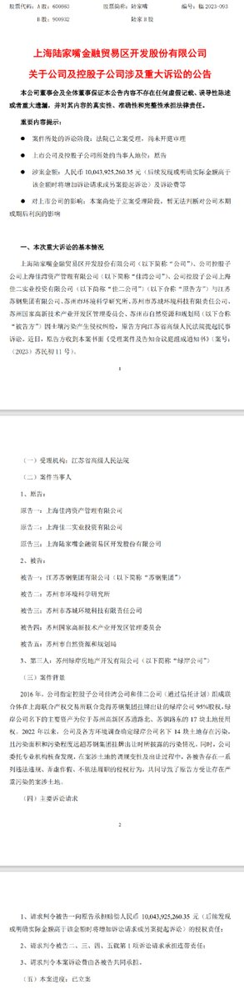
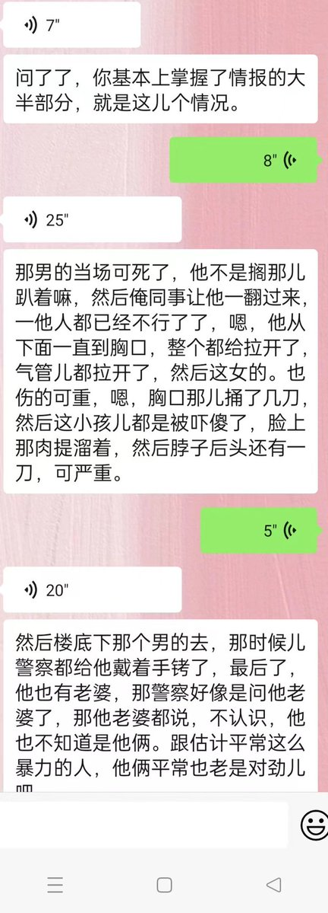
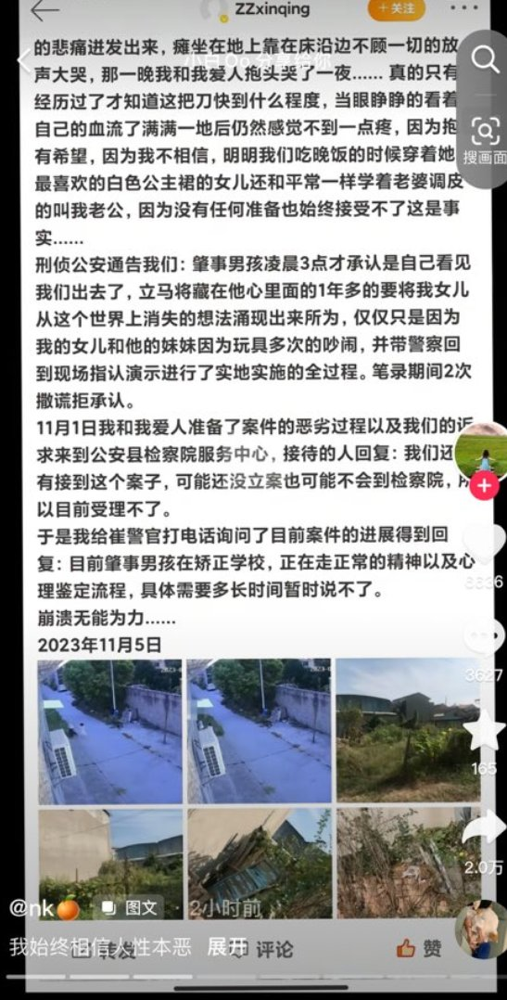

谁将十万横扫三江 北京时间 2023-11-08T15:36:34Z 1722156139272691952 陆家嘴因购买地块不能正常经营向苏州自然资源局，开发区管委会索赔100亿问责 https://t.co/fiiNmrdztz   谁将十万横扫三江 北京时间 2023-11-08T12:31:24Z 1722109541582819334 11月6号漯河市临颖县因邻居小孩太吵发生一起凶杀案，一死两伤 https://t.co/DVFTFRONwX   谁将十万横扫三江 北京时间 2023-11-08T12:41:09Z 1722111993950433286 RT @YesterdayBigcat: 11月6至7日，近百名交通局职工连续两天到天津市蓟州区交通局门口集会，追讨被拖欠长达九个月的工资。

https://t.co/6XHpI1IWv1 https://t.co/15DQ2F5YwH   谁将十万横扫三江 北京时间 2023-11-08T10:11:13Z 1722074261651964257 https://t.co/gS1Rm2JFM0   谁将十万横扫三江 北京时间 2023-11-08T01:13:21Z 1721938902490177756 RT @whyyoutouzhele: 11月5日，一名母亲在微博上称，自己四岁半的女儿人被一名未满12岁的男孩残忍杀害。
目前这条微博原文已经无法查看，但是网友们正在各大平台接力转发。 https://t.co/oexvshyCf5   谁将十万横扫三江 北京时间 2023-11-08T01:13:45Z 1721939003472265283 RT @whyyoutouzhele: 11月6日，网传中山大学孙逸仙纪念医院（中山大学附属第二医院）乳腺外科多名学生患罕见性乳腺癌
11月7日，中山二院党委办公室工作人员回复，“相关网传信息为不实信息，我们正在调查处理中，后续情况会有官方发布。” https://t.co/Y…   谁将十万横扫三江 北京时间 2023-11-08T01:22:06Z 1721941105695179143 RT @cskun1989: 关于迟夙生律师突发就医情况的通报
                                
       
2023年11月6日晚19点30分左右，我所律师突然在网上看到关于我所迟夙生律师在云南宣威法院休庭后被送往医院就医的帖子。经过近三个…   谁将十万横扫三江 北京时间 2023-11-08T01:22:16Z 1721941148007317939 RT @cskun1989: 67岁的迟夙生律师是中国知名的维权律师，也曾是第九屆第十屆第十一屆全囯人大代表，这次在宣威县法院拍照是有原因的，宣威县法院从公安机关调来很多审讯椅，就是固定手脚全身不能动的那种椅子，让被告坐这种椅子参加庭审，就是严密控制被告的言论，此等作法史无前例…   谁将十万横扫三江 北京时间 2023-11-08T01:30:51Z 1721943307478261896 执法人员面对镜头，振振有词：“我给你普普法，我们是公有制国家，不存在私人物品。”

 (https://t.co/hQHclaazLN)   谁将十万横扫三江 北京时间 2023-11-08T01:32:13Z 1721943652539457661 广西又发生了一例杀女婴案，网友列出了该地区性别比

爸爸带着小儿子跟六岁的自闭症女儿，晚上八点在海滩，说女儿朝海里那边跑了，海岸线黑看不见，他抱着儿子追着喊女儿的名字，没看到，然后报失踪了，各种海警找，二十四小时后尸体找到了。 https://t.co/0frI0DdNrg   谁将十万横扫三江 北京时间 2023-11-08T01:37:57Z 1721945094541197698 广西一建拖欠半年工资，员工准备集体诉讼
科普一下，中国不存在集体诉讼，而且中国是工人阶级自己的国家，一建是工人自己的企业，诉讼会损害自己的利益 https://t.co/JGwsQqw0G4   