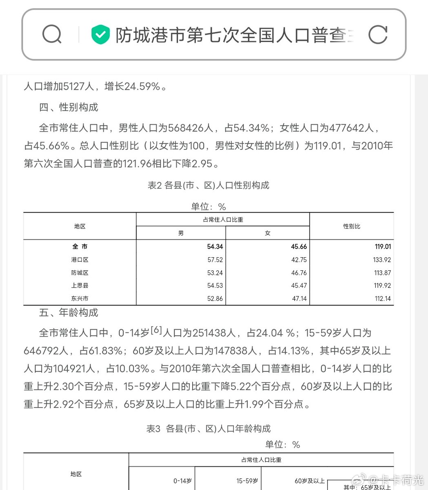

谁将十万横扫三江 北京时间 2023-11-08T01:22:16Z 1721941148007317939 RT @cskun1989: 67岁的迟夙生律师是中国知名的维权律师，也曾是第九屆第十屆第十一屆全囯人大代表，这次在宣威县法院拍照是有原因的，宣威县法院从公安机关调来很多审讯椅，就是固定手脚全身不能动的那种椅子，让被告坐这种椅子参加庭审，就是严密控制被告的言论，此等作法史无前例…   谁将十万横扫三江 北京时间 2023-11-08T01:30:51Z 1721943307478261896 执法人员面对镜头，振振有词：“我给你普普法，我们是公有制国家，不存在私人物品。”

 (https://t.co/hQHclaazLN)   谁将十万横扫三江 北京时间 2023-11-08T01:32:13Z 1721943652539457661 广西又发生了一例杀女婴案，网友列出了该地区性别比

爸爸带着小儿子跟六岁的自闭症女儿，晚上八点在海滩，说女儿朝海里那边跑了，海岸线黑看不见，他抱着儿子追着喊女儿的名字，没看到，然后报失踪了，各种海警找，二十四小时后尸体找到了。 https://t.co/0frI0DdNrg   谁将十万横扫三江 北京时间 2023-11-08T01:37:57Z 1721945094541197698 广西一建拖欠半年工资，员工准备集体诉讼
科普一下，中国不存在集体诉讼，而且中国是工人阶级自己的国家，一建是工人自己的企业，诉讼会损害自己的利益 https://t.co/JGwsQqw0G4   