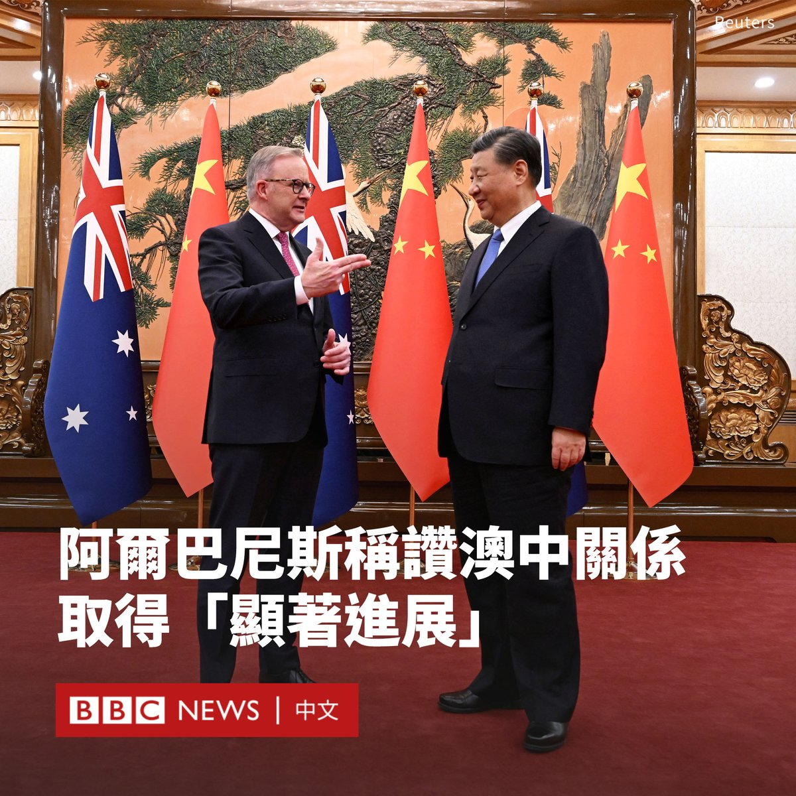
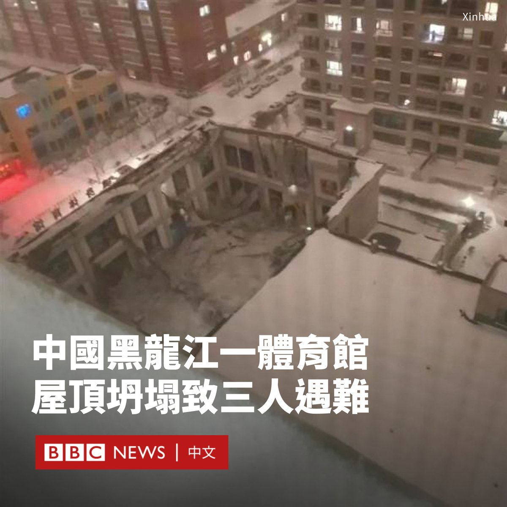

D英国广播公司BBC 北京时间 2023-11-07T14:20:01Z 1721774489246330963 正在访华的澳大利亚总理阿尔巴尼斯（Anthony Albanese）与中国国家主席习近平会谈后表示，澳中关系取得“显著进展”。

“这是非常积极的，是建设性的。我邀请习主席在一个互相方便的时间访问澳大利亚……会晤持续了一个多小时，比原定时间更长。我认为这反映出非常积极的接触。”

他表示，两人还在会晤中讨论了俄罗斯入侵乌克兰和中东冲突问题，以及被中国关押的澳籍作家杨恒均等人权问题，但没有谈及澳英美联盟（AUKUS）相关话题。

阿尔巴尼斯此访被视为两国关系解冻的关键时刻，根据会后透露的细节，两人的会晤似乎气氛轻松。

据美联社报道，阿尔巴尼斯表示，习近平在会晤中回忆起他对澳大利亚的访问，称袋獾很可爱。当阿尔巴尼斯说它们可能不如熊猫可爱时，习近平以《功夫熊猫》开玩笑道：并不是所有熊猫都可爱。

堪培拉曾与北京有着紧密的贸易联系，但两国关系在近年因一系列贸易摩擦和安全担忧，以及莫里森（Scott Morrison）政府呼吁对新冠病毒起源进行调查等因素跌落谷底。

阿尔巴尼斯在上周六（11月4日）抵达上海展开为期四天的国事访问，这是2016年以来再度有澳大利亚领导人访华。他随后前往北京，参观天坛等地。

贸易议题被视为是此访的重要议程。阿尔巴尼斯呼吁北京取消对澳大利亚商品加征的关税。

中国外交部在一份新闻稿中称，习近平表示，中澳“没有历史恩怨纠葛，没有根本利益冲突，完全可以成为相互信任、相互成就的伙伴”。

习近平对阿尔巴尼斯说，他希望“充分发挥中澳自由贸易协定潜能，拓展气候变化、绿色经济等新兴领域合作”。   D英国广播公司BBC 北京时间 2023-11-07T09:23:37Z 1721699897295225226 据中国媒体报道，中国东北部黑龙江省的一座体育馆屋顶周一（11月6日）发生坍塌，导致三人遇难。

位于佳木斯市桦南县的这座体育馆有两层，属于一家健身俱乐部，其中二楼约500平方米的篮球区域发生了坍塌。

现场画面显示，在屋顶坍塌后，该房屋仅剩四周的墙壁。很多碎石与建筑物残骸掉落在地面，上面覆盖有大雪。

当日，佳木斯市下起大雪，并发布暴雪红色预警信号。目前尚不清楚坍塌是否与积雪有关，当局正在调查事故原因。

据报道，事发时有孩童在体育馆内。消防和警方随后赶往救援，附近路段被封闭。

附近商户向中国媒体表示，晚上七点左右，在附近曾听到坍塌的巨响。

央视新闻报道说，现场当时共有七人，其中三人自行脱险，一人轻伤，三人遇难。俱乐部负责人已被警方控制。

这是黑龙江省时隔三个多月后再次发生屋顶坍塌事故，在社交媒体广泛引发对于建筑质量的批评和质疑。人们呼吁当局调查这是否是“豆腐渣工程”。

今年7月，齐齐哈尔市一座中学的体育馆的屋顶发生坍塌，导致11人遇难，包括10名该校女子排球队队员和一名教练。   