D英国广播公司BBC 北京时间 2023-11-06T22:14:12Z 1721531433682923879 BBC国际事务编辑鲍文（Jeremy Bowen）报道说，避免更多战争的唯一可能就是建立与以色列毗邻的巴勒斯坦国，但在目前双方领导人的领导下，这似乎不可能实现。如果根深蒂固的偏见无法被打破，持续的冲突将无可避免。https://t.co/03TCu3pLqF   D英国广播公司BBC 北京时间 2023-11-06T19:34:58Z 1721491357653688506 以色列表示，其军队对加沙北部发动重大攻势，目前已将加沙地带一分为二。

以色列国防军称，军队已经“包围”了加沙北部的加沙城。

国防军称，其战机袭击了“约450个目标……包括军事大院、观察哨、反坦克哨所”等。

军方还表示，以色列“将继续发动猛烈攻击，并继续加强在加沙地带北部和大加沙城地区的地面行动”。

BBC驻加沙记者报道说，周日（11月5日）晚的空袭是开战以来最猛烈的一次，加沙地带西北部的海滩难民营遭到轰炸。

加沙北部的互联网和电话通讯在夜间再次中断，现已恢复，但从加沙城获取信息仍然非常困难。

包括联合国人权高专办、世界卫生组织、儿童基金会和难民署在内的联合国18个机构负责人罕见发布联合声明，呼吁立即实行人道主义停火。

哈马斯控制的加沙卫生部表示，自10月7日哈马斯突袭以色列引发后者在加沙展开报复行动以来，加沙地带已有逾9700人死亡。 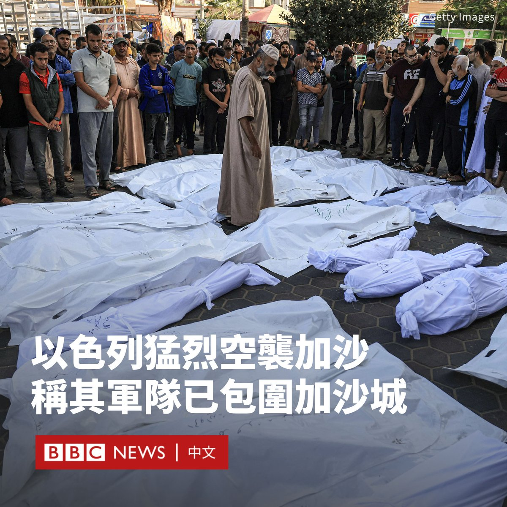  D英国广播公司BBC 北京时间 2023-11-06T17:23:15Z 1721458210958451085 中国与菲律宾两国的船只在南海争议岛礁仁爱礁（菲称阿云津礁）附近海域发生碰撞。该事件被认为是近年来双方发生的最严重的外交冲突。

几年前，随着杜特尔特的上台，菲律宾曾一度奉行“疏美亲中”的外交路线。但这一切随着新总统小马科斯的上台戛然而止。

▶️点击观看 #BBC中文解释给你听 ：菲律宾为何由“亲中”回归“亲美”外交？ https://t.co/IaNrEDUCGC 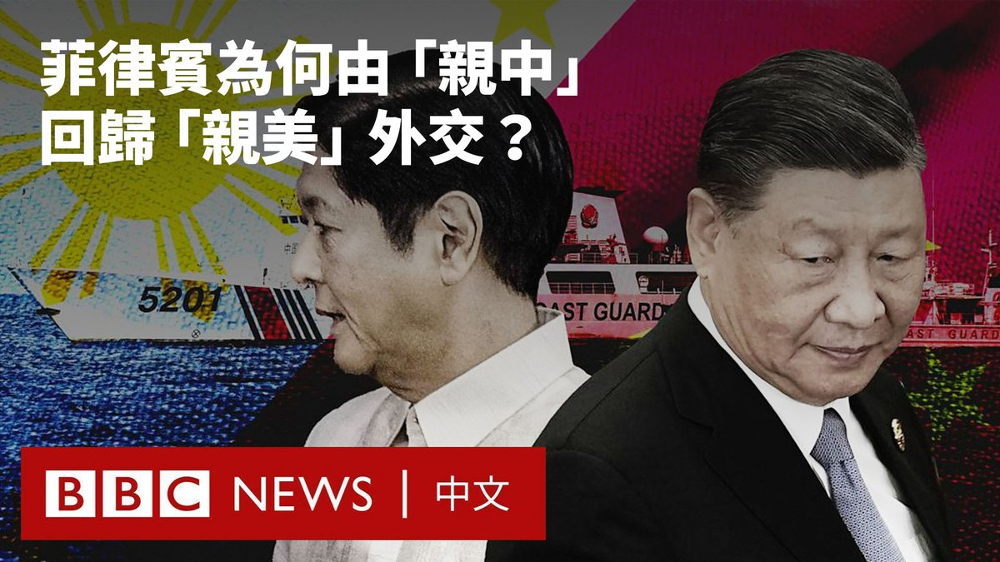  D英国广播公司BBC 北京时间 2023-11-06T18:11:03Z 1721470239567986772 澳大利亚总理阿尔巴尼斯（Anthony Albanese）抵达北京访问，这是时隔七年再度有澳大利亚领导人访华。

阿尔巴尼斯周一（11月6日）上午前往天坛参观，随后与中国国家主席习近平会晤。

阿尔巴尼斯在这个曾经的皇家祭坛中标志性的回音壁前拍照留念。半个世纪前的1973年，即中澳建交一年后，时任澳大利亚总理高夫·惠特拉姆（Gough Whitlam）曾到访于此。

“自他访问北京天坛以来，很多事发生了变化。但不变的是，我们两国之间的交往依然重要。”阿尔巴尼斯在X（推特）上写道。

阿尔巴尼斯在上周六（11月4日）抵达中国，他先前往上海进行了访问。有民众拍摄到他周日上午在外滩晨跑。

堪培拉曾与北京有着紧密的贸易联系，但两国关系在近年因一系列贸易摩擦和安全担忧，以及莫里森（Scott Morrison）政府呼吁对新冠病毒起源进行调查等因素跌落谷底。

阿尔巴尼斯此访被视为两国关系解冻的关键时刻，他预计将把贸易问题列为首要议程，包括呼吁中国取消对澳大利亚商品加征的关税。

但阿尔巴尼斯此行也面临国内压力。澳籍华裔作家杨恒均自2019年以来一直因间谍罪名在中国被监禁，澳大利亚当局面临着要求其获释的呼声。 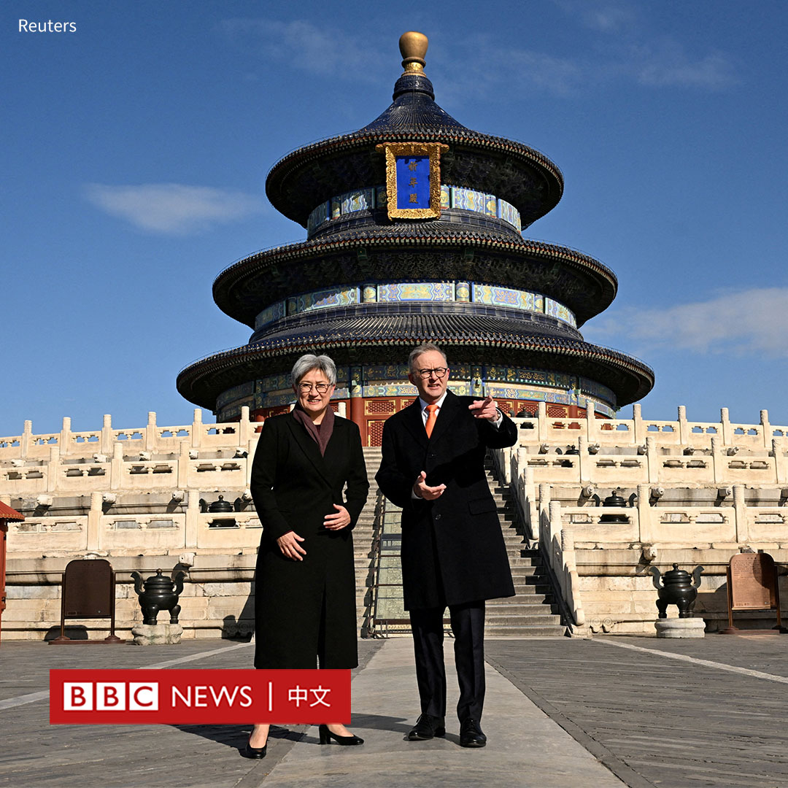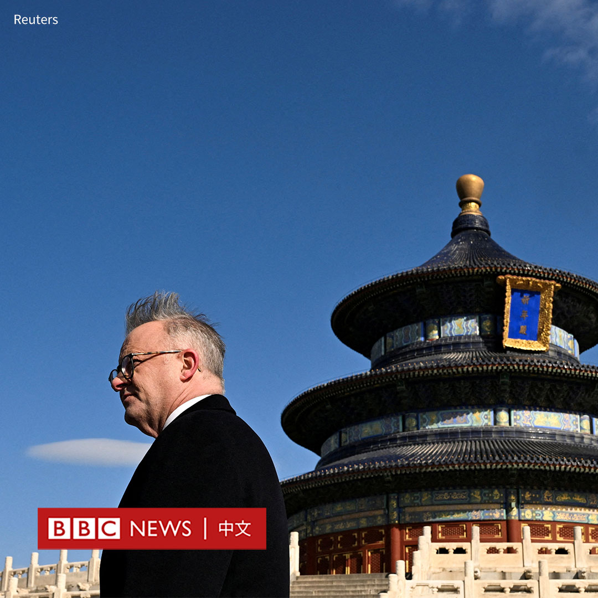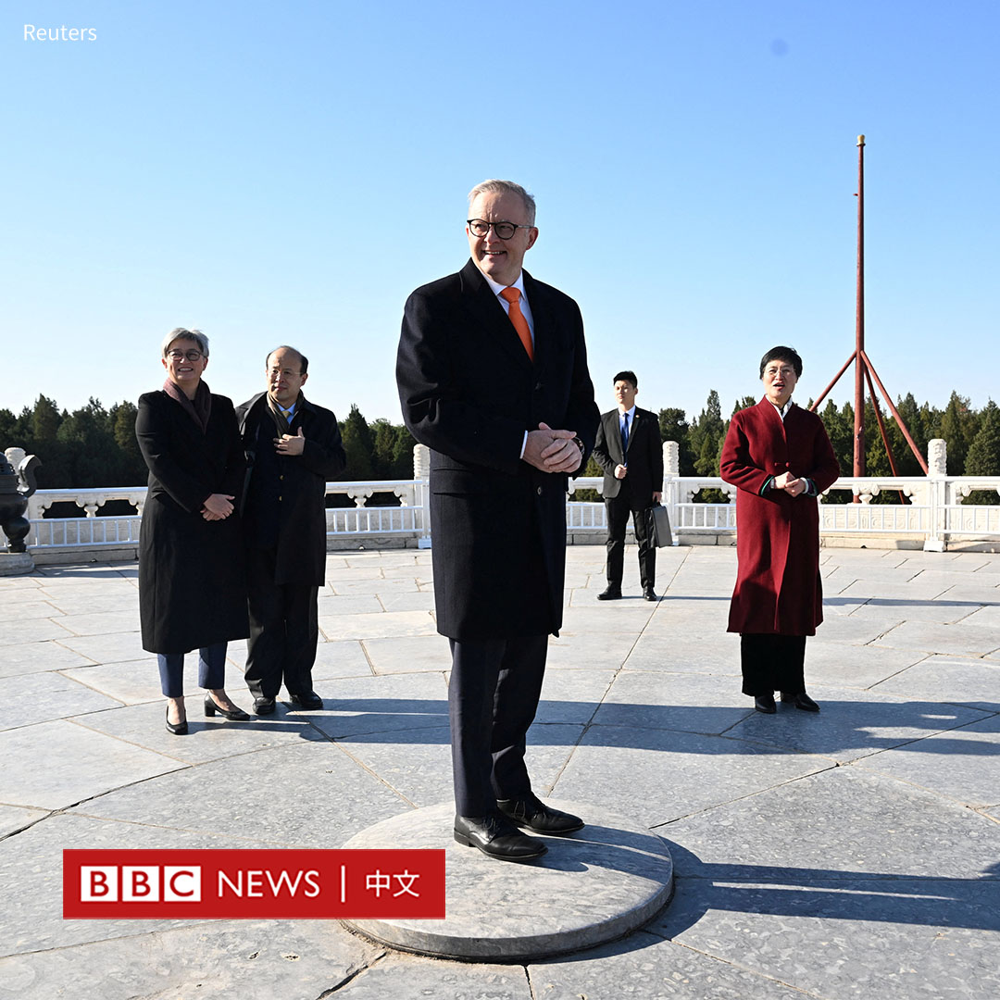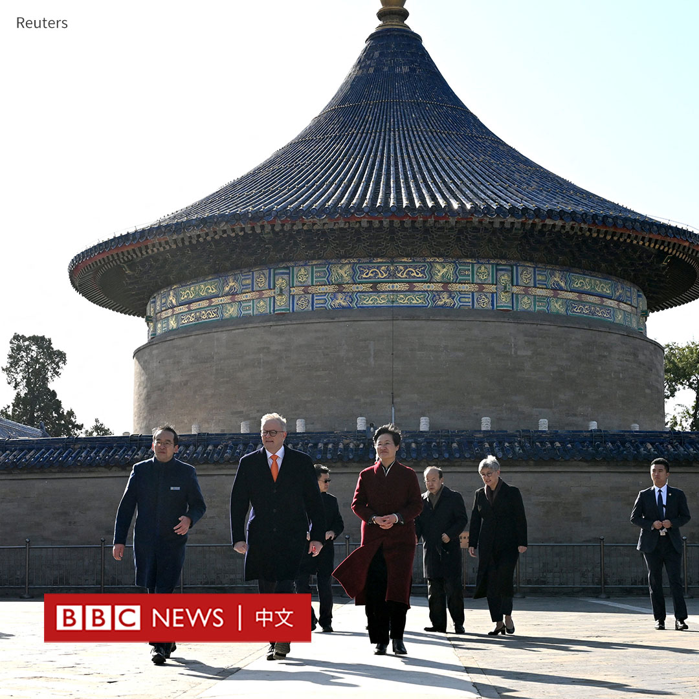  D英国广播公司BBC 北京时间 2023-11-06T15:13:02Z 1721425442484441400 随着加沙战事激烈，通讯多次遭到切断，身处苏格兰的阿玛尼心急如焚。

她于以哈冲突开始前几日赴英国继续博士学业，而她的丈夫与三个孩子留在了加沙。当她的孩子躲避以色列空袭的影片在网上引起关注时，阿玛尼称其感到心里“完全是空的”。 https://t.co/lHbWlguKwM 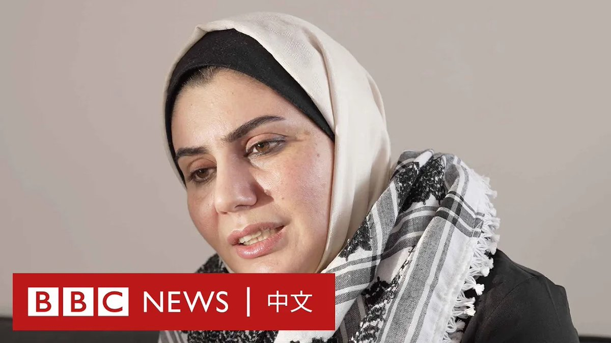  D英国广播公司BBC 北京时间 2023-11-06T16:23:45Z 1721443238798594488 德国汉堡机场发生劫持幼儿事件，据当地警察称，事件在僵持18小时后结束。https://t.co/nuVTas2BDS   D英国广播公司BBC 北京时间 2023-11-06T12:38:36Z 1721386576457130296 在印度首都德里，空气污染问题不断加剧。当局已下令小学停课至11月10日。

该市周日（11月5日）的空气质量指数（AQI）为471，属于“危险”类别。远高于排第二的巴基斯坦拉合尔，其为261。

德里是世界上污染最严重的城市之一。地方官员指，由于冬季风速较低，以及邻近的焚烧秸秆事件增多等因素，导致空气污染物飙升。

根据德里污染控制委员会（Delhi Pollution Control Committee）的研究，由于旁遮普邦和哈里亚纳邦焚烧秸秆事件增多，邻近的德里空气污染程度在11月1日至15日期间达到高峰。

根据政府数据，上周四（11月2日）晚上，德里市及其郊区的细悬浮微粒（PM2.5）指数，超过了每立方米60微克的安全标准七至八倍。

有许多德里居民报称眼睛不适、喉咙发痒。一些监测站的空气质量指数徘徊在480左右，空气变成了浓密的灰色。

空气质量指数在0-50之间被认为是良好的，而在400-500之间则会对健康人造成影响，并对患有疾病的人构成威胁。 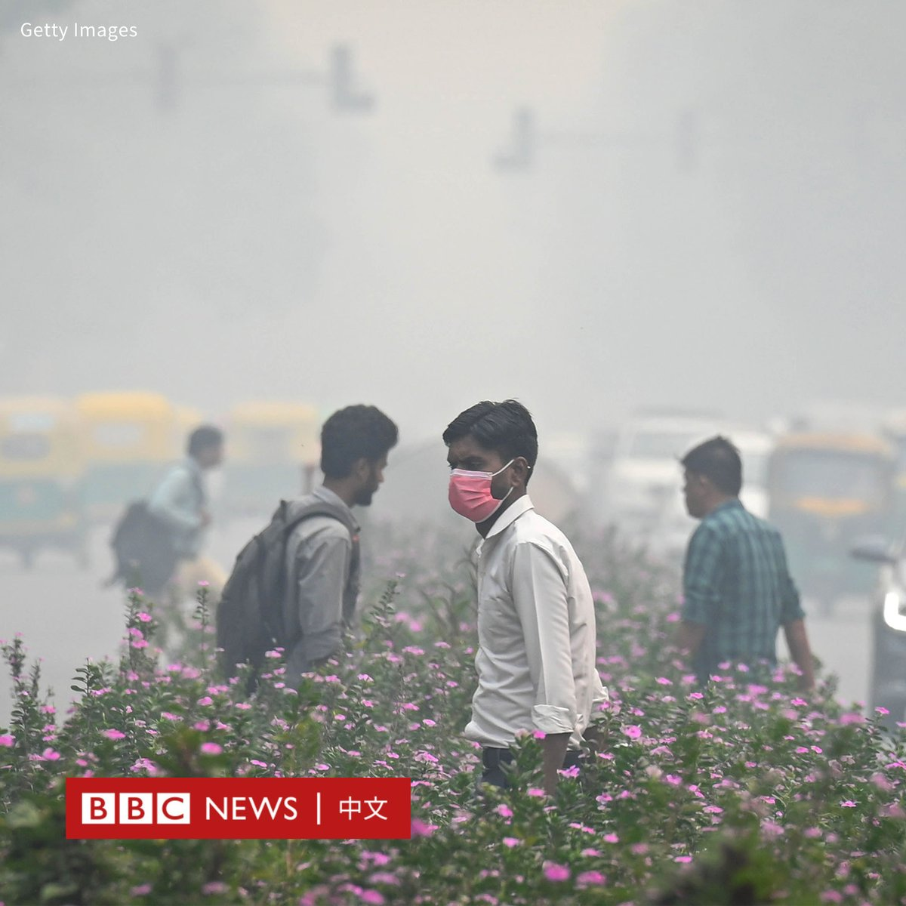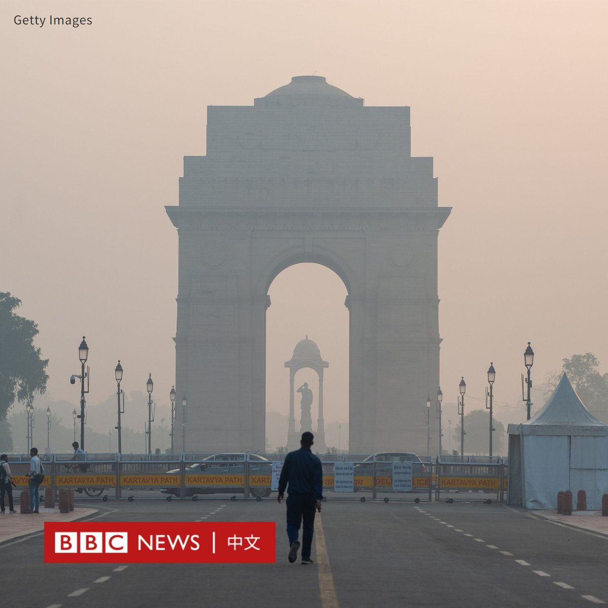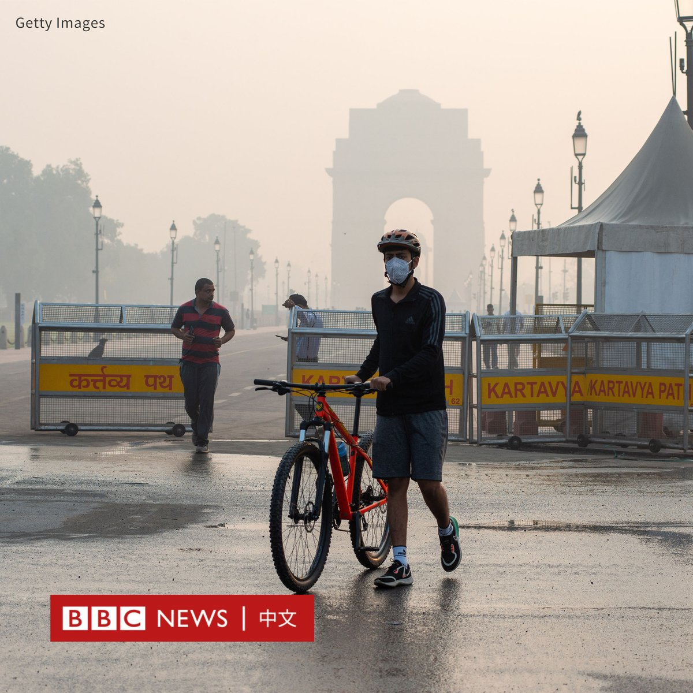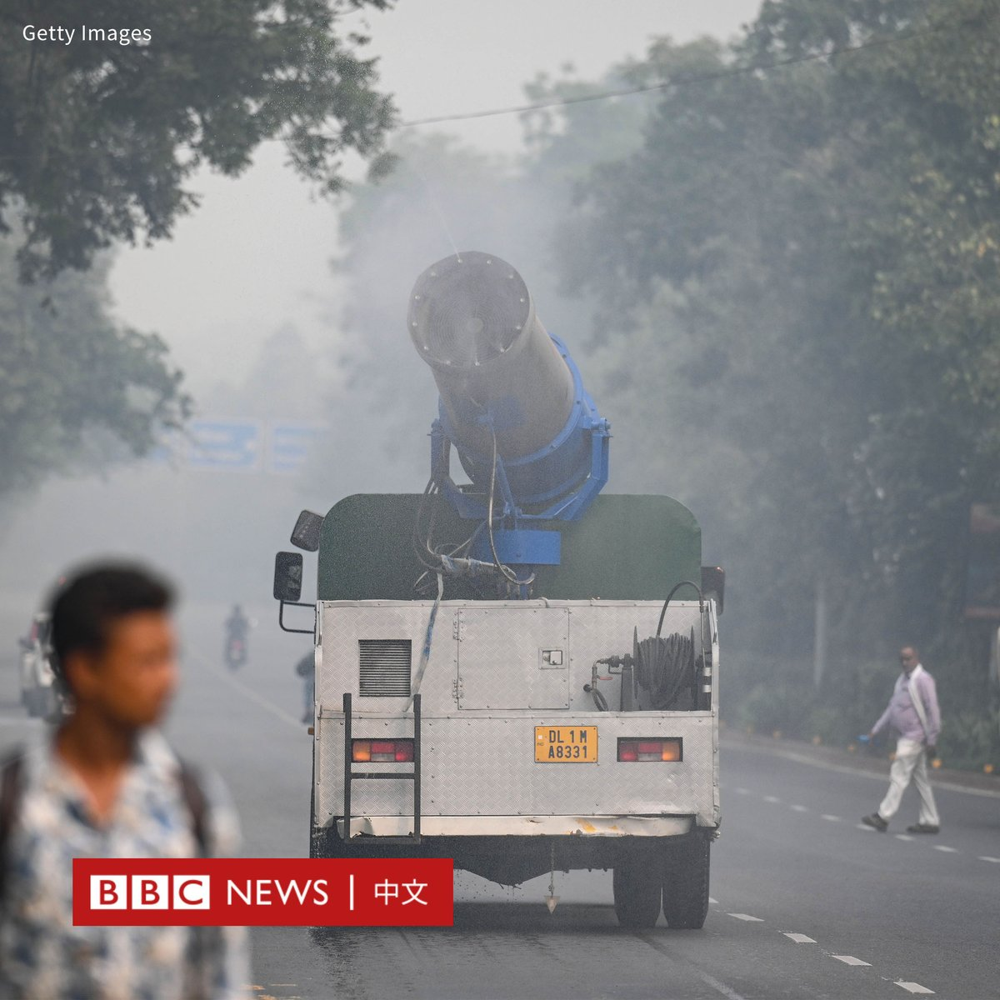  D英国广播公司BBC 北京时间 2023-11-06T10:31:50Z 1721354675017146464 新加坡总理李显龙周日（11月5日）表示，他最早计划在明年年底前将权力交棒予副手黄循财。

现年71岁的李显龙自2004年起担任长期执政的人民行动党秘书长。去年，该党将黄循财指定为接班人。

“我对黄循财和他的团队充满信心，没有理由推迟政治过渡。因此，我打算在下次大选前交权给副总理黄循财。”李显龙在行动党大会上说。

他称，由于新冠疫情，他未能如愿于70岁生日前交棒，但或许可以在人民行动党70岁生日前交棒。

人民行动党将于明年11月迎来70年党庆，而新加坡下届大选最迟须在2025年11月举行。

李显龙在致辞结尾提到自己为国服务，并担任总理近20年时，一度哽咽说不出话来。台下出席者给予其热烈掌声。

李显龙表示，在交棒后，他将听从黄循财的安排。“他认为我能在哪里发挥作用，我就去哪里。我会尽我所能帮助他打赢下届大选。”

鉴于人民行动党很可能会在大选中继续获胜，普遍预测黄循财将成为1965年新加坡独立以来的第四位总理。

现年50岁的黄循财最初是一名公务员，在2005年至2008年担任李显龙的私人秘书。

他在2021年5月获任财政部长。他被视为在抗击新冠疫情期间表现出色，得到李显龙的青睐。2022年6月，他升任副总理。 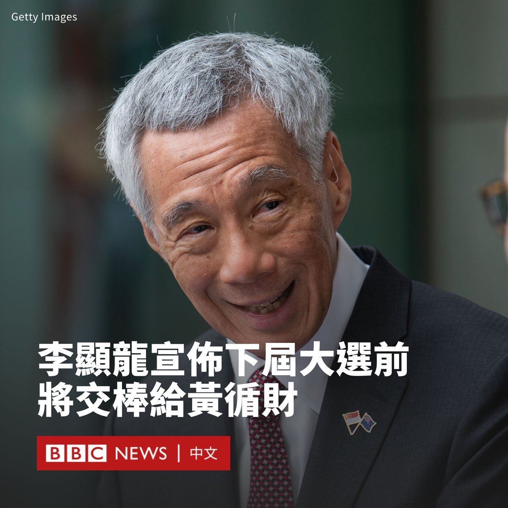  