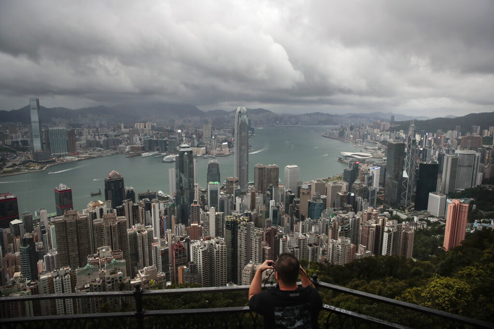
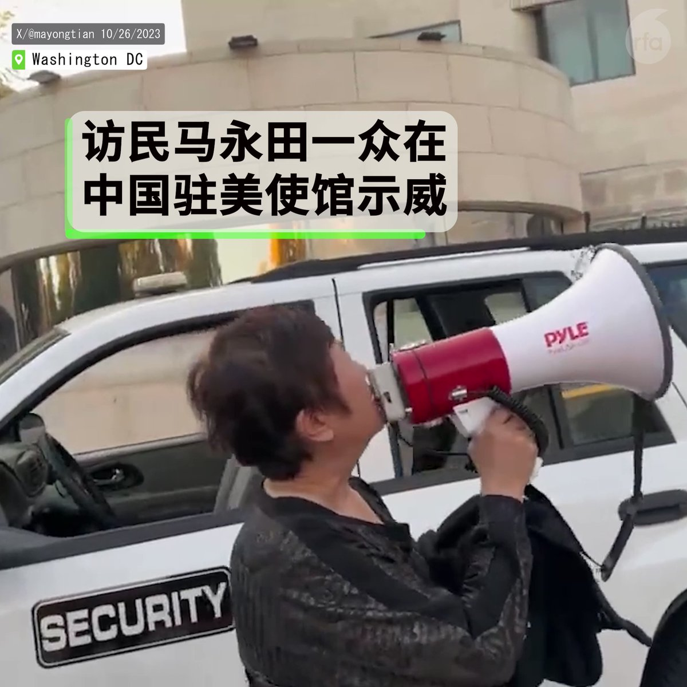

自由亚洲电台 北京时间 2023-11-06T14:05:31Z 1721408448615825538 【港府预告“#23条”设域外法权】
【恐成《国安法》加强版】
除了已实施《香港国安法》，港府已表明在2024年内，会完成另一条涉及国家安全的香港《#基本法》23条立法工作，港府高官近期披露立法的方向和细节，强调"23条"会针对间谍行为，与《香港国安法》一样属域外适用的法律，事件引起各界关注和担忧。详细报道：https://t.co/RASdSuMNvE   自由亚洲电台 北京时间 2023-11-06T07:26:24Z 1721308010625007898 【Nio裁员10%岗位 | 2700员工将受影响】
蔚来向公司全体员工发信说，虽然公司在成交价30万元以上 #纯电动汽车 市场获得四成以上的份额，但综合表现离预期目标仍有差距。
报道指，今年二季度，#蔚来 毛利润为8700万元，同比下降93.5%，净亏损超60亿元。
详阅：https://t.co/4R3mrqdDK3   自由亚洲电台 北京时间 2023-11-06T08:03:39Z 1721317383606784135 【维权人士将拦截习近平 | 澳总理访华关注人权】
上访人士 #马永田 因厂房强拆，在中国驻美大使馆外示威，更计划于 #习近平 本月访美时，在 #旧金山 拦截其车队。中国人权恶化，受国际社会谴责，但七年来首度访华的澳洲总理，并没在 #进博会 致辞时公开提出人权问题。
另见：https://t.co/elrieNtmP1 https://t.co/lX4ti6FR9v   自由亚洲电台 北京时间 2023-11-06T04:35:45Z 1721265063229628551 【参与进博会台商骤降】上海 #进口博览会 3000多家参展商中，仅有20家台湾企业，较首届110家参展减81%。与第二届的150家被较，降幅则更大。
详阅：https://t.co/kqcJJtb8gG   自由亚洲电台 北京时间 2023-11-06T02:41:30Z 1721236313460871477 【献花属于寻衅滋事? | 网络热论李克强死因】
重庆 #钟容元 因微信表示有意“送一束花”，被萱花路派出所传唤。钟拒签传唤证，继日早晨10点才离开。
2016年钟容元因永福煤矿的股权利益被侵犯而上访北京新华门 #维权，被带回重庆后刑拘。
详情：https://t.co/42fvDVUFkB   自由亚洲电台 北京时间 2023-11-06T03:38:14Z 1721250590129295620 【广东地震】江门市 #恩平 发生4.3级 #地震，震源深8千米。深圳、佛山、中山等地均有震感。震中大槐镇距离广州156公里。截至4日晚10时共发生余震五次。
详情：https://t.co/u5CNZmSRMf   