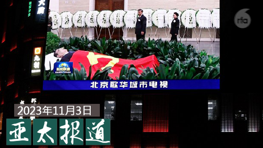
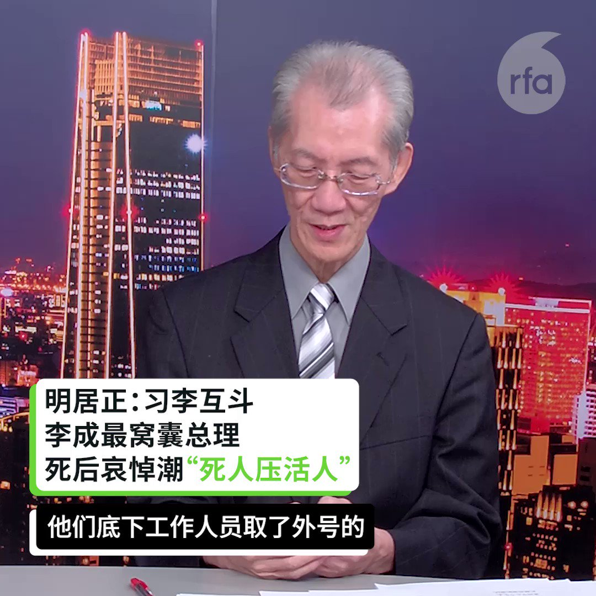

自由亚洲电台 北京时间 2023-11-04T07:00:07Z 1720576618064998644 欢迎收听和订阅播客【#亚太报道（2023-11-3）】 https://t.co/MjLNSvVMqc
#习近平 对中国女性强调结婚生子； 外媒称赞 #李克强 的政治遗产；广东佛山取缔一 #模拟联合国 组织；#欧盟商会 批 #进博会 政治色彩太浓；#AI安全峰会 警告AI脱离人类掌控的风险 https://t.co/zsh0hQ2GfY   自由亚洲电台 北京时间 2023-11-04T05:00:51Z 1720546604330164361 首届 #人工智能安全峰会 在英国布莱切利园召开，这也是国际首度对人工智能的风险发表主要联合声明。《布莱切利宣言》表示，人工智能系统可能会被不良分子滥用，带来严重甚至灾难性伤害，甚至脱离人类掌控。对此，美中等28国承诺将加强合作，并考虑制定法律管理这些模型。

 https://t.co/Jm81nhBPNa   自由亚洲电台 北京时间 2023-11-04T08:11:25Z 1720594561926316343 【悼念活动戛然而止｜女子长街送总理被捂嘴带走】
北京市民上街送 #李克强 最后一程，一名女子因呼喊口号被强行捂嘴架走。更有不明身份人物警告群众不要拍摄，以防“被人利用”；在 #合肥， 满城的金菊，一夜之间消失殆尽；尽管滁州、凤阳、宿州等中小城市集会持续， #深圳 警方迅速移除市中心花束，尽显“#深圳速度”。
另见：https://t.co/Pdv1M5boCU   自由亚洲电台 北京时间 2023-11-04T04:46:18Z 1720542944984502648 广东佛山市民政局近日发布消息，对一个名为“#岭南模拟联合国”的组织予以取缔。而根据知情者的说法，这一团体之所以遭到取缔与其近日举行的以“#省权”为主题的活动有关。
#省权定宪

 https://t.co/2RRX6k9VCW   自由亚洲电台 北京时间 2023-11-04T05:26:09Z 1720552973913514005 专栏 | #夜话中南海：深受全党和全国各族人民衷心爱戴的居然是 #李鹏 而不是 #李克强
 https://t.co/o4gZCnM8Rk   自由亚洲电台 北京时间 2023-11-04T05:49:01Z 1720558728230154462 专栏 | #财经时时听：十月工厂订单收缩中国经济复苏势头再度转弱
 https://t.co/ik9eTAN0zg   自由亚洲电台 北京时间 2023-11-04T05:57:17Z 1720560805052395641 美国资产管理巨头 #先锋领航集团 正在采取最后的步骤退出中国。据彭博社报道，知情人士透露，先锋领航集团已经与位于上海的约10名剩余员工签订了解聘协议，大多数团队成员将在明年初离开，办公室将关闭。
 https://t.co/H3E1IUV4s3   自由亚洲电台 北京时间 2023-11-04T02:25:59Z 1720507631469785247 #郭台铭 宣布向中选会递交103万余份连署，申请独立参选总统之际，传出郭台铭多地连署点涉贿选弊案，甚至涉嫌有诈骗集团以伪造连署书骗取民众个资。
中国是否涉及透过诈骗集团介入 #台湾选举？
独派政党提醒诈骗集团恐怕会成为中共介入台湾选举的破口。

 https://t.co/Rm9ishVAK1   自由亚洲电台 北京时间 2023-11-04T02:44:39Z 1720512329304174838 #习近平 对中国女性强调结婚生子，不再提 “#男女平等“。这是什么信号？ https://t.co/Q7XEBgGIpy   自由亚洲电台 北京时间 2023-11-04T00:31:56Z 1720478928794710141 日本集英社出版《亚洲人物史》系列套书将 #李登辉 等人归类于“中国”历史人物。李登辉之女李安妮发声明表示，不论从出生当下或二战结束迄今，李登辉皆不宜归在“中国”项下，何况今日世界所认知的“中国”是“中华人民共和国”，而李登辉是“台湾人”。 她说的有道理吗？#您怎么看？ https://t.co/P4BP2vMaRn   自由亚洲电台 北京时间 2023-11-04T01:06:37Z 1720487660333232413 #数据查核｜2023 #香港区议会选举 更“多元”和“立体”了吗？
 https://t.co/owIXyT8ieY   自由亚洲电台 北京时间 2023-11-04T02:01:54Z 1720501569744203802 #中国欧盟商会 副主席代开乐（Carlo D'Andrea）表示，欧洲企业对中国的商业信心正在幻灭。他说，与其展现中国改革开放的一面，#进博会 更像是政治营销。 https://t.co/wtMeVxDkbs   自由亚洲电台 北京时间 2023-11-04T02:19:50Z 1720506085432553846 【 悼念 #李克强 人潮被压制 共党害怕“死人压活人”】
【阴谋论盛行 中国政府陷入塔西陀“信任危机”困境】
【保有北大底色？民众悼念怀念李言行】
最新一期 #亚洲很想聊 https://t.co/xGPDkTUGb0
 #明居正  #胡平 @HuPing1 精彩分析 https://t.co/PInFblm0Ff   自由亚洲电台 北京时间 2023-11-04T00:07:05Z 1720472674496123131 遭当局以“煽动颠覆国家政权”罪判刑四年六个月的上海异议人士 #陈建芳，上月刑满。据了解，被视为上海街头运动领导者的陈建芳出狱后仍被软禁，家人也受到株连。

 https://t.co/QAVwKpjxA6   