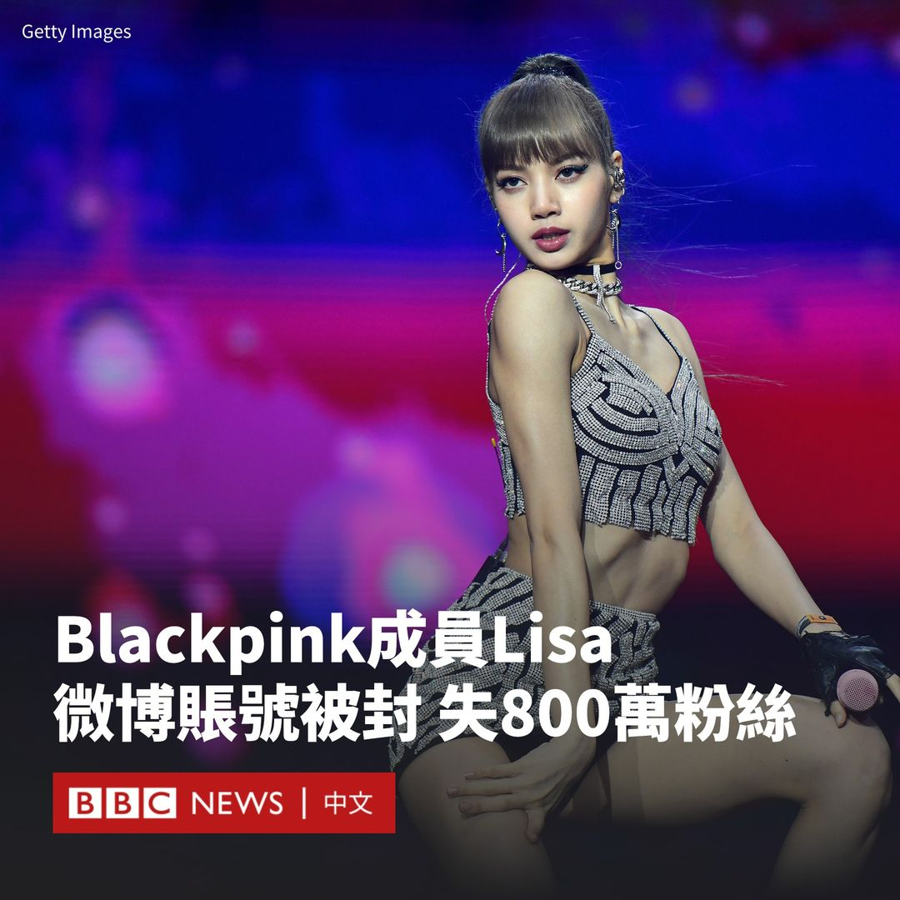

D英国广播公司BBC 北京时间 2023-11-03T16:28:18Z 1720357219877744748 这一有着40年历史的同志界国际盛事将于11月3日至11日在香港进行。BBC中文梳理了五个主要看点，帮助读者了解它由成功拿到主办权到正式举办期间，经历了怎样的风波。
https://t.co/L3cGBu7W0G   D英国广播公司BBC 北京时间 2023-11-03T18:01:03Z 1720380562316104161 澳大利亚总理阿尔巴尼斯11月4日将开启为期四天的访华之旅，这是自2016年以来澳大利亚领导人的首次访华行程。https://t.co/TB7XxjGlBa   D英国广播公司BBC 北京时间 2023-11-03T13:24:00Z 1720310840900174111 韩国人气女团Blackpink成员Lisa参加巴黎疯马秀表演后惹争议。近日，她在中国社交媒体平台微博的账号被封锁，网民猜测这与她的演出有关。

她的微博账号被禁止发文，用户名“lalalalisa_m”被更改为“user7330454276”，当连结到她的账号就会出现“该帐号因被投诉违反法律法规和《微博社区公约》的相关规定，现已无法查看”的信息。

Lisa的800万粉丝名单也被消失，她的百度账号似乎也被暂停了。

疯马秀拥有70多年历史，它在艳舞夜总会“疯马”（Crazy Horse）内上演，以奇幻的光影效果和裸体女舞者而闻名。

虽然Lisa于九月底的演出并没裸露上身，但她在多国遭到批评，指其鼓励裸体并物化女性。有网民指她作为偶像，应知道自己对社会和年轻一代的影响。同时，亦有支持者表示“这是艺术自由”。

其他三位Blackpink成员Jisoo、Jennie和Rosé的微博账号仍然在线。

疯马秀过去曾接待过乐坛天后碧昂丝（Beyoncé）到蒂塔·万提斯（Dita Von Teese）和帕米拉·安德森（Pamela Anderson）等众多名人。

Lisa在中国拥有很高的知名度，她曾在中国真人秀节目《青春有你》中担任导师。

至截稿前，Blackpink团队的管理层尚未回复BBC的置评请求。

与此同时，据报道曾现身“疯马秀”表演场地的中国演员杨颖（Angelababy），以及张嘉倪的社交媒体账号也遭禁言，尽管疯马秀的官方Instagram曾表示Angelababy并未观看Lisa的表演。

中国媒体红星新闻报道称，张嘉倪的团队并不知道账号被限制的原因。   D英国广播公司BBC 北京时间 2023-11-03T12:07:15Z 1720291524250828987 在对人工智能（AI）工具的使用上，似乎有明显的性别差异，这是为什么？
https://t.co/XdzwAam7Cj   D英国广播公司BBC 北京时间 2023-11-03T10:01:03Z 1720259763592733160 自以哈冲突开始，从加沙进入埃及的拉法口岸于11月1日首次开启，这是平民在战争开始后第一次得以离开该地。根据统计，包括巴勒斯坦的伤者以及外国护照持有者在内，有超过400人抵达埃及。 https://t.co/Kz2HckvXcT   D英国广播公司BBC 北京时间 2023-11-03T08:30:18Z 1720236925380899047 缅甸北部华裔少数民族武装近日与执政军阀交战，据报有炮弹落入中国云南境内。来自当地的消息称，一些城镇的政府军投降。

民族武装声称，此举旨在清剿果敢地区的中国电信诈骗集团。一些自2021年军事政变后成立的反政府游击队据报有意加入战斗。
https://t.co/3A6bKd6s0i   