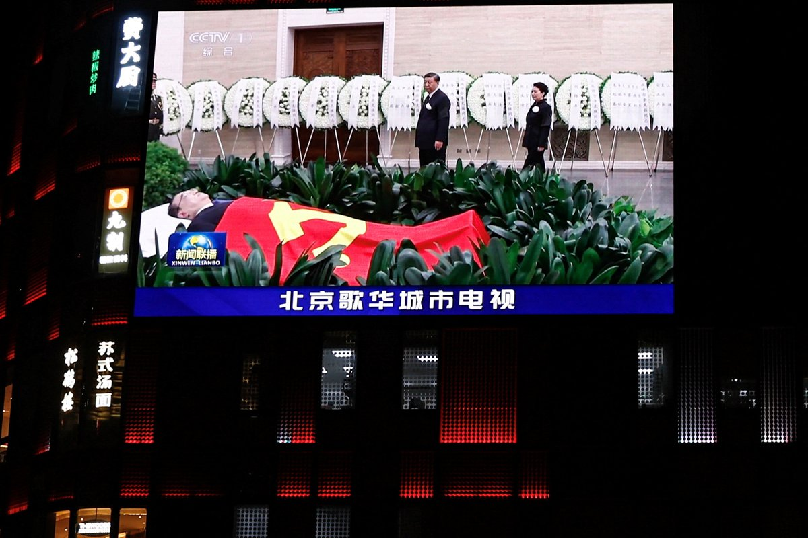
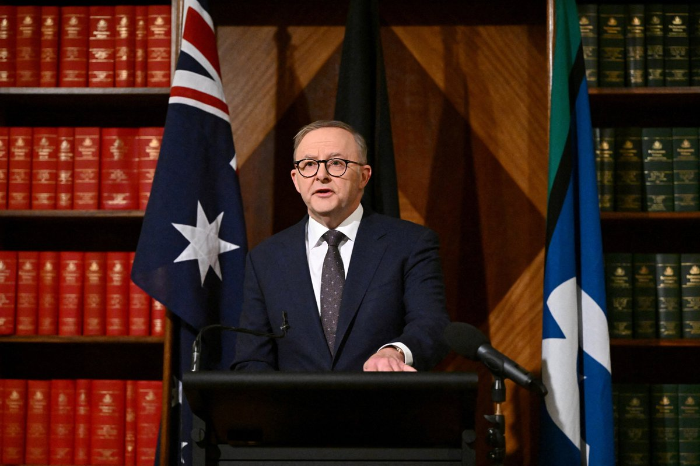
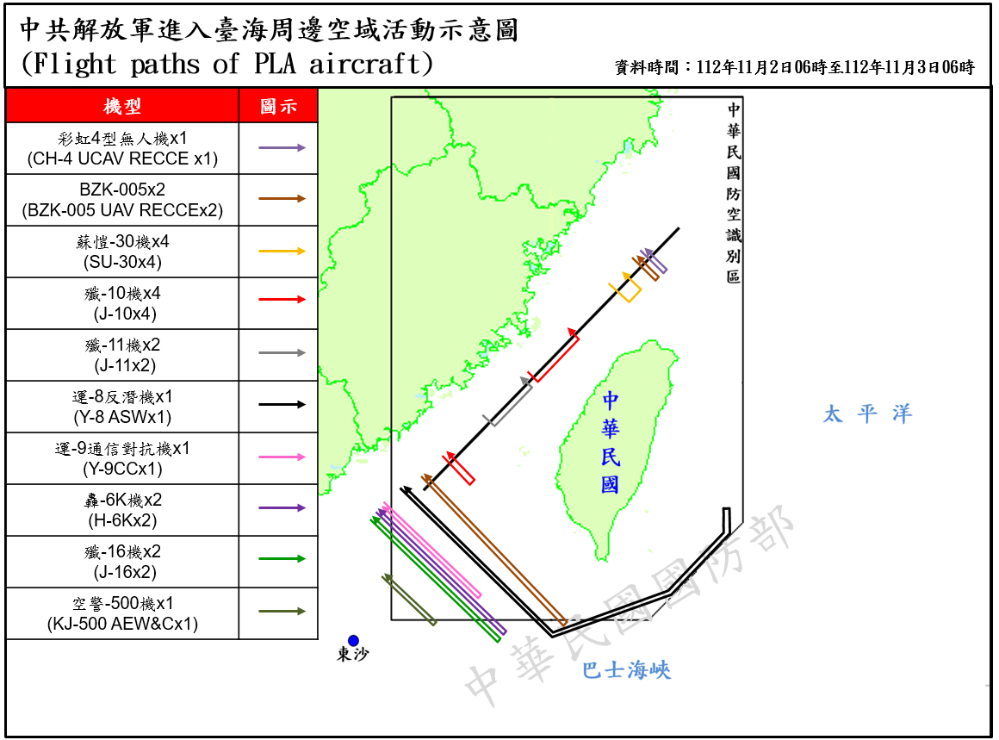
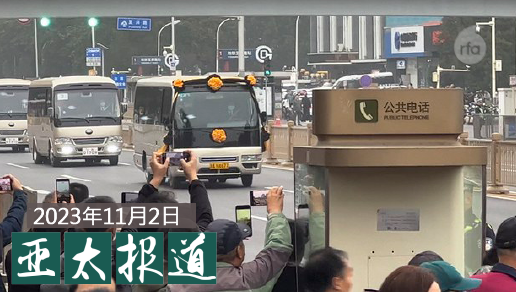

自由亚洲电台 北京时间 2023-11-03T13:22:47Z 1720310532136157404 RT @RFA_Chinese: 【欢迎加入自由亚洲电台电报群】https://t.co/UkKZmFSRkG https://t.co/Qid2LNZxJn   自由亚洲电台 北京时间 2023-11-03T13:23:25Z 1720310694065709431 RT @RFA_Chinese: 【欢迎订阅自由亚洲电台电邮新闻】 
点击https://t.co/197BDI7DqA
输入您的电邮地址，即可收到本台每周二和周五发送的“新闻快递”。
不翻墙也知天下事！ https://t.co/MpqlDbZXTE   自由亚洲电台 北京时间 2023-11-03T15:05:03Z 1720336270495535110 【李克强火化留下众多谜团】
【中国压制悼念 外媒赞扬李遗产】
中国国务院前总理李克强遗体火化，西方媒体也关注报道，而且对李克强有诸多赞扬。有评论认为，西方媒体对李克强的评价远高过中国国内官方的评价，而国内即使是民间，也只认为李克强不过说了几句真话而已。详细报道：https://t.co/1Iolnn3WpG #李克强   自由亚洲电台 北京时间 2023-11-03T16:15:45Z 1720354060946338241 【澳大利亚总理4日至7日访华出席进博会】
【#杨恒均 处境受关注】
中国外交部发言人汪文斌3日在例行记者会上宣布，应国务院总理李强邀请，澳大利亚总理阿尔巴尼斯(Anthony Albanese)将于11月4日至7日对中国进行正式访问。
阿尔巴尼斯此行最受关注的焦点之一，是他能否使遭中国拘留的澳籍华裔作家杨恒均获释。路透社报道，杨恒均的儿子致信阿尔巴尼斯，希望他能借访华契机创造“第二个奇迹”，要求中共当局像释放被捕的澳籍华裔记者成蕾一样释放他们的父亲。
美联社报道，阿尔巴尼斯10月31日表示，他将在对中国进行国事访问期间，向中国领导人提出对杨恒均的关切。https://t.co/XWL3DBJHqI   自由亚洲电台 北京时间 2023-11-03T09:37:56Z 1720253947468984542 随着美中关系恶化，外界担忧，两国间的经济是否会有脱钩的迹象。与此同时，#APEC 峰会即将在本月于旧金山召开，美国总统 #拜登 与中国国家主席 #习近平 有机会在峰会上碰面。那么，针对和中国的经济互动，拜登政府究竟有什么样的规划呢？

 https://t.co/e0k81p4kGv   自由亚洲电台 北京时间 2023-11-03T10:56:23Z 1720273688648659142 【解放军机39架次 军舰8艘次 在台海周边活动】
台湾的国防部3日发布消息指出，自11月2日6时至3日6时止，侦获解放军机39架次(其中逾越海峡中线及其延伸线进入西南及东南空域20架次)、解放军舰8艘次，在台海周边活动。
由于美国和加拿大军舰日前例行性通过台湾海峡，引发关注。
台湾的行政院长陈建仁3日受访表示，中国所有的军事动向，台湾国防部及国安单位都有所掌握，而台海牵涉到整个和平稳定以及繁荣发展，相当重要，台湾政府会和相关国家继续维持台海的和平稳定，使整个区域能够和平繁荣。陈建仁表示，希望中国能做出一些必要措施，不要再继续造成台海的不稳定，使得地区繁荣受到影响。   自由亚洲电台 北京时间 2023-11-03T10:58:39Z 1720274262173319349 RT @RFA_Chinese: 【七常委哀悼李克强画面曝光】
【习近平慰问程虹 程虹低头】
【央视下午三点半播出影片】
在民众一片痛惜 #李克强 和质疑丧礼安排过于低调的声浪中，没有等到晚上的新闻联播，中国中央电视台在2日下午三点多发布上午七常委向李克强遗体致敬的画面。其中可…   自由亚洲电台 北京时间 2023-11-03T10:00:01Z 1720259504527552819 #数据查核｜2023 #香港区议会选举 更“多元”和“立体”了吗？
 https://t.co/owIXyT8ieY   自由亚洲电台 北京时间 2023-11-03T05:03:19Z 1720184837695496694 是情色，还是色情？
是第二次 ＃限韩令？还是底下人揣摩圣意？
＃韩国女团 ＃Blackpink 的泰籍成员Lisa参演法国巴黎的 ＃疯马秀，引起中国网民热议。她的官方微博不仅已经消失、无法观看，也有网传消息显示她的作品及周边商品也在中国境内被禁。

 https://t.co/sVDYUBKSw7   自由亚洲电台 北京时间 2023-11-03T06:30:01Z 1720206655605133546 专栏 | ＃中国透视：共产中国，死亡驱动的国家 — ＃李克强 去世面面观
 https://t.co/HQE3ElMULI   自由亚洲电台 北京时间 2023-11-03T08:05:55Z 1720230788594360829 欢迎收听和订阅播客【亚太报道(2023-11-2)】 https://t.co/MjLNSvVMqc

#习近平 等八常委参加 #李克强遗体告别式；中共政权为何畏惧群众悼念；美国加州出现讽刺习、李的主题活动 抨击中国政局；美中将恢复 #核军控 谈判；#拜习会 前 #布林肯出访亚洲 都为何？ https://t.co/p7r2k9kBV0   自由亚洲电台 北京时间 2023-11-03T03:15:37Z 1720157736003162526 美国国务院周三（１日）宣布，国务卿 #布林肯 将从11 月 2 日至 10 日首先访问中东的以色列及约旦，随后就将展开亚洲行，到访日本东京、韩国首尔以及印度新德里。

 https://t.co/dRrDygkutt   自由亚洲电台 北京时间 2023-11-03T05:13:08Z 1720187307675062446 专栏 | ＃军事无禁区：斗而不破－中美大国竞争新常态
 https://t.co/vDG6dP1Avc   自由亚洲电台 北京时间 2023-11-03T05:30:01Z 1720191557419274318 首届 ＃人工智能安全峰会 日前在英国召开。中方代表获邀出席并在开幕仪式上发言，却被排除于和英国首相 ＃苏纳克 的“小范围会面”之外。
而海外 ＃维吾尔人 则继续抗议中国代表参加峰会，组织货车游走于国会和峰会会场外，向民众讲述中国政府如何以高科技手段监控国民。

 https://t.co/6I2s1Eiuu5   自由亚洲电台 北京时间 2023-11-03T06:00:00Z 1720199104582873429 中国经济下行，也给金融业带来危机，正通过不同的迹象显现出来。据经济观察报报道， A股上市公司 ＃郑州银行 连续三年没有分红，引发投资人质疑。

 https://t.co/yYCxAhLsxA   自由亚洲电台 北京时间 2023-11-03T00:57:34Z 1720122992443932995 近期，中国农业农村部发布关于《＃农业转基因生物标识管理办法》的修改决定征询意见稿，规定 ＃转基因 成分超3%才应当标注“转基因”。
众多网民质疑，这会造成大量转基因食品悄无声息地被端上亿万人的餐桌，以至于消费者将失去知情权和选择权。

 https://t.co/AK1fnQQQpz   自由亚洲电台 北京时间 2023-11-03T02:30:33Z 1720146393917263944 据美国《华尔街日报》报道，美国零售巨头 #开市客( #Costco Wholesale)因其销售的产品涉及 #中国强迫劳动 问题而面临一些有影响力的美国国会议员的质询。

 https://t.co/z3hkcUyFbt   自由亚洲电台 北京时间 2023-11-03T04:07:31Z 1720170794385580488 在南加州的 #洛杉矶，一场政治讽刺活动于10月31日 #万圣节 之夜在圣塔莫尼卡大道举行，一批来自中国的异议人士参加了游行。他们穿上“大白”和“红卫兵”服饰，把 #习近平、#李克强、李强、蔡奇的照片举到头部的位置，并展示了一副习近平的讽刺画像。 https://t.co/Y7lJVRkRaB   自由亚洲电台 北京时间 2023-11-03T01:22:27Z 1720129254221021493 #事实查核 | 中国反对一切形式的 #贸易保护主义 吗？
 https://t.co/wcKPv0Bhdq   自由亚洲电台 北京时间 2023-11-03T02:20:20Z 1720143820346839097 《华尔街日报》本周四报道指出，美国拜登政府将与中国政府官员在下周一（10月6日）在华盛顿就 #核军控 问题进行对话。有美国官员表示，这场讨论将是奥巴马政府以来两国高层进行的首次此类会谈，重点将聚焦如何降低误判风险。

 https://t.co/kt1u3JgAap   自由亚洲电台 北京时间 2023-11-03T00:20:11Z 1720113586515964353 近日，贵州 #茅台 调涨价格推动股价上涨，并影响到其他中国酒业股票市场的行情。一时间，有关“#茅台救经济”的话题引发舆论热议。

 https://t.co/ueUt6za9uj   